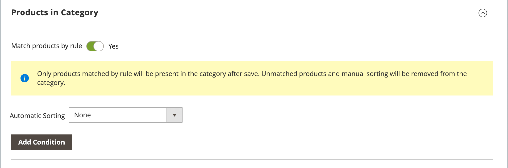

# 類別產品指派

若為類別，請使用 _[!UICONTROL Products in Category]_區段來檢閱目前指派給類別的產品。 每欄頂端的搜尋篩選器是用來新增和移除類別中的產品。 您也可以使用 [類別規則](../merchandising-promotions/category-product-rules.md) (  僅限Adobe Commerce)，可在符合一組條件時動態變更產品選擇。 若要深入瞭解，請參閱 [Visual Merchandiser](../merchandising-promotions/visual-merchandiser.md))。

>[!TIP]
>
>在類別規則設定期間，產品為 _已排序_， _相符_， _已指派_、和 _已取消指派_ 根據該規則 **_僅限_** 儲存此類別時。 為確保將新產品新增至目錄時能根據規則進行指派，您 **必須重新儲存每個類別** 已設定為依規則比對產品。 此外，如果任何產品庫存狀態變更為 `In Stock` 或 `Out of Stock` 類別中的產品包括 _已排序_ 根據 **自動排序** 規則，您必須按一下 **[!UICONTROL Save Category]**.

{width="600" zoomable="yes"}

>[!NOTE]
>
>在類別頁面上， `Out of stock` 產品一律會顯示 **_晚於_** `In Stock` 產品清單上的產品，具有所有排序型別。

>[!NOTE]
>
>此 _Stock_ 欄顯示的可銷售產品數量 _**選取的類別範圍**_ 僅限。 為產品管理多個庫存時，您應在對應的範圍之間切換以顯示其他 _Stock_ 中的欄值 _類別產品_ 格線。

## 套用類別規則

{{ee-feature}}

1. 設定 **[!UICONTROL Match products by rule]** 至 `Yes`.

   自動排序和條件選項隨即顯示。

   {width="600" zoomable="yes"}

1. 設定 **[!UICONTROL Automatic Sorting]** 訂購。

   此自動排序是根據目前狀況。

   - `Stock level`  — 移至頂端或底部。
   - `Special price`  — 移至頂端或底部。
   - `New Products`  — 先列出最新產品。
   - `Color`  — 依色彩的字母順序排序。
   - `Name`  — 依名稱以遞增或遞減順序排序。
   - `SKU`  — 依SKU以遞增或遞減順序排序
   - `Price`  — 依「價格」以遞增或遞減順序排序。

1. 按一下 **[!UICONTROL Add Condition]** 並執行下列動作：

   - 選擇 **[!UICONTROL Attribute]** 這是條件的基礎。
   - 選擇 **[!UICONTROL Operator]** 構成運算式所需。
   - 輸入 **[!UICONTROL Value]** 將進行比對。

   {width="600" zoomable="yes"}

   對每個要用來描述要滿足的條件的屬性重複此程式。 例如，若要比對在7到30天前建立的產品，請執行下列動作：

   - 設定 **[!UICONTROL Date Created]** 至 `Less than 30`.
   - 設定 **[!UICONTROL Logic]** 至 `AND`.
   - 設定 **[!UICONTROL Date Modified]** 至 `Greater than 7`.

1. 完成後，按一下 **[!UICONTROL Save Category]**.

### 頁面選項

| 選項 | 說明 |
|--- |--- |
| [!UICONTROL Match products by rule] | 決定類別中的產品清單是否由類別規則動態產生。 選項： `Yes` / `No` |
| [!UICONTROL Automatic Sorting] | 自動將排序順序套用至類別產品清單。 選項：  `None` `Move low stock to top` `Move low stock to bottom` `Special price to top` `Special price to bottom` `Newest products first` `Sort by color` `Name: A - Z` `Name: Z - A` `SKU: Ascending` `SKU: Descending` `Price: High to Low` `Price: Low to High` |
| [!UICONTROL Add Condition] | 將另一個條件新增至規則。 |

{style="table-layout:auto"}

### 頁面條件

| 選項 | 說明 |
|--- |--- |
| [!UICONTROL Attribute] | 決定作為條件基礎的屬性。 選項：  **[!UICONTROL Clone Category ID(s)]**— 根據類別ID從多個類別動態複製產品，而不需排序和排序。 **[!UICONTROL Color]**  — 包含以顏色為準的產品。  **[!UICONTROL Date Created (days ago)]**— 包含以產品新增至目錄後間隔天數為基礎的產品。 **[!UICONTROL Date Modified (days ago)]**  — 包含以上次修改產品後間隔天數為基礎的產品。  **[!UICONTROL Name]**— 包含以產品名稱為準的產品。 **[!UICONTROL Price]**  — 包含以價格為準的產品。  **[!UICONTROL Quantity]**— 包含以庫存數量為基準的產品。 ** SKU **— 包含以SKU為依據的產品。 |
| [!UICONTROL Operator] | 指定套用至屬性值以符合條件的運運算元。 除非指定運運算元， `Equal` 會使用作為預設值。 選項： `Equal` / `Not equal` / `Greater than` / `Greater than or equal to` / `Less than` / `Less than or equal to` / `Contains` |
| [!UICONTROL Value] | 指定屬性必須符合條件的值。 |
| [!UICONTROL Logic] | 用於定義多個條件，且僅在新增其他條件時顯示。 選項： `OR` / `AND` |

{style="table-layout:auto"}

>[!NOTE]
>
>可設定產品及其子項選項的數量是透過結合所有可銷售子項產品數量來計算。 考量可設定產品的範例 _耐力健身背心_ 紫色、紅色和黃色選項，以及每種選項的不同數量。 在此案例中，上階產品數量是紫色、紅色和黃色下階產品的組合可銷售數量。

## 控制項

## 頁面控制項

{{ee-feature}}

| 控制 | 說明 |
|----------|--------------|
|  | 以清單檢視 |
|  | 以圖磚檢視 |
|  | 依規則比對 — 否 |
|  | 依規則比對 — 是 |
|  | 拖放控制項可讓您抓取產品，並將其移至格線目前頁面中的另一個位置。 若要深入瞭解，請參閱 [Visual Merchandiser](../merchandising-promotions/visual-merchandiser.md). |
|  | 決定產品在清單中的位置。 |

{style="table-layout:auto"}

## 頁面控制項

{{ce-feature}}

| 控制 | 說明 |
|----------|--------------|
|  | 使用第一欄標題中的核取方塊，以選取所有產品或清除所有選取專案。 第一列中的控制項決定搜尋型別，並可設定為包含任何記錄，或僅包含已指定或未指定給類別的記錄。 每一列第一欄中的核取方塊可識別要新增至類別的產品。 選項： `Yes` / `No` / `Any` |
| [!UICONTROL Search Filters] | 每欄頂端的篩選控制項可用於輸入您想要在清單中包含或省略的特定值，視「選取全部」設定而定。 |
| [!UICONTROL Reset Filter] | 清除所有搜尋篩選器。 |
| [!UICONTROL Search] | 根據篩選條件搜尋目錄並顯示結果。 |

{style="table-layout:auto"}
