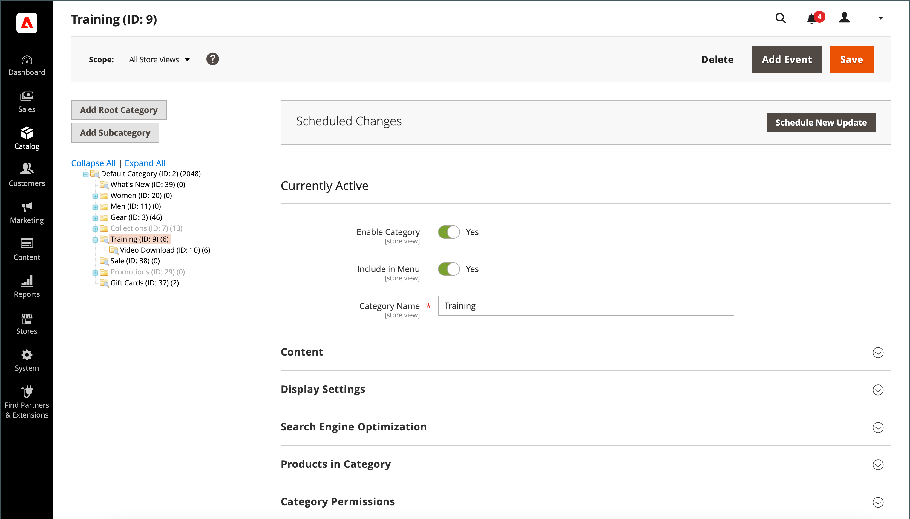

# 類別概觀

將產品加入目錄之前，您應該先建立目錄的基本類別結構。 可將產品指派給零個或多個類別。 通常，在新產品加入目錄之前，會預先建立類別。 不過，您也可以在建立產品時立即新增類別&#x200B;__。 目錄類別結構會反映在存放區的主功能表（或[頂端導覽](navigation-top.md)）中。

{width="700" zoomable="yes"}

| 控制 | 說明 |
|--- |--- |
| **[!UICONTROL Add Root Category]** | 建立根類別。 |
| **[!UICONTROL Add Subcategory]** | 在目前類別或子類別下方新增子類別。 |
| **[!UICONTROL Collapse All]** / **[!UICONTROL Expand All]** | 摺疊或展開類別樹狀結構。 |
| **[!UICONTROL Delete]** | 從樹狀結構中移除目前類別或子類別。 |
| **[!UICONTROL Save]** | 儲存類別的任何變更。 |

{style="table-layout:auto"}

>[!NOTE]
>
>受限制的管理員無權存取根類別，也無法建立子類別，除非他們有權存取所有網站。

## 疑難排解資源

如需疑難排解類別問題的說明，請參閱下列Commerce支援知識庫文章：

- [未儲存類別變更](https://experienceleague.adobe.com/docs/commerce-knowledge-base/kb/troubleshooting/miscellaneous/changes-to-categories-are-not-being-saved.html?lang=zh-Hant)
- [主功能表（類別）未顯示在啟用Fastly的子頁面上](https://experienceleague.adobe.com/docs/commerce-knowledge-base/kb/troubleshooting/miscellaneous/main-menu-categories-not-displayed-on-subpages-with-fastly-enabled.html?lang=zh-Hant)
