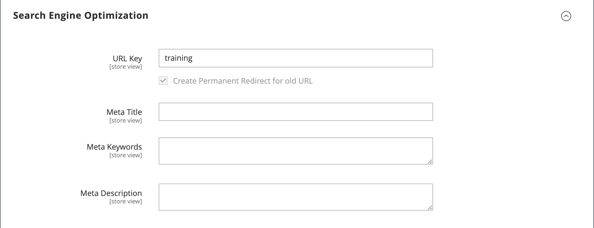
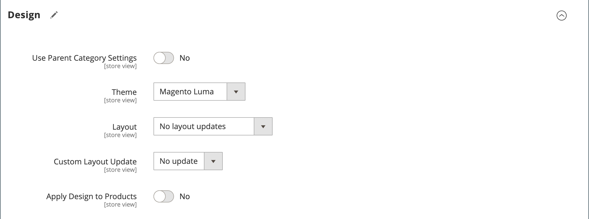

# 建立類別

型錄的類別結構就像上下顛倒的樹狀結構，其根位於頂端。 樹狀結構的每個區段都可以展開和摺疊。 任何停用或隱藏的類別都會呈現灰色。 第一層級的類別（在[根](category-root.md)之下）通常會顯示為[主功能表](navigation-top.md)中的選項。 您可以根據組態中設定的最大選單深度，視需要建立任意數量的其他子類別。 類別可以拖放至樹狀結構中的其他位置。 類別ID編號會顯示在頁面頂端類別名稱后的括弧中。

對於有多個[商店](../stores-purchase/stores.md#add-stores)的網站，您可以為每個商店建立不同的根類別，以定義用於[上層導覽](navigation-top.md)的類別集。

{width="700" zoomable="yes"}

## 最佳實務

計畫和建立類別時，請使用這些最佳實務。

### 類別結構

主功能表中的類別結構可能會影響客戶體驗和效能。 作為最佳實務，您應該識別一個首要的頂層類別，並避免有其他具有相同名稱的類別。 例如，不要將多個類別的「小孩」組織在不同部門，例如`Clothing/Kids`、`Shoes/Kids`、`Accessories/Kids`。 建立最上層父類別`Kids`，然後視需要在下方建立子類別會更有效率。 請和類別結構保持一致，並對目錄中的所有產品型別使用相同的方法。

### 商業規則和自動化

使用商業邏輯在目錄頁面上顯示類似專案，或設定個人化促銷、自動化流程或搜尋條件時，請考慮類別結構和可用的屬性值。 例如，如果您指定「polo」作為父類別，結果可能會包含性別和年齡不適當的混合產品。 不過，如果您符合特定次類別的polo襯衫，結果會比較窄，而且可能會吸引特定客戶。 結合其他以特定客戶為目標的屬性值時，結果可能更具體一些。 參考特定類別路徑時，請考慮必須篩選及擷取的產品數量。 結果差異可能非常大。 考量下列類別路徑傳回的不同結果：

- `[Category:  All Products/Shirts/Father's Day/Polos/Sale]`
- `[Category Path: Men/Shirts/Polos]`
- `[Child Category: Polos]`

請務必明確定義分類關係，例如：

- 父類別
- 子類別
- 類別路徑

也定義任何關聯的關鍵字和屬性，例如：

- 可用性
- 售價
- 品牌
- 大小
- 顏色

## 步驟1：建立類別

1. 在&#x200B;_管理員_&#x200B;側邊欄上，移至&#x200B;**[!UICONTROL Catalog]** > **[!UICONTROL Categories]**。

1. 設定&#x200B;**[!UICONTROL Store View]**&#x200B;以決定新類別在何處可用。

1. 在類別樹狀結構中，選取新類別的父類別。

   父級比新類別高一個層級。

   如果您從頭開始，沒有任何資料，清單中可能只有兩個類別： _預設類別_ （根目錄）和&#x200B;_範例類別_

1. 按一下&#x200B;**[!UICONTROL Add Subcategory]**。

## 步驟2：完成基本資訊

1. 如果您希望類別立即在市集內可用，請將&#x200B;**[!UICONTROL Enable Category]**&#x200B;設為`Yes`。

1. 若要在[頂端導覽](navigation-top.md)中包含類別，請將&#x200B;**[!UICONTROL Include in Menu]**&#x200B;設為`Yes`。

1. 輸入&#x200B;**[!UICONTROL Category Name]**。

   {width="500" zoomable="yes"}

1. 按一下&#x200B;**[!UICONTROL Save]**&#x200B;並繼續。

## 步驟3：完成類別內容

1. 展開&#x200B;**[!UICONTROL Content]**&#x200B;區段的。

   {width="600" zoomable="yes"}

1. 若要在頁面頂端顯示&#x200B;**[!UICONTROL Category Image]**，您可以上傳自己的影像，或使用[媒體儲存體](../content-design/media-storage.md)中存在的影像。

   - 若要上傳您自己的影像，請按一下&#x200B;**[!UICONTROL Upload]**&#x200B;並選擇您要代表類別的影像。

   - 若要使用媒體儲存空間的影像，請按一下&#x200B;**[!UICONTROL Select from Gallery]**&#x200B;並選取您要代表類別的影像。

   在媒體集內，您也可以按一下&#x200B;**[!UICONTROL Search Adobe Stock]**，使用[Adobe Stock整合](../content-design/adobe-stock.md)來尋找適當的影像。

   >[!NOTE]
   >
   > 如果您已啟用AEM Assets，請參閱[管理類別](../content-design/aem-assets-manage.md)以取得詳細資訊。

1. 針對&#x200B;**[!UICONTROL Description]**，輸入您要顯示在類別登入頁面上的文字或其他內容。

   如需詳細資訊，請參閱[類別內容](categories-content-settings.md)。

1. 若要在類別登入頁面上加入內容區塊，請選擇要顯示的&#x200B;**[!UICONTROL CMS Block]**。

1. 按一下&#x200B;**[!UICONTROL Save]**&#x200B;並繼續。

## 步驟4：完成顯示設定

1. 展開&#x200B;**[!UICONTROL Display Setting]**&#x200B;區段的。

   {width="600" zoomable="yes"}

   如需這些選項的詳細資訊，請參閱[如需這些選項的詳細資訊]，請參閱[顯示設定](categories-display-settings.md)。

1. 將&#x200B;**[!UICONTROL Display Mode]**&#x200B;設定為下列其中一項：

   - `Products Only`
   - `Static Block Only`
   - `Static Block and Products`

1. 如果您希望類別頁面包含分層導覽的&#x200B;_`Filter by Attribute`_區段，請將&#x200B;**[!UICONTROL Anchor]**&#x200B;設為`Yes`。

1. 針對&#x200B;**[!UICONTROL Available Product Listing Sort By]**&#x200B;選項，選取一或多個可供客戶排序清單的可用值。 此設定不適用於[!DNL Live Search] [產品清單頁面Widget](https://experienceleague.adobe.com/zh-hant/docs/commerce/live-search/live-search-storefront/plp-styling)。

   依預設，會包含所有可用的值。 取消選取&#x200B;**[!UICONTROL Use All]**&#x200B;核取方塊以變更選取專案。 例如，值可能包括：

   - `Position`
   - `Product Name`
   - `Price`

1. 若要設定類別的預設排序順序，請選擇&#x200B;**[!UICONTROL Default Product Listing Sort By]**&#x200B;值。 此設定不適用於[!DNL Live Search] [產品清單頁面Widget](https://experienceleague.adobe.com/zh-hant/docs/commerce/live-search/live-search-storefront/plp-styling)。

1. 若要變更預設的分層導覽[價格步驟](navigation-layered.md#configure-price-navigation)設定，請執行下列動作：

   - 取消選取&#x200B;**[!UICONTROL Use Config Settings]**&#x200B;核取方塊。

   - 輸入要做為分層導覽之增量價格步驟的值。

1. 按一下&#x200B;**[!UICONTROL Save]**&#x200B;並繼續。

## 步驟5：完成搜尋引擎最佳化設定

1. 展開&#x200B;**[!UICONTROL Search Engine Optimization Settings]**&#x200B;區段的。

   {width="600" zoomable="yes"}

   如需這些選項的詳細資訊，請參閱[搜尋引擎最佳化](categories-search-engine-optimization.md)。

1. 完成該類別的下列[中繼資料](../merchandising-promotions/meta-data.md)：

   - [!UICONTROL Meta Title]
   - [!UICONTROL Meta Keywords]
   - [!UICONTROL Meta Description]

1. 按一下&#x200B;**[!UICONTROL Save]**&#x200B;並繼續。

## 步驟6：選擇類別中的產品

1. 展開&#x200B;**[!UICONTROL Products in Category]**&#x200B;區段的。

   {width="600" zoomable="yes"}

   如需這些選項的詳細資訊，請參閱[類別中的產品](categories-product-assignments.md)。

1. 如有需要，請使用[篩選器](../getting-started/admin-grid-controls.md)來尋找產品。

   若要顯示尚未納入類別的所有記錄，請將第一欄中的記錄選擇器設定為`No`，然後按一下&#x200B;**[!UICONTROL Search]**。

1. 在第一欄中，針對要包含在類別中的每個產品選取核取方塊。

1. 按一下&#x200B;**[!UICONTROL Save]**&#x200B;並繼續。

## 步驟7：設定類別許可權

{{ee-feature}}

1. 展開&#x200B;**[!UICONTROL Category Permissions]**&#x200B;區段的。

1. 若是多站台安裝，請選擇套用類別許可權的&#x200B;**[!UICONTROL Website]**。

1. 選擇套用類別許可權的&#x200B;**[!UICONTROL Customer Group]**。

    (僅限[Adobe Commerce B2B](../b2b/introduction.md))如有需要，您可以改為選擇&#x200B;**[!UICONTROL Shared Catalog]**。

1. 視需要設定下列許可權：

   - [!UICONTROL Browsing Category]
   - [!UICONTROL Display Product Prices]
   - [!UICONTROL Add to Cart]

1. 若要新增其他許可權規則，請按一下&#x200B;**[!UICONTROL New Permission]**&#x200B;並重複此程式。

   {width="600" zoomable="yes"}

## 步驟8：完成設計設定

1. 展開&#x200B;**[!UICONTROL Design]**&#x200B;區段的。

1. 視需要設定設計設定：

   - ([僅限Adobe Commerce B2B](../b2b/introduction.md))若要將父類別設計設定套用至此類別，請將&#x200B;**[!UICONTROL Use Parent Category Settings]**&#x200B;設為`Yes`。

   - 若要變更類別頁面的設計，請選擇您要套用的&#x200B;**[!UICONTROL Theme]**。

   - 若要變更類別頁面的欄配置，請選擇您要套用的&#x200B;**[!UICONTROL Layout]**。

   - 若要輸入自訂代碼，請在&#x200B;**[!UICONTROL Layout Update XML]**&#x200B;方塊中輸入有效的XML代碼。

   - 若要對產品頁面使用相同設計，請將&#x200B;**[!UICONTROL Apply Design to Products]**&#x200B;設為`Yes`。

   {width="600" zoomable="yes"}

1.  (僅限Magento Open Source)若要將設計更新排程在特定時段，請執行下列動作：

   - 展開&#x200B;_[!UICONTROL Schedule Design Update]_&#x200B;區段。

   - 使用行事曆（）選擇排程更新&#x200B;**[!UICONTROL from]**&#x200B;和&#x200B;**[!UICONTROL to]**&#x200B;日期。

   {width="600" zoomable="yes"}

1. 完成時，按一下&#x200B;**[!UICONTROL Save]**。
