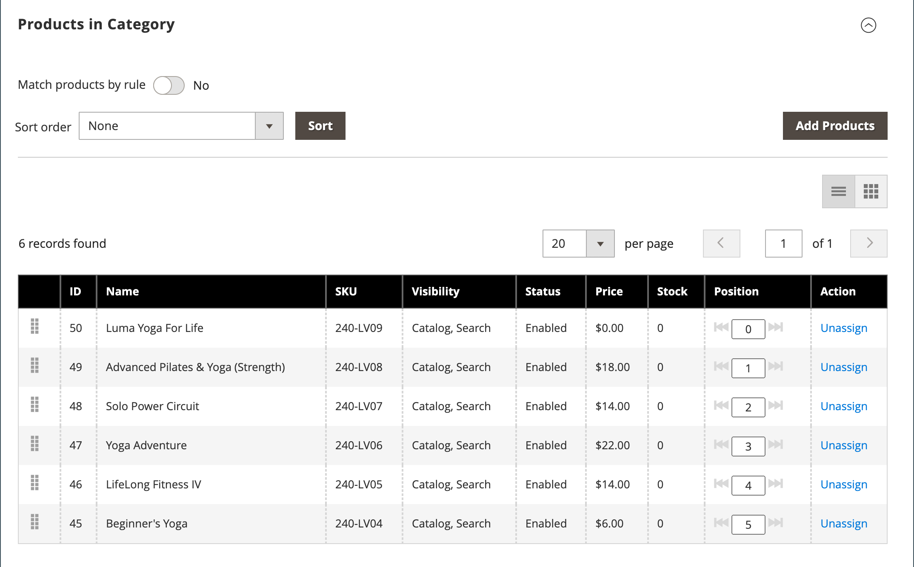

# 新增和移除類別產品

從[類別](categories-product-assignments.md)中的產品區段，商店管理員可以將產品新增至類別。 此區段列出指派給類別的所有產品，並在&#x200B;**[!UICONTROL Match products by rule]**&#x200B;設定為`No`時顯示&#x200B;**[!UICONTROL Add Product]**。

{width="600" zoomable="yes"}中的產品

## 搜尋要新增的產品

1. 在&#x200B;_管理員_&#x200B;側邊欄上，移至&#x200B;**[!UICONTROL Catalog]** > **[!UICONTROL Categories]**。

1. 在左側的類別樹狀結構中，選擇要新增產品的類別。

1. 展開 「類別&#x200B;_」中的_&#x200B;產品。

1. 按一下&#x200B;**[!UICONTROL Add Products]**。

1. 使用&#x200B;_依關鍵字_&#x200B;搜尋，或篩選來尋找您要新增的產品。

   {width="700" zoomable="yes"}

1. 在&#x200B;_[!UICONTROL Assign]_欄中，將您要新增之每個產品的選項切換為`Yes`。

   如果您想要包含所有顯示的產品，可以按一下欄標題中的功能表箭頭，然後選擇&#x200B;**[!UICONTROL Select All]**。

1. 若要套用變更，請按一下&#x200B;**[!UICONTROL Save and Close]**。

### 動作

| 動作 | 說明 |
|--- |--- |
| [!UICONTROL Select All] | 選取清單中所有記錄的核取方塊。 |
| [!UICONTROL Unselect All] | 清除清單中所有記錄的核取方塊。 |
| [!UICONTROL Select All on This Page] | 選取目前頁面上記錄的核取方塊。 |
| [!UICONTROL Deselect All on This Page] | 清除目前頁面上記錄的核取方塊。 |

{style="table-layout:auto"}

## 依SKU新增產品

1. 按一下&#x200B;**[!UICONTROL Add Products]**

1. 選取&#x200B;**[!UICONTROL Add Products by SKU]**&#x200B;標籤。

1. 輸入SKU （每行一個）並按一下&#x200B;**[!UICONTROL Assign]**。

   若要捨棄變更，請按一下&#x200B;**[!UICONTROL Remove]**。

   {width="700" zoomable="yes"}

1. 若要套用變更，請按一下&#x200B;**[!UICONTROL Save and Close]**。

## 從類別中移除產品

1. 在&#x200B;_管理員_&#x200B;側邊欄上，移至&#x200B;**[!UICONTROL Catalog]** > **[!UICONTROL Categories]**。

1. 在左側的類別樹狀結構中，選擇要編輯的類別。

1. 展開&#x200B;_[!UICONTROL Products in Category]_區段的。

1. 尋找要移除的產品。

1. 在&#x200B;_[!UICONTROL Actions]_欄中按一下&#x200B;**[!UICONTROL Unassign]**。

1. 若要套用變更，請按一下&#x200B;**[!UICONTROL Save]**。
