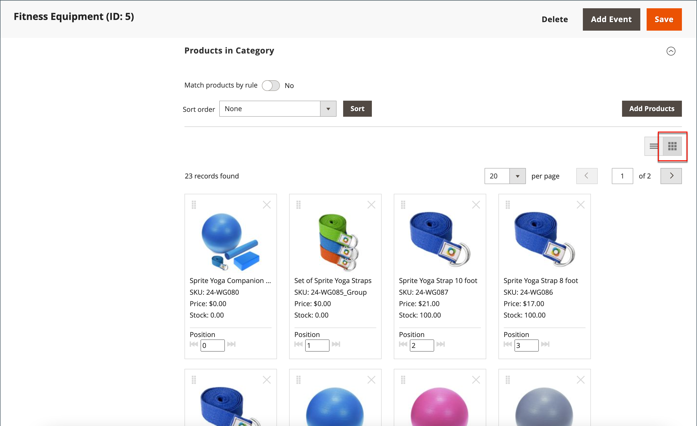

# 排序類別產品

{{ee-feature}}

將產品拖放至某個位置或套用預先定義的排序順序，即可手動指定類別中產品的位置。 依預設，產品可依庫存等級、年齡、顏色、名稱、SKU和價格排序。 自動排序會覆寫目前的排序順序，並重設任何手動設定的拖放位置。 顏色的排序順序以及產品必須包含在清單中的最低庫存水準設定於 [Visual Merchandiser](../configuration-reference/catalog/visual-merchandiser.md) 設定。

>[!NOTE]
>
>在類別頁面上， `Out of stock` 產品一律會顯示 **_晚於_** `In Stock` 產品清單上的產品，具有所有排序型別。

您可以分別為每個設定類別選項 [存放區檢視](../stores-purchase/stores.md#add-stores) 決定產品的選擇、它們在清單中的相對位置，以及類別規則可用的屬性。 然而，只有一個， **_全域_** 排序順序和產品在目錄中的位置，並在所有對象間共用 [存放區檢視](../stores-purchase/store-views.md)、商店和網站。

## 步驟1：設定設定的範圍

1. 在 _管理員_ 側欄，前往 **[!UICONTROL Catalog]** > **[!UICONTROL Categories]**.

1. 如有需要，請選擇 **[!UICONTROL Store View]** 設定套用的位置。

   若為多存放區安裝， _[!UICONTROL Store View]_設定會將排序順序套用至商店內所有可用的檢視。

1. 在左側的類別樹狀結構中，選擇要編輯的類別。

   {width="700" zoomable="yes"}

## 步驟2：排序產品

>[!NOTE]
>
>依產品屬性排序類別時，具有相同屬性值的產品也會依其屬性排序 _[!UICONTROL Product ID]_以遞增順序顯示。

在 _[!UICONTROL Products in Category]_區段，按一下圖磚(  )圖示，以在格線中顯示產品圖磚。 使用手動或自動方法來排序產品。

{width="600" zoomable="yes"}

### 方法1：手動排序

1. 設定 **[!UICONTROL Sort Order]** 依您的偏好設定。

   {width="600" zoomable="yes"}

1. 若要套用新的排序順序，請按一下 **[!UICONTROL Sort]**.

1. 若要儲存排序順序，請按一下 **[!UICONTROL Save Category]**.

1. 出現提示時，請更新任何無效的索引子。

### 方法2：自動排序

1. 設定 **[!UICONTROL Match products by rule]** ()至 `Yes`.

1. 設定 **[!UICONTROL Automatic Sorting]** 依您的偏好設定。

1. 若要建立類別規則，請依照下一個步驟中的指示進行。

## 步驟3：建立類別規則

1. 設定 **[!UICONTROL Match products by rule]** ()至 `Yes`.

1. 按一下 **[!UICONTROL Add Condition]**.

1. 選擇 **[!UICONTROL Attribute]** 這是條件的基礎。

1. 設定 **[!UICONTROL Operator]** 變更為下列其中一項：

   - `Equal`
   - `Not equal`
   - `Greater than`
   - `Greater than or equal to`
   - `Less than`
   - `Less than or equal to`
   - `Contains`

1. 輸入適當的 **[!UICONTROL Value]**.

   {width="600" zoomable="yes"}

1. 若要新增其他條件，請按一下 **[!UICONTROL Add Condition]** 並重複此程式。

## 步驟4：儲存、重新整理及驗證

1. 完成後，按一下 **[!UICONTROL Save Category]**.

1. 當提示重新整理快取時，請按一下 **[!UICONTROL Cache Management]** 並重新整理每個無效的快取。

1. 在店面，確認產品選擇、排序和類別規則正確運作。

   如果您必須進行調整，請變更設定，然後再試一次。
