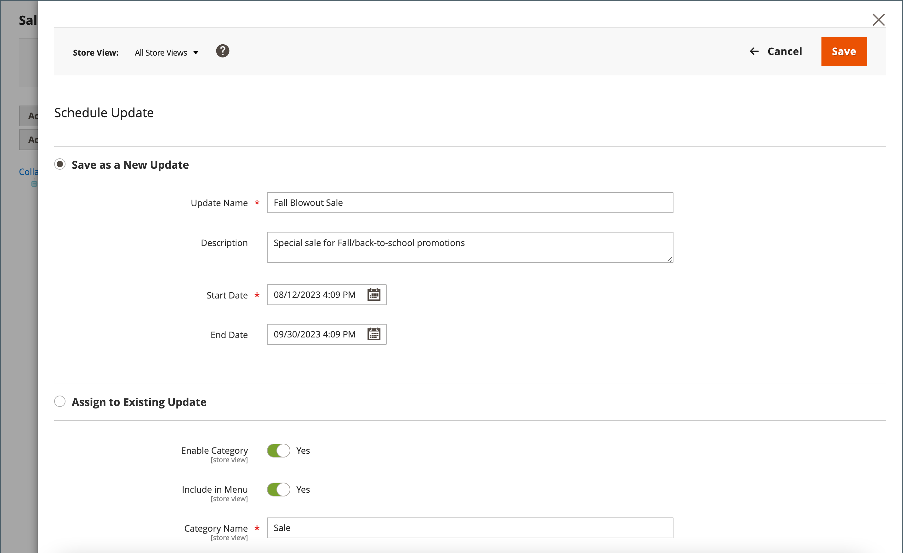

# 類別的已排程變更

{{ee-feature}}

類別更新可以依排程套用，並和其他內容變更一起分組。 您可以根據類別已排程的變更來建立行銷活動，或將變更套用至現有的行銷活動。 若要深入瞭解，請參閱[內容暫存](../content-design/content-staging.md)。

>[!NOTE]
>
>[!UICONTROL Schedule Design Update]索引標籤已在 Adobe Commerce中移除，且無法直接在類別上修改。 您必須為這些啟用建立排定的更新。

>[!NOTE]
>
>所有排定的更新都會連續套用，這表示任何實體一次只能有一個排定的更新。 任何排定的更新都會套用至其時間範圍內的所有存放區檢視。 因此，一個實體無法同時擁有不同存放區檢視的多個排程更新。 所有存放區檢視中的所有實體屬性值（不受目前排程更新影響）都是從預設值取得，而不是從先前的排程更新取得。

## 為類別排程更新

1. 在&#x200B;_管理員_&#x200B;側邊欄上，移至&#x200B;**[!UICONTROL Catalog]** > **[!UICONTROL Categories]**。

1. 在左側的類別樹狀結構中，選擇要修改的類別。

1. 在頁面頂端的&#x200B;_排程變更_&#x200B;方塊中，按一下&#x200B;**[!UICONTROL Schedule New Update]**。

   {width="600" zoomable="yes"}

1. 選取&#x200B;**[!UICONTROL Save as a New Update]**&#x200B;選項後，設定更新的基本引數：

   - 針對&#x200B;**[!UICONTROL Update Name]**，輸入新內容預備行銷活動的名稱。

   - 請輸入簡短的更新&#x200B;**[!UICONTROL Description]**&#x200B;及其使用方式。

   - 使用行事曆（  ）工具，為行銷活動選擇&#x200B;**[!UICONTROL Start Date]**&#x200B;和&#x200B;**[!UICONTROL End Date]**。

   >[!IMPORTANT]
   >
   >行銷活動&#x200B;**[!UICONTROL Start Date]**&#x200B;和&#x200B;**[!UICONTROL End Date]**&#x200B;必須使用從每個網站的當地時區轉換而來的&#x200B;**_預設_**&#x200B;管理時區來定義。 例如，若您有多個網站位在不同時區，且您想根據美國時區啟動促銷活動，則必須針對每個當地時區分別排程更新。 您為每個設定&#x200B;**[!UICONTROL Start Date]**&#x200B;和&#x200B;**[!UICONTROL End Date]**，這會從本機網站時區轉換為預設管理時區。

   {width="600" zoomable="yes"}

1. 進行排程更新所需的任何變更。

1. 若要預覽變更，請按一下右上角按鈕列中的&#x200B;**[!UICONTROL Preview]**。

1. 完成時，按一下&#x200B;**[!UICONTROL Save]**。

## 指派給現有更新

1. 在&#x200B;_管理員_&#x200B;側邊欄上，移至&#x200B;**[!UICONTROL Catalog]** > **[!UICONTROL Categories]**。

1. 在左側的類別樹狀結構中，選擇要修改的類別。

1. 在頁面頂端的&#x200B;_排程變更_&#x200B;方塊中，按一下&#x200B;**[!UICONTROL Schedule New Update]**。

1. 選取&#x200B;**[!UICONTROL Assign to Existing Campaign]**。

1. 在清單中，找到所需的行銷活動，然後按一下&#x200B;**[!UICONTROL Select]**。

1. 對排程更新進行必要的變更。

1. 完成時，按一下&#x200B;**[!UICONTROL Save]**。
