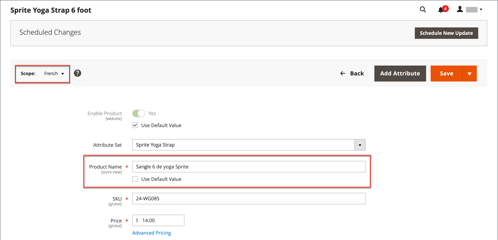
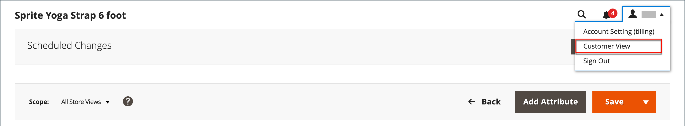

# 目錄管理簡介

Adobe Commerce和Magento Open Source使用術語 _目錄_ 以參照整個產品資料庫。

建立和管理商店的最重要領域之一是產品建立和類別。 管理員提供數種工具，可用於商店的初始設定、商店的維護及業務最佳化。

>[!TIP]
>
>適用於Adobe Commerce和Magento Open Source的Inventory management提供管理工具，可管理您的產品詳細目錄。 擁有單一商店到多個倉庫、商店、取貨地點、卸貨託運人等等的商家，可以使用這些功能來維護銷售數量，並處理出貨以完成訂單。 有關這些功能以及如何使用這些功能來管理多個位置中的庫存的更多資訊，請參閱 [Inventory management使用手冊](../inventory-management/introduction.md).

## 目錄範圍

目錄資料的存取權取決於數個因素，包括 [範圍](../getting-started/websites-stores-views.md#scope-settings) 設定、目錄設定及 [根類別](category-root.md) 指派給存放區的內容。 目錄包括已啟用且可供銷售的產品，以及目前不提供以供銷售的產品。

在銷售中，術語 _目錄_ 通常是指經過精選而可供銷售的產品。 例如，商店可能有「Spring Catalog」和「Fall Catalog」。

就像列印目錄的內容表，商店的主功能表 — 或 _上層導覽_  — 依類別組織產品，讓客戶輕鬆找到他們想要的東西。 主要功能表是根據 _根類別_，這是指派給商店之功能表的容器。 因為特定選單選項是在商店檢視層級定義的，所以每個檢視都可以根據相同的根類別有不同的主選單。 在每個功能表中，您都可以提供適合該商店的精選產品。

{width="550"}

## 產品範圍

對於具有多個網站、商店和檢視的安裝， [範圍](../getting-started/websites-stores-views.md#scope-settings) 設定決定可供銷售產品的位置，以及每個商店檢視可用的產品資訊。 最初，您建立的所有產品都會發佈至預設的網站、商店和商店檢視。

{width="550"}

如果您只有一個具有預設檢視的商店，則可以在以下位置執行商店： [單一存放區模式](../getting-started/websites-stores-views.md#single-store-mode) 以隱藏範圍設定。 但是，如果您的存放區有多個檢視，則每個欄位的名稱下方會顯示一個範圍指示器。

- 若要編輯特定檢視的產品資訊，請使用 _存放區檢視_ 左上角的控制項以選擇檢視。 可在存放區檢視層級編輯的任何欄位都可使用其他控制項。

- 若要定義多站台安裝中的產品範圍，請參閱 [網站中的產品](settings-basic-websites.md) 產品資訊的區段。

針對商店檢視編輯產品的程式，就像新增檢視特有的產品資訊層一樣。

您只能編輯或指派您擁有許可權之網站的產品，不能編輯或指派所有指派了產品的網站。

雖然 _西班牙文_ 在下列範例中選取商店檢視，產品資訊仍會以預設商店檢視的原始語言顯示。 若要翻譯產品資訊，您必須切換至 _西班牙文_ 儲存檢視和翻譯文字欄位 — 例如產品標題、說明和中繼資料。 如需詳細資訊，請參閱 [將產品本地化](../stores-purchase/store-localize.md#localize-products).

## 編輯不同檢視的產品

>[!NOTE]
>
>此 _所有商店檢視_ 如果產品也發佈在允許的範圍之外，對於限制在特定範圍內的管理員使用者，範圍會遭停用。 預設會選取第一個可編輯的範圍，因為受限制的使用者無法執行 _全域_ 影響他們無權存取之範圍的動作或動作。

1. 在左上角，設定 **[!UICONTROL Store View]** 至要編輯的特定檢視。

1. 若要確認範圍變更，請按一下 **[!UICONTROL OK]**.

1. 使用存放區檢視的新值更新欄位。

   任何可針對存放區檢視編輯的欄位下都會出現核取方塊。 若要覆寫預設值，請取消選取 **使用預設值** 核取方塊。

   {width="600" zoomable="yes"}

1. 完成後，按一下 **[!UICONTROL Save]**.

1. 在左上角，設定 **[!UICONTROL Store View]** 選擇器恢復為預設值。

1. 若要驗證您商店中的變更，請執行下列動作：

   - 在右上角，按一下 _管理員_ 選單箭頭並選擇 **[!UICONTROL Customer View]**.

     {width="600" zoomable="yes"}

   - 在商店的右上角，設定 **[!UICONTROL Language Chooser]** 至您編輯之產品的商店檢視，並尋找您針對該檢視編輯的產品。

     {width="700" zoomable="yes"}
