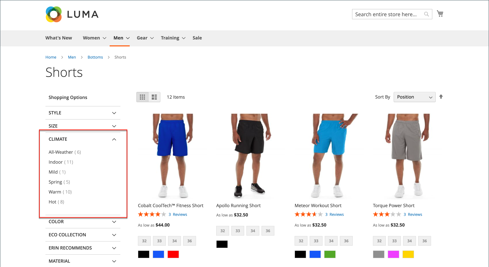
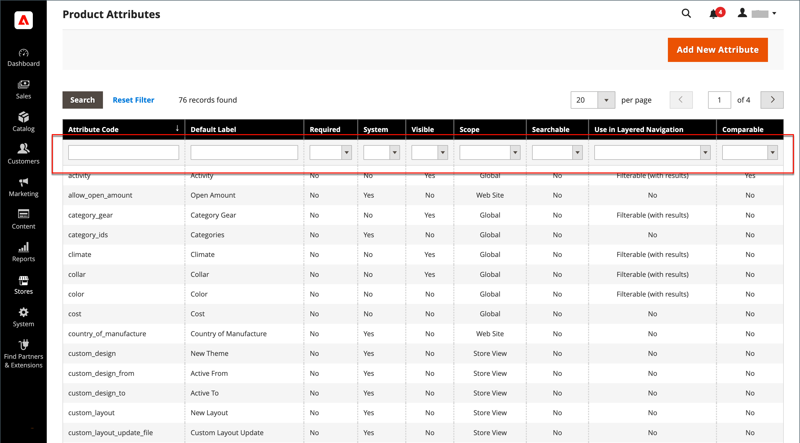
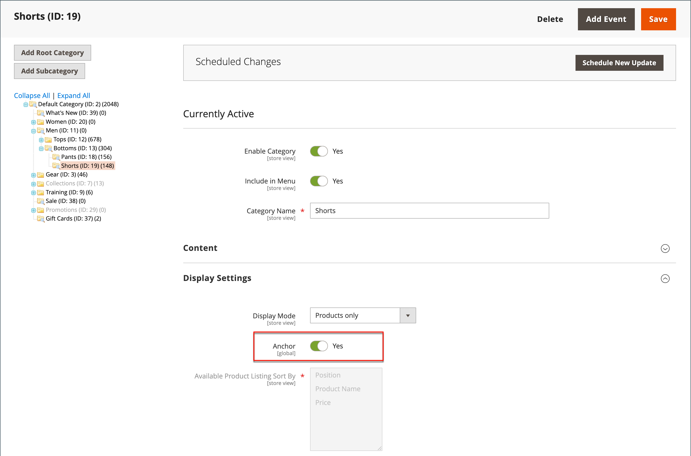
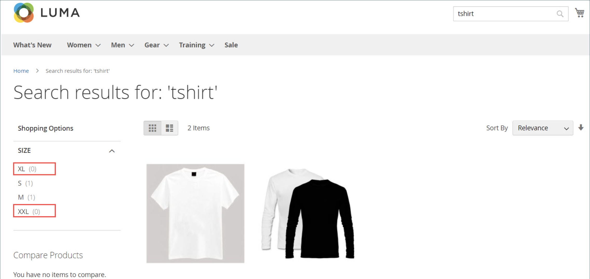

# 分層導覽

>[!NOTE]
>
>本節所述標準的分層導覽，與即時搜尋的篩選導覽不同， [Facet](https://experienceleague.adobe.com/docs/commerce-merchant-services/live-search/live-search-admin/facets/facets.html).

分層導覽可讓您根據類別、價格範圍或任何其他可用屬性輕鬆尋找產品。 階層式導覽通常會顯示在搜尋結果和類別頁面的左欄，有時也會顯示在首頁上。 標準導覽包括 _購買者_ 類別與價格範圍的清單。 您可以設定分層導覽的顯示方式，包括產品計數和價格範圍。

{width="700" zoomable="yes"}

## 可篩選的屬性

>[!NOTE]
>
>本主題中說明的可篩選屬性需求有所不同 [即時搜尋](https://experienceleague.adobe.com/docs/commerce-merchant-services/live-search/overview.html). 若要深入瞭解，請參閱 [Facet](https://experienceleague.adobe.com/docs/commerce-merchant-services/live-search/live-search-admin/facets/facets.html).

您可以使用分層導覽，依類別或屬性搜尋產品。 例如，當購物者從頂端導覽選擇「Mens/Shorts」類別時，初始結果會包含該類別中的所有產品。 您可以藉由選擇特定的樣式、氣候、顏色、材質、圖樣或價格（或值的組合），進一步篩選清單。 可篩選的屬性會顯示在展開區段中，其中列出每個屬性值。 作為選項，具有相符結果的產品清單可以設定為包含具有或不具有相符結果的產品。

屬性屬性與產品輸入型別結合，決定哪些屬性可用於分層導覽。 階層導覽僅適用於 [_錨點_](categories-display-settings.md) 類別，但也可新增至搜尋結果頁面。 此 **存放區所有者的目錄輸入型別** 每個屬性的屬性都必須設為 `Yes/No`， `Dropdown`， `Multiple Select`，或 `Price`. 若要讓屬性可篩選，請 **用於分層導覽** 每個的屬性都必須設為 `Filterable (with results)` 或 `Filterable (no results)`.

_範例：含有結果的可篩選屬性_

{width="700" zoomable="yes"}

_範例：無結果顯示的可篩選色票值_

{width="700" zoomable="yes"}

下列指示顯示如何使用可篩選屬性來設定基本的分層導覽。 如需價格步驟的進階階層導覽，請參閱 [價格導覽](navigation-layered.md#configure-price-navigation).

## 步驟1：設定屬性特性

1. 在 _管理員_ 側欄，前往 **[!UICONTROL Stores]** > _[!UICONTROL Attributes]_>**[!UICONTROL Product]**.

1. 瀏覽或使用篩選搜尋來尋找清單中的屬性，並在編輯模式下開啟它。

   {width="700" zoomable="yes"}

1. 在左側面板中，選擇 **[!UICONTROL Storefront Properties]** 並設定 **[!UICONTROL Use In Layered Navigation]** 變更為下列其中一項：

   - `Filterable (with results)`  — 階層導覽僅包含可找到相符產品的篩選器。 任何已套用至清單中顯示之所有產品的屬性值，仍應顯示為可用篩選器。 可用篩選器清單中會忽略計數為零(0)產品相符的屬性值。 篩選清單僅包含符合篩選的產品。 只有在選取的篩選器變更顯示內容時，產品清單才會更新。

   - `Filterable (no results)`  — 階層式導覽包含所有可用屬性值的篩選器及其產品計數，包括零(0)產品相符的產品。 如果屬性值是色票，則該值會顯示為篩選條件，但會被劃掉。 此選項不支援價格層級篩選，也不會影響價格篩選。

1. 設定 **[!UICONTROL Use In Search Results Layered Navigation]** 至 `Yes`.

   {width="600" zoomable="yes"}

1. 對要包含在分層導覽中的每個屬性重複這些步驟。

>[!NOTE]
>
>此 [!UICONTROL Position] 欄位預設為灰色，因此您必須先儲存屬性，才能修改此設定。

## 步驟2：將類別設為錨點

1. 在 _管理員_ 側欄，前往 **[!UICONTROL Catalog]** > **[!UICONTROL Categories]**.

1. 在類別樹狀結構中，選取您要使用分層導覽的類別。

1. 展開  此 **[!UICONTROL Display Settings]** 部分與集合 **[!UICONTROL Anchor]** 至 `Yes`.

   {width="600" zoomable="yes"}

1. 按一下 **[!UICONTROL Save]**.

## 步驟3：測試結果

若要測試設定，請造訪您的商店，並從主功能表導覽至類別。 可篩選屬性的選取專案會顯示在類別頁面的階層導覽中。

搜尋、篩選及檢閱顯示的產品。

## 從階層式導覽移除可篩選的屬性值

階層式導覽包含所有可用屬性值的篩選器及其產品計數，包括零(0)產品相符專案（如下圖所示）。

{width="700" zoomable="yes"}

這樣的結果會讓客戶很難選取偏好的產品，而且不需要在前端顯示&#x200B;0個產品&#x200B;的屬性值。

您可以使用下列步驟，從階層式導覽中移除0 Products的可篩選屬性值：

1. 在 _管理員_ 側欄，前往 **[!UICONTROL Stores]** > _[!UICONTROL Attributes]_>**[!UICONTROL Product]**.

1. 瀏覽或使用篩選搜尋來尋找清單中的屬性，並在編輯模式下開啟它。

1. 在 _[!UICONTROL Attribute Information]_，按一下&#x200B;**[!UICONTROL Storefront Properties]**.

1. 的 **[!UICONTROL Layered Navigation]**，選擇 `Filterable (with results)`.

   {width="600" zoomable="yes"}

1. 按一下 **[!UICONTROL Save Attribute]**.

## 價格導覽

>[!NOTE]
>
>本主題中說明的價格瀏覽組態不同 [即時搜尋](https://experienceleague.adobe.com/docs/commerce-merchant-services/live-search/overview.html).

價格導覽可用於在分層導覽中依價格範圍分配產品。 您也可以以間隔分割每個範圍。 有幾種方式可以計算價格導覽：

- 自動（均衡價格範圍）
- 自動（平衡產品計數）
- 手動

使用前兩種方法會自動計算導覽步驟。 手動方式可讓您指定價格間隔的除數限制。 下列範例顯示10與100的價格導覽步驟之間的差異。

反複分割可提供不同價格範圍間的最佳產品分配。 透過反複分割，在選擇$0.00-$99範圍之後，客戶可以向下追溯至數個價格子範圍。 當產品數目達到「間隔除數限制」所設定的臨界值時，價格範圍分割即會停止。

## 範例：價格瀏覽步驟

| 價格步驟10 | 價格步驟100 |
|----------|--------|
| $20.00 - $29.99 (1) | $0.00 - $99.99 (4) |
| $30.00 - $39.99 (2) | $100 - $199.99 (5) |
| $70.00 - $79.99 (1) | $400.00 - $499.99 (2) |
| $100.00 - $109.99 (1) | $700.00及以上(1) |
| $120.00 - $129.99 (2) |   |
| $150.00 - $159.99 (1) |   |
| $180.00 - $189.99 (1) |   |
| $420.00 - $429.99 (1) |   |
| $440.00 - $449.99 (1) |   |
| $710.00及以上(1) |   |

{style="table-layout:auto"}

## 設定價格導覽

>[!IMPORTANT]
>
>若要正確顯示產品及其價格，請依 _價格篩選器_ 在階層式導覽中，請確定價格的設定顯示在 [銷售稅組態](../configuration-reference/sales/tax.md) 有相同的值(`Excluding Tax` **或** `Including Tax`)。 對於 _[!UICONTROL Calculation Settings]_，檢查&#x200B;**[!UICONTROL Catalog Prices]**值。 和_[!UICONTROL Price Display Settings]_，檢查 **[!UICONTROL Display Product Prices in Catalog]** 值。 如果這些值不同，分層導覽中的價格篩選器可能無法正確依價格篩選及排序產品。

1. 在 _管理員_ 側欄，前往 **[!UICONTROL Stores]** > _[!UICONTROL Settings]_>**[!UICONTROL Configuration]**.

1. 在左側面板中，展開 **[!UICONTROL Catalog]** 並選擇 **[!UICONTROL Catalog]** 底下。

1. 展開  此 _分層導覽_ 區段。

   根據預設， **[!UICONTROL Display Product Count]** 設為 `Yes`. 如有必要，請取消選取 **[!UICONTROL Use system value]** 核取方塊以變更此設定。

   {width="600" zoomable="yes"}

   如需這些組態選項的詳細清單，請參閱 [分層導覽](../configuration-reference/catalog/catalog.md#layered-navigation) 在 _設定參考_.

1. 設定 **[!UICONTROL Price Navigation Steps Calculation]** ，以供下列其中一個方法使用。

1. 完成後，按一下 **[!UICONTROL Save Config]**.

### 方法1：自動（均化價格範圍）

離開 **[!UICONTROL Price Navigation Steps Calculation]** 設為 `Automatic (Equalize Price Ranges)` （預設）。 此設定使用標準演演算法來導覽價格。

### 方法2：自動（均衡產品計數）

>[!TIP]
>
>如有必要，請先取消選取 **[!UICONTROL Use system value]** 核取方塊以變更這些設定。

1. 設定 **[!UICONTROL Price Navigation Steps Calculation]** 至 `Automatic (equalize product counts)`.

1. 若要在多個產品具有相同價格時顯示單一價格，請設定 **[!UICONTROL Display Price Interval as One Price]** 至 `Yes`.

1. 的 **[!UICONTROL Interval Division Limit]**，輸入價格範圍內產品數量的臨界值。

   此範圍無法進一步分割，超出此限制。 預設值為 `9`.

   {width="600" zoomable="yes"}

### 方法3：手動

>[!NOTE]
>
>如有必要，請先取消選取 **[!UICONTROL Use system value]** 核取方塊以變更這些設定。

1. 設定 **[!UICONTROL Price Navigation Steps Calculation]** 至 `Manual`.

1. 輸入值，該值會決定 **[!UICONTROL Default Price Navigation Step]**.

1. 輸入 **[!UICONTROL Maximum Number of Price Intervals]** 允許，最多 `100`.

   {width="600" zoomable="yes"}

## 設定圖層導覽

>[!NOTE]
>
>此頁面中說明的標準組態不同 [即時搜尋](https://experienceleague.adobe.com/docs/commerce-merchant-services/live-search/overview.html).

階層式導覽組態會決定產品計數是否出現在每個屬性後面的括弧中，以及價格導覽中使用的步驟計算大小。

1. 在 _管理員_ 側欄，前往 **[!UICONTROL Stores]** > _[!UICONTROL Settings]_>**[!UICONTROL Configuration]**.

1. 在左側面板中，展開 _[!UICONTROL Catalog]_區段並選擇&#x200B;**[!UICONTROL Catalog]**底下。

1. 展開 _[!UICONTROL Layered Navigation]_區段。

   >[!NOTE]
   >
   >如有必要，請先取消選取 **[!UICONTROL Use system value]** 核取方塊以變更這些設定。

1. 若要顯示每個屬性的產品數，請設定 **[!UICONTROL Display Product Count]** 至 `Yes`.

1. 設定 **[!UICONTROL Price Navigation Step Calculation]** 至 `Automatic (equalize price ranges)`.

1. 完成後，按一下 **[!UICONTROL Save Config]**.
