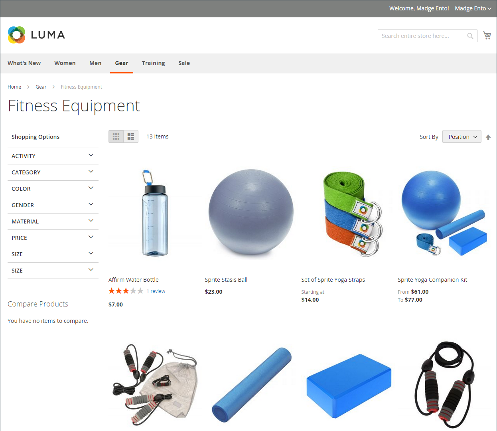

# 產品清單

產品清單可設定為預設顯示為清單或格線。 您也可以決定每頁要顯示多少產品，以及使用哪個屬性來排序清單。 產品清單包含一組控制項，可用於排序產品、變更清單格式、依屬性排序以及從一個頁面前進到下一個頁面。

>[!NOTE]
>
>依產品屬性排序類別時，具有相同屬性值的產品也會依其&#x200B;_[!UICONTROL Product ID]_&#x200B;遞增順序排序。

{width="700" zoomable="yes"}

## 設定產品清單

1. 在&#x200B;_管理員_&#x200B;側邊欄上，移至&#x200B;**[!UICONTROL Stores]** > _[!UICONTROL Settings]_>**[!UICONTROL Configuration]**。

1. 在左側面板中，展開&#x200B;**[!UICONTROL Catalog]**&#x200B;並在下方選擇&#x200B;**[!UICONTROL Catalog]**。

1. 展開&#x200B;**[!UICONTROL Storefront]**&#x200B;區段的。

   {width="600" zoomable="yes"}

   如需這些選項的詳細清單，請參閱&#x200B;_組態參考_&#x200B;中的[店面](../configuration-reference/catalog/catalog.md#storefront)。

   >[!NOTE]
   >
   >若要依據&#x200B;_依價格_&#x200B;的產品排序正確顯示產品及其價格，請確定[銷售稅組態](../configuration-reference/sales/tax.md)中顯示的價格設定具有相同值（`Excluding Tax` **或** `Including Tax`）。 對於&#x200B;_[!UICONTROL Calculation Settings]_，請檢查&#x200B;**[!UICONTROL Catalog Prices]**&#x200B;值。 對於&#x200B;_[!UICONTROL Price Display Settings]_，請檢查&#x200B;**[!UICONTROL Display Product Prices in Catalog]**&#x200B;值。 如果這些值不同，分層導覽中的價格篩選器可能無法正確依價格篩選及排序產品。

1. 將預設&#x200B;**[!UICONTROL List Mode]**&#x200B;設定為下列其中一項：

   - `Grid Only`
   - `List Only`
   - `Grid (default) / List`
   - `List (default / Grid`

1. 針對&#x200B;**[!UICONTROL Products per Page on Grid Allowed Values]**，輸入以格線格式顯示時每頁要顯示的產品數目。

   若要輸入值的選取範圍，請以逗號分隔每個數字。

1. 針對&#x200B;**[!UICONTROL Products per Page on Grid Default Value]**，輸入每頁格線中所顯示的預設產品數目。

1. 針對&#x200B;**[!UICONTROL Products per Page on List Allowed Values]**，輸入您要在清單格式中顯示之每頁的產品數目。

   若要輸入值的選取範圍，請以逗號分隔每個數字。

1. 針對&#x200B;**[!UICONTROL Products per page on List Default Value]**，輸入每頁清單中預設的產品數目。

1. 將&#x200B;**[!UICONTROL Product Listing Sorted by]**&#x200B;設為最初用來排序清單的預設屬性。

1. 若要讓客戶選擇列出所有產品，請將&#x200B;**[!UICONTROL Allow All Products on Page]**&#x200B;設為`Yes`。

1. 如果要在客戶瀏覽目錄清單時保留所有分頁設定，請將&#x200B;**[!UICONTROL Remember Category Pagination]**&#x200B;設為`Yes`。

   啟用此設定可確保當購物者從一個類別瀏覽到另一個類別時，在清單或格線中顯示的產品數量會保留。 依預設，此欄位會設為`No`，因為它使用更多快取儲存空間，而且可能會影響搜尋引擎為頁面編制索引的方式。

1. 如果使用[平面目錄](catalog-flat.md) （**不建議使用**），請執行下列動作：

   - 若要顯示產品的一般類別清單，請將&#x200B;**[!UICONTROL Use Flat Catalog Category]**&#x200B;設為`Yes`。

   - 若要顯示一般產品清單，請將&#x200B;**[!UICONTROL Use Flat Catalog Product]**&#x200B;設為`Yes`。

1. 如果您想要允許類別和產品URL中媒體資產的動態參考，請將&#x200B;**[!UICONTROL Allow Dynamic Media URLs in Products and Categories]**&#x200B;設為`Yes`。

1. 完成時，按一下&#x200B;**[!UICONTROL Save Config]**。

## 頁面控制項

| 控制 | 說明 |
|--- |--- |
| [!UICONTROL View As] | 以格線或清單格式顯示產品。 |
| [!UICONTROL Sort By] | 變更清單的排序順序。 |
| [!UICONTROL Show Per Page] | 決定每頁顯示多少產品。 |
| 分頁連結 | 導覽連結至其他頁面。 |

{style="table-layout:auto"}

## 分頁控制項

分頁設定會顯示在清單的頂端和底部，並控制產品清單分頁連結的格式。 您可以設定顯示在控制項中的連結數目，以及設定下一個和上一個連結。 為了顯示分頁連結，清單中的產品數量必須超過產品清單設定中每頁允許的數量。

{width="700" zoomable="yes"}

### 店面分頁控制項

| 控制 | 說明 |
|--- |--- |
|  | [!UICONTROL View As] — 以格線或清單格式顯示清單。 |
|  | [!UICONTROL Sort By] — 變更清單的排序順序。 _[!UICONTROL Used for Sorting in Product Listing]_&#x200B;storefront屬性決定哪些[產品屬性](../catalog/product-attributes.md)可用來排序清單。 |
| 每頁 | [!UICONTROL Show Per Page] — 決定每頁要顯示多少產品。 |
|  | 分頁連結 — 導覽連結至其他頁面。 |

{style="table-layout:auto"}

### 設定分頁控制項

1. 在&#x200B;_管理員_&#x200B;側邊欄上，移至&#x200B;**[!UICONTROL Content]** > _[!UICONTROL Design]_>**[!UICONTROL Configuration]**。

1. 尋找您要設定的存放區檢視，並在&#x200B;**[!UICONTROL Action]**&#x200B;欄中按一下&#x200B;**[!UICONTROL Edit]**。

1. 在&#x200B;**[!UICONTROL Other Settings]**&#x200B;底下，展開&#x200B;**[!UICONTROL Pagination]**&#x200B;區段的。

   {width="600" zoomable="yes"}

   如需這些設定的詳細資訊，請參閱[設計組態](../content-design/configuration.md)。

1. 針對&#x200B;**[!UICONTROL Pagination Frame]**，輸入您要在分頁控制項中顯示的連結數目。

1. 針對&#x200B;**[!UICONTROL Pagination Frame Skip]**，輸入您要在分頁控制項中顯示下一組連結之前略過的連結數目。

   例如，如果分頁框架有五個連結，而您想要跳至下五個連結，您想跳至多少個連結？ 如果您將值設定為四(`4`)，則前一個集合的最後一個連結是下一個集合的第一個連結。

1. 針對&#x200B;**[!UICONTROL Anchor Text for Previous]**，輸入您想要針對[上一頁]連結顯示的文字。

   留空將使用預設箭頭。

1. 針對&#x200B;**[!UICONTROL Anchor Text for Next]**，輸入您要在[下一步]連結中顯示的文字。 留空將使用預設箭頭。

1. 完成時，按一下&#x200B;**[!UICONTROL Save Configuration]**。
