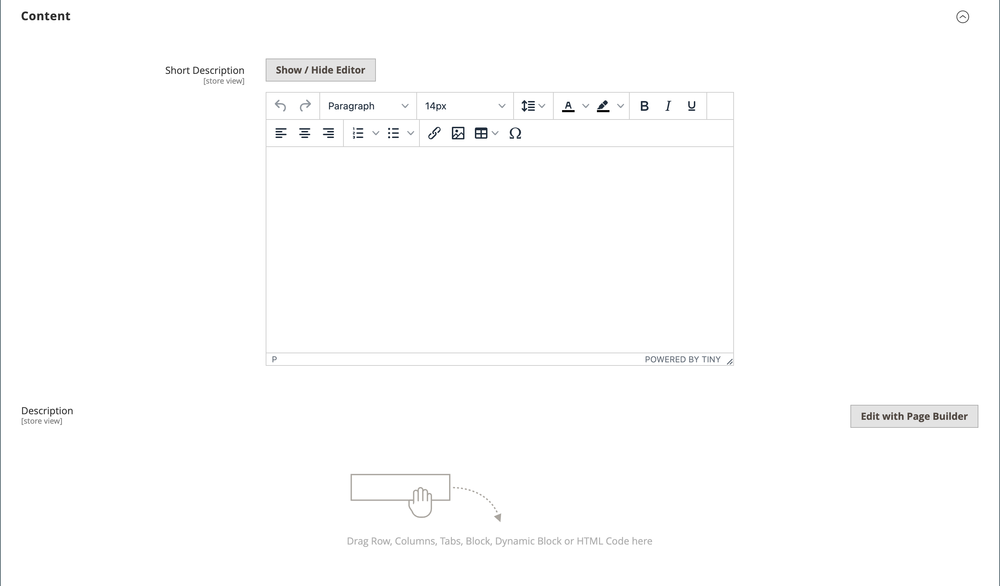

# 產品設定 — [!UICONTROL Content]

_[!UICONTROL Content]_區段可用來輸入及編輯出現在產品頁面上的主要產品說明。 此簡短描述可用於大多數RSS摘要，也可能出現在目錄清單中，視[佈景主題](../content-design/themes.md)而定。

## 在[!DNL Page Builder]中新增產品說明

1. 在編輯模式中開啟產品。

1. 向下捲動並展開 **[!UICONTROL Content]**&#x200B;區段。

   {width="600" zoomable="yes"}

1. 輸入產品的&#x200B;**[!UICONTROL Short Description]**，然後視需要使用[編輯器工具列](../content-design/editor.md)來格式化。

1. 在&#x200B;**[!UICONTROL Description]**&#x200B;標籤上，按一下&#x200B;**[!UICONTROL Edit with Page Builder]**。

1. 使用[[!DNL Page Builder]](../page-builder/introduction.md)內容工具[編輯現有文字](../page-builder/text.md)並新增其他內容（如有需要）。

## [!DNL Page Builder]預覽

當您展開現有產品的&#x200B;_[!UICONTROL Content]_區段（其中包含以[!DNL Page Builder]建立的內容）時，它會顯示產品頁面中所顯示的&#x200B;**[!UICONTROL Description]**內容預覽。 按一下&#x200B;**[!UICONTROL Edit with Page Builder]**開啟[!DNL Page Builder]工作區，您可以在其中進行任何必要的更新。

{width="600" zoomable="yes"}

此產品和類別表單的內容預覽預設為啟用。 如果效能因載入預覽而受到影響，您可以在[內容管理組態](../configuration-reference/general/content-management.md#advanced-content-tools)設定中停用預覽。

## 在編輯器中新增產品說明

如果您的商店停用[!DNL Page Builder]，請使用文字編輯器新增產品內容。 在文字方塊中只輸入純ASCII字元。 如果從文書處理器貼上文字，請先將它儲存為純.TXT檔案，以移除任何隱藏的控制字元。 如需詳細資訊，請參閱[使用編輯器](../content-design/editor.md)。

1. 在編輯模式中開啟產品。

1. 向下捲動並展開 **[!UICONTROL Content]**&#x200B;區段。

   {width="600" zoomable="yes"}

1. 視需要輸入產品及格式的&#x200B;**[!UICONTROL Short Description]**。

1. 輸入主要產品&#x200B;**[!UICONTROL Description]**，並視需要使用編輯器工具列來格式化。

   您可以拖曳右下角來變更文字方塊的高度。
