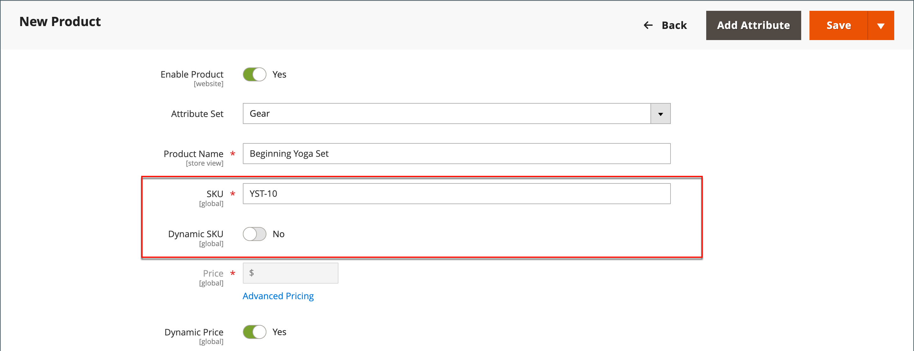
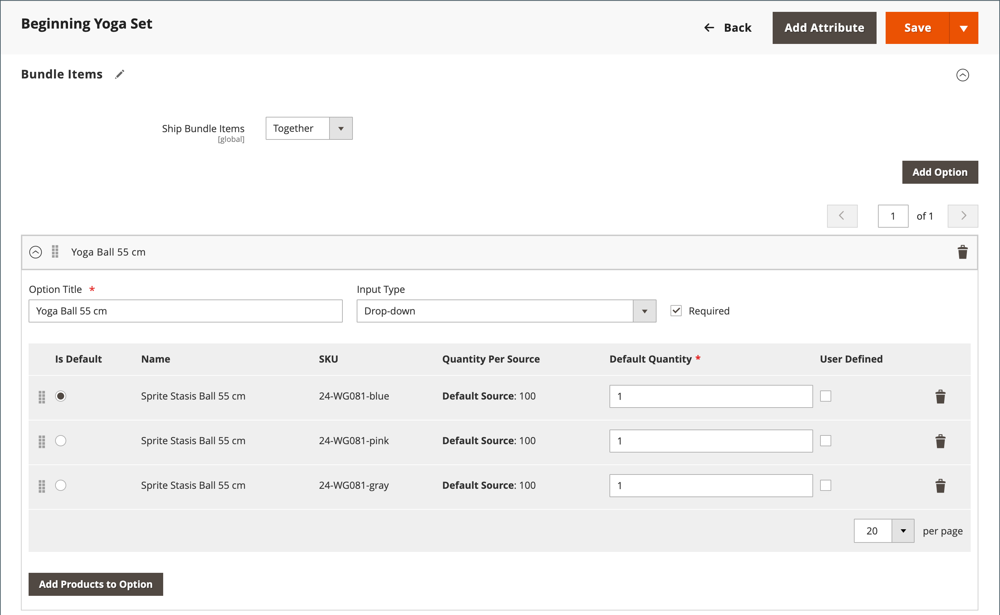

# 搭售產品

套件組合是 _建置您自己的_，可自訂的產品。 套件組合中的每個專案都可以以下列其中一種產品型別為基礎：

- [簡單產品](product-create-simple.md)
- [虛擬產品](product-create-virtual.md)

{width="700" zoomable="yes"}

客戶按一下任一按鈕時，畫面就會顯示選項 **[!UICONTROL Customize]** 或 **[!UICONTROL Add to Cart]**. 由於套件中包含的產品不盡相同，因此SKU、價格和重量皆可設定為動態或固定值。

>[!NOTE]
>
>使用動態定價的套件組合產品無法使用最低廣告價格(MAP)。

>[!NOTE]
>
>父套裝產品一律自動顯示為其所有子產品的向上銷售產品。

如果 [立即購買](../stores-purchase/checkout-instant-purchase.md) 可用， _立即購買_ 按鈕會出現在 _加入購物車_ 束中每個專案的按鈕。

{width="600" zoomable="yes"}

下列指示會引導您使用來建立套件組合產品的程式 [產品範本](attribute-sets.md)、必填欄位和基本設定。 每個必填欄位都標有紅色星號(`*`)。 當您完成基本功能後，您可以視需要完成其他產品設定。

## 步驟1：選擇產品型別

1. 在 _管理員_ 側欄，前往 **[!UICONTROL Catalog]** > **[!UICONTROL Products]**.

1. 在右上角 _[!UICONTROL Add Product]_( {width="25"} )功能表，選擇&#x200B;**[!UICONTROL Bundle Product]**.

   {width="700" zoomable="yes"}

## 步驟2：選擇屬性集

若要選擇 [屬性集](attribute-sets.md) 作為產品的範本，請執行下列任一項作業：

- 的 **[!UICONTROL Search]**，輸入屬性集的名稱，
- 在清單中，選擇要使用的屬性集。

表單會更新以反映變更。

{width="600" zoomable="yes"}

## 步驟3：完成必要的設定

1. 輸入產品 **[!UICONTROL Product Name]**.

1. 接受預設值 **[!UICONTROL SKU]** 根據產品名稱或輸入不同的值。

   若要決定指定給每個組合專案的SKU型別，請執行下列步驟：

   - A **[!UICONTROL Dynamic SKU]** 藉由新增尾碼至預設SKU，可自動指派給每個束專案。 根據預設，設定為 `Yes`.

   - 如果您偏好為每個組合專案指定唯一的SKU，請設定 **[!UICONTROL Dynamic SKU]** 至 `No`.

   {width="600" zoomable="yes"}

1. 若要決定套裝的價格，請執行下列任一項作業：

   - 若要讓價格反映客戶選擇的選項，請設定 **[!UICONTROL Dynamic Price]** 至 `Yes` 並離開 **[!UICONTROL Price]** 空白。 在這種情況下，套裝產品在目錄中沒有自己的價格，而產品價格是從套裝中包含的個別產品的價格衍生而來的。

   - 若要對套件收取固定價格，請設定 **[!UICONTROL Dynamic Price]** 至 `No` 並輸入 **[!UICONTROL Price]** 您想要對套件收費。

   >[!NOTE]
   >
   >[!UICONTROL Special Price] 和 [!UICONTROL Customer Group Price] （層級價格）一律設為所有搭售產品型別的折扣百分比。

1. 由於產品尚未準備好發佈，請設定 **[!UICONTROL Enable Product]** 至 `No`.

1. 按一下 **[!UICONTROL Save]** 並繼續。

   儲存產品時， [存放區檢視](introduction.md#product-scope) 選擇器會出現在左上角。

1. 選擇 **[!UICONTROL Store View]** 產品可用的位置。

   {width="600" zoomable="yes"}

## 步驟4：完成基本設定

1. 如果套裝有「固定定價」，請設定 **[!UICONTROL Tax Class]** 變更為下列其中一項：

   - `None`
   - `Taxable Goods`

   如果組合具有「動態訂價」，則稅捐會針對 **_每個_** 組合專案。 如果組合具有「固定定價」，則稅捐會針對 **_全部_** 捆綁產品。

1. 請注意下列事項：

   - 此 **[!UICONTROL Quantity]** 不可用，因為值是每個組合專案的值。

   - 根據預設， **[!UICONTROL Stock Status]** 設為 `In Stock`.

1. 若要決定束的重量，請執行下列任一項作業：

   - 若要讓權重反映客戶選擇的選項，請設定 **[!UICONTROL Dynamic Weight]** 設定 `Yes` 並離開 **[!UICONTROL Weight]** 空白。

   - 若要將固定權重指派給束，請設定 **[!UICONTROL Dynamic Weight]** 至 `No` 並輸入 **[!UICONTROL Weight]** 束的ID。

   {width="600" zoomable="yes"}

1. 若要在產品清單中推出產品 [新產品](../content-design/widget-new-products-list.md)，選取 **[!UICONTROL Set Product as New]** 核取方塊。

1. 接受預設值 **[!UICONTROL Visibility]** 設定 `Catalog, Search`.

1. 要指派 _[!UICONTROL Categories]_若要存取產品，請按一下&#x200B;**[!UICONTROL Select…]**方塊並執行下列任一項作業：

   **選擇現有類別：**

   - 開始在方塊中輸入內容，直到找到相符專案為止。

   - 選取要指派的每個類別的核取方塊。

   {width="600" zoomable="yes"}

   **建立類別：**

   - 按一下 **[!UICONTROL New Category]**.

   - 輸入 **[!UICONTROL Category Name]** 並選擇 **[!UICONTROL Parent Category]**，這會決定其在功能表結構中的位置。

   - 按一下 **[!UICONTROL Create Category]**.

1. 選擇 **[!UICONTROL Country of Manufacture]**.

   可能有其他屬性可說明產品。 選取範圍會改變屬性集，您稍後可以完成它們。

## 步驟5：新增束專案

此 _[!UICONTROL Bundle Items]_section可用來將專案新增至Bundle產品型別，以及編輯目前選取的專案。

{width="600" zoomable="yes"}

1. 向下捲動至 _組合包專案_ 部分與集合 **[!UICONTROL Ship Bundle Items]** 變更為下列其中一項：

   - `Separately`
   - `Together`

   如果您選取 `Together`，所有束專案都必須指派相同的 [來源](../inventory-management/sources-manage.md).

1. 按一下 **[!UICONTROL Add Option]** 並執行下列動作：

   - 輸入 **[!UICONTROL Option Title]** 做為欄位標籤。

   - 設定 **[!UICONTROL Input Type]** 變更為下列其中一項：

      - `Drop-down`
      - `Radio buttons`
      - `Checkbox`
      - `Multiple Select`

   - 若要讓欄位成為必要專案，請選取 **[!UICONTROL Required]** 核取方塊。

   - 按一下 **[!UICONTROL Add Products to Option]** 並勾選您要納入此選項的每個產品核取方塊。

     如果有多種產品，請使用清單篩選器和分頁控制來尋找您需要的產品。

   - 按一下 **[!UICONTROL Add Selected Products]**.

     {width="600" zoomable="yes"}

   - 專案出現在 _選項_ 區段，選擇專案作為 **[!UICONTROL Default]** 選取。

   - 在 _預設數量_ 欄位，輸入當客戶選擇料號時，要新增至搭售計畫的每個料號數量。

   - 若要允許客戶變更套件組合專案的數量，請選取 **[!UICONTROL User Defined]**.

     >[!NOTE]
     >
     >量值可以是預設值或使用者定義的值。 不過，請勿指派 _[!UICONTROL User Defined]_屬性核取方塊或多選輸入型別。

     依預設，客戶無法變更包含在套件專案中的「預設數量」。 但是，客戶可以輸入要包含在套件中的料號數量。

     例如，如果「Sprite狀態球」的「預設數量」設定為 `2` 和客戶訂單 `4` 在該組合選項中，購買的總球數為 `8`.

     {width="600" zoomable="yes"}

1. 對要新增至束的每個專案重複這些步驟。

1. 若要變更束截面中的專案順序，請按一下 _移動_ (  )圖示並拖曳專案至適當位置。

   {width="600" zoomable="yes"}

   也可以在匯出的組合產品資料中變更專案順序，然後重新匯入到目錄中。 如需詳細資訊，請參閱 [匯入套件組合產品](../systems/data-transfer-bundle-products.md).

   若要更清楚地檢視工作區，請先收合每個區段，然後將它們拖曳到適當位置。

1. 若要從束中移除任何專案，請按一下 **[!UICONTROL Delete]** (  )圖示。

1. 完成後，按一下 **[!UICONTROL Save]**.

## 步驟6：完成產品資訊

視需要向下捲動並填入下列章節中的資訊：

- [內容](product-content.md)
- [影像和影片](product-images-and-video.md)
- [搜尋引擎最佳化](product-search-engine-optimization.md)
- [相關產品、向上銷售和交叉銷售](related-products-up-sells-cross-sells.md)
- [可自訂的選項](settings-advanced-custom-options.md)
- [網站中的產品](settings-basic-websites.md)
- [設計](settings-advanced-design.md)
- [贈品選項](product-gift-options.md)

## 步驟7：發佈產品

1. 如果您已準備好在目錄中發佈產品，請設定 **[!UICONTROL Enable Product]** 至 `Yes` (  )。

1. 執行下列任一項作業：

   **方法1：** 儲存並預覽

   - 在右上角，按一下 **[!UICONTROL Save]**.

   - 若要檢視您商店中的產品，請選擇 **[!UICONTROL Customer View]** 於 _管理員_ (  )功能表。

     該存放區會在新的瀏覽器標籤中開啟。

   {width="600" zoomable="yes"}

   **方法2：** 儲存並關閉

   在 _[!UICONTROL Save]_( {width="25"} )功能表，選擇&#x200B;**[!UICONTROL Save & Close]**.

## 輸入控制項

| 控制 | 說明 | 範例 |
|--- |--- |--- |
| [!UICONTROL Drop-down] | 顯示包含產品名稱和價格的選項下拉式清單。 只能選取一個專案。 | {width="200"} |
| [!UICONTROL Radio Buttons] | 顯示每個選項的單選按鈕，其後加上產品名稱和價格。 只能選取一個專案。 | {width="200"} |
| [!UICONTROL Checkbox] | 顯示每個選項的核取方塊，然後是產品名稱和價格。 可選取多個專案。 | {width="200"} |
| [!UICONTROL Multiple Select] | 顯示選項清單以及產品名稱和價格。 若要選取多個專案，請按住Ctrl鍵(PC)或Command鍵(Mac)，然後按一下每個專案。 | {width="200"} |

{style="table-layout:auto"}

## 欄位說明

| 欄位 | 說明 |
|--- |--- |
| [!UICONTROL SKU] | 決定每個專案是否被指派變數或動態SKU，或者是否使用固定SKU作為搭配。 選項： `Fixed` / `Dynamic` |
| [!UICONTROL Weight] | 指定加權是根據所選專案計算，還是整個束的固定加權。 選項： `Fixed` / `Dynamic` |
| [!UICONTROL Price View] | 決定產品價格是否顯示為範圍，從最便宜到最昂貴（價格範圍）或顯示最便宜（最低）。 選項： `Price Range` / `As Low As` |
| 出貨套件組合專案 | 指定個別料號是否可單獨出貨。 |

{style="table-layout:auto"}

## 組合產品庫存狀態

搭售方案產品庫存狀態為 **_自動變更為無庫存_** 當以下任一情況發生時：

- 所有選項皆為選用，所有關聯產品皆為 _無庫存_.

- 需要一些選項，而關聯至任何必要選項的產品為 _無庫存_.

搭售方案產品庫存狀態為 **_未自動變更為無庫存_** 當以下任一情況發生時：

- 所有選項均為選填，且至少有一個關聯產品為 _有貨_.

- 需要一些選項，且每個必要選項中至少有一個關聯產品是 _有貨_.

## 注意事項

 客戶可以 _建置他們自己的_ 捆綁產品。

 組合專案可以是簡單或虛擬產品，沒有自訂選項。

 「價格檢視」可以設為 `Price Range` 或 `As Low As`.

 SKU和權重可以是 `Fixed` 或 `Dynamic`.

 量值可以是預設值或使用者定義的值。 不過，請勿指派 _[!UICONTROL User Defined]_屬性核取方塊或多選輸入型別。

 組合專案可以一起或單獨出貨。

 父套裝產品一律自動顯示為其所有子產品的向上銷售產品。

 [!UICONTROL Special Price] 和 [!UICONTROL Customer Group Price] （層級價格）一律設為所有搭售產品型別的折扣百分比。
