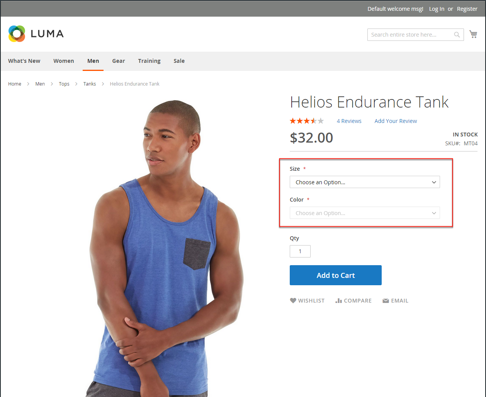
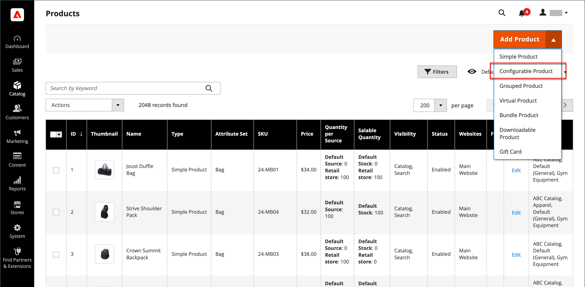
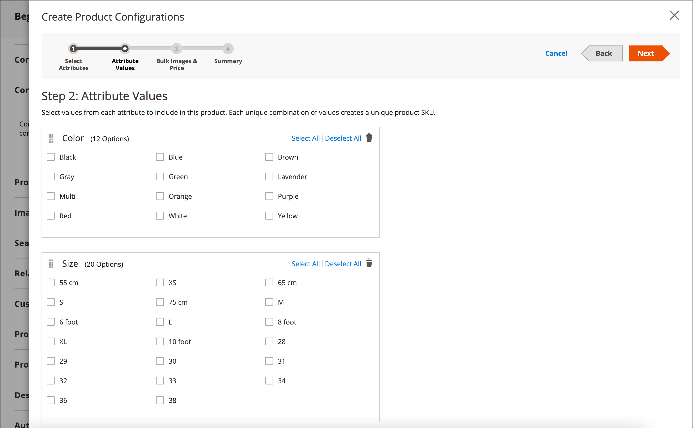
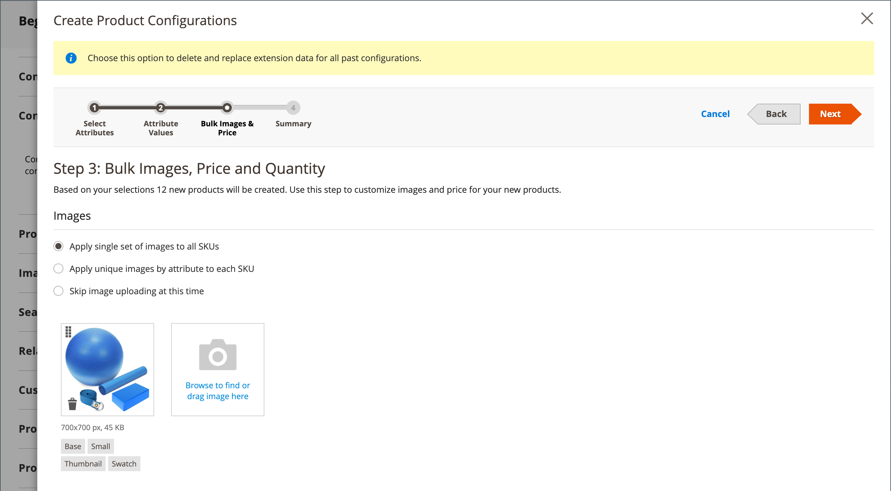
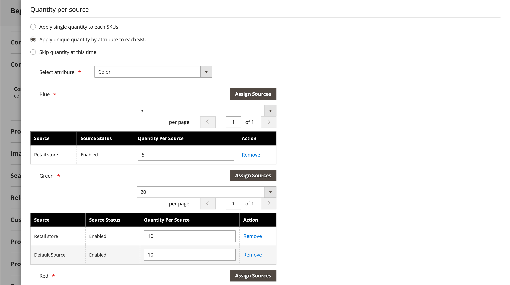
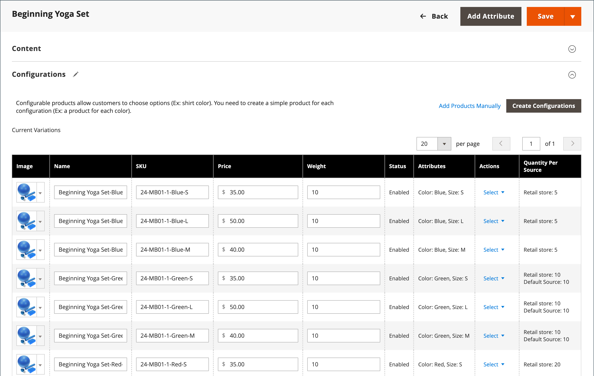
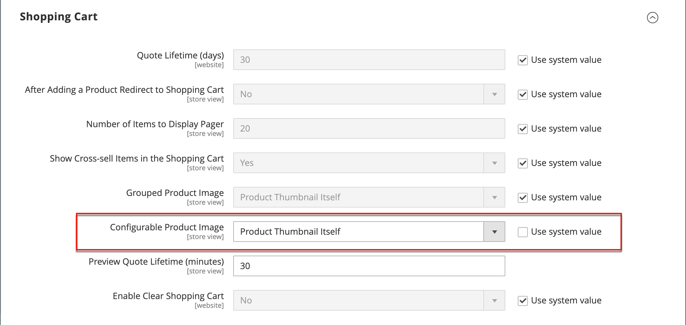

# 可設定的產品

可設定的產品看起來就像單一產品，有每個變數的下拉式清單。 每個清單專案實際上是一個單獨的簡單產品，具有唯一的SKU，因此可以追蹤每個產品變體的存貨。 您可以使用具有自訂選項的簡單產品來達到類似的效果，但無法追蹤每個變數的詳細目錄。

下列指示示範使用[產品範本](attribute-sets.md)、必要欄位及基本設定來建立可設定產品的程式。 每個必要欄位都標有紅色星號(`*`)。 當您完成基本功能後，您可以視需要完成其他產品設定。

{width="700" zoomable="yes"}

## 第1部分：建立可設定的產品

雖然可設定的產品使用較多SKU，且一開始可能需要較長時間進行設定，但最終可為您節省時間。 如果您計畫拓展業務，可設定的產品型別對於具有多種選項的產品來說是個不錯的選擇。

開始之前，請先準備一個[屬性集](attribute-sets.md)，該屬性集包含為每個產品變數設定為其中一個允許的輸入型別的屬性。 例如，屬性集可能包含顏色和大小的下拉式清單屬性。

用於可設定產品變數的每個屬性的屬性必須具有下列設定：

### 產品變數屬性需求

| 屬性 | 設定 |
|--- |--- |
| [!UICONTROL Scope] | `Global` |
| [!UICONTROL Catalog Input Type for Store Owner] | 用於產品變數的任何屬性的輸入型別必須是下列其中一項： `Dropdown`、`Visual Swatch`或`Text Swatch`。 |
| [!UICONTROL Values Required] | `Yes` |

{style="table-layout:auto"}

### 步驟1：選擇產品型別

1. 在&#x200B;_管理員_&#x200B;側邊欄上，移至&#x200B;**[!UICONTROL Catalog]** > **[!UICONTROL Products]**。

1. 在右上角的&#x200B;_[!UICONTROL Add Product]_（{width="25"} ）功能表上，選擇&#x200B;**[!UICONTROL Configurable Product]**。

   {width="700" zoomable="yes"}

### 步驟2：選擇屬性集

[屬性集](attribute-sets.md)決定產品中使用的欄位選擇。 下列範例中使用的屬性集具有顏色和大小的屬性。 屬性集的名稱會顯示在頁面頂端，且一開始會設為`Default`。

1. 若要選擇產品的屬性集，請按一下頁面頂端的欄位，然後執行下列任一項作業：

   - 針對&#x200B;**[!UICONTROL Search]**，輸入屬性集的名稱。
   - 在清單中，選擇要使用的屬性集。

   表單會更新以反映變更。

1. 如果您想要新增其他屬性至屬性集，請按一下&#x200B;**[!UICONTROL Add Attribute]**&#x200B;並遵循[新增屬性](product-attributes-add.md)中的指示。

   {width="600" zoomable="yes"}

### 步驟3：完成必要的設定

1. 輸入產品&#x200B;**[!UICONTROL Product Name]**。

1. 接受以產品名稱為基礎的預設&#x200B;**[!UICONTROL SKU]**，或輸入其他名稱。

1. 輸入產品&#x200B;**[!UICONTROL Price]**。

1. 因為產品尚未準備好發佈，請將&#x200B;**[!UICONTROL Enable Product]**&#x200B;設定為`No`。

1. 按一下&#x200B;**[!UICONTROL Save]**&#x200B;並繼續。

   儲存產品時，[商店檢視](introduction.md#product-scope)選擇器會出現在左上角。

1. 選擇要提供產品的&#x200B;**[!UICONTROL Store View]**。

   {width="600" zoomable="yes"}

### 步驟4：完成基本設定

1. 將&#x200B;**[!UICONTROL Tax Class]**&#x200B;設定為下列其中一項：

   - `None`
   - `Taxable Goods`

1. **[!UICONTROL Quantity]**&#x200B;由產品變數決定，因此您可以保留空白。

1. 保留&#x200B;**[!UICONTROL Stock Status]**&#x200B;設定。

   可設定產品的「庫存狀態」取決於每個關聯的組態。 因為產品儲存時未輸入數量，**[!UICONTROL Stock Status]**&#x200B;設定為`Out of Stock`。

   >[!NOTE]
   >
   >可設定產品的&#x200B;**庫存狀態**&#x200B;是&#x200B;**_半手動_**&#x200B;控制的設定。 它部分受到其子產品的庫存狀態所控制。 它是&#x200B;**_多重條件_**&#x200B;庫存狀態計算的一部分，在[設定庫存狀態](#configure-the-stock-status)區段中有所說明。

1. 輸入產品&#x200B;**[!UICONTROL Weight]**。

>[!NOTE]
>
>可設定的產品必須一律有權重。 如果您從下拉式清單中選取&#x200B;**[!UICONTROL This item has no weight]**，儲存產品後會自動變更為&#x200B;**[!UICONTROL This item has weight]**。

1. 接受`Catalog, Search`的預設&#x200B;**[!UICONTROL Visibility]**&#x200B;設定。

1. 若要在[新產品](../content-design/widget-new-products-list.md)的清單中新增產品，請選取&#x200B;**[!UICONTROL Set Product as New]**&#x200B;核取方塊。

1. 若要將類別指派給產品，請按一下&#x200B;**[!UICONTROL Select…]**&#x200B;方塊並執行下列任一項作業：

   **選擇現有類別**：

   - 開始在方塊中輸入內容，直到找到相符專案為止。

   - 選取要指派的類別的核取方塊。

   {width="600" zoomable="yes"}

   **建立類別**：

   - 按一下&#x200B;**[!UICONTROL New Category]**。

   - 輸入&#x200B;**[!UICONTROL Category Name]**&#x200B;並選擇&#x200B;**[!UICONTROL Parent Category]**，這會決定其在功能表結構中的位置。

   s — 按一下&#x200B;**[!UICONTROL Create Category]**。

1. 選擇&#x200B;**[!UICONTROL Country of Manufacture]**。

   可能會有其他屬性用於描述產品。 選取範圍會因屬性集而異，您稍後可以完成它們。

### 步驟5：儲存並繼續

現在是儲存工作的好時機。 按一下右上角的&#x200B;**[!UICONTROL Save]**。 在接下來的幾個步驟中，您將針對產品的每個變化來設定設定。

## 第2部分：新增組態

下列範例說明如何新增三種顏色和三種大小的組態。 共有9種簡單產品是以唯一的SKU建立的，涵蓋各種變數的可能組合。 依預設，每個變數的產品名稱和SKU都以屬性值和上層產品名稱或SKU為基礎。

頁面頂端的進度列會顯示您在程式中的位置，並引導您完成每個步驟。

### 步驟1：選擇屬性

1. 從上方繼續，向下捲動至&#x200B;_[!UICONTROL Configurations]_區段，然後按一下&#x200B;**[!UICONTROL Create Configurations]**。

   {width="600" zoomable="yes"}

1. 選取每個要納入設定的屬性的核取方塊。

   在此範例中，已選取`color`和`size`。

   {width="600" zoomable="yes"}

   清單包括屬性集中可用於可設定產品的所有屬性。

1. 若要新增屬性，請按一下&#x200B;**[!UICONTROL Create New Attribute]**&#x200B;並執行下列動作：

   - 完成屬性屬性。

   - 按一下&#x200B;**[!UICONTROL Save Attribute]**。

   - 選取屬性的核取方塊。

1. 按一下右上角的&#x200B;**[!UICONTROL Next]**。

### 步驟2：輸入屬性值

1. 針對每個屬性，選取套用至產品的值核取方塊。

   {width="600" zoomable="yes"}

1. 若要重新排列屬性，請抓取&#x200B;_重新排序_ （  ）圖示，並將區段移至新位置。

   順序會決定下拉式清單在產品頁面上的位置。

1. 按一下進度列中的&#x200B;**[!UICONTROL Next]**。

### 步驟3：設定影像、價格和數量

此步驟會決定每個設定的影像、定價和數量。 每個的可用選項都相同，您只能選擇一個。 您可以將相同的設定套用至所有SKU、將唯一的設定套用至每個SKU，或暫時略過這些設定。

選擇適用的組態選項。

使用下列其中一種方法來設定&#x200B;**[!UICONTROL images]**：

**方法1：**&#x200B;將單一影像集套用至所有SKU

1. 選取&#x200B;**[!UICONTROL Apply single set of images to all SKUs]**。

1. 瀏覽至每個要包含在產品相簿中的影像，或將它們拖曳至方塊。

{width="600" zoomable="yes"}

**方法2：**&#x200B;為每個SKU套用唯一的影像

由於上層產品的影像已上傳，因此您可以使用此選項上傳每種顏色的影像。 當有人以特定顏色購買商品時，您可以新增顯示在購物車中的不同影像。

1. 選取&#x200B;**[!UICONTROL Apply unique images by attribute to each SKU]**。

1. 選取影像說明的&#x200B;**[!UICONTROL Attribute]**，例如`color`。

1. 對於每個屬性值，請瀏覽至您要用於該設定的影像，或將它們拖曳至方塊。

   如果您將影像拖曳至數值方塊，它也會出現在其他值的區段中。 若要刪除影像，請按一下&#x200B;_垃圾桶_ （）圖示。

   每個SKU有{width="600" zoomable="yes"}

使用下列其中一種方法來設定&#x200B;**[!UICONTROL prices]**：

>[!NOTE]
>
>可設定的產品在目錄中並沒有自己的價格。 可設定的產品價格衍生自其[!UICONTROL In Stock]子產品。

**方法1：**&#x200B;對所有SKU套用相同價格

1. 如果所有變數的價格都相同，請選取&#x200B;**[!UICONTROL Apply single price to all SKUs]**。

1. 輸入&#x200B;**[!UICONTROL Price]**。

   每個SKU {width="600" zoomable="yes"}

**方法2：**&#x200B;為每個SKU套用不同的價格

1. 如果每個產品的價格或某些產品的價格不同，請選取&#x200B;**[!UICONTROL Apply unique prices by attribute to each SKU]**。

1. 選取作為價格差異基礎的&#x200B;**[!UICONTROL Attribute]**。

1. 為每個屬性值輸入&#x200B;**[!UICONTROL Price]**。

   在此範例中，XL大小的成本較高。

   每個SKU的{width="600" zoomable="yes"}

使用下列其中一種方法來設定&#x200B;**[!UICONTROL Quantity]**：

**方法1：**&#x200B;將相同的數量套用至所有SKU

如果所有SKU的數量都相同，請選取&#x200B;**[!UICONTROL Apply single quantity to each SKU]**&#x200B;並指定數量。

_單一來源商家_ — 輸入&#x200B;**[!UICONTROL Quantity]**。

_使用[Inventory management](../inventory-management/introduction.md)_&#x200B;的多Source商家 — 為所有產生的產品系列指派來源並新增數量：

1. 選取&#x200B;**[!UICONTROL Apply single quantity to each SKU]**&#x200B;選項。

1. 若要新增來源，請按一下&#x200B;**[!UICONTROL Assign Sources]**。

1. 瀏覽或搜尋您要新增的來源。 選取您要為產品新增的來源旁的核取方塊。

1. 輸入每個來源的庫存量數量。

   所有SKU的{width="600" zoomable="yes"}

**方法2：**&#x200B;依屬性套用不同的數量

_單一來源商家_ — 輸入&#x200B;**[!UICONTROL Quantity]**。

_使用[Inventory management](../inventory-management/introduction.md)_&#x200B;的多Source商家 — 為所有產生的產品系列指派來源並新增數量：

1. 如果每個SKU的數量不同，請選取&#x200B;**[!UICONTROL Apply unique quantity by attribute to each SKU]**。

1. 輸入每個的&#x200B;**[!UICONTROL Quantity]**。

   {width="600" zoomable="yes"}

影像、價格和數量的設定完成後，請按一下右上角的&#x200B;**[!UICONTROL Next]**。

### 步驟4：產生產品組態

請稍候片刻，讓產品清單顯示，然後執行下列任一項作業：

- 如果您對組態感到滿意，請按一下&#x200B;**[!UICONTROL Generate Products]**。

- 若要更正，請按一下&#x200B;**[!UICONTROL Back]**。

在產生產品變數之前{width="600" zoomable="yes"}

目前的產品變數會顯示在&#x200B;_組態_&#x200B;區段的底部。

{width="600" zoomable="yes"}

### 步驟5：新增產品影像

1. 向下捲動並展開 _[!UICONTROL Images and Videos]_區段。

1. 按一下&#x200B;_攝影機_&#x200B;圖磚，並瀏覽至您要用於可設定產品的主影像。

如需詳細資訊，請參閱[影像和視訊](product-images-and-video.md)。

### 步驟6：完成產品資訊

視需要向下捲動並填入下列章節中的資訊：

- [內容](product-content.md)

- [相關產品、向上銷售和交叉銷售](related-products-up-sells-cross-sells.md)

- [搜尋引擎最佳化](product-search-engine-optimization.md)

- [可自訂的選項](settings-advanced-custom-options.md)

- [網站中的產品](settings-basic-websites.md)

- [設計](settings-advanced-design.md)

- [贈品選項](product-gift-options.md)

### 步驟7：Publish產品

1. 如果您已準備好在目錄中發佈產品，請將&#x200B;**[!UICONTROL Enable Product]**&#x200B;設定為`Yes`並執行下列任一項作業：

   - **方法1：**&#x200B;儲存並預覽

      - 按一下右上角的&#x200B;**[!UICONTROL Save]**。

      - 若要檢視您商店中的產品，請在&#x200B;_管理員_ （  ）功能表上選擇&#x200B;**[!UICONTROL Customer View]**。

     該存放區會在新的瀏覽器標籤中開啟。

     {width="600" zoomable="yes"}

   - **方法2：**&#x200B;儲存並關閉

     在&#x200B;_[!UICONTROL Save]_（{width="25"} ）功能表上，選擇&#x200B;**[!UICONTROL Save & Close]**。

### 步驟8：設定購物車縮圖

如果您每個變數都有不同的影像，您可以設定為使用購物車縮圖的正確影像。

1. 在&#x200B;_管理員_&#x200B;側邊欄上，移至&#x200B;**[!UICONTROL Stores]** > _[!UICONTROL Settings]_>**[!UICONTROL Configuration]**。

1. 在左側面板中，展開&#x200B;**[!UICONTROL Sales]**&#x200B;並在下方選擇&#x200B;**[!UICONTROL Checkout]**。

1. 展開&#x200B;_[!UICONTROL Shopping Cart]_區段的。

1. 將&#x200B;**[!UICONTROL Configurable Product Image]**&#x200B;設為`Product Thumbnail Itself`。

1. 完成時，按一下&#x200B;**[!UICONTROL Save Config]**。

   {width="600" zoomable="yes"}

## 設定庫存狀態

可設定的產品庫存狀態與簡單產品的庫存狀態不同，後者是產品可用性的直接表示。 對於可設定的產品，庫存狀態是&#x200B;**_多重條件_**&#x200B;庫存狀態計算的一部分。

### 概觀

「庫存狀態」關係的主要原則如下：

- 當您將可設定產品的&#x200B;**[!UICONTROL Stock Status]**&#x200B;變更為`Out of Stock`並按一下&#x200B;**[!UICONTROL Save]**&#x200B;時，它是&#x200B;**_不受其子產品的庫存狀態控制_**。 在管理員和店面中一律顯示為`Out of Stock`。

- 當您將可設定產品的&#x200B;**[!UICONTROL Stock Status]**&#x200B;設定為`In Stock`並按一下&#x200B;**[!UICONTROL Save]**&#x200B;時，它只有&#x200B;**_部分受其子產品的庫存狀態控制_**，這些狀態反映在管理員和店面中。

### 詳細說明

可設定產品的&#x200B;_庫存狀態_&#x200B;部分由其子產品的庫存狀態所控制，並根據下列&#x200B;**_多重條件_**&#x200B;庫存狀態計算：

#### 僅使用預設來源/庫存：

- 如果可設定的產品庫存狀態是管理員使用者、檔案匯入或API呼叫所設定的&#x200B;**_手動_**&#x200B;設定為`Out of Stock`，它將在&#x200B;**_管理員_**&#x200B;和&#x200B;**_店面_**&#x200B;上保持為`Out of Stock`，直到它是管理員使用者、檔案匯入或API呼叫所手動變更的&#x200B;**__** `In stock`。 無法由其子產品的庫存狀態控制。

- 如果可設定的產品庫存狀態是由管理員使用者、檔案匯入或API呼叫以&#x200B;**_手動_**&#x200B;設定為`In Stock`，則其庫存狀態是由&#x200B;**_管理員_**&#x200B;和&#x200B;**_店面_**&#x200B;上其子產品的庫存狀態所控制的&#x200B;**_自動_**。

>[!NOTE]
>
>自訂庫存和來源是[Inventory management](../inventory-management/sources-stocks.md)擴充功能的一部分，強烈建議您專門使用此工具來管理庫存和來源。 預設來源和庫存函式是`CatalogInventory`模組的一部分，該模組現已棄用。

#### 至少具有一個自訂來源/庫存：

- 如果可設定的產品庫存狀態值是管理員使用者、檔案匯入或API呼叫所設定的&#x200B;**_手動_**&#x200B;設定為`Out of Stock`，它將在&#x200B;**_管理員_**&#x200B;和&#x200B;**_店面_**&#x200B;上保持為`Out of Stock`，直到它是管理員使用者、檔案匯入或API呼叫所手動變更的&#x200B;**__** `In Stock`。 它&#x200B;**_無法_**&#x200B;由其子產品的庫存狀態控制。

- 如果可設定的產品庫存狀態值是管理員使用者、檔案匯入或API呼叫所設定的&#x200B;**_手動_**&#x200B;設定為`In Stock`，則其庫存狀態是僅由&#x200B;**_店面_**&#x200B;上其子產品的庫存狀態所控制的&#x200B;**_自動_**。

- 如果可設定的產品庫存狀態值是管理員使用者、檔案匯入或API呼叫所設定的&#x200B;**_手動_**&#x200B;設定為`In Stock`，在&#x200B;**_管理員_**&#x200B;中仍會保留為`In Stock`，直到管理員使用者、檔案匯入或API呼叫將其&#x200B;**_手動_**&#x200B;變更為`Out of Stock`為止。 它&#x200B;**_無法_**&#x200B;由其子產品的庫存狀態控制。

## 注意事項

- 可設定的產品可讓購物者從下拉式清單、多選、視覺色票和文字色票輸入型別中選擇選項。 每個選項都是一個獨立的、簡單的產品。

- 可設定產品的[庫存狀態](../inventory-management/sources-stocks.md)是半手動控制的設定。 它與簡單產品的庫存狀態不同，在這種庫存狀態中，它是產品可用性的直接表示。 對於可設定產品，庫存狀態是多條件庫存狀態計算的一部分。

- 可設定的子產品可以是簡單或虛擬產品&#x200B;**，但沒有自訂選項**。 若要讓自訂子產品成為虛擬，您必須為每個子產品的&#x200B;**[!UICONTROL Weight]**&#x200B;設定選取`Тhis item has no weight`。

- 可設定的產品在目錄中並沒有自己的價格。 可設定的產品價格衍生自其[!UICONTROL In Stock]子產品。

- 用於產品變異的屬性必須具有全域範圍，且必須要求客戶選擇值。 產品變數屬性必須包含在用作可設定產品範本的屬性集中。

- 作為可設定產品範本使用的屬性集必須包含包含每個產品變數所需的值的屬性。

- 購物車中的縮圖影像可設定為顯示來自可設定產品記錄或產品變數的影像。

- 透過在Admin的屬性編輯頁面將&#x200B;**[!UICONTROL Update Product Preview Image]**&#x200B;選項值設定為`No`，可將[色票屬性](swatches.md#create-swatches-for-products)設定為當選取色票時不會顯示對應的簡單產品影像。

- 主題可控制使用者在產品設定之間切換時，影像館的行為。 _空白_&#x200B;佈景主題的預設行為是使用選取的產品變數覆寫上層可設定產品影像。 對於Luma主題，預設行為是將所選產品變數影像附加到父級可配置產品影像之前。
