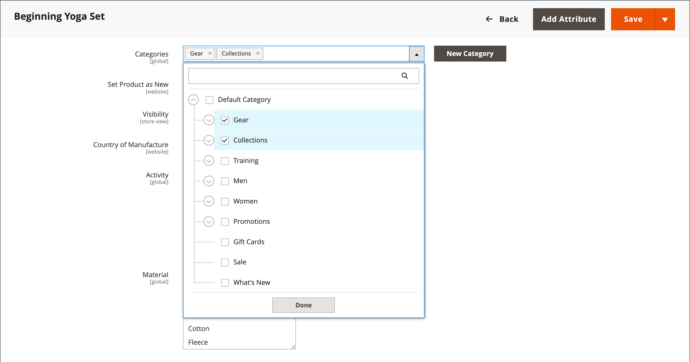

# 可設定的產品

可設定的產品會顯示為單一產品，其中包含變數（如顏色或大小）的下拉式選項。 每個變數都是一個獨立的、具有自己SKU的簡單產品，可啟用個別詳細目錄追蹤，不同於具有自訂選項的簡單產品。

**最適合：**&#x200B;產品有多個選項（顏色、大小、材質等），您需要追蹤每個變數的詳細目錄。 初始設定需要更長的時間，但可提供更好的擴充性。

{width="700" zoomable="yes"}

## 開始之前

### 先決條件檢查清單

在建立可設定的產品之前，請確定您已：

1. **屬性集** — 包含變數屬性（例如顏色和大小）的屬性集
1. **已建立變數屬性** — 屬性已使用下列設定設定
1. **產品影像** - （可選用，但建議使用）父產品和每個變數的影像

### 屬性需求

用於產品變異的每個屬性都必須有以下設定：

| 屬性 | 必要設定 |
|--- |--- |
| [!UICONTROL Scope] | `Global` |
| [!UICONTROL Catalog Input Type for Store Owner] | `Dropdown`、`Visual Swatch`或`Text Swatch` |
| [!UICONTROL Values Required] | `Yes` |

{style="table-layout:auto"}

如需建立屬性的說明，請參閱[產品屬性](product-attributes.md)。

## 階段1：建立產品基礎

### 步驟1：選擇產品型別

1. 在&#x200B;_管理員_&#x200B;側邊欄上，移至&#x200B;**[!UICONTROL Catalog]** > **[!UICONTROL Products]**。

1. 在右上角的&#x200B;_[!UICONTROL Add Product]_（{width="25"} ）功能表上，選擇&#x200B;**[!UICONTROL Configurable Product]**。

   {width="700" zoomable="yes"}

### 步驟2：選擇屬性集

[屬性集](attribute-sets.md)決定產品表單中會出現哪些欄位，以及哪些屬性可供變數使用。

1. 按一下頁面頂端的屬性集欄位，然後執行下列任一項作業：

   - 針對&#x200B;**[!UICONTROL Search]**，輸入屬性集的名稱。
   - 在清單中，選擇要使用的屬性集。

   表單會更新以反映選取的屬性集。

1. 如果您需要新增其他屬性至屬性集，請按一下&#x200B;**[!UICONTROL Add Attribute]**&#x200B;並遵循[新增屬性](product-attributes-add.md)中的指示。

   {width="600" zoomable="yes"}

### 步驟3：輸入基本資訊

1. 輸入產品&#x200B;**[!UICONTROL Product Name]**。

1. 根據產品名稱接受預設&#x200B;**[!UICONTROL SKU]**&#x200B;或輸入不同的值。

1. 輸入產品&#x200B;**[!UICONTROL Price]**。

   >[!NOTE]
   >
   >此價格會由下階產品價格覆寫。 向客戶顯示的實際價格來自[!UICONTROL In Stock]子產品。

1. 因為產品尚未準備好發佈，請將&#x200B;**[!UICONTROL Enable Product]**&#x200B;設定為`No`。

1. 按一下&#x200B;**[!UICONTROL Save]**&#x200B;並繼續。

   儲存產品時，[商店檢視](introduction.md#product-scope)選擇器會出現在左上角。

1. 選擇要提供產品的&#x200B;**[!UICONTROL Store View]**。

   {width="600" zoomable="yes"}

### 步驟4：完成基本設定

1. 將&#x200B;**[!UICONTROL Tax Class]**&#x200B;設定為下列其中一項：

   - `None`
   - `Taxable Goods`

1. 保留&#x200B;**[!UICONTROL Quantity]**&#x200B;空白。 數量由產品變數決定。

1. 保留&#x200B;**[!UICONTROL Stock Status]**&#x200B;的設定。

   可設定產品的庫存狀態由其關聯的變數決定。 因為儲存產品時沒有數量，**[!UICONTROL Stock Status]**&#x200B;設為`Out of Stock`。

   >[!NOTE]
   >
   >可設定產品的&#x200B;**庫存狀態**&#x200B;是&#x200B;**_半手動_**&#x200B;控制的設定，部分依據其子產品的庫存狀態。 它是&#x200B;**_多重條件_**&#x200B;庫存狀態計算的一部分。 請參閱[設定庫存狀態](#configure-stock-status)以取得詳細資料。

1. 輸入產品&#x200B;**[!UICONTROL Weight]**。

   >[!NOTE]
   >
   >可設定的產品必須一律有權重。 如果您從下拉式清單中選取&#x200B;**[!UICONTROL This item has no weight]**，當您儲存產品時，它會自動變更為&#x200B;**[!UICONTROL This item has weight]**。

1. 接受&#x200B;**[!UICONTROL Visibility]**&#x200B;的預設`Catalog, Search`設定。

1. 若要在[新產品](../content-design/widget-new-products-list.md)的清單中新增產品，請選取&#x200B;**[!UICONTROL Set Product as New]**&#x200B;核取方塊。

1. 若要指派類別給產品，請按一下&#x200B;**[!UICONTROL Select…]**&#x200B;方塊並執行下列任一項作業：

   **選擇現有類別：**

   - 開始在方塊中輸入以尋找相符專案。

   - 選取每個要指派類別的核取方塊。

   {width="600" zoomable="yes"}

   **建立新類別：**

   - 按一下&#x200B;**[!UICONTROL New Category]**。

   - 輸入&#x200B;**[!UICONTROL Category Name]**&#x200B;並選擇&#x200B;**[!UICONTROL Parent Category]**&#x200B;以決定其在功能表結構中的位置。

   - 按一下&#x200B;**[!UICONTROL Create Category]**。

1. 選擇&#x200B;**[!UICONTROL Country of Manufacture]**。

   其他屬性可能會根據屬性集而顯示。 您稍後可以完成這些步驟。

### 步驟5：儲存並繼續

這是儲存工作的好時機。 按一下右上角的&#x200B;**[!UICONTROL Save]**。 在下一個階段中，您將為每個變數設定設定。

## 階段2：新增產品變數

下列步驟說明如何為多個變數新增設定。 頁面頂端的進度列會顯示您目前在程式中的位置。

**範例：**&#x200B;如果是具有3種顏色和3種尺寸的襯衫，您將建立9個具有唯一SKU的簡單產品（每個組合一個）。 依預設，每個變數的產品名稱和SKU都根據屬性值和上層產品名稱或SKU。

### 步驟6：選擇變數屬性

1. 向下捲動至&#x200B;_[!UICONTROL Configurations]_&#x200B;區段並按一下&#x200B;**[!UICONTROL Create Configurations]**。

   {width="600" zoomable="yes"}

1. 選取每個屬性的核取方塊，以作為變數納入。

   在此範例中，已選取`color`和`size`。

   {width="600" zoomable="yes"}

   清單包括屬性集中可用於可設定產品的所有屬性。

1. 如果您需要新增屬性，請按一下&#x200B;**[!UICONTROL Create New Attribute]**&#x200B;並執行下列動作：

   - 完成屬性屬性。

   - 按一下&#x200B;**[!UICONTROL Save Attribute]**。

   - 選取屬性的核取方塊。

1. 按一下右上角的&#x200B;**[!UICONTROL Next]**。

### 步驟7：選取屬性值

1. 針對每個屬性，選取套用至產品的值核取方塊。

   {width="600" zoomable="yes"}

1. 若要重新排列屬性，請抓取&#x200B;_重新排序_ （  ）圖示，並將區段移至新位置。

   順序會決定下拉式清單在產品頁面上的位置。

1. 按一下進度列中的&#x200B;**[!UICONTROL Next]**。

### 步驟8：設定影像、定價和詳細目錄

此步驟會決定每個組態的影像、定價和數量。 每個的可用選項都相同。 您可以將相同的設定套用至所有SKU、將唯一的設定套用至每個SKU，或暫時略過設定。

#### 設定影像

選擇套用的組態選項：

**選項1：將單一影像集套用至所有SKU**

1. 選取&#x200B;**[!UICONTROL Apply single set of images to all SKUs]**。

1. 瀏覽至每個要包含在產品相簿中的影像，或將影像拖曳至方塊。

{width="600" zoomable="yes"}

**選項2：為每個SKU套用唯一的影像**

由於上層產品影像已上傳，請使用此選項上傳每個變數的影像。 當有人購買特定變數時，您可以新增顯示在購物車中的不同影像。

1. 選取&#x200B;**[!UICONTROL Apply unique images by attribute to each SKU]**。

1. 選取影像說明的&#x200B;**[!UICONTROL Attribute]**，例如`color`。

1. 針對每個屬性值，瀏覽至要用於該設定的影像，或將其拖曳至方塊。

   如果將影像拖曳至數值方塊，它也會出現在其他值的區段中。 若要刪除影像，請按一下&#x200B;_垃圾桶_ （）圖示。

   每個SKU有{width="600" zoomable="yes"}

#### 設定定價

>[!NOTE]
>
>可設定的產品在目錄中並沒有自己的價格。 可設定的產品價格衍生自其[!UICONTROL In Stock]子產品。

選擇套用的組態選項：

**選項1：對所有SKU套用相同價格**

1. 如果所有變數的價格都相同，請選取&#x200B;**[!UICONTROL Apply single price to all SKUs]**。

1. 輸入&#x200B;**[!UICONTROL Price]**。

   每個SKU {width="600" zoomable="yes"}

**選項2：為每個SKU套用不同的價格**

1. 如果每個或某些變數的價格不同，請選取&#x200B;**[!UICONTROL Apply unique prices by attribute to each SKU]**。

1. 選取作為價格差異基礎的&#x200B;**[!UICONTROL Attribute]**。

1. 為每個屬性值輸入&#x200B;**[!UICONTROL Price]**。

   在此範例中，XL大小的成本較高。

   每個SKU的{width="600" zoomable="yes"}

#### 設定詳細目錄

選擇套用的組態選項：

**選項1：對所有SKU套用相同數量**

如果所有SKU的數量都相同，請選取&#x200B;**[!UICONTROL Apply single quantity to each SKU]**&#x200B;並指定數量。

單一Source商家(_S):_

輸入&#x200B;**[!UICONTROL Quantity]**。

使用[Inventory management &#x200B;](../inventory-management/introduction.md):_的多Source商家(_M)

為所有產生的產品系列指定來源及新增數量：

1. 選取&#x200B;**[!UICONTROL Apply single quantity to each SKU]**&#x200B;選項。

1. 若要新增來源，請按一下&#x200B;**[!UICONTROL Assign Sources]**。

1. 瀏覽或搜尋要新增的來源。 選取產品來源旁的核取方塊。

1. 輸入每個來源的庫存量數量。

   所有SKU的{width="600" zoomable="yes"}

**選項2：依屬性套用不同的數量**

單一Source商家(_S):_

為每個屬性值輸入&#x200B;**[!UICONTROL Quantity]**。

使用[Inventory management &#x200B;](../inventory-management/introduction.md):_的多Source商家(_M)

為所有產生的產品系列指定來源及新增數量：

1. 選取&#x200B;**[!UICONTROL Apply unique quantity by attribute to each SKU]**。

1. 輸入每個變數的&#x200B;**[!UICONTROL Quantity]**。

   {width="600" zoomable="yes"}

影像、價格和數量的設定完成後，請按一下右上角的&#x200B;**[!UICONTROL Next]**。

### 步驟9：產生產品組態

請稍候片刻，讓產品清單顯示，然後執行下列任一項作業：

- 如果您對組態感到滿意，請按一下&#x200B;**[!UICONTROL Generate Products]**。

- 若要更正，請按一下&#x200B;**[!UICONTROL Back]**。

在產生產品變數之前{width="600" zoomable="yes"}

目前的產品變數會顯示在&#x200B;_組態_&#x200B;區段的底部。

{width="600" zoomable="yes"}

### 步驟10：新增產品影像

1. 向下捲動並展開 _[!UICONTROL Images and Videos]_&#x200B;區段。

1. 按一下&#x200B;_攝影機_&#x200B;圖磚，並瀏覽至可供設定產品使用的主要影像。

如需詳細資訊，請參閱[影像和視訊](product-images-and-video.md)。

### 步驟11：完成產品資訊

視需要向下捲動並填入下列章節中的資訊：

- [內容](product-content.md)

- [相關產品、向上銷售和交叉銷售](related-products-up-sells-cross-sells.md)

- [搜尋引擎最佳化](product-search-engine-optimization.md)

- [可自訂的選項](settings-advanced-custom-options.md)

- [網站中的產品](settings-basic-websites.md)

- [設計](settings-advanced-design.md)

- [贈品選項](product-gift-options.md)

## 階段3：發佈產品

### 步驟12：發佈產品

1. 如果您已準備好發佈目錄中的產品，請將&#x200B;**[!UICONTROL Enable Product]**&#x200B;設為`Yes`。

1. 執行下列任一項作業：

   **方法1：儲存並預覽**

   - 按一下右上角的&#x200B;**[!UICONTROL Save]**。

   - 若要檢視您商店中的產品，請在&#x200B;**[!UICONTROL Customer View]**&#x200B;管理員&#x200B;_（_&#x200B;功能表箭頭。

   該存放區會在新的瀏覽器標籤中開啟。

   {width="600" zoomable="yes"}

   **方法2：儲存並關閉**

   在&#x200B;_[!UICONTROL Save]_（{width="25"} ）功能表上，選擇&#x200B;**[!UICONTROL Save & Close]**。

## 設定庫存狀態

可設定的產品庫存狀態與簡單產品庫存狀態不同。 對於可設定的產品，庫存狀態是&#x200B;**_多重條件_**&#x200B;計算的一部分。

### 庫存狀態的運作方式

庫存狀態行為的主要原則：

| 您設定狀態為 | 結果 | 由子產品控制？ |
|---|---|---|
| `Out of Stock` （手動） | 在管理員和店面中一律顯示`Out of Stock` | 否 — 在手動變更為`In Stock`之前保留 |
| `In Stock` （手動） | 狀態是根據子產品的動態 | 部分 — 參閱下列詳細資料 |

{style="table-layout:auto"}

### 當設為「有貨」時

當您手動將可設定的產品庫存狀態設定為`In Stock`時，其行為會依您的詳細目錄設定而有所不同：

**僅使用預設來源/庫存：**

- **管理員和店面：**&#x200B;庫存狀態會自動反映子產品的可用性

**至少有一個自訂來源/庫存：**

- **店面：**&#x200B;庫存狀態會自動反映子產品的可用性
- **管理員：**&#x200B;保留為`In Stock`，直到手動變更為止（不受子產品控制）

>[!NOTE]
>
>自訂庫存和來源是[Inventory management](../inventory-management/sources-stocks.md)擴充功能的一部分。 強烈建議您僅將此工具用於管理庫存和來源。 預設來源和庫存函式是`CatalogInventory`模組的一部分，該模組現已棄用。

### 手動庫存狀態變更

如果您手動將庫存狀態設為`Out of Stock` （透過管理員使用者動作、檔案匯入或API呼叫），在手動將其變更回`Out of Stock`之前，它會在管理員和店面中維持`In Stock`。 它不受子產品庫存狀態的影響。

## 系統組態（選擇性）

### 在購物車縮圖中顯示變數影像

如果您每個變異都有不同的影像，您可以設定系統以顯示購物車縮圖的正確影像。

1. 在&#x200B;_管理員_&#x200B;側邊欄上，移至&#x200B;**[!UICONTROL Stores]** > _[!UICONTROL Settings]_>**[!UICONTROL Configuration]**。

1. 在左側面板中，展開&#x200B;**[!UICONTROL Sales]**&#x200B;並選擇&#x200B;**[!UICONTROL Checkout]**。

1. 展開擴充選擇器&#x200B;_[!UICONTROL Shopping Cart]_。

1. 將&#x200B;**[!UICONTROL Configurable Product Image]**&#x200B;設為`Product Thumbnail Itself`。

1. 按一下&#x200B;**[!UICONTROL Save Config]**。

   {width="600" zoomable="yes"}

## 主要考量事項

- **變數型別：**&#x200B;購物者可以從下拉式清單、多選、視覺色票和文字色票輸入型別中選取選項。 每個選項都是一個獨立的、簡單的產品。

- **詳細目錄追蹤：**&#x200B;與具有自訂選項的簡單產品不同，可設定的產品會獨立追蹤每個變數的詳細目錄。

- **子產品型別：**&#x200B;子產品可以是簡單或虛擬產品&#x200B;**沒有自訂選項**。 若要讓子產品成為虛擬，請為每個子產品的`Тhis item has no weight`設定選取&#x200B;**[!UICONTROL Weight]**。

- **全域指派：**&#x200B;子產品會同時從所有網站、商店和商店檢視中的可設定產品&#x200B;**全域**&#x200B;進行指派和取消指派。

- **價格：**&#x200B;可設定的產品在目錄中沒有自己的價格。 顯示的價格來自其[!UICONTROL In Stock]子產品。

- **屬性：**&#x200B;變數屬性必須有全域範圍，而且客戶必須選擇值。 屬性必須包含在用於可設定產品的屬性集中。

- **購物車縮圖：**&#x200B;購物車縮圖可顯示可設定產品記錄或產品變化中的影像。 請參閱上述[系統組態](#system-configuration-optional)。

- **色票行為：** [色票屬性](swatches.md#create-swatches-for-products)可設定為在屬性編輯頁面上將&#x200B;**[!UICONTROL Update Product Preview Image]**&#x200B;設定為`No`來選取色票時，不顯示對應的簡單產品影像。

- **影像中心行為：**&#x200B;主題會控制使用者在產品組態之間切換時影像中心的行為。 _Blank_&#x200B;佈景主題的預設行為會以選取的變數覆寫上層可設定的產品影像。 對於Luma主題，預設行為是將所選變數影像附加到父級可配置產品影像之前。
