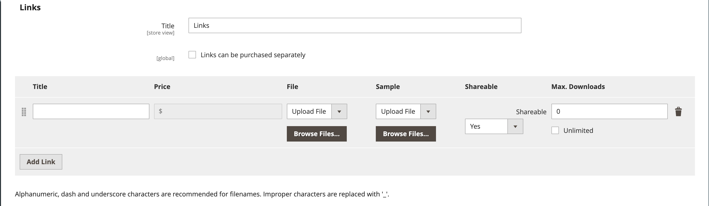

# 可下載的產品

可下載的產品可以是任何可做為檔案提供的產品，例如電子書、音樂、視訊、軟體應用程式或更新。 您可以提供專輯以供銷售，並單獨銷售每首歌。 您也可以使用可下載的產品來交付產品目錄的電子版本。

由於下載要等到購買後才能提供，因此您可以提供範例，例如書籍的節選、音訊檔案的剪輯，或視訊的尾部。 範例是客戶在購買產品之前可以嘗試的東西。 可供下載的檔案可以上傳至您的伺服器或從其他伺服器上傳。

{width="700" zoomable="yes"}

可下載的產品可設定為要求客戶登入帳戶以接收連結，或透過電子郵件傳送並與他人共用。 下載變為可用之前的訂單狀態，預設值和其他傳送選項均在設定中設定。 在規劃可下載的目錄新增專案時，請注意下列事項：

- 可下載的產品可上傳至伺服器，或從網際網路上的其他伺服器連結至。

- 您可以決定客戶可下載產品的次數。

- 購買可下載產品的客戶可能需要先登入，才能進行結帳。

- 當訂單處於`Pending`或`Invoiced`狀態時，可以傳送可下載的產品。

- 因為可下載的產品未送出，所以當購物車只包含可下載的產品時，會略過結帳的&#x200B;_送貨_&#x200B;步驟。

## 設定下載選項

可下載的組態設定會決定可下載產品的預設值和傳送選項，並指定訪客是否可以購買下載專案。

1. 在&#x200B;_管理員_&#x200B;側邊欄上，移至&#x200B;**[!UICONTROL Stores]** > _[!UICONTROL Settings]_>**[!UICONTROL Configuration]**。

1. 在左側面板中，展開&#x200B;**[!UICONTROL Catalog]**&#x200B;並在下方選擇&#x200B;**[!UICONTROL Catalog]**。

1. 展開擴充選擇器&#x200B;_[!UICONTROL Downloadable Product Options]_。

   {width="700" zoomable="yes"}

   如需這些組態選項的詳細清單，請參閱&#x200B;[_組態參考_](../configuration-reference/catalog/catalog.md#downloadable-product-options)&#x200B;中的&#x200B;_可下載的產品選項_。

1. 若要在下載可用時判斷訂購程式的狀態，請將&#x200B;**[!UICONTROL Order Item Status to Enable Downloads]**&#x200B;設定為下列其中一項：

   - `Pending`
   - `Invoiced`

1. 若要設定單一客戶可進行的下載次數預設限制，請輸入&#x200B;**[!UICONTROL Default Maximum Number of Downloads]**&#x200B;的數字。

1. 將&#x200B;**[!UICONTROL Shareable]**&#x200B;設定為下列其中一項：

   - `Yes` — 允許客戶透過電子郵件將下載連結傳送給其他人。
   - `No` — 要求客戶登入其帳戶以存取下載連結，以防止客戶與其他人共用下載連結。

1. 針對&#x200B;**[!UICONTROL Default Sample Title]**，輸入您要在範例選取範圍上方的標題。

   {width="400"}

1. 針對&#x200B;**[!UICONTROL Default Link Title]**，輸入您要用於下載連結的預設文字。

1. 如果您要在新的瀏覽器視窗中開啟下載連結，請將&#x200B;**[!UICONTROL Opens Links in New Window]**&#x200B;設為`Yes`。

   此設定是用來讓您的商店保持開啟瀏覽器視窗。

1. 若要判斷可下載內容如何傳遞，請將&#x200B;**[!UICONTROL Use Content Disposition]**&#x200B;設為下列其中一項：

   - `Attachment` — 以電子郵件傳送下載連結作為附件。
   - `Inline` — 將下載連結以連結形式傳送至網頁上。

1. 如果您想要要求購買者在購買下載專案前先註冊客戶帳戶並登入，請將&#x200B;**[!UICONTROL Disable Guest Checkout if Cart Contains Downloadable Items]**&#x200B;設為`Yes`。

1. 完成時，按一下&#x200B;**[!UICONTROL Save Config]**。

## 建立可下載的產品

下列指示示範使用[產品範本](attribute-sets.md)、必要欄位及基本設定來建立可下載產品的程式。 每個必要欄位都標有紅色星號(`*`)。 當您完成基本功能後，您可以視需要完成其他產品設定。

>[!NOTE]
>
>可下載的檔案名稱可包含字母和數字。 您可以使用破折號或底線字元來表示字詞之間的空格。 檔案名稱中的任何無效字元都會取代為底線。

### 步驟1：選擇產品型別

1. 在&#x200B;_管理員_&#x200B;側邊欄上，移至&#x200B;**[!UICONTROL Catalog]** > **[!UICONTROL Products]**。

1. 在右上角的&#x200B;_[!UICONTROL Add Product]_（{width="25"} ）功能表上，選擇`Downloadable Product`。

   {width="700" zoomable="yes"}

### 步驟2：選擇屬性集

範例資料包含名為[Downloadable](attribute-sets.md)的&#x200B;_屬性集_，其中包含可下載產品的特殊欄位。 您可以使用現有的範本，或在儲存產品之前建立另一個範本。

若要選擇用來作為產品範本的屬性集，請執行下列其中一項作業：

- 針對&#x200B;**[!UICONTROL Search]**，輸入屬性集的名稱。

- 在清單中，選擇`Downloadable`屬性集。

表單會更新以反映變更。

{width="600" zoomable="yes"}

### 步驟3：完成必要的設定

1. 輸入&#x200B;**[!UICONTROL Product Name]**。

1. 接受以產品名稱為基礎的預設&#x200B;**[!UICONTROL SKU]**，或輸入其他名稱。

1. 輸入產品&#x200B;**[!UICONTROL Price]**。

1. 因為產品尚未準備好發佈，請將&#x200B;**[!UICONTROL Enable Product]**&#x200B;設定為`No`。

1. 按一下&#x200B;**[!UICONTROL Save]**&#x200B;並繼續。

   儲存產品時，[商店檢視](introduction.md#product-scope)選擇器會出現在左上角。

1. 選擇要提供產品的&#x200B;**[!UICONTROL Store View]**。

   {width="600" zoomable="yes"}

### 步驟4：完成基本設定

1. 將&#x200B;**[!UICONTROL Tax Class]**&#x200B;設定為下列其中一項：

   - `None`
   - `Taxable Goods`

1. 輸入有庫存的產品的&#x200B;**[!UICONTROL Quantity]**。

   請注意下列事項：

   - 根據預設，**[!UICONTROL Stock Status]**&#x200B;已設為`Out of Stock`。

   - 因為可下載的產品未出貨，所以未使用&#x200B;**[!UICONTROL Weight]**&#x200B;欄位。 如果您啟用此功能，它就會變成[簡單產品](product-create-simple.md)，而&#x200B;_此產品是否可下載？_&#x200B;索引標籤無法使用。

   >[!NOTE]
   >
   >如果您啟用[Inventory management](../inventory-management/introduction.md)，Single Source商家會在此區段中設定數量。 多Source商家在「來源」區段中新增來源和數量。 請參閱下列&#x200B;_指派來源與數量(Inventory management)_&#x200B;區段。

1. 接受&#x200B;**[!UICONTROL Visibility]**&#x200B;的預設`Catalog, Search`設定。

1. 若要在新產品[清單](../content-design/widget-new-products-list.md)中設定該產品的功能，請選取&#x200B;**[!UICONTROL Set Product as New]**&#x200B;核取方塊。

1. 若要將&#x200B;_[!UICONTROL Categories]_&#x200B;指派給產品，請按一下&#x200B;**[!UICONTROL Select…]**&#x200B;方塊並執行下列任一動作：

   **選擇現有類別**：

   - 開始在方塊中輸入內容，直到找到相符專案為止。

   - 選取要指派的每個類別的核取方塊。

   **建立類別**：

   - 按一下&#x200B;**[!UICONTROL New Category]**。

   - 輸入&#x200B;**[!UICONTROL Category Name]**&#x200B;並選擇&#x200B;**[!UICONTROL Parent Category]**，這會決定其在[功能表結構](category-root.md)中的位置。

   - 按一下&#x200B;**[!UICONTROL Create Category]**。

1. 將&#x200B;**[!UICONTROL Format]**&#x200B;設定為下列其中一項：

   - `Download`
   - `DVD`

   如有必要，您可以編輯[屬性](attribute-product-create.md)以新增更多值。

   可能有其他屬性可說明產品。 選取範圍會因屬性集而異，您稍後可以完成。

#### 指定來源與數量([!DNL Inventory Management])

{{$include /help/_includes/inventory-assign-sources.md}}

### 步驟5：完成可下載的資訊

向下捲動，展開 _[!UICONTROL Downloadable Information]_&#x200B;區段，然後選取&#x200B;**[!UICONTROL Is this downloadable product?]**&#x200B;核取方塊。

啟用時，_[!UICONTROL Downloadable Information]_&#x200B;區段有兩個部分。 第一部分說明每個下載連結，第二部分說明每個範例檔案。 許多這些選項的預設值可以在[組態](#configure-the-download-options)中設定。

{width="600" zoomable="yes"}

#### 完成連結

1. 在&#x200B;_[!UICONTROL Links]_&#x200B;區段中，輸入您想要用來作為下載連結標題的&#x200B;**[!UICONTROL Title]**。

1. 如果適用，請選取&#x200B;**[!UICONTROL Links can be purchased separately]**&#x200B;核取方塊。

1. 按一下&#x200B;**[!UICONTROL Add Link]**&#x200B;並執行下列動作：

   - 輸入下載的&#x200B;**[!UICONTROL Title]**&#x200B;和&#x200B;**[!UICONTROL Price]**。

   - 針對&#x200B;**[!UICONTROL File]**&#x200B;和&#x200B;**[!UICONTROL Sample]**&#x200B;檔案，選擇下列其中一種下載分配方法：

      - `Upload File` — 選擇這個方法，將散發檔案上傳到伺服器。 瀏覽至檔案並選取它以上傳。
      - `URL` — 選擇此方法以從URL存取散發檔案。 輸入下載檔案的完整URL。

   >[!NOTE]
   >
   >您無法使用外部資源的連結作為可下載的產品。 有效的連結網域是在`env.php`檔案中以程式設計方式預先定義的（請參閱[組態指南](https://experienceleague.adobe.com/docs/commerce-operations/configuration-guide/files/config-reference-envphp.html?lang=zh-Hant)中的&#x200B;_env.php參考_）。

   - 將&#x200B;**[!UICONTROL Shareable]**&#x200B;設定為下列其中一項：

      - `No` — 要求客戶登入其帳戶才能存取下載連結。

      - `Yes` — 透過電子郵件傳送連結，客戶可以與其他人共用。

      - `Use Config` — 使用在[可下載的產品選項](../configuration-reference/catalog/catalog.md)組態中指定的方法。

   - 執行下列任一項作業：

      - 若要限制每位客戶的下載次數，請輸入&#x200B;**[!UICONTROL Max. Downloads]**&#x200B;的最大數量。
      - 若要允許無限制的下載，請選取「**[!UICONTROL Unlimited]**」核取方塊。

   {width="600" zoomable="yes"}

1. 若要新增其他連結，請按一下&#x200B;**[!UICONTROL Add Link]**&#x200B;並重複這些步驟。

#### 完成範例

1. 在&#x200B;_[!UICONTROL Samples]_&#x200B;區段中，輸入您想用作範例標題的&#x200B;**[!UICONTROL Title]**。

1. 若要完成每個範例的資訊，請按一下&#x200B;**[!UICONTROL Add Link]**。

   {width="600" zoomable="yes"}

1. 依照以下步驟完成連結詳細資料：

   - 輸入個別樣本的&#x200B;**[!UICONTROL Title]**。

   - 選擇下列其中一種分配方法：

      - `Upload File` — 選擇這個方法，將散發檔案上傳到伺服器。 瀏覽至檔案並選取它以上傳。
      - `URL` — 選擇此方法以從URL存取散發檔案。 輸入下載檔案的完整URL。

   - 若要新增其他樣本，請按一下&#x200B;**[!UICONTROL Add Link]**&#x200B;並重複這些步驟。

   - 若要變更範例的順序，請抓住&#x200B;_變更順序_ （  ）圖示，並將範例拖曳到新位置。

### 步驟6：完成產品資訊

視需要向下捲動並填入下列章節中的資訊：

- [內容](product-content.md)
- [影像和影片](product-images-and-video.md)
- [搜尋引擎最佳化](product-search-engine-optimization.md)
- [相關產品、向上銷售和交叉銷售](related-products-up-sells-cross-sells.md)
- [可自訂的選項](settings-advanced-custom-options.md)
- [網站中的產品](settings-basic-websites.md)
- [設計](settings-advanced-design.md)
- [贈品選項](product-gift-options.md)

### 步驟7：發佈產品

如果您已準備好在目錄中發佈產品，請將&#x200B;**[!UICONTROL Enable Product]**&#x200B;設定為`Yes`並執行下列任一項作業：

**方法1：**&#x200B;儲存並預覽

- 按一下右上角的&#x200B;**[!UICONTROL Save]**。

- 若要檢視您商店中的產品，請在&#x200B;**[!UICONTROL Customer View]**&#x200B;管理員&#x200B;_（_&#x200B;功能表箭頭。

  該存放區會在新的瀏覽器標籤中開啟。

  {width="600" zoomable="yes"}

**方法2：**&#x200B;儲存並關閉

在&#x200B;_[!UICONTROL Save]_（{width="25"} ）功能表上，選擇&#x200B;**[!UICONTROL Save & Close]**。

## 店面體驗

在客戶帳戶儀表板中，_[!UICONTROL My Downloadable Products]_&#x200B;頁面會連結至每個可下載的產品訂單。 訂單完成時，便可從客戶帳戶取得下載內容。

{width="700" zoomable="yes"}

下表說明&#x200B;_我的可下載產品_&#x200B;值：

| 欄 | 說明 |
|--- |--- |
| [!UICONTROL Order#] | 購買可下載產品的[訂單](../stores-purchase/orders.md)。 提供訂單詳細資料的連結。 |
| [!UICONTROL Date] | 訂單建立日期。 |
| [!UICONTROL Title] | 與訂單一起購買的可下載產品名稱。 提供可下載產品的連結。 |
| [!UICONTROL Status] | 訂單處理狀態。 |
| [!UICONTROL Remaining Downloads] | 已下載產品的可用下載次數。 |

_&#x200B;**若要從帳戶儀表板下載產品檔案**&#x200B;_

1. 客戶在其帳戶儀表板中選擇&#x200B;**[!UICONTROL My Downloadable Products]**。

1. 尋找清單中的順序，然後按一下標題後面的連結。

1. 在下載視窗的右下角，按一下&#x200B;_下載_&#x200B;圖示。

1. 將檔案儲存在其下載位置，並將檔案儲存到所需的位置。

<!-- Last updated from includes: 2023-05-19 17:14:58 -->
