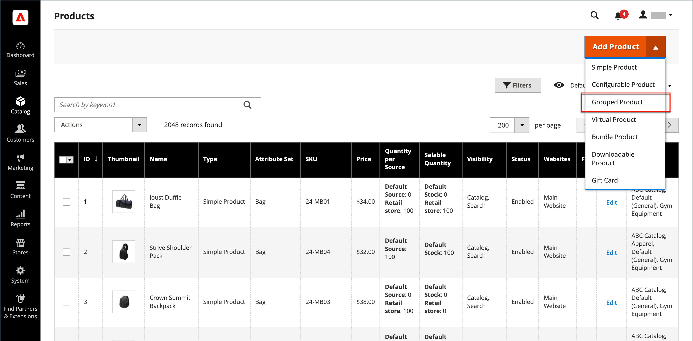
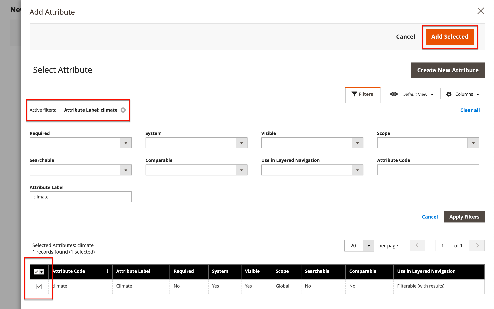
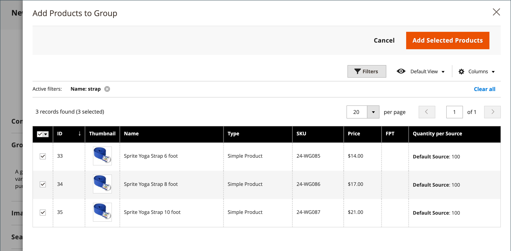

# 已分組的產品

群組產品由簡單獨立產品組成，並以群組呈現。 您可以提供單一產品的變數，或依季節或主題分組。 展示分組產品可鼓勵客戶購買其他專案。 分組產品可讓您輕鬆提供產品的變化，並在相同頁面上列出所有變化。

例如，您可能會銷售開放式庫存的平面軟體，並列出在正式位置設定中使用的各種器具。 有人可能會訂購多份沙拉叉、魚叉、晚餐叉、晚餐刀、魚刀、黃油刀、湯匙和甜點勺子。 其他客戶可能會訂購簡單的叉子、刀和勺子。 客戶可依需求訂購任何數量的專案。

雖然是以群組方式顯示，但群組中的每項產品都是以個別專案的形式購買。 在購物車中，每個專案和購買的數量都會顯示為個別的條列專案。

下列指示會示範使用來建立分組產品的程式 [產品範本](attribute-sets.md)、必填欄位和基本設定。 每個必填欄位都標有紅色星號(`*`)。 當您完成基本功能後，您可以視需要完成其他產品設定。

{width="700" zoomable="yes"}

## 步驟1：選擇產品型別

1. 在 _管理員_ 側欄，前往 **[!UICONTROL Catalog]** > **[!UICONTROL Products]**.

1. 在 _[!UICONTROL Add Product]_( {width="25"} )功能表，選擇&#x200B;**[!UICONTROL Grouped Product]**.

   {width="700" zoomable="yes"}

## 步驟2：選擇屬性集

若要選擇 [屬性集](attribute-sets.md) 作為產品的範本，請執行下列任一項作業：

- 若要搜尋，請輸入 **[!UICONTROL Attribute Set]**.
- 在清單中，選擇要使用的屬性集。

表單會更新以反映變更。

{width="600" zoomable="yes"}

如果需要的屬性不存在，您可以在建立產品時新增屬性：

- 在右上角，按一下 **[!UICONTROL Add Attribute]**.
- 定義新屬性(請參閱 [將屬性新增至產品](product-attributes-add.md))。

  {width="600" zoomable="yes"}

若要將現有屬性新增至產品，請使用 [篩選控制項](../getting-started/admin-grid-controls.md) 若要在格線中尋找屬性，請執行下列動作：

- 在要新增的每個屬性的第一欄中選取核取方塊。
- 按一下 **[!UICONTROL Add Selected]**.

## 步驟3：完成必要的設定

1. 輸入 **[!UICONTROL Product Name]**.

1. 接受預設值 **[!UICONTROL SKU]** 根據產品名稱或輸入其他名稱。

   請注意 **[!UICONTROL Quantity]** 欄位無法使用，因為值衍生自組成群組的個別產品。

   群組的產品在目錄中沒有自己的價格。 群組產品價格衍生自群組中所包含個別產品的價格。

1. 由於產品尚未準備好發佈，請設定 **[!UICONTROL Enable Product]** 至 `No` (  )。

1. 按一下 **[!UICONTROL Save]** 並繼續。

   儲存產品後，產品名稱會出現在頁面頂端，而且 [存放區檢視](introduction.md#product-scope) 選擇器會出現在左上角。

1. 選擇 **[!UICONTROL Store View]** 產品可用的位置。

   {width="600" zoomable="yes"}

## 步驟4：完成基本設定

1. 接受 **[!UICONTROL Stock Status]** 設定 `In Stock`.

1. 要指派 **[!UICONTROL Categories]** 若要存取產品，請按一下 **[!UICONTROL Select…]** 方塊並執行下列任一項作業：

   **選擇現有類別：**

   - 開始在方塊中輸入內容，直到找到相符專案為止。

   - 選取要指派的類別的核取方塊。

   **建立類別：**

   - 按一下 **[!UICONTROL New Category]**.

   - 輸入 **[!UICONTROL Category Name]** 並選擇 **[!UICONTROL Parent Category]**，這會決定其在功能表結構中的位置。

   - 按一下 **[!UICONTROL Create Category]**.

1. 接受 **[!UICONTROL Visibility]** 設定 `Catalog, Search`.

1. 若要在中推出產品 [新產品清單](../content-design/widget-new-products-list.md)，選擇 **[!UICONTROL Set Product as New]** **[!UICONTROL from]** 和 **[!UICONTROL to]** 行事曆上的日期。

1. 選擇 **[!UICONTROL Country of Manufacture]**.

   可能有其他個別屬性可說明產品。 選取範圍會改變屬性集，您稍後可以完成它們。

## 步驟5：將產品新增至群組

1. 向下捲動至 **[!UICONTROL Grouped Products]** 區段並按一下 **[!UICONTROL Add Products to Group]**.

   {width="600" zoomable="yes"}

1. 如有必要，請使用 [篩選器](../getting-started/admin-grid-controls.md) 以尋找您要加入群組的產品。

1. 在清單中，選取要包含在群組中的每個專案的核取方塊。

   >[!NOTE]
   >
   >只有簡單、可下載且沒有可設定選項的虛擬產品才能分組為子產品。 其他產品型別不會出現在選取專案清單中。

   {width="600" zoomable="yes"}

1. 若要將其新增至產品群組，請按一下 **[!UICONTROL Add Selected Products]**.

   所選產品會出現在 _[!UICONTROL Grouped Products]_區段。

   針對具有下列條件的多來源商家： [Inventory management](../inventory-management/sources-stocks.md)，格線包含 **[!UICONTROL Quantity per Source]** 具有每個指定來源與存貨庫存量的欄位。

   {width="600" zoomable="yes"}

1. 輸入 **[!UICONTROL Default Quantity]** 用於任何專案。

1. 若要變更產品的順序，請抓取 _變更順序_ 圖示(  )，並將產品拖曳至清單中的新位置。

1. 若要從群組移除產品，請按一下 **[!UICONTROL Remove]**.

## 步驟5：完成產品資訊

視需要填寫下列章節中的資訊：

- [內容](product-content.md)
- [影像和影片](product-images-and-video.md)
- [搜尋引擎最佳化](product-search-engine-optimization.md)
- [相關產品、向上銷售和交叉銷售](related-products-up-sells-cross-sells.md)
- [可自訂的選項](settings-advanced-custom-options.md)
- [網站中的產品](settings-basic-websites.md)
- [設計](settings-advanced-design.md)
- [贈品選項](product-gift-options.md)

## 步驟6：發佈產品

1. 如果您已準備好在目錄中發佈產品，請設定 **[!UICONTROL Enable Product]** 至 `Yes`.

1. 執行下列任一項作業：

   **方法1：** 儲存並預覽

   - 在右上角，按一下 **[!UICONTROL Save]**.

   - 若要檢視您商店中的產品，請選擇 **[!UICONTROL Customer View]** 於 _管理員_ (  )功能表。

     該存放區會在新的瀏覽器標籤中開啟。

     {width="700" zoomable="yes"}

   **方法2：** 儲存並關閉

   - 在 _[!UICONTROL Save]_( {width="25"} )功能表，選擇&#x200B;**[!UICONTROL Save & Close]**.

## 步驟7：設定購物車縮圖（選用）

如果您對群組中的每個產品都有不同的影像，您可以設定為使用購物車縮圖的正確影像。

1. 在 _管理員_ 側欄，前往 **[!UICONTROL Stores]** > _[!UICONTROL Settings]_>**[!UICONTROL Configuration]**.

1. 在左側面板中，展開 **[!UICONTROL Sales]** 並選擇 **[!UICONTROL Checkout]**.

1. 展開  此 **[!UICONTROL Shopping Cart]**.

   如需這些組態選項的詳細清單，請參閱 [購物車](../configuration-reference/sales/checkout.md#shopping-cart) 在 _設定參考_.

1. 設定 **[!UICONTROL Grouped Product Image]** 至 `Product Thumbnail Itself`.

   {width="600" zoomable="yes"}

   如有必要，請取消選取 **[!UICONTROL Use system value]** 核取方塊以設定此選項。

1. 按一下 **[!UICONTROL Save Config]**.

## 注意事項

- 群組產品基本上是簡單關聯產品的集合。

- 分組的子產品可以是簡單、可下載或虛擬產品 **[!UICONTROL without custom options]**.

- 每個購買的專案都會個別出現在購物車中，而不是群組的一部分。

- 群組的產品在目錄中沒有自己的價格。 群組產品價格衍生自群組中所包含個別產品的價格。

- 購物車中的縮圖影像可設定為顯示來自分組的父項產品或相關產品的影像。
