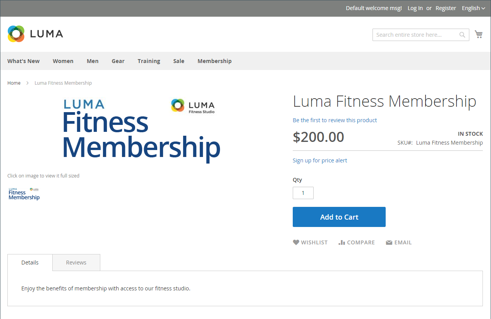
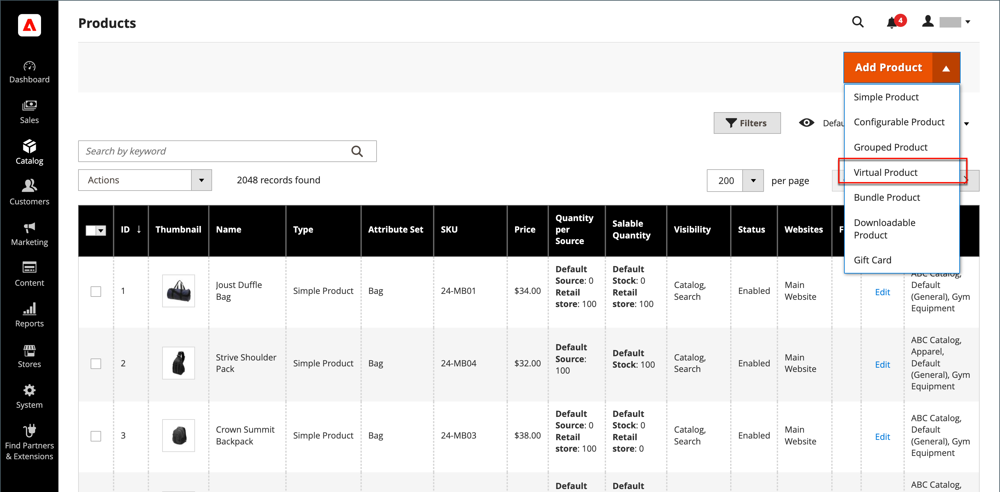

# 虛擬產品

虛擬產品（或數位產品）代表無形的專案，例如會籍、服務、保固，或書籍、音樂、視訊或其他產品的訂閱和數位下載。 虛擬產品可以個別銷售，或包含在[群組產品](product-create-grouped.md)、[可配置產品](product-create-configurable.md)或[組合產品](product-create-bundle.md)產品型別中。

除了缺少&#x200B;_[!UICONTROL Weight]_&#x200B;欄位以外，建立虛擬產品和簡單產品的程式是相同的。 下列指示示範使用[產品範本](attribute-sets.md)、必要欄位及基本設定來建立虛擬產品的程式。 當您完成基本功能後，您可以視需要完成其他產品設定。

>[!NOTE]
>
>PayPal已取代透過PayPal Express Checkout支援數位商品銷售。 他們建議您使用[PayPal Payments Standard](../stores-purchase/paypal-payments-standard.md)或任何其他PayPal付款閘道來處理任何包含虛擬產品的訂單。

{width="700" zoomable="yes"}

## 步驟1：選擇產品型別

1. 在&#x200B;_管理員_&#x200B;側邊欄上，移至&#x200B;**[!UICONTROL Catalog]** > **[!UICONTROL Products]**。

1. 在右上角的&#x200B;_[!UICONTROL Add Product]_（{width="25"} ）功能表上，選擇&#x200B;**[!UICONTROL Virtual Product]**。

   {width="700" zoomable="yes"}

## 步驟2：選擇屬性集

若要選擇做為產品範本的[屬性集](attribute-sets.md)，請執行下列其中一項作業：

- 按一下&#x200B;**[!UICONTROL Attribute Set]**&#x200B;欄位，然後輸入屬性集的全部或部分名稱。

- 在顯示的清單中，選擇要使用的屬性集。

表單會更新以反映變更。

{width="600" zoomable="yes"}

## 步驟3：完成必要的設定

1. 輸入&#x200B;**[!UICONTROL Product Name]**。

1. 接受以產品名稱為基礎的預設&#x200B;**[!UICONTROL SKU]**，或輸入其他名稱。

1. 輸入產品&#x200B;**[!UICONTROL Price]**。

1. 因為產品尚未準備好發佈，請將&#x200B;**[!UICONTROL Enable Product]**&#x200B;設定為`No`。

1. 按一下&#x200B;**[!UICONTROL Save]**&#x200B;並繼續。

   儲存產品時，[商店檢視](introduction.md#product-scope)選擇器會出現在左上角。

1. 選擇要提供產品的&#x200B;**[!UICONTROL Store View]**。

   {width="600" zoomable="yes"}

## 步驟4：完成基本設定

1. 將&#x200B;**[!UICONTROL Tax Class]**&#x200B;設定為下列其中一項：

   - `None`
   - `Taxable Goods`

1. 輸入庫存產品的&#x200B;**[!UICONTROL Quantity]**，並執行下列動作：

   - 接受&#x200B;**[!UICONTROL Stock Status]**&#x200B;的預設`In Stock`設定。

     因為虛擬產品未出貨，所以未使用&#x200B;**[!UICONTROL Weight]**&#x200B;欄位。

   - 接受&#x200B;**[!UICONTROL Visibility]**&#x200B;的預設`Catalog, Search`設定。

   >[!NOTE]
   >
   >如果您啟用[Inventory management](../inventory-management/introduction.md)，單一來源商家會在此區段中設定數量。 多來源商家在「來源」區段中新增來源與數量。 請參閱下列&#x200B;_指派來源與數量(Inventory management)_&#x200B;區段。

1. 若要將&#x200B;**[!UICONTROL Categories]**&#x200B;指派給產品，請按一下&#x200B;**[!UICONTROL Select…]**&#x200B;方塊並執行下列任一動作：

   **選擇現有類別**：

   - 開始在方塊中輸入內容，直到找到相符專案為止。

   - 選取要指派的類別的核取方塊。

   **建立類別**：

   - 按一下&#x200B;**[!UICONTROL New Category]**。

   - 輸入&#x200B;**[!UICONTROL Category Name]**&#x200B;並選擇&#x200B;**[!UICONTROL Parent Category]**，這會決定其在功能表結構中的位置。

   - 按一下&#x200B;**[!UICONTROL Create Category]**。

   可能有其他個別屬性可說明產品。 選取範圍會因屬性集而異，您稍後可以完成。

### 指定來源與數量([!DNL Inventory Management])

{{$include /help/_includes/inventory-assign-sources.md}}

## 步驟5：完成產品資訊

視需要填寫下列章節中的資訊：

- [內容](product-content.md)
- [影像和影片](product-images-and-video.md)
- [搜尋引擎最佳化](product-search-engine-optimization.md)
- [相關產品、向上銷售和交叉銷售](related-products-up-sells-cross-sells.md)
- [可自訂的選項](settings-advanced-custom-options.md)
- [網站中的產品](settings-basic-websites.md)
- [設計](settings-advanced-design.md)
- [贈品選項](product-gift-options.md)

>[!NOTE]
>
>_[!UICONTROL Is this downloadable product?]_&#x200B;選項預設為停用。 為虛擬產品啟用此功能會使產品[可下載](product-create-downloadable.md#downloadable-product)。

## 步驟6：發佈產品

1. 如果您已準備好發佈目錄中的產品，請將&#x200B;**[!UICONTROL Enable Product]**&#x200B;設為`Yes`。

1. 執行下列任一項作業：

   - **方法1：**&#x200B;儲存並預覽

      - 按一下右上角的&#x200B;**[!UICONTROL Save]**。

      - 若要檢視您商店中的產品，請在&#x200B;**[!UICONTROL Customer View]**&#x200B;管理員&#x200B;_（_&#x200B;功能表箭頭。

     該存放區會在新的瀏覽器標籤中開啟。

     {width="600" zoomable="yes"}

   - **方法2：**&#x200B;儲存並關閉

     在&#x200B;_[!UICONTROL Save]_（{width="25"} ）功能表上，選擇&#x200B;**[!UICONTROL Save & Close]**。

## 注意事項

- 虛擬產品用於非實體產品，例如服務、訂閱和保固。

- 虛擬產品就像簡單的產品，但沒有重量。

- 除非購物車中有實際產品，否則結帳期間不會顯示送貨選項。

<!-- Last updated from includes: 2023-05-19 17:14:58 -->
