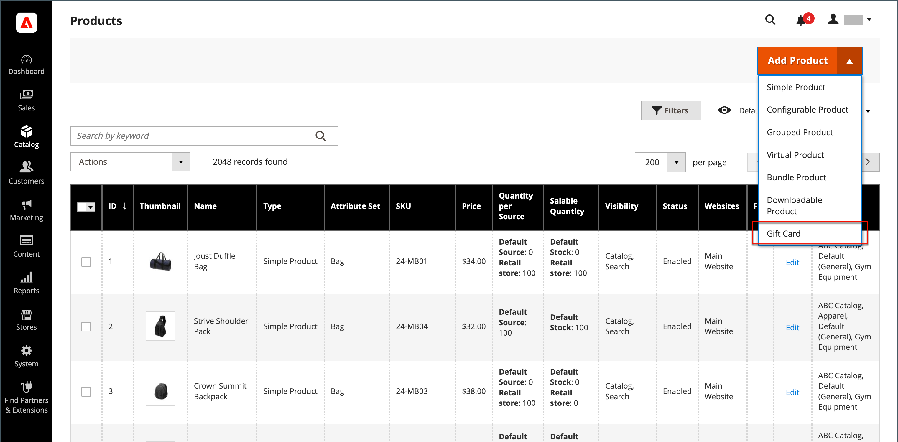
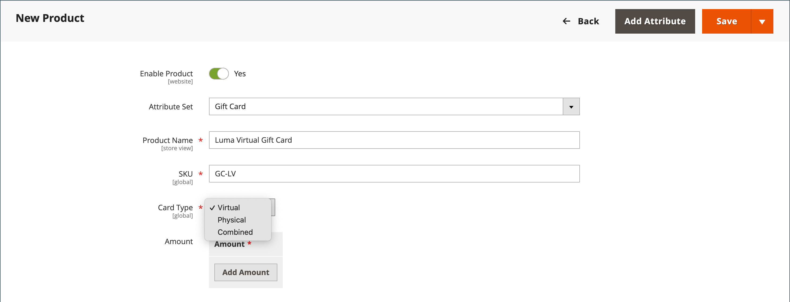

# 禮卡產品

{{ee-feature}}

每個禮品卡都有唯一代碼，在結帳時僅能由一位客戶兌換。 必須先建立[代碼集區](../stores-purchase/product-gift-card-accounts.md#step-3-establish-the-gift-card-code-pool)，才能銷售禮品卡。 請參閱[禮卡工作流程](../stores-purchase/product-gift-card-workflow.md)，瞭解如何在購物車中兌換禮卡。

{width="700" zoomable="yes"}

禮卡產品有三種：

- **Virtual** — 已將虛擬禮卡傳送至收件者的電子郵件地址，這是購買禮卡時所需的電子郵件地址。 不需要送貨地址。

- **實體** — 實體禮卡已運送至收件者的地址，這是購買禮卡時所需的地址。

- **合併** — 已出貨並透過電子郵件傳送給收件者。 購買禮品卡時，需要收件者的電子郵件和送貨地址。

## 建立禮品卡產品

下列指示示範使用[產品範本](attribute-sets.md)、必要欄位及基本設定來建立禮品卡的程式。 每個必要欄位都標有紅色星號(`*`)。 當您完成基本功能後，您可以視需要完成其他產品設定。

### 步驟1：選擇產品型別

1. 在&#x200B;_管理員_&#x200B;側邊欄上，移至&#x200B;**[!UICONTROL Catalog]** > **[!UICONTROL Products]**。

1. 在&#x200B;_[!UICONTROL Add Product]_&#x200B;的右上角({width="25"}  )功能表，選擇&#x200B;**[!UICONTROL Gift Card]**。

   {width="700" zoomable="yes"}

### 步驟2：選擇屬性集

您可以使用預設的`Gift Card`屬性集或選擇其他屬性集。 若要選擇用來作為產品範本的屬性集，請執行下列其中一項作業：

- 按一下&#x200B;**[!UICONTROL Attribute Set]**&#x200B;欄位，然後輸入屬性集的全部或部分名稱。

- 在顯示的清單中，選擇要使用的屬性集。

{width="600" zoomable="yes"}

### 步驟3：完成必要的設定

1. 輸入禮品卡的&#x200B;**[!UICONTROL Product Name]**。

   您也可以在名稱中指明禮品卡的型別。 例如，_Luma虛擬禮品卡_。

1. 輸入產品的&#x200B;**[!UICONTROL SKU]**。

   依預設，「產品名稱」會用作預設SKU。

1. 將&#x200B;**[!UICONTROL Card Type]**&#x200B;設定為下列其中一項：

   - `Virtual` — 虛擬禮品卡會透過電子郵件傳送給收件者。
   - `Physical` — 實體禮品卡可以預先大量生產，並使用唯一代碼進行浮雕。
   - `Combined` — 組合禮卡兼具虛擬和實體禮卡的特性。

   {width="600" zoomable="yes"}

1. 若要讓客戶選擇固定金額，請按一下&#x200B;**[!UICONTROL Add Amount]**&#x200B;並輸入卡片的第一個固定值做為小數。

   若要輸入固定金額的選擇，請對每個重複此步驟。

1. 若要讓客戶能夠設定禮品卡的價值，請執行下列步驟：

   - 將&#x200B;**[!UICONTROL Open Amount]**&#x200B;設為`Yes`。

   - 若要定義可接受的最小值和最大值範圍，請輸入&#x200B;**[!UICONTROL Open Amount From]**&#x200B;和&#x200B;**[!UICONTROL To]**&#x200B;值。

   您可以建立固定訂價、未結金額訂價或兩者的禮品卡。

   >[!NOTE]
   >
   >禮品卡產品在目錄中沒有自己的價格。 禮品卡價格是從購買期間所選取的禮品卡金額衍生而得。

   {width="600" zoomable="yes"}

### 步驟4：完成基本設定

1. 對於實體或組合禮品卡，請輸入庫存中的&#x200B;**[!UICONTROL Quantity]**。

1. 如果要出貨的禮品卡，請輸入包裝的&#x200B;**[!UICONTROL Weight]**。

1. 在&#x200B;**[!UICONTROL Categories]**&#x200B;欄位中選擇`Gift Card`。

可能有其他個別屬性可說明產品。 選取範圍會改變屬性集，您稍後可以完成它們。

### 步驟5：完成禮卡資訊

產品設定的&#x200B;_[!UICONTROL Gift Card Information]_&#x200B;區段可用來覆寫決定卡片管理方式的[禮卡組態](../configuration-reference/sales/gift-cards.md)設定。

1. 向下捲動至&#x200B;_[!UICONTROL Gift Card Information]_&#x200B;區段。

   此段落中的預設設定由系統組態決定。

   {width="600" zoomable="yes"}

1. 根據您想要的禮品卡運作方式變更其他欄位：

   - **[!UICONTROL Treat Balance as Store Credit]** — 決定禮品卡持有人是否可將餘額兌換為商店信用。

   - **[!UICONTROL Lifetime (days)]** — 決定購買後到禮品卡到期的天數。 如果您不想設定卡片存留期的限制，請將此欄位留空。

   - **[!UICONTROL Allow Message]** — 決定禮品卡的購買者是否可以為收件者輸入訊息。 虛擬（電子郵件）和實體（出貨）禮品卡都可以包含禮品訊息。

   - **[!UICONTROL Email Template]** — 決定用於傳送給禮品卡收件者的通知的電子郵件範本。

### 步驟6：完成產品資訊

視需要填寫下列章節中的資訊：

- [內容](product-content.md)
- [影像和影片](product-images-and-video.md)
- [相關產品、向上銷售和交叉銷售](related-products-up-sells-cross-sells.md)
- [搜尋引擎最佳化](product-search-engine-optimization.md)
- [可自訂的選項](settings-advanced-custom-options.md)
- [網站中的產品](settings-basic-websites.md)
- [設計](settings-advanced-design.md)
- [贈品選項](product-gift-options.md)

### 步驟7：Publish產品

1. 如果您已準備好發佈目錄中的產品，請將&#x200B;**啟用產品**&#x200B;切換為`Yes`。

1. 執行下列任一項作業：

   **方法1：**&#x200B;儲存並預覽

   - 按一下右上角的&#x200B;**[!UICONTROL Save]**。

   - 若要檢視您商店中的產品，請在&#x200B;_管理員_ （  ）功能表上選擇&#x200B;**[!UICONTROL Customer View]**，

   {width="600" zoomable="yes"}

   **方法2：**&#x200B;儲存並關閉

   在&#x200B;_[!UICONTROL Save]_（{width="25"} ）功能表上，選擇&#x200B;**[!UICONTROL Save & Close]**。

## 注意事項

- 必須先產生唯一編號的&#x200B;_代碼集區_，才能提供禮品卡銷售。

- 禮品卡可以設為`Redeemable`或`Non-Redeemable`。

- 在禮卡購買期間，稅金是&#x200B;**_未套用至禮卡_**。 只有當購買的禮品卡是用來購買產品時，才會對產品徵稅。

- 禮品卡的存留期可以不受限制，或設為指定的天數。

- 禮卡值可以設定為固定金額，或設定為最小值和最大值之未結金額。

- 禮品卡產品在目錄中沒有自己的價格。 禮品卡價格是從購買期間所選取的禮品卡金額衍生而得。

- 您可以在下訂單或開立商業發票時，建立客戶的禮品卡帳戶。
