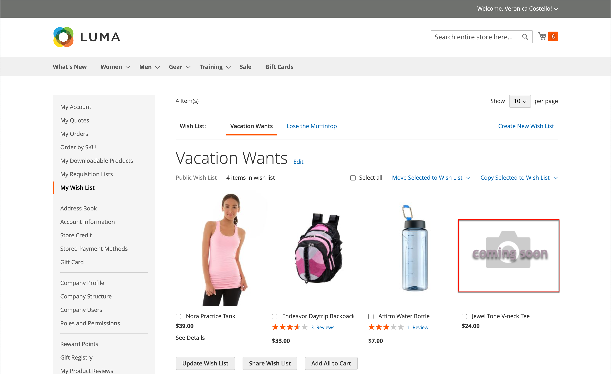

# 產品影像設定

如果您打算上傳大型影像，以便在 _[!UICONTROL Product Details]_頁面時，您可以考慮設定畫素大小上限（寬度和高度），並在上傳時自動調整檔案大小。 為了支援這類產品影像上傳，您可以選擇在上傳時啟用自動調整大型影像檔案大小。 對於您想要新增至目錄但尚未顯示影像資產的產品，您可以設定預留位置影像。

## 產品影像調整大小

上傳產品影像時，您可以新增不同大小的較大影像，以提供詳細的高品質縮放 _[!UICONTROL Product Details]_頁面。 為確保所有影像都具有類似的大小和外觀，有一個影像調整大小選項可確保所有影像符合特定的畫素大小。 此選項會使用組態設定自動調整所有產品影像的大小，這有助於縮放效能、加快影像載入速度，並保持產品影像的統一外觀。

>[!NOTE]
>
>為獲得最佳相容性，建議將所有產品影像上傳至 `sRGB` 色彩設定檔。 所有其他色彩設定檔會自動轉換為 `sRGB` 產品影像上傳期間的色彩設定檔，這可能會造成上傳影像中的色彩不一致。

設定最大畫素寬度和高度會將影像大小調整為依畫素的實體尺寸。 Commerce會根據較高的寬度或高度調整影像大小，同時保持比例。 減少JPG影像的品質數量會減少檔案大小。

例如，100%的3000 x 2100畫素JPG可能是5 mb或更大的影像檔案。 調整此影像的大小會將寬度減少到1920畫素，並保留比例和品質至80%，以提供更小的檔案大小和高品質。

### 啟用影像調整大小

1. 在 _管理員_ 側欄，前往 **[!UICONTROL Stores]** > _[!UICONTROL Settings]_>**[!UICONTROL Configuration]**.

1. 在左側面板中，展開 **[!UICONTROL Advanced]** 並選擇 **[!UICONTROL System]**.

1. 展開  此 _影像上傳設定_ 區段。

   若要變更預設設定，請取消選取 **[!UICONTROL Use system value]** 核取方塊（如果需要）。

   {width="600" zoomable="yes"}

   如需這些組態設定的詳細清單，請參閱 [_影像上傳設定_](../configuration-reference/advanced/system.md#image-upload-configuration) 在 _設定參考_.

1. 若要啟用，請確定 **[!UICONTROL Enable Frontend Resize]** 設為 `Yes`.

1. 輸入 **[!UICONTROL Quality]** 設定介於 `1` 和 `100`%。

   建議使用80-90%之間的設定，以降低檔案大小並提升品質。

1. 設定 **[!UICONTROL Maximum Width]** 影像的畫素。

   調整影像大小時，不會超過此寬度並保留比例。

1. 設定 **[!UICONTROL Maximum Height]** 影像的畫素。

   調整影像大小時，不會超過此高度並保留比例。

1. 完成後，按一下 **[!UICONTROL Save Config]**.

### 欄位說明

| 欄位 | [範圍](../getting-started/websites-stores-views.md#scope-settings) | 說明 |
|--- |--- |--- |
| [!UICONTROL Quality] | 全域 | 決定調整大小影像的JPG品質。 品質越低，檔案大小就越小。 建議使用80-90%來協助以高品質縮減檔案大小。 預設值： 80 |
| [!UICONTROL Enable Frontend Resize] | 全域 | 允許Commerce調整您上傳的大型超大影像的大小 _[!UICONTROL Product Details]_頁面。 Commerce在上傳檔案時使用JavaScript調整影像檔案的大小。 調整影像大小時，會維持精確比例，以符合且不會超過「最大寬度」或「最大高度」的最大尺寸。 預設： `Yes` |
| [!UICONTROL Maximum Width] | 全域 | 決定影像的最大畫素寬度。 調整影像大小時，不會超過此寬度。 預設： `1920` |
| [!UICONTROL Maximum Height] | 全域 | 決定影像的最大畫素高度。 調整影像大小時，不會超過此高度。 預設： `1200` |

{style="table-layout:auto"}

## 影像預留位置

Adobe Commerce和Magento Open Source使用暫時影像作為預留位置，直到永久產品影像可用為止。 可以為每個角色上傳不同的預留位置。 初始預留位置影像是標誌範例，您可以用您選擇的影像取代。

{width="600" zoomable="yes"}

**_若要上傳預留位置影像：_**

1. 在 _管理員_ 側欄，前往 **[!UICONTROL Stores]** > _[!UICONTROL Settings]_>**[!UICONTROL Configuration]**.

1. 在左側面板中，展開 **[!UICONTROL Catalog]** 並選擇 **[!UICONTROL Catalog]** 底下。

1. 展開  此 **[!UICONTROL Product Image Placeholders]** 區段。

   {width="600" zoomable="yes"}

   如需這些組態設定的詳細清單，請參閱 [_產品影像預留位置_](../configuration-reference/catalog/catalog.md#product-image-placeholders) 在 _設定參考_.

1. 對於每個影像角色，按一下 **[!UICONTROL Choose File]**，在您的電腦上尋找影像，然後上傳檔案。

   您可以對全部三個角色使用相同的影像，也可以對每個角色上傳不同的預留位置影像。

1. 完成後，按一下 **[!UICONTROL Save]**.

如需有關影像角色和建議大小的資訊，請參閱 [上傳影像](product-image.md#upload-an-image).
