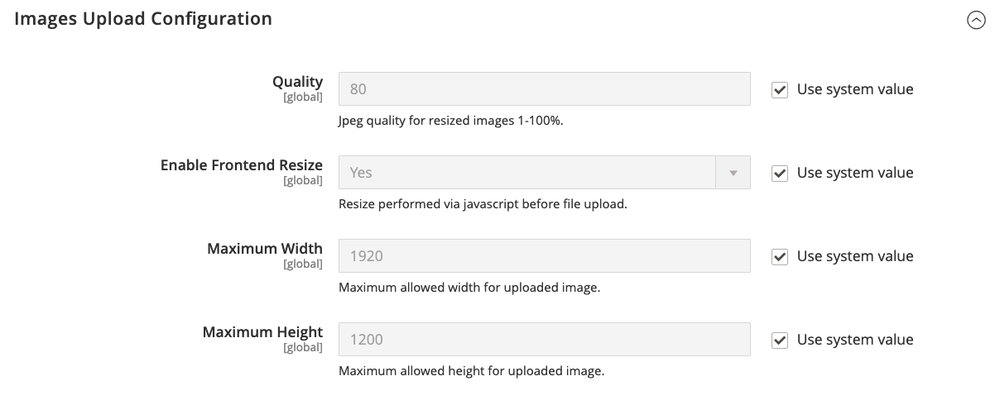

# 產品影像設定

如果您打算上傳大型影像以供在&#x200B;_[!UICONTROL Product Details]_&#x200B;頁面上檢視，建議您設定畫素大小上限（寬度和高度），並在上傳時自動調整檔案大小。 為了支援這類產品影像上傳，您可以選擇在上傳時啟用自動調整大型影像檔案大小。 對於您想要新增至目錄但尚未顯示影像資產的產品，您可以設定預留位置影像。

## 產品影像調整大小

上傳產品影像時，您可以新增不同大小的較大影像，以在&#x200B;_[!UICONTROL Product Details]_&#x200B;頁面上提供詳細的高品質縮放。 為確保所有影像都具有類似的大小和外觀，有一個影像調整大小選項可確保所有影像符合特定的畫素大小。 此選項會使用組態設定自動調整所有產品影像的大小，這有助於縮放效能、加快影像載入速度，並保持產品影像的統一外觀。

>[!NOTE]
>
>為獲得最佳相容性，建議使用`sRGB`色彩設定檔上傳所有產品影像。 所有其他色彩設定檔會在產品影像上傳期間自動轉換為`sRGB`色彩設定檔，這可能會造成上傳影像的色彩不一致。

設定最大畫素寬度和高度會將影像大小調整為依畫素的實體尺寸。 Commerce會根據較高的寬度或高度調整影像大小，同時保持比例。 降低JPG影像的品質數量會減少檔案大小。

例如，100%的3000 x 2100畫素JPG可能是5 mb或更大的影像檔案。 調整此影像的大小會將寬度減少到1920畫素，並保留比例和品質至80%，以提供更小的檔案大小和高品質。

### 啟用影像調整大小

1. 在&#x200B;_管理員_&#x200B;側邊欄上，移至&#x200B;**[!UICONTROL Stores]** > _[!UICONTROL Settings]_>**[!UICONTROL Configuration]**。

1. 在左側面板中，展開&#x200B;**[!UICONTROL Advanced]**&#x200B;並選擇&#x200B;**[!UICONTROL System]**。

1. 展開 _影像上傳設定_&#x200B;區段。

   若要變更預設設定，請視需要取消選取&#x200B;**[!UICONTROL Use system value]**&#x200B;核取方塊。

   {width="600" zoomable="yes"}

   如需這些組態設定的詳細清單，請參閱&#x200B;_組態參考_&#x200B;中的&#x200B;[_影像上傳組態_](../configuration-reference/advanced/system.md#image-upload-configuration)。

1. 若要啟用，請確定&#x200B;**[!UICONTROL Enable Frontend Resize]**&#x200B;已設為`Yes`。

1. 輸入介於`1`和`100`%之間的&#x200B;**[!UICONTROL Quality]**&#x200B;設定。

   建議使用80-90%之間的設定，以降低檔案大小並提升品質。

1. 設定影像的&#x200B;**[!UICONTROL Maximum Width]**&#x200B;畫素。

   調整影像大小時，不會超過此寬度並保留比例。

1. 設定影像的&#x200B;**[!UICONTROL Maximum Height]**&#x200B;畫素。

   調整影像大小時，不會超過此高度並保留比例。

1. 完成時，按一下&#x200B;**[!UICONTROL Save Config]**。

### 欄位說明

| 欄位 | [領域](../getting-started/websites-stores-views.md#scope-settings) | 說明 |
|--- |--- |--- |
| [!UICONTROL Quality] | 全域 | 決定調整大小影像的JPG品質。 品質越低，檔案大小就越小。 建議使用80-90%來協助以高品質縮減檔案大小。 預設值： 80 |
| [!UICONTROL Enable Frontend Resize] | 全域 | 允許Commerce調整您上傳之&#x200B;_[!UICONTROL Product Details]_&#x200B;頁面的大型超大影像大小。 上傳檔案時，Commerce會使用JavaScript調整影像檔案的大小。 調整影像大小時，會維持精確比例，以符合且不會超過「最大寬度」或「最大高度」的最大尺寸。 預設： `Yes` |
| [!UICONTROL Maximum Width] | 全域 | 決定影像的最大畫素寬度。 調整影像大小時，不會超過此寬度。 預設： `1920` |
| [!UICONTROL Maximum Height] | 全域 | 決定影像的最大畫素高度。 調整影像大小時，不會超過此高度。 預設： `1200` |

{style="table-layout:auto"}

## 影像預留位置

Adobe Commerce和Magento Open Source使用暫時影像作為預留位置，直到永久產品影像可用為止。 可以為每個角色上傳不同的預留位置。 初始預留位置影像是標誌範例，您可以用您選擇的影像取代。

{width="600" zoomable="yes"}

**_上傳預留位置影像:_**

1. 在&#x200B;_管理員_&#x200B;側邊欄上，移至&#x200B;**[!UICONTROL Stores]** > _[!UICONTROL Settings]_>**[!UICONTROL Configuration]**。

1. 在左側面板中，展開&#x200B;**[!UICONTROL Catalog]**&#x200B;並在下方選擇&#x200B;**[!UICONTROL Catalog]**。

1. 展開 **[!UICONTROL Product Image Placeholders]**&#x200B;區段。

   {width="600" zoomable="yes"}

   如需這些組態設定的詳細清單，請參閱&#x200B;_組態參考_&#x200B;中的&#x200B;[_產品影像預留位置_](../configuration-reference/catalog/catalog.md#product-image-placeholders)。

1. 對於每個影像角色，按一下&#x200B;**[!UICONTROL Choose File]**，在您的電腦上尋找該影像，然後上傳檔案。

   您可以對全部三個角色使用相同的影像，也可以對每個角色上傳不同的預留位置影像。

1. 完成時，按一下&#x200B;**[!UICONTROL Save]**。

如需影像角色和建議大小的資訊，請參閱[上傳影像](product-image.md#upload-an-image)。
