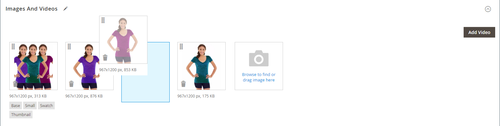
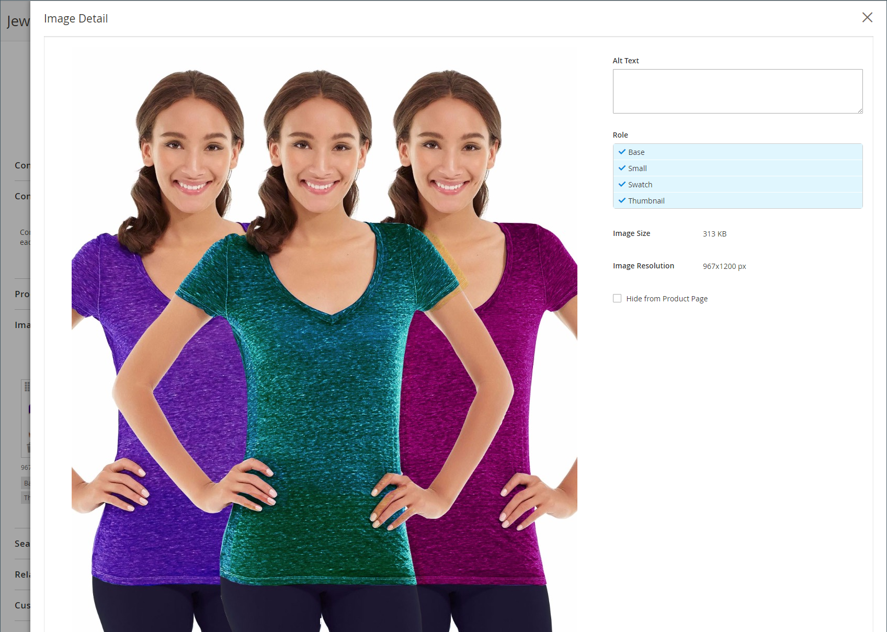
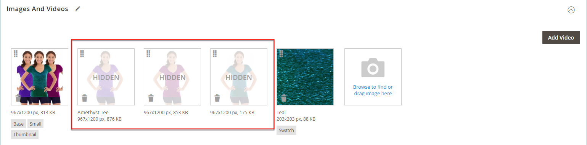

# 管理產品影像和影片

對於每個產品，您可以上傳多個影像和影片、重新安排其順序，並控制每個產品的使用方式。 如果要管理大量的影像，您可能會偏好以批次匯入，而非個別上傳每個影像。 如需詳細資訊，請參閱[匯入產品影像](../systems/data-import-product-images.md)。

如果您打算上傳大型影像以供在&#x200B;_[!UICONTROL Product Details]_&#x200B;頁面上檢視，建議您設定畫素大小上限（寬度和高度），並在上傳時自動調整檔案大小。 上傳影像時，有一個選項可啟用自動調整大型影像檔案的大小。 如需詳細資訊，請參閱[調整產品影像大小](product-image-config.md#product-image-resizing)。

## 更新產品影像

1. 在編輯模式中開啟產品。

1. 若要使用特定商店檢視，請將左上角的&#x200B;**[!UICONTROL Store View]**&#x200B;選擇器設定為適用的檢視。

   >[!NOTE]
   >
   >新產品影像會&#x200B;**_一律_**&#x200B;上傳並顯示在&#x200B;**_所有_**&#x200B;市集檢視中，即使`All Store Views`範圍未用於上傳。   若要從特定商店檢視隱藏任何產品影像，您必須切換到該商店檢視，選取影像的&#x200B;**[!UICONTROL Hide from Product Page]**&#x200B;核取方塊，然後按一下&#x200B;**[!UICONTROL Save]**。

1. 向下捲動並展開&#x200B;_[!UICONTROL Images and Videos]_&#x200B;區段。

### 上傳影像

為獲得最佳相容性，建議使用`sRGB`色彩設定檔上傳所有產品影像。 所有其他色彩設定檔會在產品影像上傳期間自動轉換為`sRGB`色彩設定檔，這可能會造成上傳影像的色彩不一致。

影像檔案名稱長度（包括副檔名）不可超過90個字元。

若要上傳影像，請執行下列任一項作業：

- 從您的案頭拖曳影像，並將它拖放到&#x200B;_[!UICONTROL Images And Videos]_&#x200B;方塊中的_&#x200B;攝影機&#x200B;_（  ）圖磚上。

- 在&#x200B;_[!UICONTROL Images And Videos]_&#x200B;方塊中，按一下_&#x200B;攝影機&#x200B;_（ ）圖磚，選取您電腦上的影像檔，然後按一下&#x200B;**[!UICONTROL Open]**。

  {width="600" zoomable="yes"}

### 重新排列影像

若要變更相簿中影像的順序，請按一下影像圖磚底部的&#x200B;_[!UICONTROL Sort]_（  ）圖示，並將影像拖曳至&#x200B;_[!UICONTROL Images And Videos]_&#x200B;方塊中的不同位置。

{width="600" zoomable="yes"}

### 刪除影像

若要從相簿移除影像，請按一下影像圖磚右上角的&#x200B;**[!UICONTROL Delete]** （  ）圖示，然後按一下&#x200B;**[!UICONTROL Save]**。

### 設定影像詳細資料

按一下您要在詳細檢視中開啟的影像，然後執行下列任一項作業：

{width="600" zoomable="yes"}

若要關閉詳細資料檢視，請按一下右上角的&#x200B;_關閉_ （  ）圖示。

完成時，按一下&#x200B;**[!UICONTROL Save]**。

#### 輸入替代文字

影像替代文字經熒幕助讀程式參考以改善網頁協助工具，並由搜尋引擎在索引網站時參考。 有些瀏覽器會在滑鼠懸停時顯示Alt文字。 替代文字可以是幾個字長，並包含仔細選取的關鍵字。

在&#x200B;_[!UICONTROL Alt Text]_&#x200B;方塊中，輸入影像的簡短描述。

#### 指派角色

依預設，所有角色都會指派給上傳至產品的第一個影像。 若要將角色重新指派給另一個影像，請執行下列動作：

在&#x200B;_[!UICONTROL Role]_&#x200B;方塊中，選擇要指派給影像的角色。

當您返回&#x200B;_影像和影片_&#x200B;區段時，目前指派的角色會出現在每個影像下方。

{width="600" zoomable="yes"}

#### 隱藏影像

若要從縮相簿中排除影像，請選取&#x200B;**[!UICONTROL Hidden]**&#x200B;核取方塊並按一下&#x200B;**[!UICONTROL Save]**。

{width="600" zoomable="yes"}

## 影像角色

| 影像角色 | 說明 |
|--- |--- |
| [!UICONTROL Thumbnail] | 縮圖影像會出現在縮圖相簿、購物車和一些區塊中，例如「相關專案」。 範例大小： 50 x 50畫素 |
| [!UICONTROL Small Image] | 小型影像用於類別和搜尋結果頁面上清單中的產品影像，並顯示追加銷售、交叉銷售和新產品清單等區段所需的產品影像。 範例大小： 470 x 470畫素 |
| [!UICONTROL Base Image] | 基本影像是產品詳細資料頁面上的主要影像。 如果您上傳的影像大於影像容器，則會啟用影像縮放。 根據您想要達到的縮放等級，基本影像應為容器大小的兩或三倍。 範例大小： 470 x 470畫素（不含「縮放」）、1100 x 1100畫素（含「縮放」） |
| [!UICONTROL Swatch] | [色票](swatches.md)可用來說明色彩、圖樣或紋理。 範例大小： 50 x 50畫素 |

{style="table-layout:auto"}

## 浮水印

如果您不惜建立自己的原始產品影像，您就沒有什麼辦法防止不擇手段的競爭對手用滑鼠點選來竊取它們。 不過，您可以在每張影像上加上浮水印，以識別其屬性，讓這些影像成為較不吸引人的目標。 浮水印檔案可以是JPG (JPEG)、GIF或PNG影像。 GIF和PNG檔案型別都支援透明圖層，可用來讓浮水印具有透明背景。

在下列範例中，_small_&#x200B;影像所使用的浮水印，是帶有透明背景的黑色標誌，並使用下列設定儲存為PNG檔案：

- 大小：50x50
- 不透明度：5
- Position：圖磚

{width="700" zoomable="yes"}

### 將浮水印新增至產品影像

1. 在&#x200B;_管理員_&#x200B;側邊欄上，移至&#x200B;**[!UICONTROL Content]** > _[!UICONTROL Design]_>**[!UICONTROL Configuration]**。

   如需設計組態的詳細資訊，請參閱[設計組態](../content-design/configuration.md)。

1. 尋找您要設定的存放區檢視，然後按一下&#x200B;_[!UICONTROL Action]_&#x200B;欄中的&#x200B;**[!UICONTROL Edit]**。

1. 在&#x200B;_[!UICONTROL Other Settings]_&#x200B;底下，展開&#x200B;**[!UICONTROL Product Image Watermarks]**&#x200B;區段的。

   {width="600" zoomable="yes"}

   **[!UICONTROL Base]**、**[!UICONTROL Thumbnail]**、**[!UICONTROL Small]**&#x200B;和&#x200B;**[!UICONTROL Swatch Image]**&#x200B;影像設定相同。

1. 使用下列其中一種方法來新增浮水印影像資產：

   - 按一下&#x200B;**[!UICONTROL Upload]**，然後在您的系統上選擇要上傳做為浮水印的影像檔案。
   - 按一下&#x200B;**[!UICONTROL Select from Gallery]**&#x200B;並從[媒體集](../content-design/media-gallery.md)中選取影像資產。

1. 完成浮水印顯示的設定：

   - 以百分比輸入&#x200B;**[!UICONTROL Image Opacity]**。 例如： `40`

   - 輸入&#x200B;**[!UICONTROL Image Size]**&#x200B;畫素。 例如： `200 x 200`

   - 設定&#x200B;**[!UICONTROL Image Position]**&#x200B;以決定浮水印出現的位置。

1. 完成時，按一下&#x200B;**[!UICONTROL Save Config]**。

1. 當提示重新整理快取時，請在系統訊息中按一下&#x200B;**[!UICONTROL Cache Management]**&#x200B;並重新整理無效的快取。

   {width="600" zoomable="yes"}

>[!TIP]
>
>您可以按一下&#x200B;**[!UICONTROL Use Default Value]** 以還原預設值。

### 刪除浮水印

1. 在影像的左下角，按一下&#x200B;**[!UICONTROL Delete]** （  ）圖示。

   {width="300"}

1. 按一下&#x200B;**[!UICONTROL Save Config]**。

1. 當提示重新整理快取時，請在系統訊息中按一下&#x200B;**[!UICONTROL Cache Management]**&#x200B;並重新整理無效的快取。

   如果浮水印影像持續存在於店面，請返回快取管理並按一下&#x200B;**[!UICONTROL Flush Magento Cache]**。
