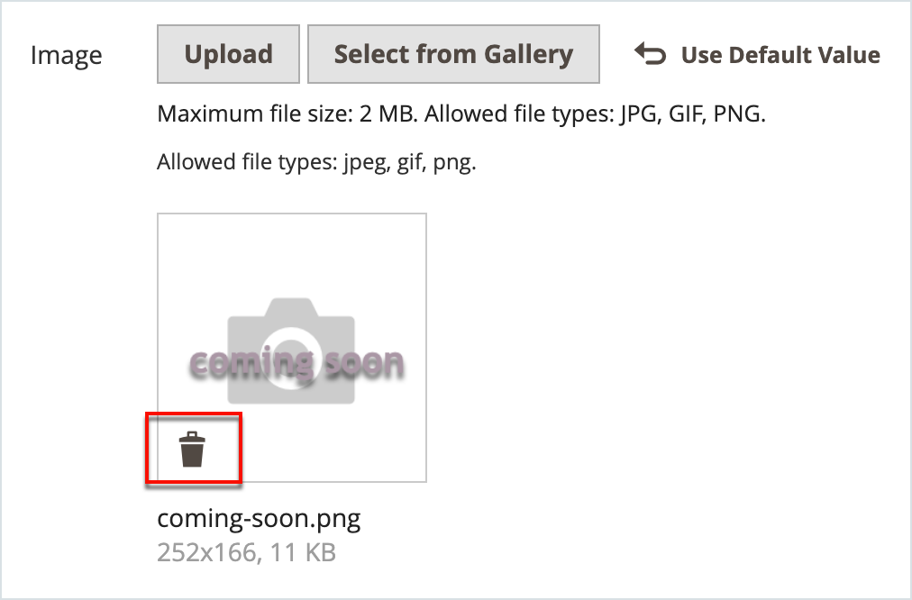

# 管理產品影像和影片

對於每個產品，您可以上傳多個影像和影片、重新安排其順序，並控制每個產品的使用方式。 如果要管理大量的影像，您可能會偏好以批次匯入，而非個別上傳每個影像。 如需詳細資訊，請參閱 [匯入產品影像](../systems/data-import-product-images.md).

如果您打算上傳大型影像，以便在 _[!UICONTROL Product Details]_頁面時，您可以考慮設定畫素大小上限（寬度和高度），並在上傳時自動調整檔案大小。 上傳影像時，有一個選項可啟用自動調整大型影像檔案的大小。 如需詳細資訊，請參閱 [產品影像調整大小](product-image-config.md#product-image-resizing).

## 更新產品影像

1. 在編輯模式中開啟產品。

1. 若要使用特定商店檢視，請設定 **[!UICONTROL Store View]** 選擇器位於適用檢視的左上角。

   >[!NOTE]
   >
   >新產品影像為 **_一直_** 已上傳並顯示在中 **_全部_** 商店檢視，即使 `All Store Views` 範圍未用於上傳。   若要從特定商店檢視隱藏任何產品影像，您必須切換到該商店檢視，選取 **[!UICONTROL Hide from Product Page]** 核取方塊，然後按一下 **[!UICONTROL Save]**.

1. 向下捲動並展開 _[!UICONTROL Images and Videos]_區段。

### 上傳影像

為獲得最佳相容性，建議將所有產品影像上傳至 `sRGB` 色彩設定檔。 所有其他色彩設定檔會自動轉換為 `sRGB` 產品影像上傳期間的色彩設定檔，這可能會造成上傳影像中的色彩不一致。

影像檔案名稱長度（包括副檔名）不可超過90個字元。

若要上傳影像，請執行下列任一項作業：

- 從您的案頭拖曳影像，並將它拖放到 _相機_ (  )圖磚(在 _[!UICONTROL Images And Videos]_方塊。

- 在 _[!UICONTROL Images And Videos]_方塊中，按一下_&#x200B;相機&#x200B;_(  )圖磚，選取您電腦上的影像檔案，然後按一下&#x200B;**[!UICONTROL Open]**.

  {width="600" zoomable="yes"}

### 重新排列影像

若要變更影像庫中的影像順序，請按一下 _[!UICONTROL Sort]_(  )圖示並將影像拖曳至_[!UICONTROL Images And Videos]_ 方塊。

{width="600" zoomable="yes"}

### 刪除影像

若要從影像庫移除影像，請按一下 **[!UICONTROL Delete]** (  )圖示並按一下 **[!UICONTROL Save]**.

### 設定影像詳細資料

按一下您要在詳細檢視中開啟的影像，然後執行下列任一項作業：

{width="600" zoomable="yes"}

若要關閉詳細資料檢視，請按一下 _關閉_ (  )圖示中。

完成後，按一下 **[!UICONTROL Save]**.

#### 輸入替代文字

影像替代文字經熒幕助讀程式參考以改善網頁協助工具，並由搜尋引擎在索引網站時參考。 有些瀏覽器會在滑鼠懸停時顯示Alt文字。 替代文字可以是幾個字長，並包含仔細選取的關鍵字。

在 _[!UICONTROL Alt Text]_方塊中，輸入影像的簡短描述。

#### 指派角色

依預設，所有角色都會指派給上傳至產品的第一個影像。 若要將角色重新指派給另一個影像，請執行下列動作：

在 _[!UICONTROL Role]_方塊中，選擇要指派給影像的角色。

當您返回 _影像和影片_ 區段，目前指派的角色會顯示在每個影像下方。

{width="600" zoomable="yes"}

#### 隱藏影像

若要從縮相簿中排除影像，請選取 **[!UICONTROL Hidden]** 核取方塊並按一下 **[!UICONTROL Save]**.

{width="600" zoomable="yes"}

## 影像角色

| 影像角色 | 說明 |
|--- |--- |
| [!UICONTROL Thumbnail] | 縮圖影像會出現在縮圖相簿、購物車和一些區塊中，例如「相關專案」。 範例大小： 50 x 50畫素 |
| [!UICONTROL Small Image] | 小型影像用於類別和搜尋結果頁面上清單中的產品影像，並顯示追加銷售、交叉銷售和新產品清單等區段所需的產品影像。 範例大小： 470 x 470畫素 |
| [!UICONTROL Base Image] | 基本影像是產品詳細資料頁面上的主要影像。 如果您上傳的影像大於影像容器，則會啟用影像縮放。 根據您想要達到的縮放等級，基本影像應為容器大小的兩或三倍。 範例大小： 470 x 470畫素（不含「縮放」）、1100 x 1100畫素（含「縮放」） |
| [!UICONTROL Swatch] | A [色票](swatches.md) 可用來說明顏色、圖樣或紋理。 範例大小： 50 x 50畫素 |

{style="table-layout:auto"}

## 浮水印

如果您不惜建立自己的原始產品影像，您就沒有什麼辦法防止不擇手段的競爭對手用滑鼠點選來竊取它們。 不過，您可以在每張影像上加上浮水印，以識別其屬性，讓這些影像成為較不吸引人的目標。 浮水印檔案可以是JPG(JPEG)、GIF或PNG影像。 GIF和PNG檔案型別都支援透明圖層，可用來讓浮水印具有透明背景。

用於的浮水印 _小_ 在以下範例中，影像為具有透明背景的黑色標誌，並儲存為PNG檔案，其設定如下：

- 大小：50x50
- 不透明度：5
- Position：圖磚

{width="700" zoomable="yes"}

### 將浮水印新增至產品影像

1. 在 _管理員_ 側欄，前往 **[!UICONTROL Content]** > _[!UICONTROL Design]_>**[!UICONTROL Configuration]**.

   如需有關設計組態的詳細資訊，請參閱 [設計設定](../content-design/configuration.md).

1. 尋找要設定的存放區檢視，然後按一下 **[!UICONTROL Edit]** 在 _[!UICONTROL Action]_欄。

1. 在 _[!UICONTROL Other Settings]_，展開  此&#x200B;**[!UICONTROL Product Image Watermarks]**區段。

   {width="600" zoomable="yes"}

   此 **[!UICONTROL Base]**， **[!UICONTROL Thumbnail]**， **[!UICONTROL Small]**、和 **[!UICONTROL Swatch Image]** 影像設定相同。

1. 使用下列其中一種方法來新增浮水印影像資產：

   - 按一下 **[!UICONTROL Upload]** 並選擇您要在系統上上傳的影像檔案做為浮水印。
   - 按一下 **[!UICONTROL Select from Gallery]** 並從中選取影像資產 [媒體集](../content-design/media-gallery.md).

1. 完成浮水印顯示的設定：

   - 輸入 **[!UICONTROL Image Opacity]** 以百分比顯示。 例如： `40`

   - 輸入 **[!UICONTROL Image Size]** 以畫素為單位。 例如： `200 x 200`

   - 設定 **[!UICONTROL Image Position]** 以決定浮水印出現的位置。

1. 完成後，按一下 **[!UICONTROL Save Config]**.

1. 當提示重新整理快取時，請按一下 **[!UICONTROL Cache Management]** 系統訊息中，並重新整理無效的快取。

   {width="600" zoomable="yes"}

>[!TIP]
>
>您可以按一下 **[!UICONTROL Use Default Value]**  以還原預設值。

### 刪除浮水印

1. 在影像的左下角，按一下 **[!UICONTROL Delete]** (  )圖示。

   {width="300"}

1. 按一下 **[!UICONTROL Save Config]**.

1. 當提示重新整理快取時，請按一下 **[!UICONTROL Cache Management]** 系統訊息中，並重新整理無效的快取。

   如果浮水印影像持續存在於店面中，請返回快取管理並按一下 **[!UICONTROL Flush Magento Cache]**.
