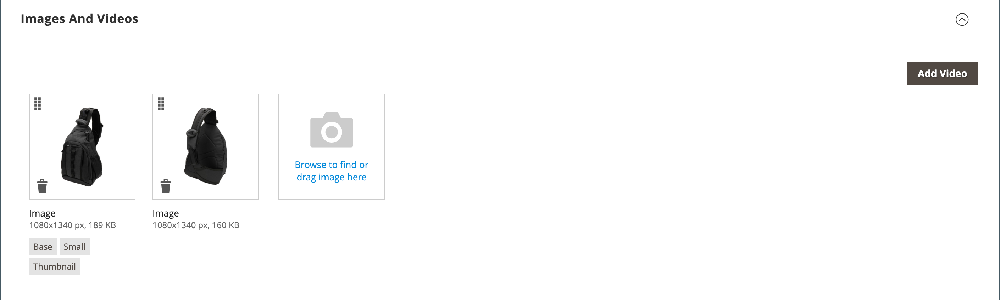

# 產品設定 — [!UICONTROL Images and Videos]

從&#x200B;_[!UICONTROL Images and Videos]_區段，您可以執行基本影像管理工作，例如上傳多個影像、重新排列影像，以及控制如何使用每個影像。 若要進一步控制個別影像，您可以在_&#x200B;詳細資料檢視&#x200B;_中開啟每個影像。 如需詳細資訊，請參閱[目錄影像和視訊](catalog-images-video.md)。

## 上傳新影像

1. 在編輯模式中開啟產品。

1. 向下捲動並展開 _[!UICONTROL Images and Videos]_區段。

   {width="600" zoomable="yes"}

1. 如果您已準備好新增產品影像，請執行下列任一項作業：

   - 從您的案頭拖曳影像，並將它拖放到&#x200B;_攝影機_ （）圖磚上。

   - 按一下&#x200B;_攝影機_ （）圖磚，選取影像檔，然後按一下&#x200B;**[!UICONTROL Open]**。

在產品影像可用之前，[預留位置](product-image-config.md#image-placeholders)影像會出現在目錄中。

## 影像詳細資料

新增產品影像時，您可以在&#x200B;_[!UICONTROL Image Detail]_視窗中自訂影像顯示。

{width="600" zoomable="yes"}

若要設定產品的影像顯示選項：

1. 按一下產品影像。

1. 輸入&#x200B;**[!UICONTROL Alt text]**。

1. 選擇&#x200B;**[!UICONTROL Role]**&#x200B;以顯示影像（一個影像可以選取所有角色）：

   - `Swatch`
   - `Base`
   - `Small`
   - `Thumbnail`

   依預設，會針對第一個新增的影像選取所有這些角色。

   {width="600" zoomable="yes"}

若要從產品頁面隱藏產品影像，請選取&#x200B;**[!UICONTROL Hide from Product Page]**&#x200B;核取方塊。
