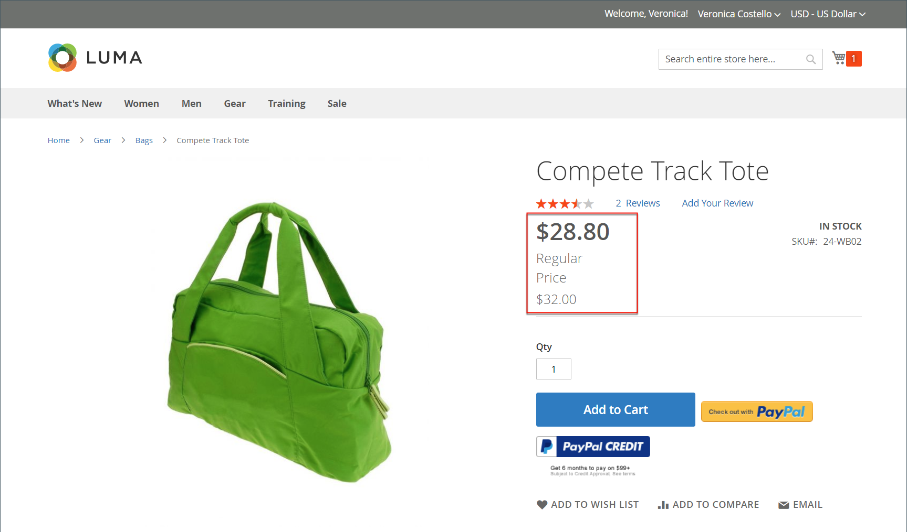
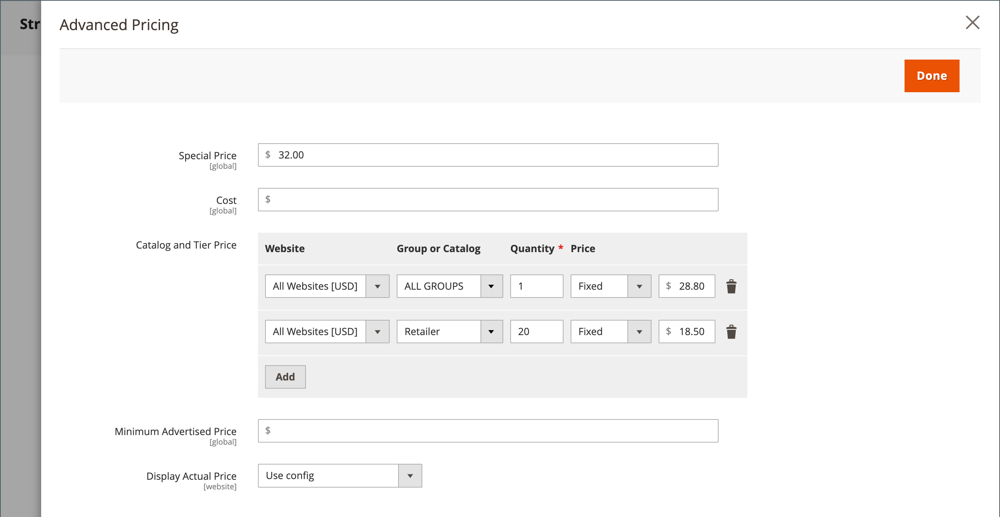

# 群組定價

您可以使用「管理員」中的產品組態設定，根據商店中的客戶群組來設定折扣專案的價格。 此策略定價模型稱為&#x200B;_群組定價_。

當購物者登入其帳戶時，任何產品的折扣價格都可向特定客戶群組的成員提供。 客戶群組價格會與一般價格一起顯示在產品頁面上，讓購物者可以輕鬆比較價格並據以行動。 當他們將產品新增到購物車後，一般價格會由根據客戶群組的群組價格取代。

客戶群組的訂價是[階層式訂價](product-price-tier.md)的元件，且是以類似方式設定。 唯一的差異在於客戶群組價格的數量為1。

{width="600" zoomable="yes"}

## 使用群組定價的好處

- 適合批發買家

- 鼓勵客戶升級其客戶群組，以利用折扣

- 目標式行銷活動

- 獎勵忠實客戶，建立信任和信譽

## 設定群組價格

1. 在編輯模式中開啟產品。

1. 在&#x200B;_[!UICONTROL Price]_&#x200B;欄位下方，按一下&#x200B;**[!UICONTROL Advanced Pricing]**。

1. 在&#x200B;_[!UICONTROL Customer Group Price]_&#x200B;區段中，按一下&#x200B;**[!UICONTROL Add]**。

   如果您的存放區包含[Adobe Commerce B2B](../b2b/introduction.md)且已啟用[共用目錄](../b2b/catalog-shared.md)，則此區段會標示為&#x200B;_[!UICONTROL Catalog and Tier Price]_。

   {width="600" zoomable="yes"}

1. 設定群組價格：

   - 若是多站台安裝，請選擇套用群組價格的&#x200B;**[!UICONTROL Website]**。

   - 選擇要接收折扣的&#x200B;**[!UICONTROL Customer Group]**。

   - 輸入`1`的&#x200B;**[!UICONTROL Quantity]**。

   - 針對&#x200B;**[!UICONTROL Price]**，設定訂價型別和金額：

      - `Fixed` — 輸入折扣產品價格。

      - `Discount` — 輸入折扣價格作為產品價格的百分比。

     {width="600" zoomable="yes"}

1. 若要新增其他群組價格，請按一下&#x200B;**[!UICONTROL Add]**&#x200B;並重複先前步驟。

1. 完成時，按一下&#x200B;**[!UICONTROL Done]**，然後按一下&#x200B;**[!UICONTROL Save]**。

>[!NOTE]
>
>使用下列公式，以&#x200B;**_最低_**&#x200B;相關價格計算&#x200B;**_最終_**&#x200B;產品價格：  `Final Price=Min(Regular(Base) Price, Group(Tier) Price, Special Price, Catalog Price Rule) + Sum(Min Price per each required custom option)`

>[!NOTE]
>
>**_固定價格_**&#x200B;產品可自訂選項&#x200B;_不_&#x200B;受群組價格、層級價格、特殊價格或目錄價格規則影響。
