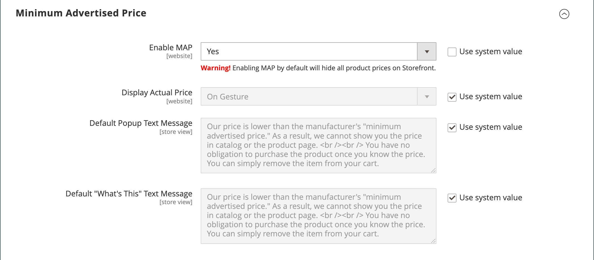

# 最低廣告價格

商家有時被禁止顯示低於製造商建議零售價(MSRP)的價格。 最低廣告價格(MAP)可讓您符合製造商的要求，同時為客戶提供更優惠的價格。 由於各製造商的需求不盡相同，因此您可以設定商店，以防止在不允許顯示實際價格的頁面上顯示。

MAP功能新增專用的&#x200B;_Click for Price_&#x200B;連結，而非一般產品價格。 若您店內的價格低於該產品的最低設定價格，則有兩種方法可以在店面處理價格資訊。 第一種方式是不顯示價格。 如果購買者按一下&#x200B;_按一下價格_&#x200B;按鈕，您實際銷售產品的價格才會顯示。 第二種方式是以刪除線顯示清單/市價，強調您的價格較低。

此外，MAP功能可讓您提出一些改善建議。 例如，當客戶將這類產品新增到購物車時，他們不會重新導向到購物車，而是會顯示一些優惠方案，讓購買者：

- 從購物車中移除專案（如果購買者只想釐清價格且尚未做出購買決定，即可完成）

- 將其留在購物車中並繼續購物

- 繼續結帳

## 對應邏輯

有些產品的價格取決於選取的選項，例如自訂選項或具有自己SKU和庫存管理的簡單產品)。 對於這些產品，會根據產品型別和價格設定套用以下邏輯。 實際價格用於訂單管理、客戶管理工具和報表。

## 搭配產品型別使用MAP

| 產品型別 | 說明 |
|--- |--- |
| [簡單](product-create-simple.md)，[虛擬](product-create-virtual.md) | 實際價格不會自動顯示在目錄清單和產品頁面上，但只會根據[!UICONTROL Display Actual Price]設定包含在內。 自訂選項價格正常顯示。 |
| [已分組](product-create-grouped.md) | 相關簡單產品的價格不會自動出現在目錄清單和產品頁面上，但只會根據[!UICONTROL Display Actual Price]設定包含在內。 |
| [可設定](product-create-configurable.md) | 實際價格不會自動顯示在目錄清單和產品頁面上，但只會根據[!UICONTROL Display Actual Price]設定包含在內。 選項價格正常顯示。 |
| [套件](product-create-bundle.md) （固定價格） | 實際價格不會自動顯示在目錄頁面上，但只會根據[!UICONTROL Display Actual Price]設定包含在內。 組合專案的價格會正常顯示。 MAP不適用於具有動態定價的套件組合產品。 |
| [可下載](product-create-downloadable.md) | 實際價格不會自動顯示在目錄清單和產品頁面上，但只會根據[!UICONTROL Display Actual Price]設定包含在內。 每個下載連結的相關價格會正常顯示。 |

{style="table-layout:auto"}

## 搭配價格設定使用MAP

| 價格設定 | 說明 |
|--- |--- |
| 主要價格 | 當將MAP套用至主要價格時，選項、搭售專案和相關產品的價格（會從主要價格中增加或減少）通常會出現。 |
| 相關聯的產品價格 | 如果產品沒有主要價格，且其價格衍生自相關聯的產品價格（例如在群組產品中），則會套用相關聯產品的MAP設定。 |
| [MSRP](product-price-minimum-advertised.md) | 如果購物車中的產品指定了製造商的建議零售價(MSRP)，則不會忽略價格。 |
| [層級價格](product-price-tier.md) | 若已設定層級訂價，則不會在目錄中顯示層級訂價訊息。 在產品頁面上，會顯示通知，指出訂購超過特定數量時價格可能較低，但折扣僅以百分比顯示。 對於已分組產品的相關產品，折扣不會顯示在產品頁面上。 層級價格會根據「顯示實際價格」設定顯示。 |
| [特別價格](product-price-special.md) | 如果指定了「特價」，則會根據「顯示實際價格」設定來顯示特價。 |

## 地圖設定

依預設不會啟用「最低廣告價格」(MAP)功能。 如果您想要將此功能新增到您的商店，您必須啟用它並設定產品的MAP設定。 MAP設定可套用至目錄中的所有產品，或針對特定產品進行設定。 全球啟用MAP時，店面中的所有產品價格都會隱藏起來，無法檢視。 您可以利用多種組態選項來維持與製造商的合約條款一致，同時仍為客戶提供更優惠的價格。

{width="700" zoomable="yes"}

在全域層級，您可以啟用或停用MAP，將其套用至所有產品，定義實際價格的顯示方式。 您也可以編輯出現在存放區中的相關訊息和資訊提示的文字。

啟用MAP時，產品層級的MAP設定即變為可用。 您可以輸入MSRP並選擇實際價格在商店中的顯示方式，將MAP套用至個別產品。 產品層級MAP設定會覆寫全域MAP設定。

按一下{width="700" zoomable="yes"}

### 步驟1：為存放區檢視啟用MAP

1. 在&#x200B;_管理員_&#x200B;側邊欄上，移至&#x200B;**[!UICONTROL Stores]** > _[!UICONTROL Settings]_>**[!UICONTROL Configuration]**。

1. 如果適用，請將右上角的&#x200B;**[!UICONTROL Store View]**&#x200B;設定為套用組態的檢視。

1. 在左側面板中，展開&#x200B;**[!UICONTROL Sales]**&#x200B;並在下方選擇&#x200B;**[!UICONTROL Sales]**。

1. 展開&#x200B;_[!UICONTROL Minimum Advertised Price]_區段的。

1. 如有必要，請將&#x200B;**啟用MAP**&#x200B;設定為`Yes`。

   {width="600" zoomable="yes"}

   如需這些組態選項的詳細清單，請參閱&#x200B;_組態參考_&#x200B;中的&#x200B;[_最低廣告價格_](../configuration-reference/sales/sales.md#minimum-advertised-price)。

### 步驟2：設定MAP設定

使用下列其中一種方法來設定MAP設定：

#### 方法1：為所有產品設定MAP

1. 若要決定要在何時何地讓客戶看到實際價格，請執行下列步驟：

   - 若要變更預設值，請取消選取&#x200B;**[!UICONTROL Use system value]**&#x200B;核取方塊。

   - 將&#x200B;**顯示實際價格**&#x200B;設定為下列其中一項：
      - `In Cart`
      - `Before Order Confirmation`
      - `On Gesture (on click)`

1. 輸入您要在&#x200B;**[!UICONTROL Default Popup Text Message]**&#x200B;中顯示的文字。

1. 輸入任何其他要顯示在&#x200B;**[!UICONTROL Default "What's This" Text Message]**&#x200B;中的說明。

1. 完成時，按一下&#x200B;**[!UICONTROL Save Config]**。

#### 方法2：為單一產品設定MAP

1. 在&#x200B;_管理員_&#x200B;側邊欄上，移至&#x200B;**[!UICONTROL Catalog]** > **[!UICONTROL Inventory]** > **[!UICONTROL Products]**。

1. 以&#x200B;**[!UICONTROL Edit]**&#x200B;模式開啟產品。

1. 在左側面板中，展開&#x200B;**[!UICONTROL Advanced Settings]**&#x200B;並選擇&#x200B;**[!UICONTROL Advanced Pricing]**。

   >[!NOTE]
   >
   >[!UICONTROL Manufacturer's Suggested Retail Price]和[!UICONTROL Display Actual Price]欄位只有在設定中啟用[最低廣告價格](../configuration-reference/sales/sales.md#minimum-advertised-price)時才會出現。

1. 輸入&#x200B;**[!UICONTROL Manufacturer's Suggested Retail Price]** (MSRP)。

   在此範例中，產品價格為$54.00，而MSRP為59.95。

   {width="600" zoomable="yes"}

1. 將&#x200B;**[!UICONTROL Display Actual Price]**&#x200B;設定為下列其中一項：

   - `Use config` - （預設）將顯示設定套用為[已設定](../configuration-reference/sales/sales.md#minimum-advertised-price)的市集。 |
   - `On Gesture` — 當客戶按一下&#x200B;_價格點按_&#x200B;或&#x200B;_這是什麼？_&#x200B;連結。
   - `In Cart` — 顯示購物車中的實際產品價格。
   - `Before Order Confirmation` — 在訂單確認前，於結帳程式結束時顯示實際產品價格。

1. 完成時，按一下&#x200B;**[!UICONTROL Done]**，然後按一下&#x200B;**[!UICONTROL Save]**。
