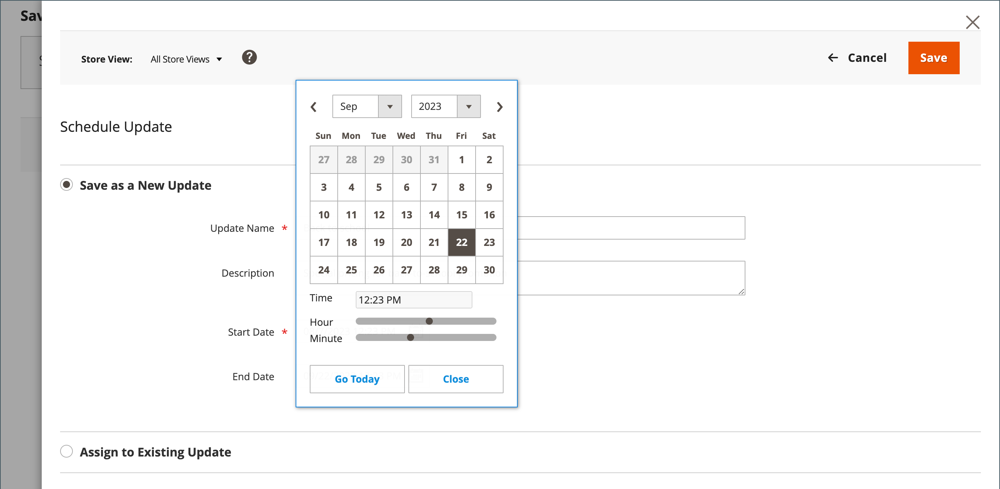

# 特別價格

特殊價格可在指定的時段內提供。 在指定的時段內，會出現特殊價格而非一般價格，隨後會出現表示法，顯示一般價格。

{width="700" zoomable="yes"}

## 對個別產品套用特殊價格

您可以輕鬆為目錄中的單一產品設定特殊價格。

### 使用排程更新

{{ee-feature}}

Adobe Commerce包含對的支援 [排定的更新](../content-design/content-staging-scheduled-update.md). 使用這些促銷工具，在特定期間內對特定產品套用特殊價格。

1. 在編輯模式中開啟產品。

1. 按一下 **[!UICONTROL Scheduled Update]**.

   {width="600" zoomable="yes"}

1. 的 **更新名稱**，輸入特殊價格促銷的名稱。

1. 輸入簡報 **[!UICONTROL Description]**.

1. 使用 _行事曆_ (  )圖示以選擇 **[!UICONTROL Start Date]** 和 **[!UICONTROL End Date]** 用於特殊價格促銷活動。

   您可以使用 **[!UICONTROL Hour]** 和 **[!UICONTROL Minute]** 滑桿以選擇開始和結束時間。 按一下 **[!UICONTROL Close]** 設定「開始」和「結束」時。

   {width="600" zoomable="yes"}

1. 向下捲動至 _價格_ 欄位，按一下 **[!UICONTROL Advanced Pricing]**，並輸入 **[!UICONTROL Special Price]** 要根據排定的更新套用。

   {width="600" zoomable="yes"}

1. 完成後，按一下 **[!UICONTROL Done]** 然後 **[!DNL Save]**.

   在店面，特殊價格應該會顯示在目錄清單和產品頁面上。

   此 _[!UICONTROL Scheduled Change]_會顯示在頁面頂端。

   {width="600" zoomable="yes"}

### 使用簡單的開始和結束日期

{{ce-feature}}

「Magento Open Source」包含「進階訂價管理系統」選項中的簡易開始與結束日期選項。

1. 在編輯模式中開啟產品。

1. 向下捲動至 _[!UICONTROL Price]_欄位，按一下&#x200B;**[!UICONTROL Advanced Pricing]**，並輸入&#x200B;**[!UICONTROL Special Price]**數量。

1. 使用 _行事曆_ (  )圖示以選擇 **[!UICONTROL Start Date]** 和 **[!UICONTROL End Date]** 用於特殊價格促銷活動。

   此特殊價格會在開始日期的午夜剛過(00:01)後生效，並持續至結束日期前一天的午夜前(23:59)。

   {width="600" zoomable="yes"}

1. 完成後，按一下 **[!UICONTROL Done]** 然後 **[!UICONTROL Save]**.

   在店面，特殊價格應該會顯示在目錄清單和產品頁面上。

## 對多項產品套用特殊價格

您也可以為多項產品指定特殊價格，例如 [可設定的產品](product-create-configurable.md).

### 設定所選產品的特殊價格

{{ee-feature}}

下列範例說明如何在Adobe Commerce中，將相同的特殊價格指派給可設定產品的多個產品變數。

1. 在 _[!UICONTROL Products]_頁面，按一下&#x200B;**[!UICONTROL Filters]**並輸入&#x200B;**[!UICONTROL Name]**可設定產品的ID。

1. 設定 **[!UICONTROL Type]** 至 `Configurable Product` 並按一下 **[!UICONTROL Apply Filters]**.

1. 如果您想要對所有產品指定相同的特殊價格，請將第一欄標題中的控制項設為 `Select All`.

   或者，您也可以選取要納入之每個產品的核取方塊。

1. 設定 **[!UICONTROL Actions]** 控制項至 `Update attributes`.

1. 向下捲動至 _[!UICONTROL Special Price]_欄位並選取&#x200B;**[!UICONTROL Change]**核取方塊於_[!UICONTROL Special Price]_ 欄位並輸入您要提供的特殊價格。

   {width="600" zoomable="yes"}

1. 完成後，按一下 **[!UICONTROL Save]**.

商店中可用的特殊價格會顯示在目錄清單和產品頁面中。 對於可設定的產品，在選擇選項時，一般價格也會顯示在產品頁面上。

### 為選取的產品設定特殊價格和日期範圍

{{ce-feature}}

下列範例說明如何在Magento Open Source中，將相同的特殊價格指派給可設定產品的多個產品變體。

1. 在 _管理員_ 側欄，前往 **[!UICONTROL Catalog]** > **[!UICONTROL Products]**.

1. 按一下 **[!UICONTROL Filters]**.

1. 輸入 **[!UICONTROL Name]** 可設定產品的ID。

1. 設定 **[!UICONTROL Type]** 至 `Simple Product`.

   {width="600" zoomable="yes"}

1. 按一下 **[!UICONTROL Apply Filters]**.

   格線會列出所有與可設定產品的變體相關聯的簡單產品。

1. 如果您想要對所有產品指定相同的特殊價格，請將第一欄標題中的控制項設為 `Select All`.

   或者，您也可以選取要納入之每個產品的核取方塊。

1. 設定 **[!UICONTROL Actions]** 控制項至 `Update attributes`.

   {width="600" zoomable="yes"}

1. 向下捲動至_[!UICONTROL Special Price]**立欄位並執行下列動作：

   - 選取 **[!UICONTROL Change]** _下方的核取方塊[!UICONTROL Special Price]**欄位並輸入您要提供的特殊價格。

   - 選取 **[!UICONTROL Change]** 核取方塊於 _特殊價格起始日期_ 欄位，按一下 _行事曆_ (  )，然後選擇特殊價格促銷活動的第一個日期。

     此特殊價格會在開始日期的午夜剛過(00:01)後生效，並持續至結束日期前一天的午夜前(23:59)。

   - 選取 **[!UICONTROL Change]** 核取方塊於 _至今為止的特殊價格_ 欄位，按一下 _行事曆_ (  )，然後選擇特殊價格促銷的最後日期。

   {width="600" zoomable="yes"}

1. 完成後，按一下 **[!UICONTROL Save]**.

   訊息會指出有多少筆記錄已更新為特殊價格。

   特殊價格會在指定的日期出現在商店中，並顯示在目錄清單和產品頁面上。 對於可設定的產品，在選擇選項時，一般價格也會顯示在產品頁面上。

   {width="600" zoomable="yes"}

## 測試

如果特殊價格未正確顯示在目錄清單和產品頁面的店面上，請清除您的瀏覽器快取：

1. 在 _管理員_ 側欄，前往 **[!UICONTROL System]** > **[!UICONTROL Cache Management]**.

1. 按一下 **[!UICONTROL Flush Magento Cache]**.

>[!NOTE]
>
>此 **_final_** 產品價格的計算方式為 **_最小值_** 相關價格，使用下列公式：  `Final Price=Min(Regular(Base) Price, Group(Tier) Price, Special Price, Catalog Price Rule) + Sum(Min Price per each required custom option)`

>[!NOTE]
>
>**_固定價格_** 產品可自訂選項包括 _非_ 受「群組價格」、「層級價格」、「特殊價格」或「型錄價格」規則影響。
