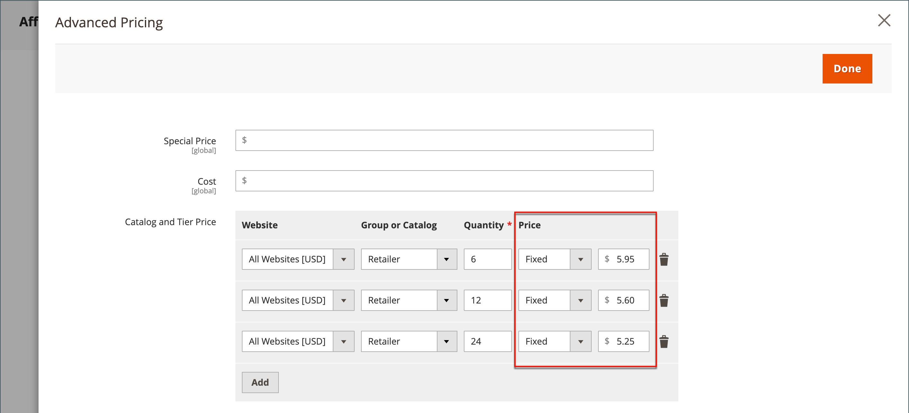

# 層級定價

層級定價可讓您從店面的產品清單或產品頁面提供數量折扣。 折扣可套用至特定商店檢視或客戶群組或共用目錄。

如果您有許多產品要更新，匯入層級價格變更比個別輸入更有效率。 如需詳細資訊，請參閱[匯入層級價格](../systems/data-import-price-tier.md)。

店面產品頁面上的{width="700" zoomable="yes"}

產品頁面會計算數量折扣，並顯示下列訊息：

`Buy 6 for $5.95 each and save 15%`

店面中的價格會從最高數量優先至最低數量。 若您有數量為`5`的層級價格，且有`10`的層級價格，而客戶新增五、六、七、八或九個專案至購物車，則客戶會收到數量為`5`的層級折扣價格。 當客戶新增第十個專案時，為數量`10`層級指定的折扣價格會取代數量`5`的層級，且適用`10`的折扣價格。

## 新增產品的價格層級

1. 在編輯模式中開啟產品。

1. 在&#x200B;_[!UICONTROL Price]_欄位下方，按一下&#x200B;**[!UICONTROL Advanced Pricing]**。

1. 在&#x200B;_[!UICONTROL Tier Price]_區段中，按一下&#x200B;**[!UICONTROL Add]**。

   如果您要建立多個價格的階層，請按一下每個額外階層&#x200B;**[!UICONTROL Add]**，以便同時處理所有階層。 群組中的每個層級都有相同的網站和客戶群組或共用目錄指派，但數量和價格不同。

## 設定價格層

1. 如果您的商店有多個網站，請選擇套用層級定價的&#x200B;**[!UICONTROL Website]**。

1. 如有必要，請選取&#x200B;**[!UICONTROL Customer Group]**&#x200B;或&#x200B;**[!UICONTROL Shared Catalog]**&#x200B;來限制訂價層的可用性(僅適用於[Adobe Commerce B2B](./b2b/../introduction.md))。

1. 針對&#x200B;**[!UICONTROL Qty]**，輸入必須訂購才能收到折扣的數量。

   - **方法1：**&#x200B;輸入價格作為固定金額

     將&#x200B;**[!UICONTROL Price]**&#x200B;設為`Fixed`，並輸入該層級中一個單位的調整後價格。

     將{width="600" zoomable="yes"}

   - **方法2：**&#x200B;以百分比輸入價格

     將&#x200B;**[!UICONTROL Price]**&#x200B;設為`Discount`，並輸入折扣價格，做為產品基準價格的百分比。

     例如，若是15%的折扣，請輸入數字`15`。 （價格會以兩個小數點位置儲存，例如`15.00`。）

     >[!NOTE]
     >
     >若要取得折扣價格，已定義的百分比是根據&#x200B;_[!UICONTROL Price]_欄位中定義的值（而非_[!UICONTROL Special Price]_&#x200B;欄位）計算。

     以百分比形式{width="600" zoomable="yes"}

## 完成價格設定

1. 若要為不同的網站或客戶群組新增另一組層級定價，請重複上述步驟。

1. 完成時，按一下&#x200B;**[!UICONTROL Done]**，然後按一下&#x200B;**[!UICONTROL Save]**。

>[!NOTE]
>
>使用下列公式，以&#x200B;**_最低_**&#x200B;相關價格計算&#x200B;**_最終_**&#x200B;產品價格：  `Final Price=Min(Regular(Base) Price, Group(Tier) Price, Special Price, Catalog Price Rule) + Sum(Min Price per each required custom option)`

>[!NOTE]
>
>**_固定價格_**&#x200B;產品可自訂選項&#x200B;_不_&#x200B;受群組價格、層級價格、特殊價格或目錄價格規則影響。

## 啟用目錄價格規則的層級訂價

僅[!BADGE SaaS]{type=Positive url="https://experienceleague.adobe.com/en/docs/commerce/user-guides/product-solutions" tooltip="僅適用於Adobe Commerce as a Cloud Service專案(Adobe管理的SaaS基礎結構)。"}

[!BADGE 沙箱]{type=Caution tooltip="列出的專案目前僅在沙箱環境中可用。 Adobe會先在沙箱環境中推出新版本，讓您在生產環境推出此版本之前有時間測試即將進行的變更。"}

在舊版Commerce中，層級定價無法與目錄價格規則搭配使用。 目錄規則忽略層級價格設定，僅從原始基本價格計算折扣。 使用Adobe Commerce as a Cloud Service，您現在可以選擇在目錄價格規則的計算中包含層級定價。

若要啟用此功能：

1. 導覽至「**[!UICONTROL Stores]** > *[!UICONTROL Settings]* > **[!UICONTROL Configuration]** > **[!UICONTROL Sales]** > **[!UICONTROL Sales]** > **[!UICONTROL Promotions]**」，並將&#x200B;**[!UICONTROL Apply Catalog Price Rule on Grouped Price]**&#x200B;欄位設為&#x200B;**[!UICONTROL Yes]**。

   {width="700" zoomable="yes"}

1. 為您想要以目錄價格規則定位的每個特定客戶群組或共用目錄（例如`1`、`Wholesale`或商家定義的群組）定義數量為`Retail`的層級價格。 `ALL GROUPS`客戶群組和`Default`共用目錄無法用於此目的。 未針對未定義數量為`1`之層級價格的任何群組啟用層級定價。

1. 視需要定義數量大於`1`的其他層級價格。 當客戶將額外數量的產品加入購物車時，會照常套用這些額外的層級價格。 目錄價格規則不適用於這些額外的層級價格。

若要說明在購買單一產品時，層級訂價如何與型錄價格規則搭配運作，請考量下列範例：

- 產品的標準基本價格為100美元。
- 已針對數量為`Wholesale`且固定價格為90美元的`1`客戶群組定義層級價格。
- 型錄價格規則會為`Wholesale`客戶群組提供10%的折扣。

當針對型錄價格規則啟用層級訂價時，系統會使用下列流程來計算最終價格：

1. 在客戶登入之前，產品價格會顯示為100美元（標準基本價格）。

1. 客戶以`Wholesale`群組成員身分登入後，產品價格會調整為90 USD （`Wholesale`群組的層級價格）。

1. 套用目錄價格規則，在90美元的層級價格上提供10%的折扣，最終價格為81美元。

當型錄價格規則啟用層級訂價，而型錄價格規則為所有客戶群組提供10%折扣時，下表會摘要價格計算：

產品：標準價格$100 （單一料號採購）

| 客戶群組 | 層級價格（數量=1） | 新基本價格 | 最終價格 |
|---|---|---|---|
| 所有群組 | 未設定 | $100 | $100 - 10% = $90 |
| 批發 | 固定：$85 | $85 | $85 - 10% = $76.50 |
| retailer | 20%折扣 | $80 | $80 - 10% = $72.00 |
| VIP | 15%折扣 | $85 | $85 - 10% = $76.50 |
