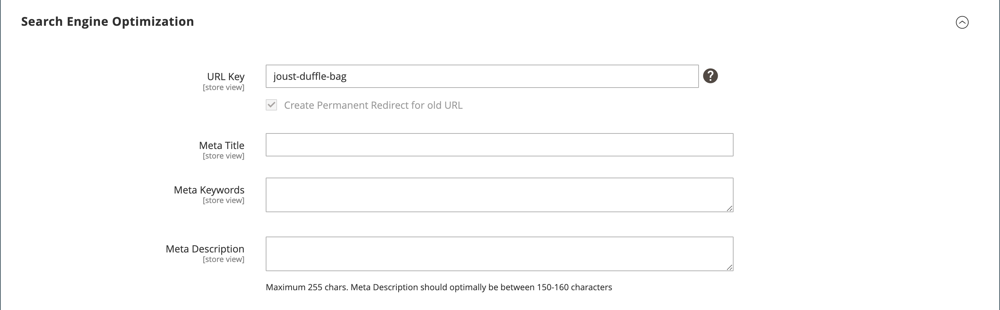

# 產品設定 — [!UICONTROL Search Engine Optimization]

_搜尋引擎最佳化_ (SEO)是微調網站的內容與呈現方式，以改進搜尋引擎索引頁面的方式。

產品的&#x200B;_[!UICONTROL Search Engine Optimization]_設定指定了搜尋引擎用來索引產品的[URL索引鍵](catalog-urls.md)和[中繼資料](../merchandising-promotions/meta-data.md)欄位。 雖然有些搜尋引擎會忽略中繼關鍵字，但其他搜尋引擎仍會繼續使用這些關鍵字。 目前的[SEO最佳作法](../merchandising-promotions/seo-overview.md)是在中繼標題和中繼描述中併入高值關鍵字。

每個中繼資料欄位的預設值可根據設定中指定的值自動產生。 每個欄位都包含一個預留位置，並以實際值取代。 如需詳細資訊，請參閱[產品欄位自動產生](../configuration-reference/catalog/catalog.md#uicontrol-product-fields-auto-generation)。

>[!NOTE]
>
>目錄擴充有助於改善LLM和AI輔助探索的產品名稱和說明。 它不會取代SEO中繼欄位。 如需詳細資訊，請參閱[目錄擴充](catalog-enrichment.md)。

## 填妥SEO欄位

1. 在編輯模式中開啟產品。

1. 向下捲動並展開 _[!UICONTROL Search Engine Optimization]_區段。

{width="600" zoomable="yes"}

1. 輸入&#x200B;**[!UICONTROL URL Key]** （選擇性）。

   預設URL金鑰是根據產品名稱。 您可以使用預設值，或視需要加以變更。 如需詳細資訊，請參閱[目錄URL](catalog-urls.md)。

1. 輸入&#x200B;**[!UICONTROL Meta Title]** （選擇性）。

   中繼標題是出現在瀏覽器視窗頂端的文字。 您可以使用以產品名稱為基礎的預設值，或視需要加以變更。

1. 新增&#x200B;**[!UICONTROL Meta Keywords]** （選擇性）。

   某些搜尋引擎比其他搜尋引擎更常使用中繼關鍵字。 最佳實務是輸入幾個高價值的關鍵字，以協助產品獲得更多的可見度。

1. 輸入&#x200B;**[!UICONTROL Meta Description]**。

   中繼說明是出現在搜尋結果清單中的文字。 為了獲得最佳結果，請輸入長度介於150到160個字元之間的說明。

## 欄位參考

| 欄位 | [領域](../getting-started/websites-stores-views.md#scope-settings) | 說明 |
|--- |--- |------------------|
| [!UICONTROL URL Key] | 存放區檢視 | 決定產品的線上位址。 URL金鑰會新增至商店的基礎URL中，並顯示在瀏覽器的位址列中。 Commerce最初會根據產品名稱建立適合&#x200B;_搜尋引擎的_ URL。 URL索引鍵應全部為小寫字元，這些字元之間應使用非尾隨連字型大小，而非空格。 請勿在URL金鑰中包含尾碼，例如`.html`，因為它是在設定中管理的。 |
| [!UICONTROL Meta Title] | 存放區檢視 | 標題會顯示在瀏覽器的標題列和索引標籤中，也會用作搜尋引擎結果頁面(SERP)上的標題。 中繼標題應為頁面唯一且長度小於70個字元。 自動產生的值： `{{name}}` |
| [!UICONTROL Meta Keywords] | 存放區檢視 | 產品的相關關鍵字。 請考慮使用客戶可能用來尋找產品的關鍵字。 自動產生的值： `{{name}}` |
| [!UICONTROL Meta Description] | 存放區檢視 | 中繼說明提供搜尋結果清單頁面的簡短概觀。 理想的長度是介於150到160個字元之間，上限為255個字元。 雖然客戶看不到，但有些搜尋引擎會在搜尋結果頁面上包含中繼說明。 自動產生的值： `{{name}} {{description}}` |

{style="table-layout:auto"}
