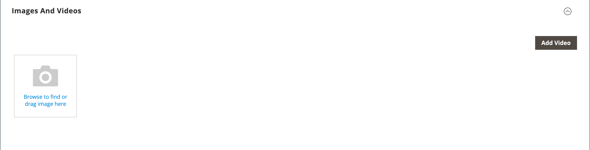

# 新增產品影片

若要新增產品影片，您必須先從Google帳戶取得API金鑰，並在商店設定中輸入。 然後，您就可以從產品連結至影片。

## 步驟1：取得YouTube API金鑰

1. 登入您的Google帳戶並造訪[Google開發人員主控台](https://console.developers.google.com/)。

1. 在頂端的搜尋欄位中，輸入`YouTube Data API v3`並按一下搜尋圖示。

1. 顯示API頁面時，請確定其已啟用。

1. 在左側面板中選擇&#x200B;**[!UICONTROL Credentials]**。

1. 根據您是否擁有認證，請執行下列任一項作業：

   - 如果您已經有所需的認證，請複製&#x200B;_API金鑰_&#x200B;表格中的金鑰。

   - 如果您還沒有此API的認證，請按一下頂端的「**[!UICONTROL Create Credentials]**」，然後依照提示建立所需的認證。 在&#x200B;_取得您的認證_&#x200B;下，複製API金鑰並按一下&#x200B;**[!UICONTROL Done]**。

1. 將API金鑰複製到剪貼簿。

1. 按一下右側的「編輯」圖示並設定限制，以確保API金鑰僅限於正確的反向連結。

1. 正在產生金鑰，請稍候片刻，然後將金鑰複製到剪貼簿。

   在下一步中，您會將金鑰貼入存放區的設定中。

## 步驟2：在Commerce中設定金鑰

1. 在&#x200B;_管理員_&#x200B;側邊欄上，移至&#x200B;**[!UICONTROL Stores]** > _[!UICONTROL Settings]_>**[!UICONTROL Configuration]**。

1. 在左側面板中，展開&#x200B;**[!UICONTROL Catalog]**&#x200B;並在下方選擇&#x200B;**[!UICONTROL Catalog]**。

1. 展開 _[!UICONTROL Product Video]_區段並貼上您的&#x200B;**[!UICONTROL YouTube API key]**。

   {width="600" zoomable="yes"}

1. 完成時，按一下&#x200B;**[!UICONTROL Save Config]**。

1. 出現提示時，請重新整理快取。

## 步驟3：影片連結

1. 在編輯模式中開啟產品。

1. 捲動至並展開&#x200B;_[!UICONTROL Images and Videos]_區段。

   {width="600" zoomable="yes"}

1. 按一下&#x200B;**[!UICONTROL Add Video]**。

   如果您尚未設定YouTube API金鑰，請按一下&#x200B;**[!UICONTROL OK]**&#x200B;以繼續。 您無法連結至YouTube影片，但您可以完成此程式。

1. 針對&#x200B;**[!UICONTROL Url]**，輸入YouTube或Vimeo視訊的URL。

   {width="600" zoomable="yes"}

1. 按一下欄位外部，然後等待對API金鑰或影片的反饋。

   如果一切都已簽出，YouTube會提供視訊的基本資訊

1. 輸入視訊的&#x200B;**[!UICONTROL Title]**&#x200B;和&#x200B;**[!UICONTROL Description]**。

1. 若要上傳&#x200B;**[!UICONTROL Preview Image]**，請瀏覽至影像並選取檔案。

   >[!NOTE]
   >
   >上傳後，外部視訊服務提供者會自動產生顯示的預覽影像。 您無法從Adobe Commerce管理員編輯影像。

1. 如果您偏好使用視訊中繼資料，請按一下&#x200B;**[!UICONTROL Get Video Information]**。

1. 若要決定視訊在市集內的使用方式，請選取每個套用之&#x200B;**[!UICONTROL Role]**&#x200B;的核取方塊：

   - `Base Image`
   - `Small Image`
   - `Swatch Image`
   - `Thumbnail`
   - `Hide from Product Page`

1. 完成時，按一下&#x200B;**[!UICONTROL Save]**。

   >[!NOTE]
   >
   >如果&#x200B;_[!UICONTROL Autostart base video]_組態選項設為`Yes`，但視訊未開始自動播放，可能是因為瀏覽器強制執行且無法由Adobe Commerce控制的自動播放原則。 每個支援的瀏覽器都有自己的自動播放原則，這些原則會隨著時間而改變，且您的視訊未來可能不會自動播放。 建議的最佳實務是，請勿仰賴自動播放功能來實現關鍵業務功能，而應使用每個支援的瀏覽器測試商店中的視訊自動播放行為。

## 在商店檢視層級管理視訊角色

當您在特定存放區檢視範圍（非&#x200B;**[!UICONTROL All Store Views]**）中工作時新增或編輯視訊時，視訊對話方塊中的每個&#x200B;**[!UICONTROL Role]**&#x200B;選項都會顯示&#x200B;**[!UICONTROL Use Default Value]**&#x200B;按鈕。 按一下此按鈕，從該角色的預設範圍繼承角色指派。

{width="600" zoomable="yes"}

## 維護API存取權

根據Google開發人員[條款與條件](https://developers.google.com/youtube/terms/developer-policies#d.-accessing-youtube-api-services)，YouTube可能會停用已停用90天以上的帳戶的API存取。 發生此狀況可能會導致您的視訊無法顯示。 若要保持API存取為最新狀態，請使用cron工作定期偵測API：

```code
30 10 1 * * curl -i -G -e https://yourdomain.com/ -d "part=snippet&maxResults=1&q=test&key=YOUTUBEAPIKEY" https://www.googleapis.com/youtube/v3/search >/dev/null 2>&1
```

## 欄位參考

| 欄位 | 說明 |
|--- |--- |
| [!UICONTROL URL] | 相關視訊的URL。 |
| [!UICONTROL Title] | 影片標題。 |
| [!UICONTROL Description] | 影片說明。 |
| [!UICONTROL Preview Image] | 已上傳的影像，可作為您商店中視訊的預覽。 |
| [!UICONTROL Get Video Information] | 擷取儲存在主機伺服器上的視訊中繼資料。 您可以視需要使用原始資料或更新資料。 |
| [!UICONTROL Role] | 決定如何在您的商店中使用預覽影像。 您可以選擇任何選項組合： `Base Image`、`Small Image`、`Thumbnail`、`Swatch Image`、`Hide from Product Page` |

{style="table-layout:auto"}
