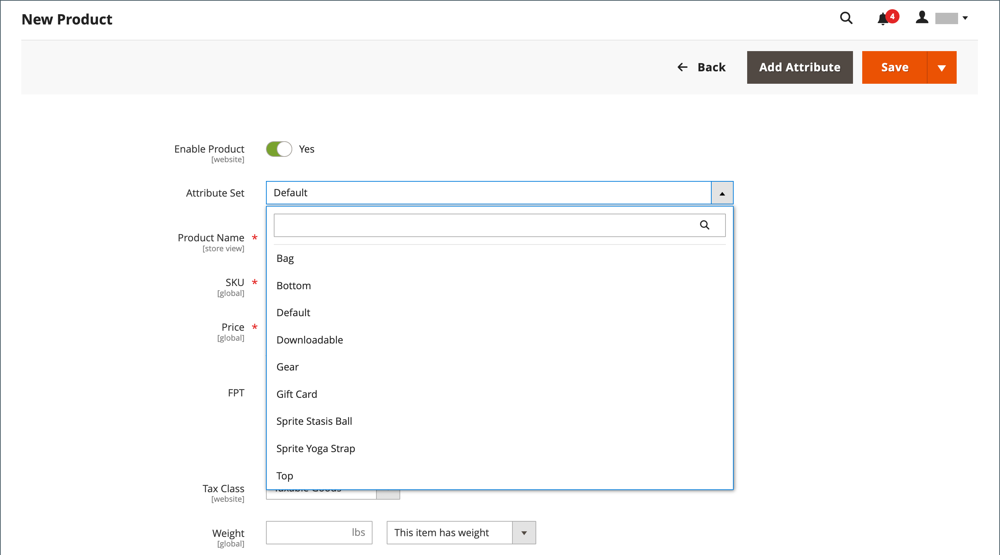

# 產品工作區

所有產品型別的產品工作區基本上相同，不過欄位選擇會根據使用的屬性集而改變。 產品屬性位於表單頂端，其後是產品資訊的可展開區段。 第一次儲存新產品時，_[!UICONTROL Store View]_&#x200B;選擇器會出現在表單的左上方。

{width="700" zoomable="yes"}

## [!UICONTROL Enable Product]設定

產品的線上狀態是由表單頂端的開關所指示。 若要變更線上狀態，請將&#x200B;**[!UICONTROL Enable Product]**&#x200B;引數設定為`Yes`或`No`。

| 控制 | 說明 |
|-------- | ----------- |
|  | 表示產品已上線。 |
|  | 表示產品已離線。 |

{style="table-layout:auto"}

## 屬性集

[屬性集](attribute-sets.md)的名稱會出現在左上角，並決定出現在產品記錄中的欄位。 若要選擇不同的屬性集，請按一下預設屬性集名稱旁邊的向下箭頭。

{width="600" zoomable="yes"}

## 展開/摺疊

若要展開或收合區段，請按一下展開或收合圖示。

## [!UICONTROL Save]功能表

_[!UICONTROL Save]_&#x200B;功能表包含數個選項，可讓您儲存並繼續、儲存並建立產品、儲存並複製產品，或儲存並關閉。

{width="600" zoomable="yes"}

| 命令 | 說明 |
|--- |--- |
| [!UICONTROL Save] | 儲存目前的產品並繼續運作。 |
| [!UICONTROL Save & New] | 儲存並關閉目前的產品，然後根據相同的產品型別和範本開始新產品。 |
| [!UICONTROL Save & Duplicate] | 儲存並關閉目前的產品，然後開啟新的重複復本。 |
| [!UICONTROL Save & Close] | 儲存目前的產品並返回&#x200B;_[!UICONTROL Products]_&#x200B;工作區。 |

{style="table-layout:auto"}

## 預設欄位值

為了在建立產品時節省時間，多個產品欄位的預設值會參考另一個欄位的值。 您可以接受預設值或輸入其他值。 下列欄位已自動產生預設值：

| 欄位 | 預設 |
|----- |------- |
| [!UICONTROL SKU] | 根據產品名稱。 |
| [!UICONTROL Meta Title] | 根據產品名稱。 |
| [!UICONTROL Meta Keywords] | 根據產品名稱。 |
| [!UICONTROL Meta Description] | 根據產品名稱和說明。 |

{style="table-layout:auto"}

代表其他欄位值的預留位置會以雙大括弧括住。 產品[屬性集](attribute-sets.md)中包含的任何屬性程式碼都可做為預留位置使用。

{width="600" zoomable="yes"}

如需這些設定的詳細清單，請參閱&#x200B;_設定參考_&#x200B;中的[產品欄位自動產生](../configuration-reference/catalog/catalog.md#product-fields-auto-generation)。

### 編輯預留位置值

1. 在&#x200B;_管理員_&#x200B;側邊欄上，移至&#x200B;**[!UICONTROL Stores]** > _[!UICONTROL Settings]_>**[!UICONTROL Configuration]**。

1. 在左側面板中，展開&#x200B;**[!UICONTROL Catalog]**&#x200B;並在下方選擇&#x200B;**[!UICONTROL Catalog]**。

1. 展開 **[!UICONTROL Product Fields Auto-Generation]**&#x200B;區段，並對預留位置值進行任何必要的變更。

   例如，如果您要為每個產品加入特定的關鍵字，或要加入每個中繼說明的片語，請直接在適當的欄位中輸入值。

   >[!NOTE]
   >
   >如果要保留現有的預留位置值，請保留每個標示標籤內的雙大括弧。

1. 完成時，按一下&#x200B;**[!UICONTROL Save Config]**。

### 通用預留位置

- `{{color}}`
- `{{country_of_manufacture}}`
- `{{description}}`
- `{{gender}}`
- `{{material}}`
- `{{name}}`
- `{{short_description}}`
- `{{size}}`
- `{{sku}}`
