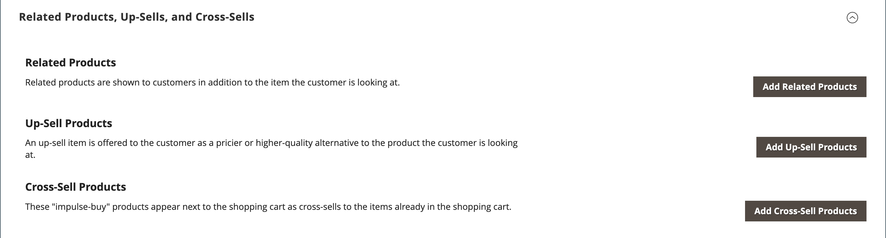
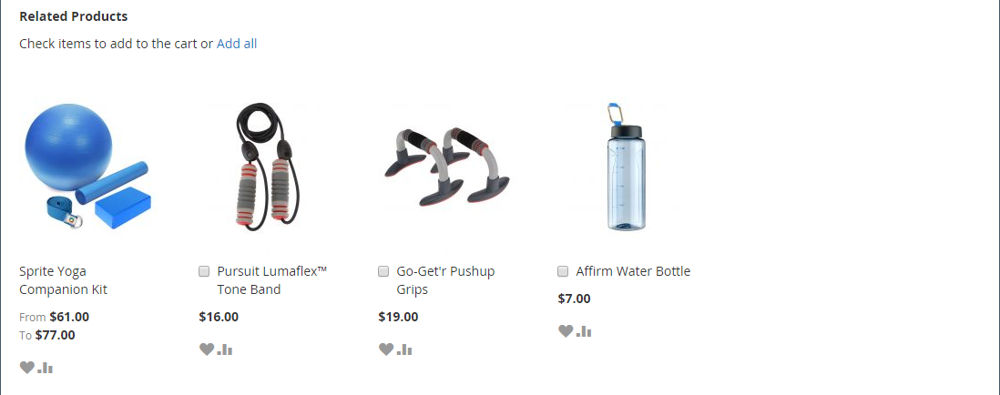
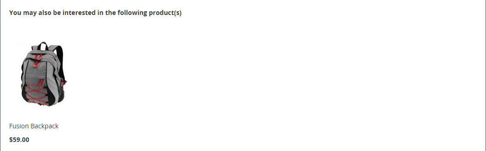
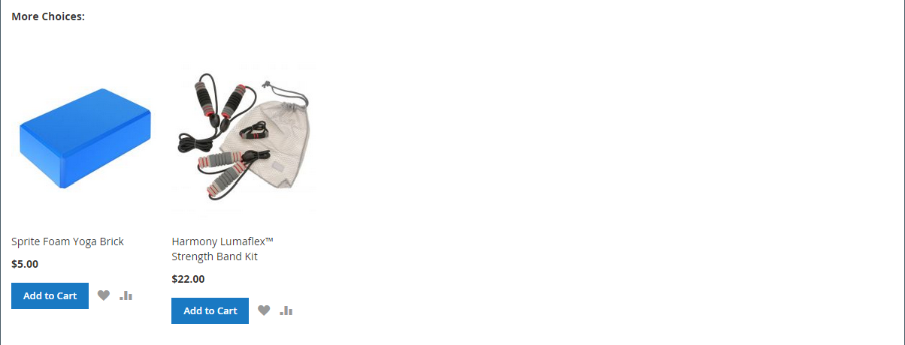

# 產品設定 — [!UICONTROL Related Products, Up-Sells, and Cross-Sells]

使用&#x200B;_[!UICONTROL Related Products, Up-Sells, and Cross-Sells]_&#x200B;區段來設定簡單的促銷區塊，這些區塊會顯示客戶可能感興趣的其他產品選項。 如需詳細資訊，請參閱[產品關係](../merchandising-promotions/product-relationships.md)。

{width="600" zoomable="yes"}

每個區塊都包含屬於特定選項的產品清單。

| 欄位 | 說明 |
|--- |--- |
| [!UICONTROL ID] | 指派給產品實體的唯一數值識別碼。 |
| [!UICONTROL Thumbnail] | 產品縮圖影像。 |
| [!UICONTROL Name] | 產品的名稱。 |
| [!UICONTROL Status] | 表示產品狀態。 選項： `Enabled` / `Disabled`。 停用的產品不會顯示在前端的區塊中。 |
| [!UICONTROL Attribute Set] | 用作產品範本的屬性集名稱。 |
| [!UICONTROL SKU] | 指定給產品的唯一庫存單位。 |
| [!UICONTROL Price] | 產品的單價。 |
| [!UICONTROL Action] | 選項： `Remove`。 從區塊中移除產品。 |

{style="table-layout:auto"}

>[!TIP]
>
> (僅限Adobe Commerce) **由Adobe AI支援的產品建議**&#x200B;使用人工智慧和機器學習演演算法，對彙總的訪客資料執行深入分析，藉以簡化定義產品關係的程式。 此資料與您的Adobe Commerce目錄結合後，可為購物者提供極為引人入勝、相關且個人化的體驗。
> 
>如需使用此Adobe開發的擴充功能作為手動設定之產品推薦和追加銷售之替代方法的詳細資訊，請參閱&#x200B;_[產品推薦指南](https://experienceleague.adobe.com/docs/commerce/product-recommendations/guide-overview.html)_。

## 相關產品

除了客戶正在檢視的專案外，相關產品的購買目的也相同。 客戶只需按一下核取方塊，即可將商品放入購物車中。 _相關產品_&#x200B;區塊的位置會根據定義的主題和頁面配置而有所不同。 在下列範例中，_相關產品_&#x200B;區塊會顯示在&#x200B;_產品檢視_&#x200B;頁面的底部。 使用兩欄式配置時，_Related Products_&#x200B;區塊經常會出現在右側邊欄中。

{width="600" zoomable="yes"}

若要設定相關產品：

1. 在編輯模式中開啟產品。

1. 向下捲動並展開 **[!UICONTROL Related Products, Up-Sells, and Cross-Sells]**&#x200B;區段。

1. 按一下&#x200B;**[!UICONTROL Add Related Products]**。

1. 使用[篩選控制項](../getting-started/admin-grid-controls.md)來尋找您想要的產品。

1. 在清單中，選取任何要設定為相關產品的產品核取方塊。

   {width="600" zoomable="yes"}

1. 完成時，按一下&#x200B;**[!UICONTROL Add Selected Products]**。

## 追加銷售

追加銷售產品是客戶可能偏好的專案，而非目前考慮的產品。 以向上銷售方式提供的料號可能會有較高的品質、較受歡迎或較佳的利潤率。 追加銷售產品會出現在產品頁面的標題下，例如&#x200B;_您可能也對下列產品感興趣_。

{width="600" zoomable="yes"}

若要選取向上銷售產品，請執行下列步驟：

1. 在編輯模式中開啟產品。

1. 向下捲動並展開 **[!UICONTROL Related Products, Up-Sells, and Cross-Sells]**&#x200B;區段。

1. 按一下&#x200B;**[!UICONTROL Add Up-Sell Products]**。

1. 使用[篩選控制項](../getting-started/admin-grid-controls.md)來尋找您想要的產品。

1. 在清單中，選取您要作為追加銷售產品功能的任何產品的核取方塊。

   {width="600" zoomable="yes"}

1. 完成時，按一下&#x200B;**[!UICONTROL Add Selected Products]**。

>[!NOTE]
>
>父套裝產品一律自動顯示為其所有子產品的向上銷售產品。

## 交叉銷售

交叉銷售專案類似於位於結帳明細中收銀機旁的衝動購買。 在客戶開始結帳程式之前，以交叉銷售方式提供的產品會出現在購物車頁面上。

>[!NOTE]
>
>若要依商店檢視顯示或隱藏交叉銷售專案，請參閱購物車中名為[的](../configuration-reference/sales/checkout.md)結帳>購物車&#x200B;_[!UICONTROL Show Cross-sell Items]_&#x200B;選項。 您可能會想要在特定銷售期間或在商店檢視中隱藏A/B測試的交叉銷售。

{width="600" zoomable="yes"}

**_若要選取交叉銷售產品:_**

1. 在編輯模式中開啟產品。

1. 向下捲動並展開 **[!UICONTROL Related Products, Up-Sells, and Cross-Sells]**&#x200B;區段。

1. 按一下&#x200B;**[!UICONTROL Add Cross-Sell Products]**。

1. 使用[篩選控制項](../getting-started/admin-grid-controls.md)來尋找您想要的產品。

1. 在清單中，選取您要作為交叉銷售產品功能的任何產品核取方塊。

   {width="600" zoomable="yes"}

1. 完成時，按一下&#x200B;**[!UICONTROL Add Selected Products]**。
