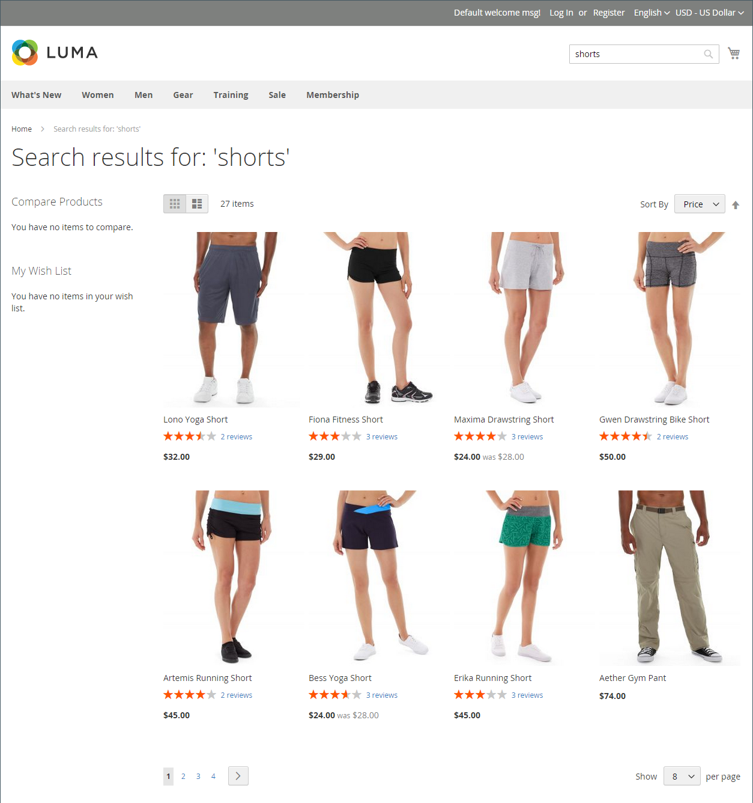
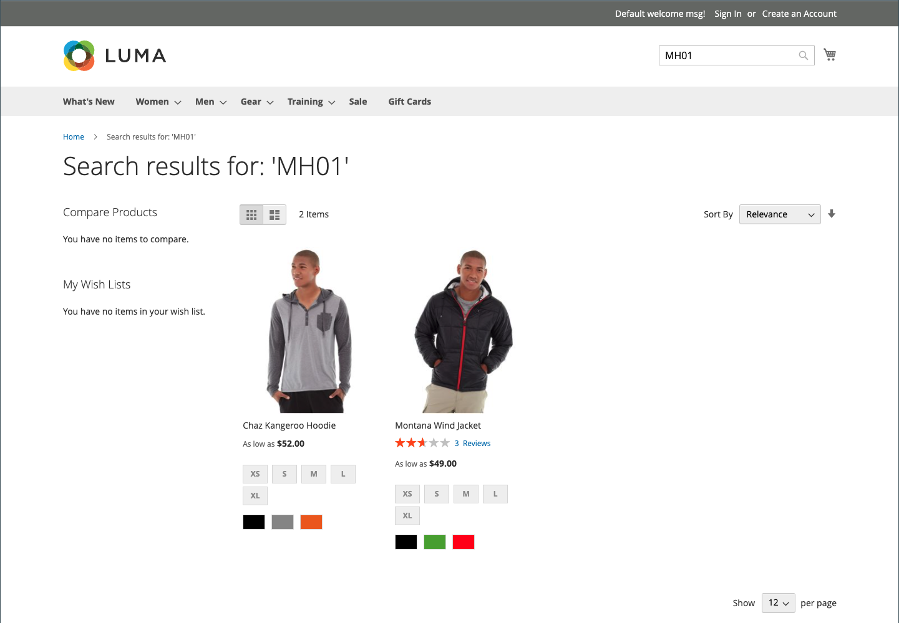
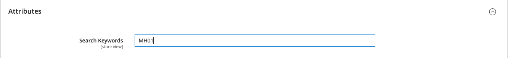
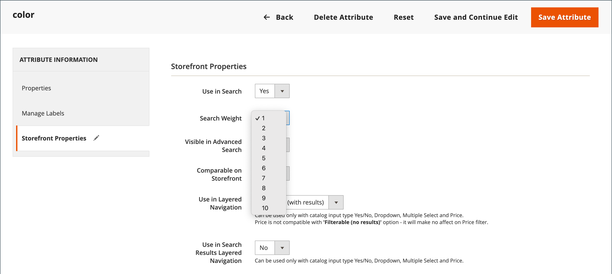

# 搜尋結果

>[!NOTE]
>
>此頁面說明可能與[即時搜尋](https://experienceleague.adobe.com/docs/commerce-merchant-services/live-search/overview.html)不同的標準搜尋功能。

_搜尋結果_&#x200B;清單包含所有符合「快速搜尋」方塊或「進階搜尋」表單中所輸入搜尋條件的產品。 目錄中的每個產品清單基本上都有相同的控制項。 唯一的差異是其中一個是搜尋查詢的結果，另一個差異是[導覽](navigation.md)的結果。

結果可以格式化為網格或清單，並按屬性選項排序。 如果頁面上有超過大小的產品，則會顯示分頁控制項。 使用這些控制項可從一個頁面移至下一個頁面。 每頁的記錄數由目錄前端設定決定。 如需詳細資訊，請參閱[產品清單](navigation-product-listings.md)。

具有&#x200B;**Elasticsearch**：

- 依據尾碼的搜尋沒有現成可用的支援。 例如，如果關鍵字只包含SKU的結尾部分，依SKU搜尋可能不會傳回預期結果。
- 僅針對`name`和`sku`產品屬性，提供開箱即用的依字首搜尋（部分關鍵字搜尋）支援。 所有其他產品屬性會使用整個關鍵字進行搜尋，且完全相符。
- `name`和`sku`產品屬性的搜尋結果是以關聯性為基礎，而非完全相符。 最相關的相符專案，例如完全相符的&#x200B;_產品名稱_&#x200B;或&#x200B;_SKU_&#x200B;會列在前。 若要搜尋完全相符的專案，客戶可在搜尋查詢中使用雙引號。 例如，`WSH12-32-Red`搜尋查詢可能會傳回數個產品，依關聯性排序。 但`"WSH12-32-Red"`搜尋查詢只傳回一個產品，**_與_**&#x200B;完全符合`sku`。

{width="700" zoomable="yes"}

>[!IMPORTANT]
>
>由於Elasticsearch7於2023年8月宣佈終止支援，建議所有Adobe Commerce客戶移轉至OpenSearch 2.x搜尋引擎。 如需在產品升級期間移轉搜尋引擎的相關資訊，請參閱&#x200B;_升級指南_&#x200B;中的[移轉至OpenSearch](https://experienceleague.adobe.com/docs/commerce-operations/upgrade-guide/prepare/opensearch-migration.html)。

## 用於擴充搜尋結果的關鍵字對應

此技巧使用屬性來建立兩個產品之間以關鍵字為基礎的關聯，以便搜尋任一產品會傳回兩個產品的結果。 您可以使用關鍵字對應來促銷搜尋結果中的產品，若沒有關鍵字對應將不會顯示。

{width="700" zoomable="yes"}

以下範例會根據SKU使用關鍵字對應。 在搜尋方塊中輸入其中一個SKU時，兩個產品都會顯示在結果中。 對應下列可設定產品的SKU，而非產品變異的SKU：

- Montana防風夾克(MJ03)
- 查茲袋鼠連帽衫(MH01)

### 步驟1：建立屬性

1. 在&#x200B;_[!UICONTROL Products]_清單中，以編輯模式開啟`Montana Wind Jacket` (MJ03)。
1. 按一下右上角的&#x200B;**[!UICONTROL Add Attribute]**。
1. 在&#x200B;_選取屬性_&#x200B;頁面上按一下&#x200B;**[!UICONTROL Create New Attribute]**。
1. 依照下列步驟完成屬性特性：

   **[!UICONTROL Attribute Properties]**

   - [!UICONTROL Attribute Label] - `Search Keywords`
   - [!UICONTROL Catalog Input Type for Store Owner] - `Text Field`

   **[!UICONTROL Advanced Attribute Properties]**

   - [!UICONTROL Add to Column Options] - `Yes` （預設）
   - [!UICONTROL Use in Filter Options] - `Yes` （預設）

   **[!UICONTROL Storefront Properties]**

   - [!UICONTROL Use in Search] - `Yes`
   - [!UICONTROL Visible on Catalog Pages in the Storefront] - `No`
   - [!UICONTROL Used in Product Listings] - `No`

1. 完成時，按一下&#x200B;**[!UICONTROL Save Attribute]**。

   屬性會新增至產品的屬性集。

### 步驟2：對應第一個產品

1. 在產品設定頁面上，向下捲動並展開&#x200B;_[!UICONTROL Attributes]_區段。
1. 在&#x200B;**[!UICONTROL Search Keywords]**&#x200B;欄位中，輸入要對應至此產品的SKU `MH01`。

   您可以在「搜尋關鍵字」欄位中輸入多個以空格分隔的SKU。 在此範例中，僅輸入一個。

   具有搜尋關鍵字的{width="600" zoomable="yes"}

1. 完成時，按一下&#x200B;**[!UICONTROL Save]**。
1. 前往「**[!UICONTROL System]** > _[!UICONTROL Tools]_>**[!UICONTROL Cache Management]**」並重新整理&#x200B;**[!UICONTROL Page Cache]**。

### 步驟3：對應第二個產品

1. 在&#x200B;_[!UICONTROL Products]_清單中，以編輯模式開啟`Chaz Kangaroo Hoodie` (MH01)。
1. 向下捲動並展開&#x200B;**[!UICONTROL Attributes]**&#x200B;區段。
1. 在&#x200B;**[!UICONTROL Search Keywords]**&#x200B;欄位中，輸入其他產品`MJ03`的SKU。
1. 按一下&#x200B;**[!UICONTROL Save]**。
1. 前往「**[!UICONTROL System]** > _[!UICONTROL Tools]_>**[!UICONTROL Cache Management]**」並重新整理&#x200B;**[!UICONTROL Page Cache]**。

### 步驟4：在店面中測試

1. 前往店面，並在&#x200B;_快速搜尋_&#x200B;方塊中輸入`MJ03`。
1. 確認搜尋結果清單中會傳回兩個產品。

## 加權搜尋

為目錄搜尋啟用的產品屬性可指定權重，以便在搜尋結果中提供較高的值。 較重量的屬性會先傳回，再傳回較重量的屬性。 例如，如果系統中有兩個屬性，搜尋權重為3的&#x200B;_color_&#x200B;和搜尋權重為1的&#x200B;_description_。 搜尋單字&#x200B;_red_&#x200B;時，會在搜尋結果頂端傳回色彩屬性值為`red`的產品清單，並傳回描述包含搜尋結果底部單字&#x200B;_red_&#x200B;的產品。 在此範例中，`color`屬性的定義權重大於`description`屬性。

>[!IMPORTANT]
>
>依關聯性排序同時受到&#x200B;**_多個_**&#x200B;條件以及它們之間的關係&#x200B;**_的影響_**。 [!UICONTROL Search Weight]只是這些條件之一。 這表示有時候搜尋權重較低的屬性可能仍比搜尋權重較高的屬性有更多的關聯性。 其他條件可能包括任何給定屬性中的相符數、找到的搜尋詞位置以及搜尋詞前後的整體文字結構。

**_設定屬性的搜尋權重屬性：_**

1. 在&#x200B;_管理員_&#x200B;側邊欄上，移至&#x200B;**[!UICONTROL Stores]** > _[!UICONTROL Attributes]_>**[!UICONTROL Product]**。

1. 在清單中尋找屬性，並以編輯模式開啟。

1. 在左側面板中，選擇&#x200B;**[!UICONTROL Storefront Properties]**&#x200B;並執行下列動作：

   - 若要在搜尋查詢中包含屬性，請將&#x200B;**[!UICONTROL Use in Search]**&#x200B;設為`Yes`。

   - 若要建立屬性的搜尋值，請將&#x200B;**[!UICONTROL Search Weight]**&#x200B;設定為從1到10的數字，其中`10`的優先順序最高。 如果未輸入任何值，則所有屬性預設為搜尋權數`1`。

   {width="600" zoomable="yes"}

1. 完成時，按一下&#x200B;**[!UICONTROL Save Attribute]**。
