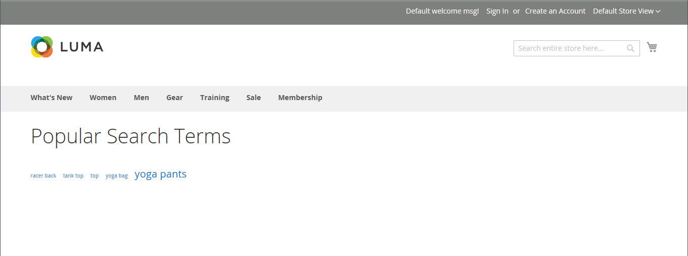

# 管理搜尋詞

搜尋詞的[登陸頁面](../content-design/pages.md)可以是內容頁面、類別頁面、產品詳細資料頁面，甚至可以是其他網站上的頁面。

使用搜尋字詞來擷取常見的拼寫錯誤並將它們重新導向到適當的頁面。 例如，如果您銷售鍛鐵式中庭傢俱，您知道許多人會誤將字詞拼成&#x200B;_rod iron_，甚至&#x200B;_rot iron_。 您可以輸入每個拼錯的字詞做為搜尋字詞，並做為鐵匠&#x200B;_的同義字_。 即使字詞拼寫有誤，搜尋仍會被導向到鍛鐵的頁面。

您也可以透過檢查客戶在您商店中尋找產品時所使用的搜尋詞來瞭解他們想要什麼。 如果有足夠的人尋找不在您目錄中的產品，則可能表示有銷售機會。 同時，與其讓這些變數空手而歸，您可以將其重新導向至目錄中的其他產品。

## 新增搜尋詞

當您瞭解人們使用新字詞在您的商店中進行搜尋時，可以將這些字詞新增到您的搜尋字詞清單中，以將人們導向目錄中最相符的產品。

{width="700" zoomable="yes"}

| 欄 | 說明 |
|--- |--- |
| [!UICONTROL Search Query] | 用來執行搜尋的查詢。 |
| [!UICONTROL Store] | 套用搜尋查詢的存放區。 |
| [!UICONTROL Results] | 查詢找到的結果數。 |
| [!UICONTROL Uses] | 使用次數。 |
| [!UICONTROL Redirect URL] | 執行搜尋後重新導向使用者的目標頁面URL。 |
| [!UICONTROL Suggested Terms] | 決定查詢結果是否顯示建議的詞語。 |
| [!UICONTROL Actions] | 以編輯模式開啟產品。 |

{style="table-layout:auto"}

>[!NOTE]
>
>每次購物者使用此搜尋查詢執行搜尋時，結果數都會更新。 若有任何產品變更或移除，則不會更新。

### 新增搜尋字詞

1. 在&#x200B;_管理員_&#x200B;側邊欄上，移至&#x200B;**[!UICONTROL Marketing]** > _[!UICONTROL SEO & Search]_>**[!UICONTROL Search Terms]**。

1. 按一下&#x200B;**[!UICONTROL Add New Search Term]**。

   {width="600" zoomable="yes"}

1. 在「**[!UICONTROL Search Query]**」方塊的「_[!UICONTROL General Information]_」下，輸入您要新增為搜尋字詞的字詞或片語。

1. 如果您的商店提供多種語言版本，請選擇適用的&#x200B;**[!UICONTROL Store]**&#x200B;檢視。

1. 若要將搜尋結果重新導向至您商店中的其他頁面或其他網站，請在&#x200B;**[!UICONTROL Redirect URL]**&#x200B;欄位中輸入目標頁面的完整URL。

1. 如果您想要在搜尋未傳回任何結果時，將此辭彙作為建議使用，請將&#x200B;**[!UICONTROL Display in Suggested Terms]**&#x200B;設為`Yes`。

1. 完成時，按一下&#x200B;**[!UICONTROL Save Search]**。

## 編輯搜尋字詞

1. 在&#x200B;_[!UICONTROL Search Terms]_格線中，按一下任何記錄的列，以在編輯模式中開啟搜尋字詞。

1. 進行必要的變更。

1. 完成時，按一下&#x200B;**[!UICONTROL Save Search]**。

## 刪除搜尋字詞

刪除搜尋字詞的方法有兩種 — 從網格和編輯頁面上。

在&#x200B;_[!UICONTROL Search Terms]_格線中的&#x200B;**方法1：**

1. 在清單中，選取要刪除之字詞的核取方塊。

1. 在清單的左上角，將&#x200B;**[!UICONTROL Actions]**&#x200B;設定為`Delete`。

1. 完成時，按一下&#x200B;**[!UICONTROL Submit]**。

**方法2：** （在&#x200B;_[!UICONTROL Edit a Search Term]_頁面上）

1. 在&#x200B;_管理員_&#x200B;側邊欄上，移至&#x200B;**[!UICONTROL Marketing]** > _[!UICONTROL SEO & Search]_>**[!UICONTROL Search Terms]**。

1. 尋找要刪除的搜尋字詞，並在編輯模式中開啟。

1. 按一下&#x200B;**[!UICONTROL Delete Search]**。

1. 若要確認動作，請按一下&#x200B;**[!UICONTROL OK]**。

## 熱門搜尋詞

商店頁尾中的&#x200B;_搜尋字詞_&#x200B;連結會顯示商店訪客所使用的搜尋字詞（依人氣排序）。 搜尋字詞以&#x200B;_標籤雲_&#x200B;格式顯示，其中文字的大小表示字詞的人氣高低。

依預設，「熱門搜尋詞」已啟用作為搜尋引擎最佳化工具，但沒有與目錄搜尋程式的直接連線。 由於「搜尋辭彙」頁面是由搜尋引擎編制索引，因此頁面上的任何詞語都可以協助改善搜尋引擎排名，以及商店的可見度。 常用搜尋詞頁面的URL是： `mystore.com/search/term/popular/`

{width="600" zoomable="yes"}

**_設定常用搜尋詞：_**

1. 在&#x200B;_管理員_&#x200B;側邊欄上，移至&#x200B;**[!UICONTROL Stores]** > _[!UICONTROL Settings]_>**[!UICONTROL Configuration]**。

1. 在左側面板中，展開&#x200B;**[!UICONTROL Catalog]**&#x200B;並在下方選擇&#x200B;**[!UICONTROL Catalog]**。

1. 展開&#x200B;**[!UICONTROL Search Engine Optimization]**&#x200B;區段的。

   {width="600" zoomable="yes"}

   如需這些選項的詳細清單，請參閱&#x200B;_組態參考_&#x200B;中的[搜尋引擎最佳化](../configuration-reference/catalog/catalog.md#search-engine-optimization)。

1. 視需要設定&#x200B;**[!UICONTROL Popular Search Terms]**。

   如有需要，請清除&#x200B;**[!UICONTROL Use system value]**&#x200B;核取方塊以變更此設定。

1. 完成時，按一下&#x200B;**[!UICONTROL Save Config]**。

>[!NOTE]
>
>您可以進一步設定常用[目錄搜尋](search-configuration.md)的快取。

## 搜尋同義字

若要改善[目錄搜尋](search-configuration.md)的效益，方法之一是加入不同辭彙，人們可能會使用這些辭彙來描述相同的專案。 您不想因為某人正在尋找&#x200B;_沙發_，而您的產品卻被列為&#x200B;_沙發_&#x200B;而失去銷售機會。 您可以輸入&#x200B;_sofa_、_davenport_&#x200B;和&#x200B;_loveseat_&#x200B;作為&#x200B;_沙發_&#x200B;的同義字，擷取範圍更廣的搜尋辭彙，並將它們導向相同的登陸頁面。

Adobe Commerce支援兩種不同的同義字管理解決方案：

- 即時搜尋[同義字](https://experienceleague.adobe.com/docs/commerce/live-search/live-search-admin/synonyms/synonyms.html)功能適用於已安裝Live Search的Adobe Commerce安裝。
- 所有Adobe Commerce安裝都能立即使用標準的搜尋同義字功能（如本頁所述）。

>[!NOTE]
>
>標準的搜尋同義字功能可立即支援`name`和`sku`產品屬性&#x200B;**_僅_**。

>[!IMPORTANT]
>
>搜尋同義字功能僅使用全文檢索比對搜尋方法。

{width="700" zoomable="yes"}

### 建立同義字群組

1. 在&#x200B;_管理員_&#x200B;側邊欄上，移至&#x200B;**[!UICONTROL Marketing]** > _[!UICONTROL SEO & Search]_>**[!UICONTROL Search Synonyms]**。

   _[!UICONTROL Search Synonyms]_格線出現。 如果這是您第一次使用搜尋同義字，則格線是空的。

   {width="700" zoomable="yes"}

1. 按一下&#x200B;**[!UICONTROL New Synonym Group]**。

   {width="700" zoomable="yes"}

1. 將&#x200B;**[!UICONTROL Scope]**&#x200B;設定為套用同義字的存放區檢視。

1. 輸入群組中的每個同義字，以逗號分隔。 選擇人們可能用作搜尋條件的字詞。 例如：

   - `sweatshirt, sweat shirt, hoodie, fleece`
   - `cell phone, mobile phone, smart phone`
   - `couch, sofa, davenport`
   - `wrought iron, rot iron, rod iron`

1. 若要將這些同義字合併成群組，並與具有相同範圍的其他同義字合併，請選取&#x200B;**[!UICONTROL Merge existing synonyms]**&#x200B;核取方塊。

1. 完成時，按一下&#x200B;**[!UICONTROL Save Synonym Group]**。

### 編輯同義字群組

1. 在&#x200B;_[!UICONTROL Search Synonyms]_網格中，按一下任何記錄的列，以編輯模式開啟同義字群組。

1. 進行必要的變更。

1. 完成時，按一下&#x200B;**[!UICONTROL Save Synonym Group]**。

### 刪除同義字群組

刪除同義字群組的方法有兩種：從格線及編輯頁面上。

搜尋同義字格中的&#x200B;**方法1：**

1. 在&#x200B;_[!UICONTROL Search Synonyms]_格線中，選取要刪除之群組的核取方塊。

1. 在清單的左上角，將&#x200B;**[!UICONTROL Actions]**&#x200B;設定為`Delete`。

1. 完成時，按一下&#x200B;**[!UICONTROL Submit]**。

編輯同義字群組頁面上的&#x200B;**方法2：**

1. 在「搜尋同義字」網格中，按一下任何記錄的列，以編輯模式開啟同義字群組。

1. 按一下&#x200B;**[!UICONTROL Delete Synonym Group]**。

1. 出現提示時，確認移除群組。

## 搜尋詞報表

「搜尋詞」報表會顯示每個詞語的結果數量，以及該詞語被使用的次數（點選）。 您可依辭彙、存放區、結果和點選來篩選報表資料，並匯出以供進一步分析。

### 檢視報告

1. 在&#x200B;_管理員_&#x200B;側邊欄上，移至&#x200B;**[!UICONTROL Reports]** > _[!UICONTROL Marketing]_>**[!UICONTROL Search Terms]**。

1. 視需要使用控制項來篩選報表。

   {width="700" zoomable="yes"}

## 匯出報告

1. 針對&#x200B;**[!UICONTROL Export to]**，選擇匯出格式：

   - `CSV` — 包含純文字資料的逗號分隔值檔案
   - `Excel XML` — 以XML為基礎的試算表資料格式

1. 按一下&#x200B;**[!UICONTROL Export]**。

   產生的檔案會自動儲存到您指定的資料夾以供下載。

### 報表欄

| 欄 | 說明 |
|--- |--- |
| [!UICONTROL ID] | 為搜尋字詞專案產生的唯一數值ID |
| [!UICONTROL Search Query] | 用來執行搜尋的查詢 |
| [!UICONTROL Store] | 套用搜尋查詢的存放區 |
| [!UICONTROL Results] | 結果數量 |
| [!UICONTROL Hits] | 使用次數 |

{style="table-layout:auto"}
