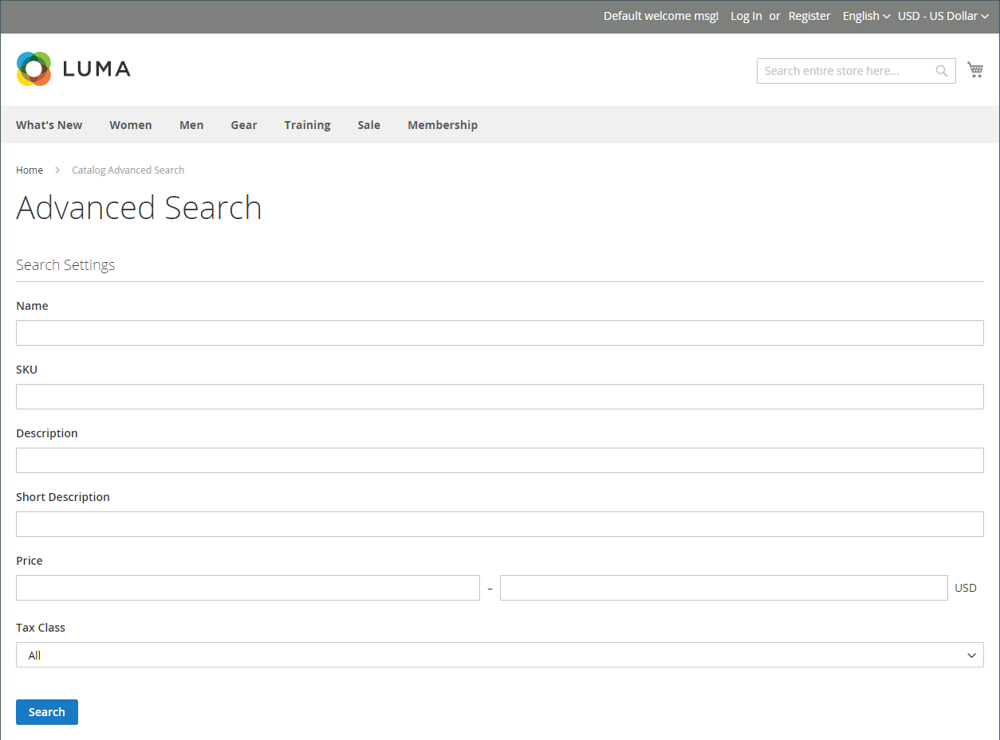

# 目錄搜尋概觀

>[!TIP]
>
>[[!DNL Live Search]](https://experienceleague.adobe.com/docs/commerce/live-search/overview.html)提供快速、超級相關且直覺式的搜尋體驗，Adobe Commerce可免費使用。 本節說明可能與[!DNL Live Search]不同的標準搜尋功能。

研究顯示，使用搜尋的人比只依賴導覽的客戶更可能購買。 事實上，根據一些研究，使用搜尋的人購買的可能性幾乎是兩倍。

以下各節說明基本目錄搜尋功能。 如需如何設定及自訂原生目錄搜尋功能的相關資訊，請參閱：

- [設定目錄搜尋](search-configuration.md)
- [搜尋結果](search-results.md)
- [管理搜尋詞](search-terms.md)

>[!NOTE]
>
>Commerce中的原生搜尋功能提供完全相符的搜尋結果。 雖然[!DNL Live Search] (可在Adobe Commerce中安裝及啟用的選用模組)實作方式不同，但結果不限於確切的搜尋字串。 例如，您有10個編號為&#x200B;_Omega_&#x200B;的產品：搜尋`Omega 1`會導致&#x200B;_Omega 1_&#x200B;與原生搜尋功能有單一相符專案。 但由「即時搜尋」提供支援的相同搜尋字串會產生多個相符專案： _Omega 1_&#x200B;和&#x200B;_Omega 10_。

## 快速搜尋

>[!NOTE]
>
>安裝[[!DNL Live Search]](https://experienceleague.adobe.com/en/docs/commerce/live-search/overview)且啟用[[!DNL Storefront Popover]](https://experienceleague.adobe.com/en/docs/commerce/live-search/live-search-storefront/storefront-popover) Widget時，搜尋方塊會在彈出視窗中傳回「鍵入時搜尋」。

商店標題中的搜尋方塊可協助訪客在目錄中尋找產品。 搜尋文字可以是完整或部分產品名稱，或是描述產品的任何其他字詞或片語。 使用者用來尋找產品的搜尋詞語，可由管理員加以管理。

1. 對於&#x200B;**[!UICONTROL Search]**，客戶輸入想要尋找內容的前幾個字母。

   目錄中的任何相符專案都會顯示如下，其中包含找到的結果數量。

1. 客戶按下Enter鍵或按一下相符產品清單中的結果。

   {width="700" zoomable="yes"}

## 進階搜尋

>[!NOTE]
>
>此處說明的進階表單搜尋功能不適用於[[!DNL Live Search]](https://experienceleague.adobe.com/docs/commerce/live-search/overview.html)。

進階搜尋可讓購物者根據在表單中輸入的值來搜尋目錄。 由於表單包含多個欄位，因此單一搜尋可包含數個引數。 結果會列出目錄中符合條件的所有產品。 進階搜尋的連結位於商店的頁尾。

{width="700" zoomable="yes"}

表單中的每個欄位都與產品目錄中的屬性相對應。 若要新增欄位，請將屬性的前端屬性設定為`Include in Advanced Search`。 最佳做法是僅包含客戶最有可能用來尋找產品的欄位，因為太多會減緩搜尋速度。

1. 在商店的頁尾中，客戶按一下&#x200B;**[!UICONTROL Advanced Search]**。

1. 在&#x200B;_進階搜尋_&#x200B;表單中，視需要在任意數目的欄位中新增完整或部分值。

1. 按一下&#x200B;**[!UICONTROL Search]**&#x200B;以顯示結果。

   {width="700" zoomable="yes"}

1. 如果他們沒有在搜尋結果中看到他們在尋找的內容，則客戶按一下&#x200B;**[!UICONTROL Modify your search]**&#x200B;並嘗試另一個條件組合。
