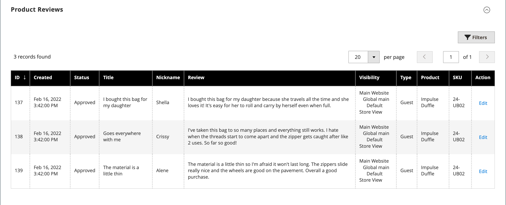

# 產品設定 — [!UICONTROL Product Reviews]

_[!UICONTROL Product Reviews]_&#x200B;區段列出客戶已提交的所有產品評論。 第一次儲存新產品後，此區段才會與其他產品資訊一起顯示。 如需詳細資訊，請參閱[產品評論](../merchandising-promotions/product-reviews.md)。

{width="600" zoomable="yes"}

## 欄位參考

| 欄位 | 說明 |
|--- |--- |
| [!UICONTROL ID] | 為產品評論專案產生的唯一數值ID |
| [!UICONTROL Created] | 評論的發佈日期 |
| [!UICONTROL Status] | 檢閱狀態（`Pending`、`Approved`或`Not Approved`） |
| [!UICONTROL Title] | 評論標題 |
| [!UICONTROL Nickname] | 離開評論之使用者的暱稱 |
| [!UICONTROL Review] | 客戶對目前產品的評論 |
| [!UICONTROL Visibility] | 商店評論中的可見性 |
| [!UICONTROL Type] | 離開評論的使用者型別（`Guest`或`Customer`） |
| [!UICONTROL Product] | 已檢閱的產品名稱 |
| [!UICONTROL SKU] | 指派給產品的唯一庫存單位 |
| [!UICONTROL Action] | 以編輯模式開啟產品 |

{style="table-layout:auto"}

## 稽核特定產品的稽核

1. 在&#x200B;_管理員_&#x200B;側邊欄上，移至&#x200B;**[!UICONTROL Catalog]** > **[!UICONTROL Products]**。

1. 找到產品並以編輯模式開啟。

1. 捲動至&#x200B;_[!UICONTROL Product Reviews]_&#x200B;區段。

1. 按一下&#x200B;**[!UICONTROL Edit]**&#x200B;進行狀態為`Pending`的產品檢閱，以檢視及編輯詳細資料。

1. 設定檢閱狀態：

   - 若要核准擱置的評論，請選取`Approved`。
   - 若要拒絕稽核，請選取`Not Approved`。
   - 您可以隨時將稽核狀態變更回`Pending`。

1. 完成時，按一下&#x200B;**[!UICONTROL Save Review]**。

具有`Pending`和`Not Approved`狀態的評論不會顯示在店面上。
