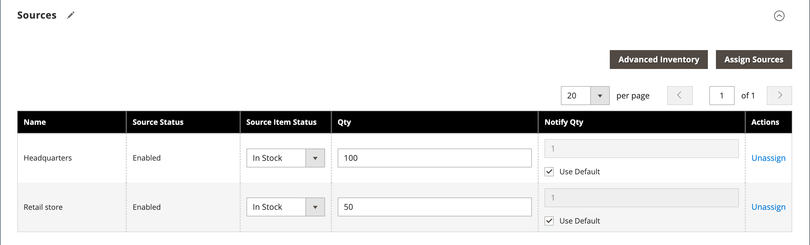

# 產品設定 — [!UICONTROL Sources]

產品設定的&#x200B;_[!UICONTROL Sources]_&#x200B;區段會列出可分發產品的來源。 它可用來指定與取消指定來源，以及管理產品的數量與可用性。 只有在您商店定義了一個以上的來源時，才會顯示此區段。 如需有關來源的詳細資訊，請參閱[管理來源](../inventory-management/sources-manage.md)。

## 指派產品的來源

1. 按一下&#x200B;**[!UICONTROL Assign Source]**。

1. 選取所需來源的核取方塊。

1. 按一下&#x200B;**[!UICONTROL Done]**。

1. 選取&#x200B;**[!UICONTROL Source Item Status]**&#x200B;並視需要輸入&#x200B;**[!UICONTROL Qty]**&#x200B;和&#x200B;**[!UICONTROL Notify Qty]**&#x200B;值。

1. 按一下&#x200B;**[!UICONTROL Save]**&#x200B;以儲存變更。

{width="600" zoomable="yes"}

## 欄位參考

| 欄位 | 說明 |
|--- |--- |
| [!UICONTROL Name] | 來源的唯一名稱。 |
| [!UICONTROL Source Status] | 決定產品在目錄中是啟用還是停用。 |
| [!UICONTROL Source Item Status] | 決定產品目前的可用性。 選項： **[!UICONTROL In Stock]**— 讓產品可供購買。 **[!UICONTROL Out of Stock]** — 除非啟用延期交貨，否則會防止產品可供購買，並從目錄中移除清單。 |
| [!UICONTROL Qty] | 每個來源的庫存量。 |
| [!UICONTROL Notify Qty] | 未選取`Notify Quantity Use Default`時，此特定來源的&#x200B;_通知數量_&#x200B;的金額。 |
| [!UICONTROL Notify Qty Use Default] | 表示在產品[進階詳細目錄]中使用數量&#x200B;_的_&#x200B;通知預設設定，或在商店組態中使用全域設定。 如需產品的進階詳細目錄設定的詳細資訊，請參閱[設定進階產品選項](../inventory-management/product-options.md)。 |
| [!UICONTROL Actions] | 針對指派的來源，按一下&#x200B;**[!UICONTROL Unassign]**，使該來源無法用於產品。 針對未指派的來源，按一下&#x200B;**[!UICONTROL Assign Sources]**&#x200B;讓來源可用於產品。 如需[!UICONTROL Assign Sources]選項的詳細資訊，請參閱[為每個產品指派來源](../inventory-management/sources-assign-per-product.md)。 |

{style="table-layout:auto"}
