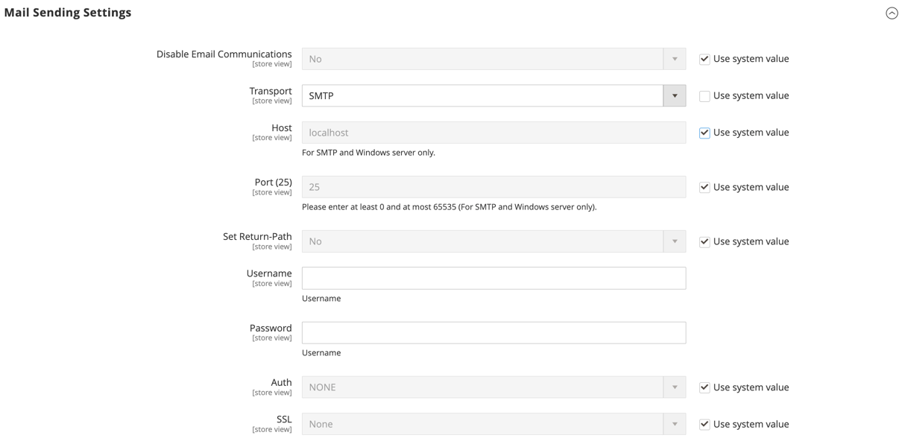

# [!UICONTROL Advanced] > [!UICONTROL System]

{{config}}

## [!UICONTROL Cron (Scheduled Tasks)]

<!-- zoom -->

如需有關變更這些組態設定的詳細資訊，請參閱 [Cron （排程工作）](../../systems/cron.md).

### [!UICONTROL index]

<!-- zoom -->

| 欄位 | [範圍](../../getting-started/websites-stores-views.md#scope-settings) | 說明 |
|--- |--- |--- |
| [!UICONTROL Generate Schedules Every] | 全域 | 決定產生排程的頻率（分鐘）。 |
| [!UICONTROL Schedule Ahead for] | 全域 | 決定產生排程的提前分鐘數。 |
| [!UICONTROL Missed if Not Run Within] | 全域 | 決定尚未執行的cron作業被標籤為錯過之前的分鐘數。 |
| [!UICONTROL History Cleanup Every] | 全域 | 決定清除cron記錄之前經過的分鐘數。 |
| [!UICONTROL Success History Lifetime] | 全域 | 決定成功完成的cron工作記錄保留在資料庫中的分鐘數。 |
| [!UICONTROL Failure History Lifetime] | 全域 | 決定失敗的cron作業記錄保留在資料庫中的分鐘數。 |
| [!UICONTROL Use Separate Process] | 全域 | 決定cron工作是否以個別處理序並行執行。 選項： `Yes` / `No` |

{style="table-layout:auto"}

### [!UICONTROL default]

<!-- zoom -->

| 欄位 | [範圍](../../getting-started/websites-stores-views.md#scope-settings) | 說明 |
|--- |--- |--- |
| [!UICONTROL Generate Schedules Every] | 全域 | 決定產生排程的頻率（分鐘）。 |
| [!UICONTROL Schedule Ahead for] | 全域 | 決定產生排程的提前分鐘數。 |
| [!UICONTROL Missed if Not Run Within] | 全域 | 決定尚未執行的cron作業被標籤為錯過之前的分鐘數。 |
| [!UICONTROL History Cleanup Every] | 全域 | 決定清除cron記錄之前經過的分鐘數。 |
| [!UICONTROL Success History Lifetime] | 全域 | 決定成功完成的cron工作記錄保留在資料庫中的分鐘數。 |
| [!UICONTROL Failure History Lifetime] | 全域 | 決定失敗的cron作業記錄保留在資料庫中的分鐘數。 |
| [!UICONTROL Use Separate Process] | 全域 | 決定cron工作是否以個別處理序並行執行。 選項： `Yes` / `No` |

{style="table-layout:auto"}

## [!UICONTROL MySQL Message Queue Cleanup]

{{ee-feature}}

<!-- zoom -->

| 欄位 | [範圍](../../getting-started/websites-stores-views.md#scope-settings) | 說明 |
|--- |--- |--- |
| [!UICONTROL Successful Messages Lifetime] | 全域 | 決定成功訊息的生命週期（分鐘）。 輸入零以略過清理。 預設： `10080` （7天） |
| [!UICONTROL New Messages Lifetime] | 全域 | 決定新訊息的存留期（以分鐘為單位）。 輸入零以略過清理。 預設： `10080` （7天） |
| [!UICONTROL Failed Messages Lifetime] | 全域 | 決定失敗訊息的生命週期（分鐘）。 輸入零以略過清理。 預設： `10080` （7天） |
| [!UICONTROL Retry Messages in Progress After] | 全域 | 決定重試之前，系統等待訊息進行中的時間。 預設： `1440` （24小時） |

{style="table-layout:auto"}

## [!UICONTROL Mail Sending Settings]

<!-- zoom -->

如需有關變更這些設定的詳細資訊，請參閱 [設定電子郵件通訊](../../systems/email-communications.md) 在 _Admin System指南_.

>[!IMPORTANT]
>
>**安全性通知** 我們建議所有商家立即設定其郵件傳送設定，以防範最近發現的潛在遠端程式碼執行攻擊。 在此問題解決之前，強烈建議您避免使用 [!DNL Sendmail] 用於電子郵件通訊。 在 [!UICONTROL Mail Sending Settings]，請確定 [!UICONTROL Set Return Path] 設為 `No`.

| 欄位 | [範圍](../../getting-started/websites-stores-views.md#scope-settings) | 說明 |
|--- |--- |--- |
| [!UICONTROL Disable Email Communications] | 存放區檢視 | 決定是否為商店啟用電子郵件通訊。 選項： `Yes` / `No` |
| [!UICONTROL Transport] | 存放區檢視 | 決定商店電子郵件通訊的傳輸型別。 選項： `Sendmail` / `SMTP` |
| [!UICONTROL Host] | 存放區檢視 | （僅適用於SMTP和Windows伺服器）決定用來參照主機的名稱。 預設值： `localhost` |
| [!UICONTROL Port (25)] | 存放區檢視 | （僅適用於SMTP和Windows伺服器）識別用於電子郵件通訊的連線埠。 預設值： `25` |
| [!UICONTROL Set Return-Path] | 存放區檢視 | 判斷傳回的電子郵件是否使用路由位址。 選項： `No` / `Yes` / `Specified` |

{style="table-layout:auto"}

### SMTP選項

當您在傳輸型別選取SMTP時，可以使用其他選項來設定SMTP伺服器連線。

<!-- zoom -->

| 欄位 | [範圍](../../getting-started/websites-stores-views.md#scope-settings) | 說明 |
|--- |--- |--- |
| [!UICONTROL Username] | 存放區檢視 | SMTP伺服器的登入使用者名稱。 |
| [!UICONTROL Password] | 存放區檢視 | SMTP伺服器登入的密碼。 |
| [!UICONTROL Auth] | 存放區檢視 | 決定SMTP伺服器連線的驗證型別。 選項： `NONE` / `PLAIN` / `LOGIN` |
| [!UICONTROL SSL] | 存放區檢視 | 決定主機安全性憑證的驗證型別。 選項： `SSL` / `TLS` |

{style="table-layout:auto"}

## [!UICONTROL Currency]

<!-- zoom -->

如需有關變更此設定的詳細資訊，請參閱 [貨幣設定](../../stores-purchase/currency-configuration.md) 在 _商店和購買體驗指南_.

| 欄位 | [範圍](../../getting-started/websites-stores-views.md#scope-settings) | 說明 |
|--- |--- |--- |
| [!UICONTROL Installed Currencies] | 全域 | 表示Commerce安裝目前可用的貨幣。 選項包含所有可用的貨幣，並選取安裝的貨幣。 |

{style="table-layout:auto"}

## [!UICONTROL Security]

<!-- zoom -->

如需有關變更這些設定的詳細資訊，請參閱 [工作階段管理](../../systems/security-session-management.md) 在 _Admin System指南_.

| 欄位 | [範圍](../../getting-started/websites-stores-views.md#scope-settings) | 說明 |
|--- |--- |--- |
| [!UICONTROL Max Session Size in Admin] | 全域 | 限制工作階段大小上限（位元組）。 使用 `0` 以停用。 |
| [!UICONTROL Max Session Size in Storefront] | 全域 | 限制工作階段大小上限（位元組）。 使用 `0` 以停用。 |

{style="table-layout:auto"}

## [!UICONTROL Notifications]

<!-- zoom -->

如需有關變更這些設定的詳細資訊，請參閱 [系統通知](../../systems/notifications.md) 在 _Admin System指南_.

| 欄位 | [範圍](../../getting-started/websites-stores-views.md#scope-settings) | 說明 |
|--- |--- |--- |
| [!UICONTROL Use HTTPS to Get Feed] | 全域 | 決定是否透過安全通道傳送管理員通知。 選項： `Yes` / `No` |
| 更新頻率 | 全域 | 決定管理員訊息更新的頻率。 選項： `1 Hour` / `2 Hours` / `6 Hours` / `12 Hours` / `24 Hours` |
| [!UICONTROL Last Update] | 全域 | 表示上次訊息更新的日期和時間。 |

{style="table-layout:auto"}

## [!UICONTROL Scheduled Backup Settings]

<!-- zoom -->

如需有關變更這些設定的詳細資訊，請參閱 [系統備份](../../systems/backups.md) 在 _Admin System指南_.

{{$include /help/_includes/backups-note.md}}

| 欄位 | [範圍](../../getting-started/websites-stores-views.md#scope-settings) | 說明 |
|--- |--- |--- |
| [!UICONTROL Enable Scheduled Backup] | 全域 | 判斷是否定期自動備份Commerce執行個體。 選項： `Yes` / `No` |
| [!UICONTROL Backup Type] | 全域 | 決定備份中包含的Commerce例項元素。 選項： `Database` / `Database and Media` / `System` / `System (excluding Media)` |
| [!UICONTROL Start Time] | 全域 | 指定排程備份開始的時間（小時、分鐘和秒）。 |
| [!UICONTROL Frequency] | 全域 | 決定進行排程備份的頻率。 選項： `Daily` / `Weekly` / `Monthly` |
| [!UICONTROL Maintenance Mode] | 全域 | 決定在排程備份期間是否將存放區置於維護模式。 選項： `Yes` / `No` |

{style="table-layout:auto"}

## [!UICONTROL Admin Actions Log Archiving]

{{ee-feature}}

<!-- zoom -->

如需有關變更這些設定的詳細資訊，請參閱 [動作記錄存檔](../../systems/action-log-archive.md) 在 _Admin System指南_.

| 欄位 | [範圍](../../getting-started/websites-stores-views.md#scope-settings) | 說明 |
|--- |--- |--- |
| [!UICONTROL Log Entry Lifetime, Days] | 存放區檢視 | 決定管理員動作在管理員動作封存中保留的天數。 預設： `60` |
| [!UICONTROL Log Archiving Frequency] | 存放區檢視 | 決定管理員動作記錄的封存頻率。 選項： `Daily` / `Weekly` / `Monthly` |

{style="table-layout:auto"}

## [!UICONTROL Full Page Cache]

{{beta2-patches-updates}}

<!-- zoom -->

如需有關變更這些設定的詳細資訊，請參閱 [全頁快取](../../systems/cache-management.md#full-page-caching) 在 _Admin System指南_.

<!-- zoom -->

| 欄位 | [範圍](../../getting-started/websites-stores-views.md#scope-settings) | 說明 |
|--- |--- |--- |
| [!UICONTROL Caching Application] | 全域 | 決定用來管理整頁快取的應用程式。 選項：  **`Built-in Application`**— 不建議用於生產環境。 **`Varnish Caching`**  — 建議用於生產環境。 |
| [!UICONTROL TTL for public content] | 全域 | 決定公用內容快取的期限（以秒為單位）。 預設值： `120` |
| **[!UICONTROL Varnish Configuration]** |  |  |
| [!UICONTROL Access list] | 全域 | 指定可以清除清漆組態以產生組態檔的IP位址。 請使用逗號分隔多個專案。 預設值： `localhost` |
| [!UICONTROL Backend host] | 全域 | 指定產生設定檔的後端主機。 預設值： `localhost` |
| [!UICONTROL Backend port] | 全域 | 指定用來產生設定檔的後端連線埠。 預設值： `8080` |
| [!UICONTROL Grace period] | 全域 | 指定產生設定檔的寬限期（以秒為單位）。 預設值： `300` |
| **[!UICONTROL Export Configuration]** |  |  |
| [!UICONTROL Export VCL for Varnish 4] | 全域 | 匯出 `varnish.vcl` 版本4的檔案。 |
| [!UICONTROL Export VCL for Varnish 5] | 全域 | 匯出 `varnish.vcl` 第5版的檔案。 |
| [!UICONTROL Export VCL for Varnish 6] | 全域 | 匯出 `varnish.vcl` 第6版的檔案。 |

{style="table-layout:auto"}

## [!UICONTROL Storage Configuration for Media]

<!-- zoom -->

如需有關變更這些設定的詳細資訊，請參閱 [使用媒體資料庫](../../content-design/media-storage-database.md) 在 _內容與設計手冊_.

| 欄位 | [範圍](../../getting-started/websites-stores-views.md#scope-settings) | 說明 |
|--- |--- |--- |
| [!UICONTROL Media Storage] | 全域 | 決定用來儲存媒體檔案的方法。 預設設定： `File System` |
| [!UICONTROL Environment Update Time] | 全域 | 決定媒體檔案環境更新的頻率（秒）。 預設值： `3600` |

{style="table-layout:auto"}

<!-- zoom -->

>[!IMPORTANT]
>
>自Adobe Commerce和Magento Open Source2.4.3起，資料庫媒體儲存方法已淘汰。

| 欄位 | [範圍](../../getting-started/websites-stores-views.md#scope-settings) | 說明 |
|--- |--- |--- |
| [!UICONTROL Media Storage] | 全域 | 指定資料庫作為用來儲存媒體檔案的方法。 |
| [!UICONTROL Select Media Database] | 全域 | 識別用於媒體儲存的資料庫名稱。 預設設定： `default_setup` |
| [!UICONTROL Synchronize] |  | 同步所有媒體傳輸到指定的資料庫位置。 |
| 環境更新時間 | 全域 | 決定媒體檔案環境更新的頻率（秒）。 預設值： `3600` |

{style="table-layout:auto"}

## [!UICONTROL Bulk Actions]

{{ee-feature}}

<!-- zoom -->

如需有關變更這些設定的詳細資訊，請參閱 [大量動作](../../systems/action-log-bulk-actions.md) 在 _Admin System指南_.

| 欄位 | [範圍](../../getting-started/websites-stores-views.md#scope-settings) | 說明 |
|--- |--- |--- |
| [!UICONTROL Days Saved in Log] | 全域 | 決定大量動作保留在中的天數 _大量動作記錄_ 封存。 預設： `60` |

{style="table-layout:auto"}

## [!UICONTROL Scheduled Import/Export File History Cleaning]

{{ee-feature}}

<!-- zoom -->

如需有關變更這些設定的詳細資訊，請參閱 [已排程的匯入和匯出](../../systems/data-scheduled-import-export.md) 在 _Admin System指南_.

| 欄位 | [範圍](../../getting-started/websites-stores-views.md#scope-settings) | 說明 |
|--- |--- |--- |
| [!UICONTROL Save File, Days] | 全域 | 決定匯入/匯出歷史記錄檔案的儲存天數。 |
| [!UICONTROL Enable Scheduled File History Cleaning] | 全域 | 啟用匯入/匯出檔案的排程檔案清理。 選項： `Yes` / `No` |
| [!UICONTROL Clean Now] |  | 覆寫排定的清除，並立即清除匯入/匯出記錄檔案。 |
| [!UICONTROL Start Time] | 全域 | 指定匯入/匯出歷史記錄檔案清理的小時、分鐘和秒。 |
| [!UICONTROL Frequency] | 全域 | 決定清除匯入/匯出歷史記錄檔案的頻率。 選項： `Daily` / `Weekly` / `Monthly` |
| [!UICONTROL Error Email Recipient] | 全域 | 在清除匯入/匯出檔案記錄期間發生錯誤時，接收通知的人員的電子郵件地址。 請使用逗號分隔多個地址。 |
| [!UICONTROL Error Email Sender] | 全域 | 識別顯示為通知寄件者的商店聯絡人。 預設寄件者： `General Contact` |
| [!UICONTROL Error Email Template] | 全域 | 識別用於匯入/匯出檔案清除錯誤通知的電子郵件範本。 預設範本： `File History Clean Failed` |

{style="table-layout:auto"}

## [!UICONTROL Image Upload Configuration]

<!-- zoom -->

<!-- [Image Upload Configuration](https://docs.magento.com/user-guide/system/action-log-bulk-actions.html) -->

| 欄位 | [範圍](../../getting-started/websites-stores-views.md#scope-settings) | 說明 |
|--- |--- |--- |
| [!UICONTROL Quality] | 全域 | 決定調整大小影像的JPG品質。 品質越低，檔案大小就越小。 使用80-90%來協助以高品質縮減檔案大小。 預設： `80` |
| [!UICONTROL Enable Frontend Resize] | 全域 | 啟用此設定可允許Commerce調整您上傳的大型超大影像的大小 _產品詳細資料_ 頁面。 Commerce會先使用JavaScript調整影像檔案的大小，然後再上傳檔案。 調整影像大小時，會保持完全相符比例，不會超過「最大寬度」或「最大高度」的最大尺寸。 預設： `Yes` |
| [!UICONTROL Maximum Width] | 全域 | 決定影像的最大畫素寬度。 調整影像大小時，不會超過此寬度。 預設： `1920` |
| [!UICONTROL Maximum Height] | 全域 | 決定影像的最大畫素高度。 調整影像大小時，不會超過此高度。 預設： `1200` |

{style="table-layout:auto"}

## [!UICONTROL Media Gallery]

<!-- zoom -->

| 欄位 | [範圍](../../getting-started/websites-stores-views.md#scope-settings) | 說明 |
|--- |--- |--- |
| [!UICONTROL Enable Old Media Gallery] | 全域 | 啟用或停用舊媒體集。 |

{style="table-layout:auto"}

## [!UICONTROL Media Gallery Image Optimization]

<!-- zoom -->

| 欄位 | [範圍](../../getting-started/websites-stores-views.md#scope-settings) | 說明 |
|--- |--- |--- |
| [!UICONTROL Enable Image Optimization] | 全域 | 決定是否調整影像大小以縮小插入內容的影像檔案大小。 原始影像會保留在「媒體集」中。 |
| [!UICONTROL Maximum Width] | 全域 | 從「媒體集」插入內容之影像的最大寬度（以畫素為單位）。 |
| [!UICONTROL Maximum Height] | 全域 | 從「媒體集」插入內容之影像的最大高度（畫素）。 |

{style="table-layout:auto"}

## [!UICONTROL Adobe Stock Integration]

<!-- zoom -->

如需有關配置這些設定的詳細資訊，請參閱 [Adobe Stock整合](../../content-design/adobe-stock.md) 在 _內容與設計手冊_.

| 欄位 | [範圍](../../getting-started/websites-stores-views.md#scope-settings) | 說明 |
|--- |--- |--- |
| [!UICONTROL Enabled Adobe Stock] | 全域 | 啟用或停用Adobe Stock整合。 |
| [!UICONTROL API Key (Client ID)] | 全域 | 需要API金鑰才能將您的存放區連結至Adobe Stock服務。 |
| [!UICONTROL Client Secret] | 全域 | 您的Adobe Stock整合需要使用者端密碼。 |
| [!UICONTROL Test Connection] |  | 執行測試，以確認API金鑰與Adobe Stock服務搭配使用時有效。 |

{style="table-layout:auto"}
