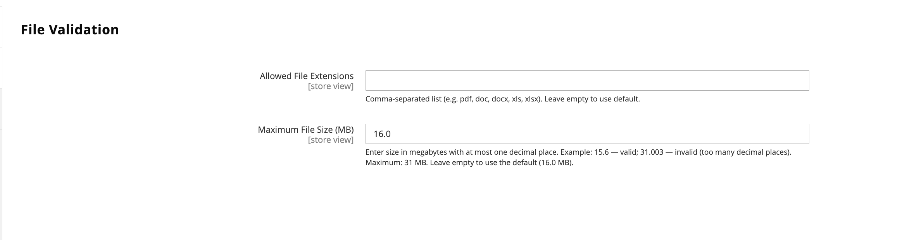

# [!UICONTROL Catalog] > [!UICONTROL Product File Attributes]

{{config}}

## [!UICONTROL Configure Allowed File Types and Size]

| 欄位 | [領域](../../getting-started/websites-stores-views.md#scope-settings) | 說明 |
|--- |--- |--- |
| [!UICONTROL Allowed File Extensions] | 全域 | 允許的檔案型別清單（以逗號分隔），例如`pdf,doc,docx,txt`。 留空將使用預設允許檔案型別：pdf、doc、docx、xls、xlsx、ppt、pptx、txt、csv、zip。 |
| [!UICONTROL Maximum File Size] | 全域 | 允許的檔案大小上限（以MB為單位），例如`20.0`。 預設限製為16 MB。 允許的最大檔案大小為31 MB。 |

{style="table-layout:auto"}
