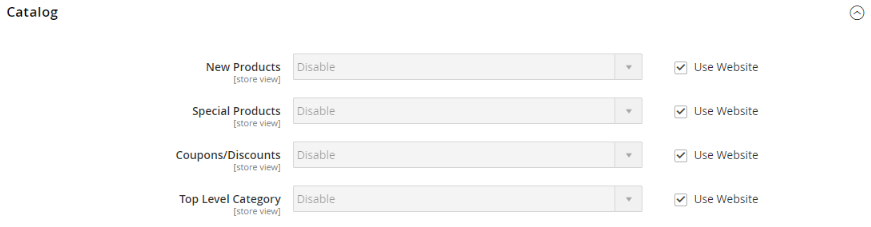

# [!UICONTROL Catalog] > [!UICONTROL RSS Feeds]

{{config}}

## [!UICONTROL Rss Config]

<!-- zoom -->

<!-- [Rss Config](https://experienceleague.adobe.com/zh-hant/docs/commerce-admin/marketing/communications/social-rss) -->

| 欄位 | [領域](../../getting-started/websites-stores-views.md#scope-settings) | 說明 |
|--- |--- |--- |
| [!UICONTROL Enable RSS] | 存放區檢視 | 讓客戶可以從商店接收RSS摘要。 |

{style="table-layout:auto"}

如需如何在啟用RSS摘要後使用這些摘要的詳細資訊，請參閱[社群媒體和RSS摘要](../../merchandising-promotions/social-rss.md)。

## [!UICONTROL Wish List]

<!-- zoom -->

<!-- [Wish List](https://experienceleague.adobe.com/zh-hant/docs/commerce-admin/stores-sales/shopper-tools/wish-lists/wishlists) -->

| 欄位 | [領域](../../getting-started/websites-stores-views.md#scope-settings) | 說明 |
|--- |--- |--- |
| [!UICONTROL Enable RSS] | 存放區檢視 | 啟用時，RSS摘要連結會出現在希望清單頁面的頂端。 該願望清單共用頁面包括一個核取方塊，客戶可選取它以從共用的願望清單連結到摘要。 |

{style="table-layout:auto"}

## [!UICONTROL Catalog]

<!-- zoom -->

<!-- [Catalog](https://experienceleague.adobe.com/zh-hant/docs/commerce-admin/catalog/catalog-menu) -->

| 欄位 | [領域](../../getting-started/websites-stores-views.md#scope-settings) | 說明 |
|--- |--- |--- |
| [!UICONTROL New Products] | 存放區檢視 | 啟用時，會發佈新增至商店目錄之新產品的通知。 |
| [!UICONTROL Special Products] | 存放區檢視 | 啟用時，會發佈任何有特殊定價之產品的通知。 |
| [!UICONTROL Coupons/Discounts] | 存放區檢視 | 啟用時，會發佈任何優惠券或折扣的通知。 |
| [!UICONTROL Top Level Category] | 存放區檢視 | 發佈目錄之最上層類別結構變更的通知，這會反映在主功能表中。 |

{style="table-layout:auto"}

## [!UICONTROL Order]

<!-- zoom -->

<!-- [Order](https://experienceleague.adobe.com/zh-hant/docs/commerce-admin/stores-sales/order-management/orders/order-status#notification) -->

| 欄位 | [領域](../../getting-started/websites-stores-views.md#scope-settings) | 說明 |
|--- |--- |--- |
| [!UICONTROL Customer Order Status Notification] | 存放區檢視 | 讓客戶能透過RSS摘要追蹤其訂單狀態。 啟用時，訂單上會顯示RSS摘要連結 |

{style="table-layout:auto"}
