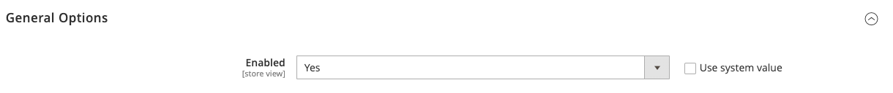

# [!UICONTROL Customers] > [!UICONTROL Newsletter]

{{config}}

>[!NOTE]
>
>電子報是行銷工具的一部分，可傳送新聞、折扣和其他行銷電子郵件給客戶。 註冊客戶可以從其[帳戶儀表板](../../customers/account-dashboard-my-account.md)管理其訂閱。

## [!UICONTROL General Options]

<!-- zoom -->

| 欄位 | [領域](../../getting-started/websites-stores-views.md#scope-settings) | 說明 |
|--- |--- |--- |
| [!UICONTROL Enabled] | 存放區檢視 | 決定是否為存放區檢視範圍啟用電子報。 選項： `Yes` / `No` |

{style="table-layout:auto"}

## [!UICONTROL Subscription Options]

<!-- zoom -->

<!-- [Subscription Options](https://experienceleague.adobe.com/en/docs/commerce-admin/marketing/communications/newsletters/newsletters) -->

| 欄位 | [領域](../../getting-started/websites-stores-views.md#scope-settings) | 說明 |
|--- |--- |--- |
| [!UICONTROL Allow Guest Subscription] | 存放區檢視 | 決定未註冊的來賓是否可以訂閱電子報。 選項： `Yes` / `No` |
| [!UICONTROL Need to Confirm] | 存放區檢視 | 決定是否必須確認訂閱要求。 這種雙重加入方法是一種驗證測量，可防止人們在未經同意的情況下進行訂閱。 選項： `Yes` / `No` |
| [!UICONTROL Confirmation Email Sender] | 存放區檢視 | 識別商店聯絡人，顯示為確認訂閱請求的電子郵件寄件者。 |
| [!UICONTROL Confirmation Email Template] | 存放區檢視 | 決定用於通知的電子郵件範本，以確認訂閱電子報的請求。 預設範本： `Newsletter subscription confirmation` |
| 成功電子郵件寄件者 | 存放區檢視 | 識別顯示為傳送給成功訂閱電子報之使用者的電子郵件寄件者的商店聯絡人。 |
| [!UICONTROL Success Email Template] | 存放區檢視 | 決定傳送給成功訂閱電子報之人員的通知所使用的電子郵件範本。 預設範本： `Newsletter subscription success` |
| [!UICONTROL Unsubscription Email Sender] | 存放區檢視 | 識別商店聯絡人，顯示為傳送給要求結束其電子報訂閱者的電子郵件的寄件者。 |
| [!UICONTROL Unsubscription Email Template] | 存放區檢視 | 決定傳送通知給要求結束其電子報訂閱者的電子郵件範本。 預設範本： `Newsletter unsubscription success` |

{style="table-layout:auto"}
