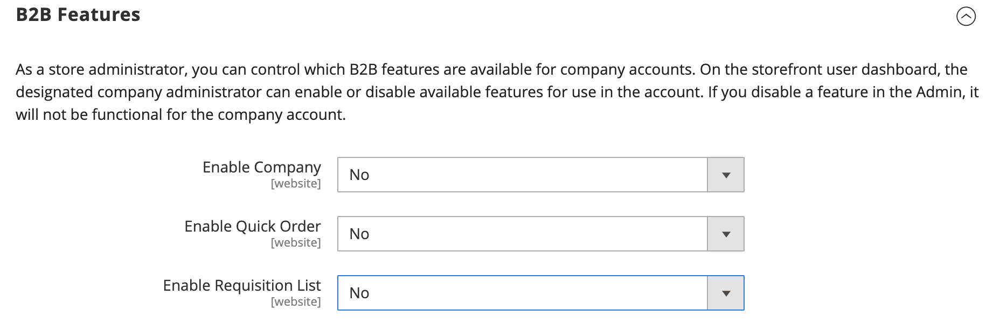

# [!UICONTROL General] > [!UICONTROL B2B Features]

{{b2b-feature}}

{{config}}

>[!TIP]
>
>安裝及啟用Adobe Commerce適用的B2B後，即可使用公司專屬的功能提供個人化的購買體驗。 Adobe Commerce適用的B2B是整合式解決方案，可支援B2B和B2C模型。 如需B2B功能的詳細資訊，請參閱 [_Adobe Commerce適用的B2B使用指南_](https://experienceleague.adobe.com/docs/commerce-admin/b2b/introduction.html).

## [!UICONTROL B2B Features]

<!-- zoom -->

| 欄位 | [範圍](../../getting-started/websites-stores-views.md#scope-settings) | 說明 |
|------- |----------------------------------------------------------------------- |------------ |
| [[!UICONTROL Enable Company]](../../b2b/account-companies.md) | 網站 | 啟用後，可讓客戶從其帳戶儀表板管理其公司指派，並依預設啟用「共用目錄」和「B2B報價」功能。 選項： `Yes` / `No` |
| [[!UICONTROL Enable Quick Order]](../../b2b/quick-order.md) | 網站 | 啟用後，可讓客戶和來賓根據SKU或產品名稱快速下訂單。 選項： `Yes` / `No` |
| [[!UICONTROL Enable Requisition List]](../../b2b/configure-requisition-lists.md) | 網站 | 啟用後，可讓客戶從其帳戶儀表板建立和管理請購單清單。 |

{style="table-layout:auto"}

<!-- zoom -->

啟用「公司」功能時，其他欄位可用於「共用目錄」和「B2B報價」。

| 欄位 | [範圍](../../getting-started/websites-stores-views.md#scope-settings) | 說明 |
|------- |----------------------------------------------------------------------- |------------ |
| [[!UICONTROL Enable Shared Catalog]](../../b2b/catalog-shared.md) | 網站 | 啟用後，即可使用自訂定價建立組織目錄，這些目錄可在全球範圍內使用，或僅限特定公司使用。 選項： `Yes` / `No` |
| [!UICONTROL Enable Shared Catalog direct products price assigning] | 網站 | 當 _[!UICONTROL Enable Shared Catalog]_欄位已設為 `Yes`，此選項可供使用。 啟用時，只有指派給共用目錄的產品才會儲存在價格索引中。 未指派給共用目錄的產品不會顯示在店面上。 選項： `Yes` / `No` |
| [[!UICONTROL Enable B2B Quote]](../../b2b/configure-quotes.md) | 網站 | 啟用後，可讓公司買家從購物車提交詢價。 選項： `Yes` / `No` |

{style="table-layout:auto"}

### [!UICONTROL Default B2B Payment Methods]

<!-- zoom -->

| 欄位 | [範圍](../../getting-started/websites-stores-views.md#scope-settings) | 說明 |
|------- |----------------------------------------------------------------------- |------------ |
| [!UICONTROL Applicable Payment Methods] | 全域 | 決定B2B買家可用的付款方式選擇。 選項： `All Payment Methods` / `Specific Payment Methods` |
| [!UICONTROL Payment Methods] | 全域 | 指定B2B買家可用的各種付款方式。 |

{style="table-layout:auto"}

### [!UICONTROL Default B2B Shipping Methods]

<!-- zoom -->

| 欄位 | [範圍](../../getting-started/websites-stores-views.md#scope-settings) | 說明 |
|------- |----------------------------------------------------------------------- |------------ |
| [!UICONTROL Applicable Shipping Methods] | 全域 | 決定預設可供B2B買家使用的送貨方式選項。 選項： `All Shipping Methods` / `Specific Shipping Methods` |
| [!UICONTROL Shipping Methods] | 全域 | 指定B2B買家預設可用的各種送貨方法。  **_注意：_**您也可以限制特定產品的送貨方法 [公司帳戶](../../b2b/account-companies.md). |

{style="table-layout:auto"}

## [!UICONTROL Order Approval Configuration]

<!-- zoom -->

| 欄位 | [範圍](../../getting-started/websites-stores-views.md#scope-settings) | 說明 |
|------- |----------------------------------------------------------------------- |------------ |
| [[!UICONTROL Enable Purchase Orders]](../../stores-purchase/purchase-order.md) | 網站 | 啟用時，可讓公司建立採購單。 選項： `Yes` / `No` |

{style="table-layout:auto"}

