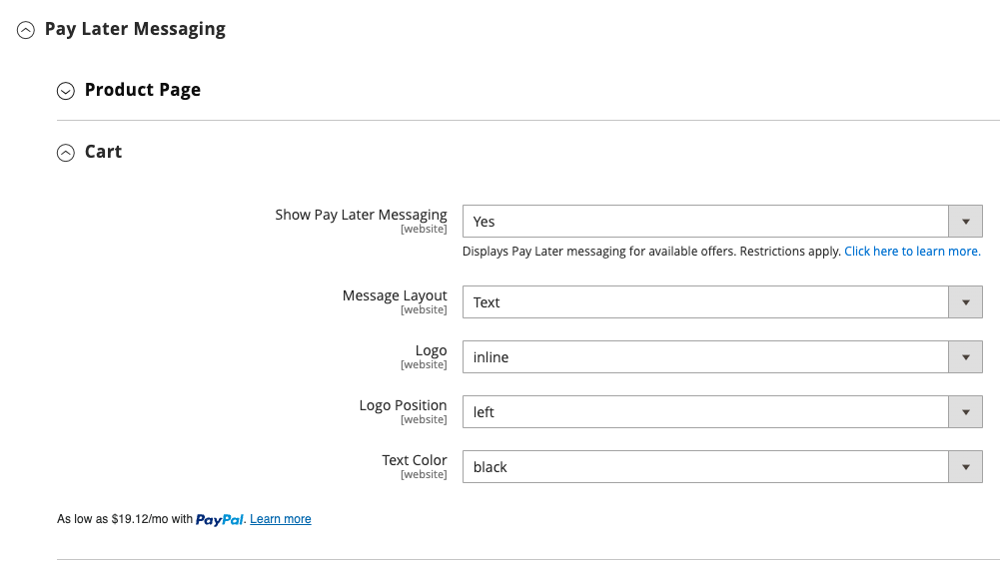

# [!UICONTROL Sales] > [!UICONTROL Payment Methods] > [!UICONTROL Braintree]

>[!IMPORTANT]
>
>**Commerce 2.4移轉：** 
>若是2.4.0之前的Adobe Commerce和Magento Open Source版本，建議商戶從[Commerce Marketplace](https://marketplace.magento.com/catalogsearch/result/?q=braintree)安裝並設定官方Braintree付款整合擴充功能，以取代核心整合。 截至2.4.0，擴充功能現已納入核心發行版本。
>  
>移轉至Commerce 2.4時，商家需要解除安裝散佈於市集（`paypal/module-braintree`或`gene/module-braintree`）上的擴充功能，並更新任何程式碼自訂，以使用`PayPal_Braintree`名稱空間而非`Magento_Braintree`。 Commerce的套件擴充功能中的組態設定和Commerce Marketplace上分散的擴充功能仍持續存在。 系統會正常擷取、作廢或退款的付款，連同這些版本的擴充功能一併放置。
>  
>如果您要升級至Commerce 2.4.0，而且未在先前的2.3.x版本中使用建議的Commerce Marketplace擴充功能，多位址功能在2.4.0版本的Braintree中無法運作。 當購物者選取&#x200B;_傳送至多個地址_&#x200B;時，Braintree付款方法未出現。 先前建議用於2.3.x的Commerce Marketplace擴充功能有多個位址問題。

{{config}}

>[!IMPORTANT]
>
>如果您需要有關卡片意外費用的協助，請造訪[取消訂閱](https://helpx.adobe.com/manage-account/using/cancel-subscription.html)頁面以取得協助。

## [!UICONTROL Basic Braintree Settings]

<!-- zoom -->

| 欄位 | [領域](../../getting-started/websites-stores-views.md#scope-settings) | 說明 |
|--- |--- |--- |
| [!UICONTROL Title] | 存放區檢視 | 預設值： `Credit Card` (Braintree) |
| [!UICONTROL Environment] | 存放區檢視 | 選項： `Sandbox` / `Production` |
| [!UICONTROL Payment Action] | 存放區檢視 | 決定Braintree在處理付款時採取的動作。 選項：  **`Authorize`**— 已授權客戶信用卡上的資金，但並未從帳戶轉帳。 系統會在您的商店管理員中建立訂單。 您稍後可以擷取銷售，並建立發票。 **`Intent Sale`** （先前版本中的`Authorize and Capture`） — 客戶信用卡上的資金已由Braintree授權並擷取，而訂單與發票是在您的商店管理員中建立。 |
| [!UICONTROL Sandbox Merchant ID] | 存放區檢視 | 這是您整個沙箱閘道帳戶的唯一識別碼。 也稱為&#x200B;_公用ID_&#x200B;或&#x200B;_生產ID_，您的商家識別碼在生產與沙箱閘道上不同。 當&#x200B;_[!UICONTROL Environment]_&#x200B;欄位設為`Sandbox`時，會顯示此欄位。 |
| [!UICONTROL Sandbox Public Key] | 存放區檢視 | 這是您的使用者專屬公用識別碼，可限制對加密資料的存取。 與您的沙箱Braintree閘道關聯的每個使用者都有各自的沙箱公開金鑰。 當&#x200B;_[!UICONTROL Environment]_&#x200B;欄位設為`Sandbox`時，會顯示此欄位。 |
| [!UICONTROL Sandbox Private Key] | 存放區檢視 | 這是您的使用者專屬私人識別碼，可限制對加密資料的存取。 與您的沙箱Braintree閘道關聯的每個使用者都有各自的沙箱私密金鑰。 當&#x200B;_[!UICONTROL Environment]_&#x200B;欄位設為`Sandbox`時，會顯示此欄位。 |
| [!UICONTROL Merchant ID] | 存放區檢視 | 這是您整個閘道帳戶的唯一識別碼，包括閘道中可能存在的多個商家帳戶。 也稱為&#x200B;_公用ID_&#x200B;或&#x200B;_生產ID_，您的商家識別碼在生產與沙箱閘道上不同。 當&#x200B;_[!UICONTROL Environment]_&#x200B;欄位設為`Production`時，會顯示此欄位。 |
| [!UICONTROL Public Key] | 存放區檢視 | 這是您的使用者專屬公用識別碼，可限制對加密資料的存取。 與您的Braintree閘道關聯的每個使用者都有各自的公開金鑰。 當&#x200B;_[!UICONTROL Environment]_&#x200B;欄位設為`Production`時，會顯示此欄位。 |
| [!UICONTROL Private Key] | 存放區檢視 | 這是您的使用者專屬私人識別碼，可限制對加密資料的存取。 與您的Braintree閘道關聯的每個使用者都有各自的私密金鑰。 當&#x200B;_[!UICONTROL Environment]_&#x200B;欄位設為`Production`時，會顯示此欄位。 |
| [!UICONTROL Enable Card Payments] | 網站 | 判斷客戶是否可使用Braintree信用卡付款方式作為付款方式。 選項： `Yes` / `No` |
| [!UICONTROL Enable Vault for Card Payments] | 網站 | 啟用後，可為客戶付款資訊提供安全的儲存空間，因此客戶不必在每次購買時都重新輸入信用卡資訊。 選項： `Yes` / `No` |
| [!UICONTROL Enable Vault CVV Re-verification] | 網站 | 啟用後，將會在您的Braintree帳戶中對CVV規則設定進行驗證。 選項： `Yes` / `No` |

{style="table-layout:auto"}

## [!UICONTROL Advanced Braintree Settings]

{width="550" zoomable="yes"}

| 欄位 | [領域](../../getting-started/websites-stores-views.md#scope-settings) | 說明 |
|--- |--- |--- |
| [!UICONTROL Vault Title] | 網站 | 描述性標題供您參考，可識別儲存客戶卡資訊的儲存庫。 |
| [!UICONTROL Merchant Account ID] | 網站 | 與此網站的Braintree交易相關聯的商家帳戶ID。 如果保留為空白，則會使用您Braintree帳戶的預設商家帳戶。 |
| [!UICONTROL Enable Checkout Express Payments] | 網站 | 在結帳程式開始時使用「快速付款」選項(包括PayPal、PayLater、Apple Pay和Google Pay)，提供更快速的結帳體驗。 選項： `Yes` / `No` |
| [!UICONTROL Skip Fraud Checks on Admin Orders] | 網站 | 防止在透過管理員下單的訂單上，當交易設為`Yes`時，傳送交易以進行評估作為[!DNL Advanced Fraud Tools]檢查的一部分。 選項： `Yes` / `No` |
| [!UICONTROL Bypass Fraud Protection Threshold] | 網站 | 當達到或超過臨界值時，會略過`Advanced Fraud Protection`個檢查。 將此欄位保留空白會停用此選項。 |
| [!UICONTROL Debug] | 網站 | 決定Braintree系統與商店之間的通訊是否記錄到記錄檔案中。 選項： `Yes` / `No` |
| [!UICONTROL CVV Verification] | 網站 | 決定是否要求客戶從信用卡背面提供三位數安全碼。 選項： `Yes` / `No` |
| [!UICONTROL Send Card Line Items] | 網站 | 傳送所有付款方式的購物車明細專案。 選項： `Yes` / `No` |
| [!UICONTROL Credit Card Types] | 網站 | 指定您接受透過Braintree付款的每一張信用卡。 按住`Ctrl` (或Mac上的`Command`)以選取卡片組合。 選項： `American Express` / `Visa` / `MasterCard` / `Discover` / `JCB` / `Diners` / `Maestro International` |
| [!UICONTROL Sort Order] | 網站 | 決定結帳期間Braintree與其他付款方法一起列出的順序。 |

## [!UICONTROL Braintree Webhooks Settings]

<!-- zoom -->

| 欄位 | [領域](../../getting-started/websites-stores-views.md#scope-settings) | 說明 |
|--- |--- |--- |
| [!UICONTROL Enable Webhook] | 網站 | 啟用webhook功能以進行詐騙保護、ACH付款、當地付款方法和爭議。 選項： `Yes` / `No` |
| [!UICONTROL Fraud Protection URL] | 網站 | 將此URL新增至您的Braintree帳戶，做為[!UICONTROL Webhook Destination URL]。 **此URL必須是安全且可供公開存取。** |
| [!UICONTROL Fraud Protection Approve Order Status] | 網站 | 當Braintree核准防欺詐功能時，系統會將選取的訂單狀態指派給Commerce訂單。 此狀態是用來更新使用ACH付款方式的訂單狀態以及在Braintree中移至`SETTLED`時的訂單狀態。 |
| [!UICONTROL Fraud Protection Reject Order Status] | 網站 | 當Braintree拒絕詐騙保護時，則會將選取的訂單狀態指派給Commerce訂單。 此狀態是用來更新使用ACH付款方式且當`SETTLEMENT`在Braintree中為`DECLINED`時的訂單狀態。 |

{style="table-layout:auto"}

## [!UICONTROL Country Specific Settings]

<!-- zoom -->

| 欄位 | [領域](../../getting-started/websites-stores-views.md#scope-settings) | 說明 |
|--- |--- |--- |
| [!UICONTROL Payment from Applicable Countries] | 網站 | 決定您是接受Braintree從所有國家/地區處理的付款，還是僅接受特定國家/地區的付款。 選項： `All Allowed Countries` / `Specific Countries` |
| [!UICONTROL Payment from Specific Countries] | 網站 | 如果適用，會識別您接受Braintree所處理付款的特定國家/地區。 |
| [!UICONTROL Country Specific Credit Card Types] | 網站 | 識別每個國家/地區針對Braintree處理的付款所接受的信用卡。 系統會為每個國家/地區儲存記錄。 選項：  **`Country`**— 選擇國家/地區。 **`Allowed Card Types`** — 選取從國家/地區接受以透過Braintree付款的每個信用卡。  **`Add`**— 新增其他國家/地區的信用卡額度。 **`Action`** — 刪除國家/地區允許的信用卡記錄。 |

{style="table-layout:auto"}

## [!UICONTROL ACH through Braintree]

透過Braintree<!-- zoom -->

| 欄位 | [領域](../../getting-started/websites-stores-views.md#scope-settings) | 說明 |
|--- |--- |--- |
| [!UICONTROL Enabled ACH Direct Debit] | 網站 | 決定是否透過Braintree將[!DNL ACH Direct Debit]納入為付款方式。 選項： `Yes` / `No` |
| [!UICONTROL Enable Vault for ACH Direct Debit] | 網站 | 客戶可以儲存/儲存單次使用的ACH Direct Debit支付方式，以供日後使用。 一旦付款明細存入儲存庫，客戶就可以使用ACH Direct Debit付款方式，無需重新輸入資料或重新驗證其付款資訊。 選項： `Yes` / `No` |
| [!UICONTROL Sort Order] | 網站 | 決定[!DNL ACH Direct Debit]在結帳期間與其他付款方法一起列出的順序。 |

{style="table-layout:auto"}

## [!UICONTROL Apple Pay through Braintree]

<!-- zoom -->

| 欄位 | [領域](../../getting-started/websites-stores-views.md#scope-settings) | 說明 |
|--- |--- |--- |
| [!UICONTROL Enable ApplePay through Braintree] | 網站 | 決定是否透過Braintree將Apple Pay納入付款方式。 選項： `Yes` / `No`   網域必須先在Braintree帳戶中通過[驗證](https://developer.paypal.com/braintree/docs/guides/apple-pay/configuration/javascript/v3)。 |
| [!UICONTROL Enable Vault for ApplePay] | 網站 | 客戶可以儲存/儲存其Apple Pay付款方式，以供日後使用。 一旦付款詳細資料存入儲存庫，客戶就可以使用Apple Pay，無需重新輸入資料或重新驗證其付款資訊。 選項： `Yes` / `No` |
| [!UICONTROL Payment Action] | 網站 | 決定Braintree在處理付款時採取的動作。 選項：  **`Authorize`**— 已授權客戶卡上的資金，但並未從客戶帳戶轉帳。 系統會在您的商店管理員中建立訂單。 您稍後可以擷取銷售，並建立發票。 **`Intent Sale`** — 客戶卡上的資金已由Braintree授權並擷取，且訂單與發票會在您的商店管理員中建立。 **_注意：_**&#x200B;在2.3.x和更早版本中，這是`Authorize and Capture`。 |
| [!UICONTROL Merchant Name] | 存放區檢視 | 顯示在ApplePay快顯視窗中的標籤給客戶。 |
| [!UICONTROL Sort Order] | 網站 | 決定結帳期間Apple Pay與其他付款方法一起列出的順序。 |

{style="table-layout:auto"}

## [!UICONTROL Local Payment Methods]

<!-- zoom -->

| 欄位 | [領域](../../getting-started/websites-stores-views.md#scope-settings) | 說明 |
|--- |--- |--- |
| [!UICONTROL Enabled Local Payment Methods] | 網站 | 決定是否透過Braintree將本地付款方式納入付款方式。 選項： `Yes` / `No` |
| [!UICONTROL Title] | 網站 | 顯示在結帳付款方式區段上的標籤。 預設值： `Local Payments` |
| [!UICONTROL Fallback Button Text] | 網站 | 輸入要用於按鈕的文字，該按鈕會顯示在將客戶帶回網站的遞補Braintree頁面上。 預設值： `Complete Checkout` |
| [!UICONTROL Redirect on Fail] | 網站 | 指定當本機付款方式交易取消、失敗或發生錯誤時，應該將客戶重新導向的URL。 它應該是結帳付款頁面（例如，`https://www.domain.com/checkout#payment`）。 |
| [!UICONTROL Allowed Payment Method] | 網站 | 選取要啟用的本機「付款」方式。 選項： `Bancontact` / `EPS` / `iDeal` / `MyBank` / `P24` / `SEPA/ELV Direct Debit` |
| [!UICONTROL Sort Order] | 網站 | 決定結帳期間本機付款方式與其他付款方式一起列出的順序。 |

{style="table-layout:auto"}

>[!NOTE]
>
>套件式Braintree擴充功能不支援[Braintree開發人員檔案](https://developer.paypal.com/braintree/docs/guides/local-payment-methods/overview)中列出的所有本機付款方法。 正在開發其他本機付款方法，未來版本將支援這些方法。

## [!UICONTROL GooglePay through Braintree]

透過Braintree<!-- zoom -->

| 欄位 | [領域](../../getting-started/websites-stores-views.md#scope-settings) | 說明 |
|--- |--- |--- |
| [!UICONTROL Enabled GooglePay through Braintree] | 網站 | 決定是否透過Braintree將[!DNL Google Pay]付款包含為付款方式。 選項： `Yes` / `No` |
| [!UICONTROL Enable Vault for GooglePay] | 網站 | 客戶可以儲存/儲存其Google Pay付款方式，以供日後使用。 一旦付款詳細資料存入儲存庫，客戶就可以使用Google Pay，無需重新輸入資料或重新驗證其付款資訊。 選項： `Yes` / `No` |
| [!UICONTROL Payment Action] | 網站 | 決定Braintree在處理付款時採取的動作。 選項：  **`Authorize`**— 已授權客戶卡上的資金，但並未從客戶帳戶轉帳。 系統會在您的商店管理員中建立訂單。 您稍後可以擷取銷售，並建立發票。 **`Intent Sale`** — 客戶卡上的資金已由Braintree授權並擷取，且訂單與發票會在您的商店管理員中建立。 **_注意：_**&#x200B;在2.3.x和更早版本中，這是`Authorize and Capture`。 |
| [!UICONTROL Button Color] | 網站 | 決定[!DNL Google Pay]按鈕的色彩。 選項： `White` / `Black` |
| [!UICONTROL Merchant ID] | 存放區檢視 | 必須在這裡輸入Google提供的ID。 |
| [!UICONTROL Accepted Cards] | 網站 | 選取客戶可以使用[!DNL Google Pay]下訂單的卡片型別。 |
| [!UICONTROL Sort Order] | 網站 | 決定結帳期間Google Pay與其他付款方法一起列出的順序。 |

{style="table-layout:auto"}

## [!UICONTROL Venmo through Braintree]

<!-- zoom -->

| 欄位 | [領域](../../getting-started/websites-stores-views.md#scope-settings) | 說明 |
|--- |--- |--- |
| [!UICONTROL Enable Venmo through Braintree] | 網站 | 決定是否透過Braintree將[!DNL Venmo]納入為付款方式。 選項： `Yes` / `No` |
| [!UICONTROL Enable Vault for Venmo] | 網站 | 客戶可以儲存/儲存他們的Venmo付款方式，以供日後使用。 一旦付款明細存入儲存庫，客戶就可以使用「Venmo」付款方式，而不需重新輸入資料或重新驗證其付款資訊。 選項： `Yes` / `No` |
| [!UICONTROL Payment Action] | 網站 | 決定Braintree在處理付款時採取的動作。 選項：  **`Authorize`**— 已授權客戶卡上的資金，但並未從客戶帳戶轉帳。 系統會在您的商店管理員中建立訂單。 您稍後可以擷取銷售，並建立發票。 **`Intent Sale`** — 客戶卡上的資金已由Braintree授權並擷取，且訂單與發票會在您的商店管理員中建立。 **_注意：_**&#x200B;這是2.3.x和更早版本中的&#x200B;_授權和擷取_。 |
| [!UICONTROL Sort Order] | 網站 | 決定結帳期間Venmo與其他付款方法一起列出的順序。 |

{style="table-layout:auto"}

## [!UICONTROL PayPal through Braintree]

{width="550" zoomable="yes"}
{width="550" zoomable="yes"}

| 欄位 | [領域](../../getting-started/websites-stores-views.md#scope-settings) | 說明 |
|--- |--- |--- |
| [!UICONTROL Enable PayPal through Braintree] | 網站 | 決定是否透過Braintree將PayPal納入付款方式。 選項： `Yes` / `No` |
| [!UICONTROL Enable PayPal Credit through Braintree] | 網站 | 決定是否要透過Braintree將PayPal點數納入為付款方式。 選項： `Yes` / `No`。 當`Enable PayPal through Braintree`設定為`Yes`時，此欄位會顯示 |
| [!UICONTROL Enable PayPal PayLater through Braintree] | 網站 | 決定是否透過Braintree將PayPal PayLater納入為付款方式。 選項： `Yes` / `No`。 當`Enable PayPal through Braintree`設定為`Yes`時，此欄位會顯示 |
| [!UICONTROL Title] | 存放區檢視 | 在結帳時透過Braintree向客戶識別PayPal的標籤。 預設值： `PayPal` |
| [!UICONTROL Vault Enabled] | 網站 | 啟用後，可為客戶付款資訊提供安全的儲存，因此客戶不必在每次購買時都重新輸入其PayPal資訊。 選項： `Yes` / `No` |
| [!UICONTROL Send Cart Line Items for PayPal] | 網站 | 將明細專案（訂購專案）連同禮品卡、專案禮品包裝、訂購禮品包裝、商店退款、送貨和稅捐一起傳送至PayPal。 選項： `Yes` / `No` |
| [!UICONTROL Sort Order] | 網站 | 一個數字，可決定PayPal透過Braintree在結帳期間與其他付款方式一起列出的順序。 |
| [!UICONTROL Override Merchant Name] | 存放區檢視 | 可用來針對每個商店檢視識別商家的其他名稱。 |
| [!UICONTROL Payment Action] | 網站 | 決定PayPal在處理付款時透過Braintree採取的動作。 選項：  **`Authorize`**— 已授權客戶卡上的資金，但並未從客戶帳戶轉帳。 系統會在您的商店管理員中建立訂單。 您稍後可以擷取銷售，並建立發票。 **`Authorize and Capture`** — 客戶卡上的資金已由PayPal透過Braintree授權並擷取，且訂單與發票會在您的商店管理員中建立。 |
| [!UICONTROL Payment from Applicable Countries] | 網站 | 決定您是接受PayPal透過Braintree從所有國家/地區處理的付款，還是僅接受特定國家/地區的付款。 選項： `All Allowed Countries` / `Specific Countries` |
| [!UICONTROL Payment from Specific Countries] | 網站 | 如果適用，會識別您接受Braintree所處理付款的特定國家/地區。 |
| [!UICONTROL Require Customer's Billing Address] | 網站 | 決定是否需要客戶的帳單地址才能提交訂單。 選項： `Yes` / `No` |
| [!UICONTROL Skip Order Review Step] | 網站 | 決定是否要在完成付款前將客戶重新導向至複查頁面。 選項： `Yes` / `No` |
| [!UICONTROL Debug] | 網站 | 判斷PayPal透過Braintree系統與您的商店之間的通訊是否記錄到記錄檔中。 選項： `Yes` / `No` |
| [!UICONTROL Display on Shopping Cart] | 網站 | 決定PayPal按鈕是否出現在[迷你購物車](../../stores-purchase/cart-configuration.md#mini-cart)和[購物車](../../stores-purchase/cart.md)頁面上。 選項： `Yes` / `No` |
| [!UICONTROL Send Package Tracking] | 網站 | 套件追蹤資訊只會針對PayPal交易/訂單傳送至PayPal。 您必須啟用[!UICONTROL Send Cart Line Items for PayPal]設定欄位，[!UICONTROL Package Tracking]功能才能正常運作。 選項： `Yes` / `No` |
| [!UICONTROL Use PayPal's "Notify Payer" functionality] | 網站 | 一旦設定為「是」，PayPal就會通知採購員或付款人，告知其包裹追蹤更新。 選項： `Yes` / `No` |

{style="table-layout:auto"}

>[!NOTE]
>
>可以啟用&#x200B;**[!DNL PayPal Credit]**&#x200B;或&#x200B;**[!DNL PayPal PayLater]**。 無法同時啟用這兩種方法。

### [!UICONTROL Styling]

<!-- zoom -->

| 欄位 | [領域](../../getting-started/websites-stores-views.md#scope-settings) | 說明 |
|--- |--- |--- |
| [!UICONTROL Location] | 網站 | 決定PayPal按鈕和訊息在店面上的呈現位置。 選項： `Mini-Cart and Cart Page` / `Checkout Page` / `Product Page` |

{style="table-layout:auto"}

**[!UICONTROL Mini-Cart and Cart Page]**

此區段中的選項和設定會根據&#x200B;_[!UICONTROL Location]_&#x200B;欄位中的設定而有所不同。

| 欄位 | [領域](../../getting-started/websites-stores-views.md#scope-settings) | 說明 |
|--- |--- |--- |
| [!UICONTROL PayPal Button Type] | 網站 | 將按鈕設定為下列三種型別之一： `PayPal Button` / `PayPal Pay Later Button` / `PayPal Credit Button` |

**[!UICONTROL PayPal Button]**

此區段中的選項和設定會根據在&#x200B;_[!UICONTROL PayPal Button Type]_&#x200B;欄位中選取的按鈕型別而有所不同。

| 欄位 | [領域](../../getting-started/websites-stores-views.md#scope-settings) | 說明 |
|--- |--- |--- |
| [!UICONTROL Show PayPal Button] | 網站 | 決定PayPal按鈕在選取位置上的位置。 選項： `Yes` / `No` |
| [!UICONTROL Button Label] | 網站 | 決定PayPal按鈕的標籤。 選項： `Paypal` / `Checkout` / `Buy Now` / `Pay` |
| [!UICONTROL Color] | 網站 | 決定PayPal按鈕的色彩。 選項： `Blue` / `Black` / `Gold` / `Silver` |
| [!UICONTROL Shape] | 網站 | 決定PayPal按鈕的形狀。 選項： `Pill` / `Rectangle` |
| [!UICONTROL Size(Deprecated)] | 網站 | 決定PayPal按鈕的大小。 選項： `Medium` / `Large` / `Responsive` |

{style="table-layout:auto"}

>[!NOTE]
>
>**[!DNL Size(Deprecated)]**&#x200B;設定欄位已過時，未用來設定PayPal按鈕的樣式。

設定這些選項後，您可以看到PayPal按鈕和PayLater訊息的預覽。 有些控制項可用來套用設定或重設值：

| 欄位 | [領域](../../getting-started/websites-stores-views.md#scope-settings) | 說明 |
|--- |--- |--- |
| [!UICONTROL Apply] | 網站 | 儲存按鈕和PayLater訊息的選取樣式設定，並將它們套用至目前位置和目前的按鈕型別。 |
| [!UICONTROL Apply to All Buttons] | 網站 | 儲存按鈕和PayLater訊息值的所選樣式設定，並將它們套用至所有按鈕型別和位置。 |
| [!UICONTROL Reset to Recommended Defaults] | 網站 | 將樣式設定傳回至按鈕和PayLater訊息的建議預設值，並將其套用至所有按鈕型別和位置。 |

{style="table-layout:auto"}

## [!UICONTROL Pay Later Messaging]

**[!UICONTROL Product Page]**

<!-- zoom -->

| 欄位 | [領域](../../getting-started/websites-stores-views.md#scope-settings) | 說明 |
|--- |--- |------------------------------------------------------------------------------------------------------------------------------------------------------------------------------------------------------------------------------------------|
| [!UICONTROL Show PayLater Messaging] | 網站 | 在選取的位置啟用PayLater訊息。 選項： `Yes` / `No`。 顯示可用優惠的「稍後付款」訊息。 限制適用。 [按一下這裡以瞭解更多資訊。](https://developer.paypal.com/studio/checkout/pay-later/us) |
| [!UICONTROL Message Layout] | 網站 | 決定PayLater訊息配置。 選項： `Text` / `Flex` |
| [!UICONTROL Logo] | 網站 | 決定稍後付款訊息使用的標誌型別。 選項： `Inline` / `Primary` / `Alternative` / `None` |
| [!UICONTROL Logo Position] | 網站 | 決定稍後付款訊息的標誌位置。 選項： `Left` / `Right` / `Top` |
| [!UICONTROL Text Color] | 網站 | 決定「稍後付款」訊息的文字色彩。 選項： `Black` / `White` / `Monochrome` / `Grayscale` |

{style="table-layout:auto"}

**[!UICONTROL Cart]**

<!-- zoom -->

| 欄位 | [領域](../../getting-started/websites-stores-views.md#scope-settings) | 說明 |
|--- |--- |------------------------------------------------------------------------------------------------------------------------------------------------------------------------------------------------------------------------------------------|
| [!UICONTROL Show PayLater Messaging] | 網站 | 在選取的位置啟用PayLater訊息。 選項： `Yes` / `No`。 顯示可用優惠的「稍後付款」訊息。 限制適用。 [按一下這裡以瞭解更多資訊。](https://developer.paypal.com/studio/checkout/pay-later/us) |
| [!UICONTROL Message Layout] | 網站 | 決定PayLater訊息配置。 選項： `Text` / `Flex` |
| [!UICONTROL Logo] | 網站 | 決定稍後付款訊息使用的標誌型別。 選項： `Inline` / `Primary` / `Alternative` / `None` |
| [!UICONTROL Logo Position] | 網站 | 決定稍後付款訊息的標誌位置。 選項： `Left` / `Right` / `Top` |
| [!UICONTROL Text Color] | 網站 | 決定「稍後付款」訊息的文字色彩。 選項： `Black` / `White` / `Monochrome` / `Grayscale` |

{style="table-layout:auto"}

**[!UICONTROL Checkout]**

<!-- zoom -->

| 欄位 | [領域](../../getting-started/websites-stores-views.md#scope-settings) | 說明 |
|--------------------------------------|--- |-------------------------------------------------------------------------------------------------------------------------------------------------------------------------------------------------------------------------------------------|
| [!UICONTROL Show PayLater Messaging] | 網站 | 在選取的位置啟用PayLater訊息。 選項： `Yes` / `No`。 顯示可用優惠的「稍後付款」訊息。 限制適用。 [按一下這裡以瞭解更多資訊。](https://developer.paypal.com/studio/checkout/pay-later/us) |
| [!UICONTROL Text Align] | 網站 | 決定PayLater訊息配置。 選項： `Left` / `Center` / `Right` |
| [!UICONTROL Text Color] | 網站 | 決定「稍後付款」訊息的文字色彩。 選項： `Black` / `White` |

{style="table-layout:auto"}

## 3d安全驗證設定

<!-- zoom -->

| 欄位 | [領域](../../getting-started/websites-stores-views.md#scope-settings) | 說明 |
|--- |--- |--- |
| [!UICONTROL 3D Secure Verification] | 網站 | 決定當客戶註冊如&#x200B;_由VISA驗證_&#x200B;的方案時，交易是否必須通過額外的驗證程式。 選項： `Yes` / `No` |
| [!UICONTROL Always request 3DS] | 網站 | 始終對所有交易挑戰3D Secure要求。 選項： `Yes` / `No` |
| [!UICONTROL Threshold Amount] | 網站 | 決定單一訂單上授權處理的最大訂單金額。 如果訂單金額超過此臨界值，Braintree會拒絕授權。 |
| [!UICONTROL Verify for Applicable Countries] | 網站 | 決定必須驗證付款的國家/地區。 選項： `All Allowed Countries` / `Specific Countries` |
| [!UICONTROL Verify for Specific Countries] | 網站 | 如果適用，可識別必須驗證Braintree付款的特定國家/地區。 |

{style="table-layout:auto"}

## [!UICONTROL Dynamic Descriptors]

<!-- zoom -->

| 欄位 | [領域](../../getting-started/websites-stores-views.md#scope-settings) | 說明 |
|--- |--- |--- |
| [!UICONTROL Name] | 存放區檢視 | 名稱描述項分為兩部分，以星號(*)分隔。 描述項的第一部分會識別公司或DBA，而第二部分則會識別產品。 例如： `company*myproduct`   描述項的公司和產品部分的長度可依下列方式配置，合併長度最多為22個字元：  **`Option 1`**— 公司必須是3個字元/產品最多可以是18個字元 **`Option 2`** — 公司必須是7個字元/產品最多可以是14個字元&#x200B; **`Option 3`**— 公司必須是12個字元/產品最多可以是9個字元 |
| [!UICONTROL Phone] | 存放區檢視 | 電話描述元的長度必須是10到14個字元，而且只能包含數字、破折號、括弧和句點。 例如： `9999999999` `(999) 999-9999` `999.999.9999` |
| [!UICONTROL URL] | 存放區檢視 | URL描述項代表您的網域名稱，長度最多可達13個字元。 例如： `company.com` |

{style="table-layout:auto"}
