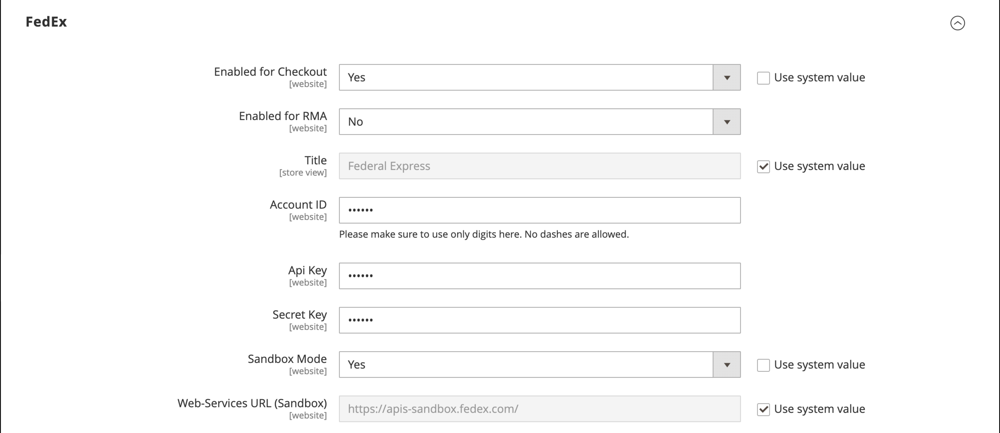
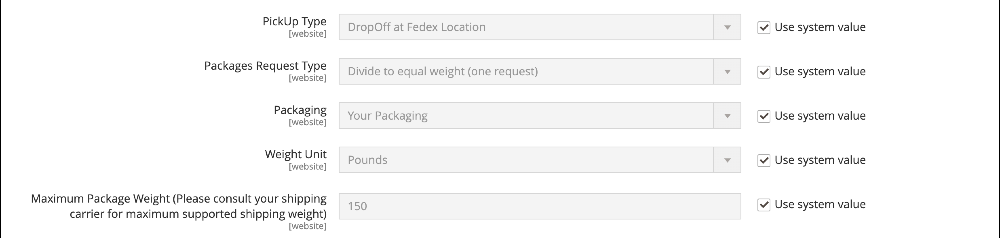
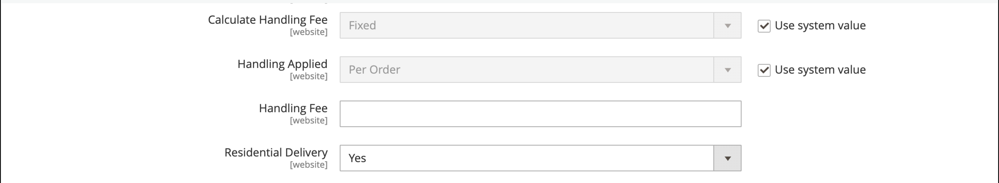

# [!UICONTROL Sales] > [!UICONTROL Delivery Methods]

{{config}}

## [!UICONTROL Basic Delivery Methods]

### [!UICONTROL Flat Rate]

<!-- zoom -->

<!-- [Flat Rate](https://experienceleague.adobe.com/zh-hant/docs/commerce-admin/stores-sales/delivery/basic-methods/shipping-flat-rate) -->

| 欄位 | [領域](../../getting-started/websites-stores-views.md#scope-settings) | 說明 |
|--- |--- |--- |
| [!UICONTROL Enabled] | 網站 | 啟用時，「統一費率」會在購物車的&#x200B;_預估運費和稅金_&#x200B;區段中，以及在結帳期間的&#x200B;_運費_&#x200B;區段中顯示為選項。 選項： `Yes` / `No` |
| [!UICONTROL Title] | 存放區檢視 | 結帳時用於此送貨方法的名稱。 |
| [!UICONTROL Method Name] | 存放區檢視 | 說明用於產生出貨估計的計算方法的名稱。 方法名稱會出現在購物車中經過計算的預估比率旁。 預設值為`Fixed`。 |
| [!UICONTROL Type] | 網站 | 說明用來決定固定匯率的計算型別。 選項：  **`None`**— 不使用計算。 將「統一運費」設定為零，這等同於免運費。 **`Per Order`** — 對整個訂單收取單一固定費用。  **`Per Item`**— 對購物車中的每個專案收取個別的統一費率。 即使總數量包含不同料號的組合，比率也會乘以購物車中的料號數量。 |
| [!UICONTROL Price] | 網站 | 您向客戶收取固定運費的價格。 |
| [!UICONTROL Calculate Handling Fee] | 網站 | 決定如何計算手續費（若包含）。 選項： `Fixed` / `Percent` |
| [!UICONTROL Handling Fee] | 網站 | 根據您選擇用來計算金額的方法，輸入處理費的金額。 例如，如果費用是以固定費用為基礎，則以小數點輸入金額，例如4.90。不過，如果處理費是以訂單的百分比為基準，請以百分比輸入金額。 例如，如果您要收取訂單的6%費用，請輸入值為`.06`。 |
| [!UICONTROL Displayed Error Message] | 存放區檢視 | 如果客戶選擇「統一費率」，但因某些原因無法使用此方法，則會顯示的訊息。 |
| [!UICONTROL Ship to Applicable Countries] | 網站 | 識別您提供統一費率送貨的國家/地區。 選項：  **`All Allowed Countries`**— 來自在商店組態中指定的任何國家/地區的客戶可以使用統一運費。 **`Specific Countries`** — 僅特定國家/地區的客戶可以使用統一費率運送。 |
| [!UICONTROL Ship to Specific Countries] | 網站 | 識別客戶可使用統一費率送貨的每個國家/地區。 |
| [!UICONTROL Show Method if Not Applicable] | 網站 | 若方法不適用於購買，則決定結帳期間是否顯示「統一費率」為選項。 選項： `Yes` / `No` |
| [!UICONTROL Sort Order] | 網站 | 一個數字，可決定結帳期間與其他傳遞方式一起列出「統一費率」時的顯示順序。 |

{style="table-layout:auto"}

### [!UICONTROL Free Shipping]

<!-- zoom -->

<!-- [Free Shipping](https://experienceleague.adobe.com/zh-hant/docs/commerce-admin/stores-sales/delivery/basic-methods/shipping-free) -->

| 欄位 | [領域](../../getting-started/websites-stores-views.md#scope-settings) | 說明 |
|--- |--- |--- |
| [!UICONTROL Enabled] | 網站 | 啟用後，結帳時「免運費」會顯示為「運送」區段中的一個選項。 選項： `Yes` / `No` |
| [!UICONTROL Title] | 存放區檢視 | 結帳時用於此送貨方法的名稱。 |
| 方法名稱 | 存放區檢視 | 說明用於產生出貨估計的計算方法的名稱。 方法名稱會出現在購物車中經過計算的預估比率旁。 預設值為`Free`。 |
| 最小訂購金額 | 網站 | 套用「免運費」至訂單所需的最低購買量。 |
| 包含稅捐目標金額 | 網站 | 決定稅捐是否包含在「最小訂單金額」計算中。 選項：  **是** — 計算最小訂單金額時包含稅捐（小計+稅捐 — 折扣）。 **否** — 計算最小訂單金額（小計 — 折扣）時不含稅捐。 |
| 顯示的錯誤訊息 | 存放區檢視 | 如果客戶選擇「免運費」，但因某些原因無法使用方法，則會顯示的訊息。 |
| 送貨至適用國家/地區 | 網站 | 識別您提供免運費的國家/地區。 選項：  **所有允許的國家/地區** — 來自商店組態中指定的任何國家/地區的客戶可以使用免運費。  **特定國家/地區** — 僅特定國家/地區的客戶可使用免運費。 |
| 送貨至特定國家 | 網站 | 識別客戶可使用免費送貨的每個國家/地區。 |
| 顯示方法（若不適用） | 網站 | 若方法不適用於購買，則決定結帳期間是否顯示「免運費」為選項。 選項： `Yes` / `No` |
| [!UICONTROL Sort Order] | 網站 | 此編號可決定「免運費」在結帳期間與其他交貨方式一起列出時的顯示順序。 |

{style="table-layout:auto"}

### [!UICONTROL Table Rates]

<!-- zoom -->

<!-- [Table Rates](https://experienceleague.adobe.com/zh-hant/docs/commerce-admin/stores-sales/delivery/basic-methods/shipping-table-rate) -->

| 欄位 | [領域](../../getting-started/websites-stores-views.md#scope-settings) | 說明 |
|--- |--- |--- |
| [!UICONTROL Enabled] | 網站 | 啟用後，表格費率會在購物車的「預估運費和稅金」區段中，以及在結帳期間的「運費」區段中顯示為選項。 選項： `Yes` / `No` |
| [!UICONTROL Title] | 存放區檢視 | 結帳時用於此送貨方法的名稱。 |
| 方法名稱 | 存放區檢視 | 說明用於產生出貨估計的計算方法的名稱。 方法名稱會出現在購物車中經過計算的預估比率旁。 預設值為`Table Rate`。 |
| [!UICONTROL Condition] | 網站 | 決定計算所依據的條件。 上傳的CSV檔案格式特定於每個條件。 選項： `Weight vs. Destination` / `Price vs. Destination` / `# of Items vs. Destination` |
| [!UICONTROL Include Virtual Products in Price Calculation] | 網站 | 決定表格費率價格計算中是否包含不需要送貨的虛擬產品。 |
| [!UICONTROL Calculate Handling Fee] | 網站 | 決定如何計算手續費（若包含）。 選項： `Fixed` / `Percent` |
| [!UICONTROL Handling Fee] | 網站 | 新增至運費以支付處理運費的任何費用金額。 輸入十進位值。 例如，如果費用是以百分比為基礎，請輸入0.06 （而非6 %）。 若為固定金額，請輸入`6.00`。 |
| [!UICONTROL Displayed Error Message] | 存放區檢視 | 如果客戶選擇「表格費率」，但因某些原因無法使用方法，則會顯示的訊息。 |
| [!UICONTROL Ship to Applicable Countries] | 網站 | 識別您提供表格費率送貨的國家/地區。 選項：  **`All Allowed Countries`**— 來自在商店組態中指定的任何國家/地區的客戶可以使用表格費率送貨。 **`Specific Countries`** — 僅特定國家/地區的客戶可以使用表格費率運送。 |
| [!UICONTROL Ship to Specific Countries] | 網站 | 識別客戶可使用表格費率送貨的每個國家/地區。 |
| [!UICONTROL Show Method if Not Applicable] | 網站 | 如果方法不適用於購買，則決定在結帳期間表格費率是否顯示為選項。 選項： `Yes` / `No` |
| [!UICONTROL Sort Order] | 網站 | 一個數字，決定在結帳期間與其他傳遞方法一起列出表格費率時的顯示順序。 |

{style="table-layout:auto"}

### [!UICONTROL In-Store Delivery]

<!-- zoom -->

<!-- [In-Store Delivery](https://experienceleague.adobe.com/zh-hant/docs/commerce-admin/stores-sales/delivery/basic-methods/shipping-in-store-delivery) -->

| 欄位 | [領域](../../getting-started/websites-stores-views.md#scope-settings) | 說明 |
|--- |--- |--- |
| [!UICONTROL Enabled] | 網站 | 啟用後，店內傳送可能會顯示為購物車的&#x200B;_預估運費和稅金_&#x200B;區段以及結帳期間的&#x200B;_運費_&#x200B;區段中的選項。 選項： `Yes` / `No` |
| [!UICONTROL Method Name] | 存放區檢視 | 將店內取貨功能識別為送貨方法的名稱。 此值會顯示為「出貨」結帳頁面頂端索引標籤的標籤，以及同一頁面底部的可用出貨方法表格中的標籤。 預設值為`In-store Delivery`。 |
| [!UICONTROL Title] | 存放區檢視 | 結帳時用於此送貨方法的名稱。 |
| [!UICONTROL Price] | 網站 | 您向客戶收取店內取貨的價格。 |
| [!UICONTROL Search Radius] | 網站 | 搜尋取車位置時使用的半徑（以公里為單位）。 |
| [!UICONTROL Displayed Error Message] | 存放區檢視 | 當客戶選擇店內取貨時，但無法使用交貨方式時顯示的訊息。 |

{style="table-layout:auto"}

## [!UICONTROL Carriers]

### [!UICONTROL UPS]

{{ups-api}}

<!-- zoom -->

<!-- zoom -->

<!-- [UPS REST Account Settings]https://experienceleague.adobe.com/zh-hant/docs/commerce-admin/stores-sales/delivery/shipping-carriers/ups) -->

| 欄位 | [領域](../../getting-started/websites-stores-views.md#scope-settings) | 說明 |
|--- |--- |--- |
| [!UICONTROL Enabled for Checkout] | 網站 | 決定客戶在結帳期間是否可使用UPS作為送貨方法。 選項： `Yes` / `No` |
| [!UICONTROL Enabled for RMA] | 網站 | 決定UPS是否可作為RMA的送貨方式提供給客戶。 選項： `Yes` / `No` |
| _[!UICONTROL UPS Account Settings]_ |  |  |
| [!UICONTROL Live Account] | 存放區檢視 | 指定United Parcel Service帳戶為即時狀態。 選項： `Yes` / `No` |
| [!UICONTROL Title] | 存放區檢視 | 結帳時用於此送貨方法的名稱。 |
| _[!UICONTROL UPS REST Account Settings]_ |  |  |
| [!UICONTROL Gateway URL] | 網站 | 對於UPS REST服務，顯示傳輸JSON資料所需的下列URL：閘道URL、追蹤URL、出貨URL。 根據「即時帳戶」設定使用沙箱或生產端點。 |
| [!UICONTROL Mode] | 網站 | 決定傳送至UPS系統之資料所使用的傳輸模式。 選項：  **`Development`**- UPS不會驗證從Commerce伺服器收到的資料是否透過SSL傳送。 **`Live`** - UPS會驗證從Commerce伺服器收到的資料是否已透過安全通訊端層(SSL)傳送。 |
| 使用者 ID | 網站 | 您的UPS託運人帳戶使用者端ID。 |
| [!UICONTROL Origin of the Shipment] | 網站 | （僅限UPS REST）產品出貨來源的國家/地區。 |
| [!UICONTROL Password] | 存放區檢視 | 您的UPS託運人帳戶使用者端密碼。 |

{style="table-layout:auto"}

<!-- zoom -->

<!-- [UPS Package Information]https://experienceleague.adobe.com/zh-hant/docs/commerce-admin/stores-sales/delivery/shipping-carriers/ups) -->

| 欄位 | [領域](../../getting-started/websites-stores-views.md#scope-settings) | 說明 |
|--- |--- |--- |
| _[!UICONTROL UPS Negotiated Rate Settings]_ |  |  |
| [!UICONTROL Enable Negotiated Rates] | 網站 | （僅限UPS REST）根據您與UPS的合約，啟用/停用特殊費率。 選項： `Yes` / `No` |
| [!UICONTROL Packages Request Type] | 網站 | 決定如何計算具有多個封裝之出貨的重量。 選項： `Divide to equal weight (one request)` / `Use origin weight (multiple requests)` |
| [!UICONTROL Shipper Number] | 網站 | （僅限UPS REST）若要參考使用議定匯率，必須有6個字元的「UPS出貨人編號」。 |
| [!UICONTROL Container] | 網站 | 設定用來包裝出貨的貨櫃型態。 選項： `Customer Packaging` / `UPS Letter Envelope` / `Customer Packaging` / `UPS Letter Envelope` / `UPS Tube` / `UPS Express Box` / `UPS Worldwide 25 kilo` / `UPS Worldwide 10 kilo` |
| [!UICONTROL Weight Unit] | 網站 | 設定商店中產品重量的預設測量單位。 如需詳細資訊，請參閱[維度權數](../../stores-purchase/carriers.md#dimensional-weight)。 |
| [!UICONTROL Tracking URL] | 網站 | （僅限UPS REST）用來追蹤套件的UPS URL。 將`https://onlinetools.ups.com/api/track`用於生產，或將`https://wwwcie.ups.com/api/track`用於沙箱設定。 |
| [!UICONTROL Destination Type] | 網站 | 設定預設出貨目的地型態。 選項： `Business` / `Residential` |
| [!UICONTROL Maximum Package Weight] | 網站 | 設定UPS所指定之封裝的最大重量。 如果訂購的產品超過最大包裝重量，則無法使用此送貨選項。 根據[UPS.com](https://www.ups.com/us/en/global.page)，包裹不得超過150磅（70公斤）。請向您的貨運業者查詢，以確認最大重量。 |
| [!UICONTROL Pickup Method] | 網站 | 設定UPS收取方法。 選項： `Regular Daily Pickup` / `On Call Air` / `One Time Pickup` / `Letter Center` / `Customer Counter` |
| [!UICONTROL Minimum Package Weight] | 網站 | 設定UPS所指定之封裝的最小重量。 如果訂購的產品重量小於最小包裝重量，則無法使用此送貨選項。 若要確認重量下限，請洽詢您的運送公司。 |
| [!UICONTROL Calculate Handling Fee] | 網站 | 設定表格費率出貨的處理費計算方法。 選項：  **`Fixed`**— 手續費是固定費率。 **`Percent`** — 處理費是以訂單金額的百分比套用。 |
| [!UICONTROL Handling Applied] | 網站 | 指定處理費是套用至每個訂單，還是套用至訂單中的每個套件。 |
| [!UICONTROL Handling Fee] | 網站 | 設定包含在運費價格中的處理。 處理費可設為固定金額或百分比。   **_注意：_**&#x200B;如果輸入百分比金額，請使用25%的小數點格式`0.25`。 |

{style="table-layout:auto"}

<!-- zoom -->

<!-- [UPS Allowed Methods]https://experienceleague.adobe.com/zh-hant/docs/commerce-admin/stores-sales/delivery/shipping-carriers/ups) -->

| 欄位 | [領域](../../getting-started/websites-stores-views.md#scope-settings) | 說明 |
|--- |--- |--- |
| _[!UICONTROL UPS allowed methods]_ |  |  |
| [!UICONTROL Allowed Methods] | 網站 | 指定提供給客戶的UPS送貨允許方法。 運費是根據選取的送貨方式計算。 |
| [!UICONTROL Free Method] | 網站 | 識別透過UPS用於免費送貨方法的方法。 若要停用免費送貨，請選擇[無]。   **_注意：_**&#x200B;此方法類似於基本的[免運費](../../stores-purchase/shipping-free.md)，但在結帳時會顯示為UPS送貨選項。 |
| [!UICONTROL Free Shipping Amount Threshold] | 網站 | 決定當訂單金額符合免運費臨界值時是否套用免運費。 選項： `Enable` / `Disable` |
| [!UICONTROL Free Shipping Amount Threshold] | 網站 | 設定訂單達到免費送貨資格所需達到的最低總金額。 |
| [!UICONTROL Displayed Error Message] | 存放區檢視 | 當此送貨方法因任何原因而無法使用時所顯示的錯誤訊息。 |

{style="table-layout:auto"}

<!-- zoom -->

<!-- [UPS Applicable Countries and Other Settings]https://experienceleague.adobe.com/zh-hant/docs/commerce-admin/stores-sales/delivery/shipping-carriers/ups) -->

| 欄位 | [領域](../../getting-started/websites-stores-views.md#scope-settings) | 說明 |
|--- |--- |--- |
| _[!UICONTROL UPS Applicable countries and other Settings]_ |  |  |
| [!UICONTROL Ship to Applicable Countries] | 網站 | 指定允許哪些國家/地區客戶使用此送貨方法。 選項：  **`All Allowed Countries`**— 在您商店組態中指定的所有[國家/地區](../../getting-started/store-details.md#country-options)的客戶都可以使用這個送貨方法。 **`Specific Countries`** — 選擇此選項後，[!UICONTROL Ship to Specific Countries]清單會出現。 選取清單中可使用此送貨方法的每個國家/地區。 |
| [!UICONTROL Show Method if Not Applicable] | 網站 | 決定UPS在出庫時是否一律顯示為送貨選項。 選項：  **`Yes`**- UPS在結帳時一律顯示為送貨選項，即使不適用於該訂單。 **`No`** — 只有適用於訂單時，UPS才會在結帳時顯示為送貨選項。 （例如，訂單重量超過最大重量金額）。 |
| [!UICONTROL Debug] | 網站 | 指定系統是否記錄您存放區與UPS之間的資料傳輸以進行偵錯。 除非發生必須追蹤和記錄的問題，否則此選項應設為`No`。 |
| [!UICONTROL Sort Order] | 網站 | 一個數字，可決定UPS在結帳期間與其他傳遞方法一起列出時的顯示順序。 在清單頂端輸入`0`。 |

{style="table-layout:auto"}

### [!UICONTROL USPS]

| 欄位 | [領域](../../getting-started/websites-stores-views.md#scope-settings) | 說明 |
|--- |--- |--- |
| 已啟用簽出 | 網站 | 決定客戶在結帳期間是否可使用USPS作為送貨方法。 選項： `Yes` / `No` |
| _[!UICONTROL USPS Account Settings]_ |  |  |
| [!UICONTROL Gateway URL] | 網站 | 用於連線至USPS系統以動態擷取運費的URL。 |
| [!UICONTROL Secure Gateway URL] | 網站 | 用於透過安全通訊端層(SSL)連線至USPS系統的安全URL，以動態擷取運費。 |
| [!UICONTROL Title] | 存放區檢視 | 此送貨選項的標題，顯示在購物車結帳中。 |
| [!UICONTROL User ID] | 網站 | 您的USPS託運人帳戶使用者識別碼。 |
| [!UICONTROL Password] | 網站 | 您的USPS託運人帳戶密碼。 |
| [!UICONTROL Mode] | 網站 | 決定傳送至USPS系統之資料所使用的傳輸模式。 選項包括：  **`Development`**- USPS不會驗證從Commerce伺服器收到的資料是否透過SSL傳送。 **`Live`** - USPS會驗證從Commerce伺服器收到的資料是否已透過安全通訊端層(SSL)傳送。 |

{style="table-layout:auto"}

<!-- zoom -->

<!-- [USPS Packaging Settings](https://experienceleague.adobe.com/zh-hant/docs/commerce-admin/stores-sales/delivery/shipping-carriers/usps) -->

| 欄位 | [領域](../../getting-started/websites-stores-views.md#scope-settings) | 說明 |
|--- |--- |--- |
| _[!UICONTROL USPS packaging Settings]_ |  |  |
| [!UICONTROL Packages Request Type] | 網站 | 決定如何計算具有多個封裝之出貨的重量。 選項： `Divide to equal weight (one request)` / `Use origin weight (multiple requests)` |
| [!UICONTROL Container] | 網站 | 設定用來包裝出貨的貨櫃型態。 選項： `Variable` / `Flat Rate Box` / `Flat Rate Envelope` / `Rectangular` /非矩形 |
| [!UICONTROL Size] | 網站 | 將「大小」選項設為一般出貨套件大小。 此選項會影響運費的計算。 選項： `Regular` / `Large` / `Oversize` |
| [!UICONTROL Machinable] | 網站 | 指定電腦是否可以處理封裝。 此選項會影響運費的計算。 |
| [!UICONTROL Maximum Package Weight] | 網站 | 設定封裝可以由USPS指定的最大重量。 如果訂購的產品超過最大包裝重量，則無法使用此送貨選項。 |

{style="table-layout:auto"}

<!-- zoom -->

<!-- [USPS Handling Fee Settings](https://experienceleague.adobe.com/zh-hant/docs/commerce-admin/stores-sales/delivery/shipping-carriers/usps) -->

| 欄位 | [領域](../../getting-started/websites-stores-views.md#scope-settings) | 說明 |
|--- |--- |--- |
| _[!UICONTROL USPS Handling Fee settings]_ |  |  |
| [!UICONTROL Calculate Handling Fee] | 網站 | 設定表格費率出貨的處理費計算方法。 選項：  **`Fixed`**— 手續費是固定費率。 **`Percent`** — 處理費是以訂單金額的百分比套用。 |
| [!UICONTROL Handling Applied] | 網站 | 指定處理費是套用至每個訂單，還是套用至訂單中的每個套件。 |
| [!UICONTROL Handling Fee] | 網站 | 設定包含在運費價格中的處理。 處理費可設為固定金額或百分比。   **_注意：_**&#x200B;輸入百分比量時，請以`0.25`小數點格式輸入25%。 |

{style="table-layout:auto"}

<!-- zoom -->

<!-- [USPS Allowed Methods](https://experienceleague.adobe.com/zh-hant/docs/commerce-admin/stores-sales/delivery/shipping-carriers/usps) -->

| 欄位 | [領域](../../getting-started/websites-stores-views.md#scope-settings) | 說明 |
|--- |--- |--- |
| _[!UICONTROL USPS Allowed Methods]_ |  |  |
| [!UICONTROL Allowed Methods] | 網站 | 指定提供給客戶的USPS送貨允許方法。 運費是根據選取的送貨方式計算。 |
| [!UICONTROL Free Method] | 網站 | 透過USPS設定免費送貨方法，或可透過選取`None`來停用。   **_注意：_**&#x200B;此送貨方式與商店的免運費方式類似，但列為USPS送貨選項，且識別為USPS送貨。 |
| [!UICONTROL Minimum Order Amount for Free Shipping] | 網站 | 設定符合免費送貨資格的最低訂單金額。 |
| [!UICONTROL Displayed Error Message] | 存放區檢視 | USPS由於任何原因無法使用時顯示的錯誤訊息。 |

{style="table-layout:auto"}

<!-- zoom -->

<!-- [USPS Applicable Countries](https://experienceleague.adobe.com/zh-hant/docs/commerce-admin/stores-sales/delivery/shipping-carriers/usps) -->

| 欄位 | [領域](../../getting-started/websites-stores-views.md#scope-settings) | 說明 |
|--- |--- |--- |
| _[!UICONTROL USPS Applicable Countries]_ |  |  |
| [!UICONTROL Ship to Applicable Countries] | 網站 | 指定可出貨訂單的國家/地區。 選項：  **`All Allowed Countries`**— 在您商店組態中指定的所有[國家/地區](../../getting-started/store-details.md#country-options)的客戶都可以使用這個送貨方法。 **`Specific Countries`** — 選擇此選項後，[!UICONTROL Ship to Specific Countries]清單會出現。 選取清單中可使用此送貨方法的每個國家/地區。 |
| [!UICONTROL Show Method if Not Applicable] | 網站 | 控制結帳期間USPS送貨的顯示。 選項：  **`Yes`**— 結帳時，USPS一律會顯示為送貨選項，即使不適用於該訂單。 **`No`** - USPS只有在適用於訂單時（即訂單重量超過最大重量金額），才會顯示為結帳時的送貨選項。 |
| [!UICONTROL Debug] | 網站 | 決定系統是否維護您存放區與USPS之間的資料傳輸記錄以進行偵錯。 除非發生必須追蹤和記錄的問題，否則此選項應設為`No`。 |
| [!UICONTROL Sort Order] | 網站 | 一個數字，可決定USPS在結帳期間與其他傳送方法一起列出時的顯示順序。 在清單頂端輸入`0`。 |

{style="table-layout:auto"}

### [!UICONTROL FedEx]

<!-- [FedEx Account Settings](https://experienceleague.adobe.com/zh-hant/docs/commerce-admin/stores-sales/delivery/shipping-carriers/fedex) -->

#### FedEx帳戶設定

{width="600" zoomable="yes"}

| 欄位 | [領域](../../getting-started/websites-stores-views.md#scope-settings) | 說明 |
|-------|------ |-----------------------------------------------------------------------------|
| [!UICONTROL Enabled for Checkout] | 網站 | 決定客戶在結帳期間是否可使用FedEx作為送貨方法。 選項： `Yes` / `No` |
| [!UICONTROL Title] | 存放區檢視 | 此送貨選項的標題，顯示在購物車結帳中。 |
| [!UICONTROL Account ID] | 網站 | 您的聯邦快遞帳戶ID。 |
| [!UICONTROL Api Key] | 網站 | 您的聯邦快遞帳戶API金鑰。 |
| [!UICONTROL Secret Key] | 網站 | 您的FedEx帳戶API秘密金鑰。 |
| [!UICONTROL Sandbox Mode] | 網站 | 若要在測試環境中執行FedEx交易，請將[沙箱模式]設定為`Yes`。 選項： `Yes` / `No`。 |
| [!UICONTROL Web-Services URL] | 網站 | 所需的URL取決於沙箱模式設定。 選項：  **`Production`**— 儲存區上線時用來存取FedEx Web服務的URL。 **`Sandbox`** — 存取FedEx Web服務測試環境的URL。 |

{style="table-layout:auto"}

#### FedEx封裝設定

{width="600" zoomable="yes"}

| 欄位 | [領域](../../getting-started/websites-stores-views.md#scope-settings) | 說明 |
|--- |--- |--- |
| [!UICONTROL Pickup Type] | 網站 | 從清單中選取取貨方式：  **`DropOff at Fedex Location`**- （預設）表示您在本機FedEx站卸貨。 **`Contact Fedex to Schedule`** — 表示您連絡FedEx要求取車。  **`Use Scheduled Pickup`**— 表示出貨是作為定期排程取貨的一部分而取貨。 **`On Call`** — 表示已透過呼叫FedEx排程取車。  **`Package Return Program`**— 表示出貨是由FedEx Ground Package Returns Program取貨。 **`Regular Stop`** — 表示出貨是以定期取貨排程取貨。  **`Tag`**— 表示出貨取貨是特供Express貨簽或地面電話貨簽取貨請求使用。 這僅適用於回程送貨標籤。 |
| [!UICONTROL Packages Request Type] | 網站 | 決定如何計算具有多個封裝之出貨的重量。 選項： `Divide to equal weight (one request)` / `Use origin weight (multiple requests)` |
| [!UICONTROL Packaging] | 網站 | 從清單中，選取您通常用來包裝從商店訂購之產品的容器型別。 |
| [!UICONTROL Weight Unit] | 網站 | 用於封裝重量的單位。 選項： `Pounds` （預設） / `Kilograms` |
| [!UICONTROL Maximum Package Weight] | 網站 | FedEx的預設值為150磅。 如需支援的最大重量，請洽詢您的運送公司。 除非您與FedEx有特殊安排，否則建議使用預設值。 |

{style="table-layout:auto"}

#### FedEx處理費設定

{width="600" zoomable="yes"}

| 欄位 | [領域](../../getting-started/websites-stores-views.md#scope-settings) | 說明 |
|--- |--- |--- |
| [!UICONTROL Calculate Handling Fee] | 網站 | 決定用來計算手續費的方法。 選項： `Fixed Fee` / `Percentage`   **_注意：_**&#x200B;處理費是選擇性的，而且會顯示為額外費用，已加到FedEx運費中。 |
| [!UICONTROL Handling Applied] | 網站 | 決定如何套用處理費用。 選項： `Per Order` / `Per Package` |
| [!UICONTROL Handling Fee] | 網站 | 根據用來計算金額的方法，指定收取處理費的金額。 如果費用是以固定費用為基礎，請以小數點輸入金額，例如`4.90`。 如果處理費是以訂單的百分比為基準，請以百分比輸入金額。 例如，若要收取訂單的6%費用，請輸入值為`.06`。 |

{style="table-layout:auto"}

#### FedEx傳遞方法

{width="600" zoomable="yes"}

| 欄位 | [領域](../../getting-started/websites-stores-views.md#scope-settings) | 說明 |
|--- |--- |--- |
| [!UICONTROL Residential Delivery] | 網站 | 視您銷售企業對消費者(B2C)或企業對企業(B2B)而定，設定為下列其中一項：  **`Yes`**— 適用於B2C傳遞 **`No`** — 適用於B2B傳遞 |
| [!UICONTROL Allowed Methods] | 網站 | 從清單中，選取您支援的送貨方式。 方法取決於您的FedEx帳戶、出貨的頻率和大小，以及您是否允許國際出貨。 身為商家，您可能決定只提供地面運送。 |
| [!UICONTROL Hub ID] | 網站 | FedEx提供的ID搭配[!DNL Smart Post]方法使用。 |
| [!UICONTROL Free Method] | 網站 | 從清單中，選取您偏好用於免費送貨優惠的送貨方式。   **_注意：_**&#x200B;這個送貨方式與一般免運費方式類似，但是它列在FedEx送貨選項中，而且被識別為FedEx送貨。 |
| [!UICONTROL Free Shipping Amount Threshold] | 網站 | 決定免費送貨是否需要最低訂單金額。 選項：  **`Enable`**— 針對符合最小金額的訂單，啟用免費FedEx出貨。 **`Disable`** — 停用最低訂單的免費FedEx送貨。 |
| [!UICONTROL Free Shipping Amount Threshold] | 網站 | 指定免費送貨所需的最小訂單金額。 |
| [!UICONTROL Displayed Error Message] | 存放區檢視 | 當FedEx由於任何原因無法使用時顯示的訊息。 您可以使用預設訊息或輸入其他訊息。 |

{style="table-layout:auto"}

#### FedEx適用的國家/地區設定

{width="600" zoomable="yes"}

| 欄位 | [領域](../../getting-started/websites-stores-views.md#scope-settings) | 說明 |
|--- |--- |--- |
| [!UICONTROL Ship to Applicable Countries] | 網站 | 指出客戶可透過FedEx出貨的國家/地區。 選項：  **`All Allowed Countries`**— 在您商店組態中指定的所有[國家/地區](../../getting-started/store-details.md#country-options)的客戶都可以使用這個送貨方法。 **`Specific Countries`** — 選擇此選項後，[!UICONTROL Ship to Specific Countries]清單會出現。 選取清單中可使用此送貨方法的每個國家/地區。 |
| [!UICONTROL Ship to Specific Countries] | 網站 | 指出客戶可透過FedEx出貨的特定國家/地區。 |
| [!UICONTROL Debug] | 網站 | 決定系統是否維護您存放區與FedEx之間的資料傳輸記錄以進行偵錯。 除非發生必須追蹤和記錄的問題，否則此選項應設為`No`。 |
| [!UICONTROL Show Method if Not Applicable] | 網站 | 決定結帳期間FedEx何時顯示為送貨方法。 選項：  **`Yes`**— 無論訂單是否符合使用條件，FedEx送貨選項都會顯示在交貨方式清單中。 **`No`** — 如果交貨方式清單不適用訂單（例如，訂單重量超過最大重量金額），則不會顯示FedEx出貨選項。 |
| [!UICONTROL Sort Order] | 網站 | 一個數字，決定在結帳期間與其他傳遞方法一起列出時，FedEx出現的順序。 在清單頂端輸入`0`。 |

{style="table-layout:auto"}

### [!UICONTROL DHL]

<!-- zoom -->

<!-- [DHL Account Settings](https://experienceleague.adobe.com/zh-hant/docs/commerce-admin/stores-sales/delivery/shipping-carriers/dhl) -->

| 欄位 | [領域](../../getting-started/websites-stores-views.md#scope-settings) | 說明 |
|--- |--- |--- |
| _[!UICONTROL DHL Account Settings]_ |  |  |
| [!UICONTROL Enabled for Checkout] | 網站 | 決定客戶在結帳期間是否可使用DHL作為送貨方法。 選項： `Yes` / `No` |
| [!UICONTROL Title] | 存放區檢視 | 此送貨方法的標題，在結帳時顯示。 |
| [!UICONTROL Gateway URL] | 網站 | 通常您可以接受預設的閘道URL。 不過，如果DHL已為您指定替代URL，請在此欄位中輸入值。 |
| [!UICONTROL Access ID] | 網站 | 您的DHL託運人帳戶存取識別碼。 |
| [!UICONTROL Password] | 網站 | 您的DHL託運人帳戶密碼。 |
| [!UICONTROL Account Number] | 網站 | 您的DHL託運人帳號。 |

{style="table-layout:auto"}

<!-- zoom -->

<!-- [DHL Package Settings](https://experienceleague.adobe.com/zh-hant/docs/commerce-admin/stores-sales/delivery/shipping-carriers/dhl) -->

| 欄位 | [領域](../../getting-started/websites-stores-views.md#scope-settings) | 說明 |
|--- |--- |--- |
| _[!UICONTROL DHL Package Settings]_ |  |  |
| [!UICONTROL Calculate Handling Fee] | 網站 | 處理費是選擇性的，在DHL運費中會額外收費。 從清單中，選取您要用來計算手續費的方法。 選項：固定費用/百分比。 |
| [!UICONTROL Handling Applied] | 網站 | 從清單中選取您要如何套用處理費用。 選項： `Per Order` / `Per Package` |
| 手續費 | 網站 | 根據您選擇用來計算金額的方法，輸入處理費的金額。 例如，如果費用是以固定費用為基礎，則以小數點輸入金額，例如`4.90`。 不過，如果處理費是以訂單的百分比為基準，請以百分比輸入金額。 例如，如果您要收取訂單的6%費用，請輸入值為`.06`。 |
| [!UICONTROL Divide Order Weight] | 存放區檢視 | 決定超過70公斤的訂單是否可分成較小的單位，以確保精確的運費。 選項： `Yes` / `No` |
| [!UICONTROL Weight Unit] | 存放區檢視 | 決定用於出貨計算的重量測量單位。 選項： `Pounds` / `Kilograms` |
| [!UICONTROL Size] | 存放區檢視 | 決定封裝的大小。 選項：  **`Regular`**— 寄出的套件符合DHL標準封裝方法。 在[!UICONTROL Allowed Methods]清單中，選取從商店出貨時所使用的各種包裝方式。 **`Specific`** — 如果寄出的套件有自訂維度，請完成下列專案： [!UICONTROL Height (cm)] / [!UICONTROL Depth (cm)] / [!UICONTROL Width (cm)] |

{style="table-layout:auto"}

<!-- zoom -->

<!-- DHL Allowed Methods](https://experienceleague.adobe.com/zh-hant/docs/commerce-admin/stores-sales/delivery/shipping-carriers/dhl) -->

| 欄位 | [領域](../../getting-started/websites-stores-views.md#scope-settings) | 說明 |
|--- |--- |--- |
| _[!UICONTROL DHL allowed methods]_ |  |  |
| [!UICONTROL Allowed Methods] | 網站 | 在清單中，選取您支援的每個出貨方式。 |
| [!UICONTROL Ready Time] | 網站 | 指定在提交訂單後，封裝何時準備好取貨（以小時為單位）。 |
| [!UICONTROL Displayed Error Message] | 存放區檢視 | 當DHL因任何原因而無法使用時，就會顯示此訊息。 您可以使用預設訊息或輸入您自己的訊息。 |
| [!UICONTROL Free Method] |  | 此送貨方法與一般的「免運費」送貨方法類似，但是會列在DHL送貨選項中，並識別為DHL送貨。 在清單中，選取您偏好用於免費送貨優惠的送貨方式。 |
| [!UICONTROL Free Shipping with Minimum Order Amount] | 網站 | 設定為下列其中一項：  **`Enable`**— 允許符合最小金額的訂單免費DHL運送。 **`Disable`** — 不提供免費DHL送貨及最低訂單。 |
| [!UICONTROL Minimum Order Amount for Free Shipping] | 網站 | 如果您啟用[!UICONTROL Free Shipping with Minimum Order]，請在欄位中輸入最小訂單金額值。 |

{style="table-layout:auto"}

<!-- zoom -->

<!-- [DHL Applicable Countries](https://experienceleague.adobe.com/zh-hant/docs/commerce-admin/stores-sales/delivery/shipping-carriers/dhl) -->

| 欄位 | [領域](../../getting-started/websites-stores-views.md#scope-settings) | 說明 |
|--- |--- |--- |
| _[!UICONTROL DHL applicable countries]_ |  |  |
| [!UICONTROL Ship to Applicable Countries] | 網站 | 指定允許哪些國家/地區客戶使用此送貨方法。 選項：  **所有允許的國家/地區** — 所有允許的國家/地區都適用免費送貨方法。 允許的國家在[!UICONTROL General]設定頁面中指定。  **特定國家/地區** — 將此運送選項限製為送貨至特定國家/地區清單中指定的國家/地區。 |
| [!UICONTROL Ship to Specific Countries] | 網站 | 指定可以傳送DHL出貨的國家/地區。 如果在[!UICONTROL Ship to Applicable Countries]選項中選取`Specific Countries`，則會使用這個選取的國家清單。 |
| [!UICONTROL Show Method if Not Applicable] | 網站 | 決定DHL在結帳期間何時顯示為送貨方法。 選項：  **`Yes`**- DHL在結帳期間一律顯示為送貨選項，即使不適用於該訂單。 **`No`** - DHL只有在適用於訂單時（即訂單重量超過最大重量金額），才會顯示為出貨選項。 |
| [!UICONTROL Debug] | 網站 | 建立包含錯誤資訊的記錄檔。 |
| [!UICONTROL Sort Order] | 網站 | 一個數字，用來決定結帳期間DHL與其他傳遞方法一起列出時的顯示順序。 若要將它放在清單頂端，請輸入`0`。 |

{style="table-layout:auto"}
