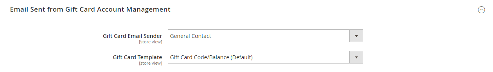

# [!UICONTROL Sales] > [!UICONTROL Gift Cards]

{{ee-feature}}

{{config}}

## [!UICONTROL Gift Card Email Settings]

<!-- zoom -->

<!-- [Gift Card Email Settings](https://experienceleague.adobe.com/en/docs/commerce-admin/stores-sales/point-of-purchase/gift-cards/product-gift-card-accounts#configure-gift-card-accounts) -->

| 欄位 | [領域](../../getting-started/websites-stores-views.md#scope-settings) | 說明 |
|--- |--- |--- |
| [!UICONTROL Gift Card Notification Email Sender] | 存放區檢視 | 識別顯示為禮品卡通知電子郵件寄件者的[商店連絡人](../../getting-started/store-details.md#store-email-addresses)。 預設值： `General Contact` |
| [!UICONTROL Gift Card Notification Email Template] | 存放區檢視 | 決定用於禮品卡通知電子郵件的[範本](../../systems/email-templates.md)。 |

{style="table-layout:auto"}

## [!UICONTROL Gift Card General Settings]

<!-- zoom -->

<!-- [Gift Card General Settings](https://experienceleague.adobe.com/en/docs/commerce-admin/stores-sales/point-of-purchase/gift-cards/product-gift-card-accounts#configure-gift-card-accounts) -->

| 欄位 | [領域](../../getting-started/websites-stores-views.md#scope-settings) | 說明 |
|--- |--- |--- |
| [!UICONTROL Redeemable] | 全域 | 決定禮卡持有人是否可以兌換其現金價值。 選項： `Yes` / `No`。 |
| [!UICONTROL Lifetime (days)] | 全域 | 決定卡片有效的天數。 如果留空，卡片不會過期。   **_重要:_**&#x200B;在某些地方，在禮品卡上設定到期資料是不合法的。 在設定禮品卡的期限之前，請先檢查當地法律。 |
| [!UICONTROL Allow Gift Message] | 存放區檢視 | 決定購買禮品卡的客戶是否可選擇加入禮品訊息。 選項： `Yes` / `No`。 |
| [!UICONTROL Gift Message Maximum Length] | 存放區檢視 | 決定禮卡訊息中允許的最大字元數。 預設值： 255 |
| [!UICONTROL Generate Gift Card Account when Order Item is] | 全域 | 決定客戶下訂單時或開立訂單商業發票時是否產生禮品卡帳戶。 選項： `Ordered` / `Invoiced` |

{style="table-layout:auto"}

## [!UICONTROL Email Sent from Gift Card Account Management]

<!-- zoom -->

<!-- [Email Sent from Gift Card Account Management](https://experienceleague.adobe.com/en/docs/commerce-admin/stores-sales/point-of-purchase/gift-cards/product-gift-card-accounts#configure-gift-card-accounts) -->

| 欄位 | [領域](../../getting-started/websites-stores-views.md#scope-settings) | 說明 |
|--- |--- |--- |
| [!UICONTROL Gift Card Email Sender] | 存放區檢視 | 識別顯示為禮品卡電子郵件寄件者的[商店連絡人](../../getting-started/store-details.md#store-email-addresses)。 預設值： `General Contact` |
| [!UICONTROL Gift Card Template] | 存放區檢視 | 決定用於禮品卡電子郵件的[範本](../../systems/email-templates.md)。 |

{style="table-layout:auto"}

## [!UICONTROL Gift Card Account General Settings]

<!-- zoom -->

<!-- [Gift Card Account General Settings](https://experienceleague.adobe.com/en/docs/commerce-admin/stores-sales/point-of-purchase/gift-cards/product-gift-card-accounts#configure-gift-card-accounts) -->

| 欄位 | [領域](../../getting-started/websites-stores-views.md#scope-settings) | 說明 |
|--- |--- |--- |
| [!UICONTROL Code Length] | 全域 | 決定禮卡代碼的長度。 |
| [!UICONTROL Code Format] | 全域 | 決定禮卡代碼的格式。 選項： `Alphanumeric` / `Numeric` |
| [!UICONTROL Code Prefix] | 全域 | 定義新增至程式碼開頭的任何前置詞。 |
| [!UICONTROL Code Suffix] | 全域 | 定義新增到程式碼結尾的任何尾碼。 |
| [!UICONTROL Dash Every X Characters] | 全域 | 如果要在程式碼中包含破折號，請決定每個破折號之間的字元數。 |
| [!UICONTROL New Pool Size] | 全域 | 決定要產生的新程式碼集區的大小。 |
| [!UICONTROL Low Code Pool Threshold] | 全域 | 決定程式碼集區中觸發需要補充集區之警示的記錄數。 |
| [!UICONTROL Generate] | 全域 | 按一下以產生禮品卡代碼清單。 |

{style="table-layout:auto"}
