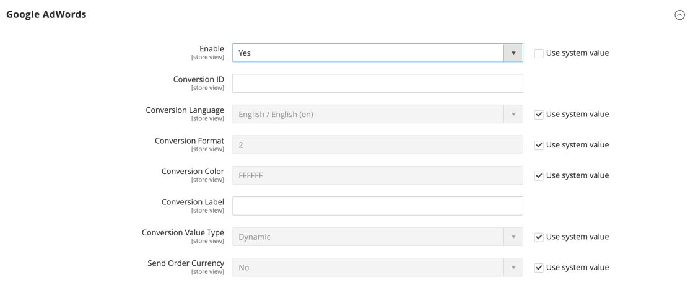

# [!UICONTROL Sales] > [!UICONTROL Google API]

{{config}}

## [!UICONTROL Google Analytics]

<!-- zoom -->

<!-- [Google Analytics](https://experienceleague.adobe.com/en/docs/commerce-admin/marketing/google-tools/google-analytics) -->

| 欄位 | [領域](../../getting-started/websites-stores-views.md#scope-settings) | 說明 |
| ----- | ------------------------------------------ | ----------- |
| [!UICONTROL Enable] | 存放區檢視 | 啟用您商店的[!DNL Google Analytics]。 選項： `Yes` / `No` |
| [!UICONTROL Account Type] | 存放區檢視 |  （僅限Adobe Commerce）根據您的Google Analytics帳戶型別決定設定選項。 選項： Universal Analytics （預設） / Google標籤管理員 |
| [!UICONTROL Account Number] | 存放區檢視 | 建立[!DNL Google Analytics]帳戶時所指派的帳號或追蹤代碼。 |
| [!UICONTROL Anonymize IP] | 存放區檢視 | 決定是否從出現在[!DNL Google Analytics]結果中的IP位址移除識別資訊。 |

{style="table-layout:auto"}

## [!UICONTROL Google Analytics - Google Tag Manager]

{{ee-feature}}

<!-- zoom -->

當&#x200B;**[!UICONTROL Account Type]**&#x200B;設定為`Google Tag Manager`時，會顯示額外的欄位。

| 欄位 | [領域](../../getting-started/websites-stores-views.md#scope-settings) | 說明 |
| ----- | ------------------------------------------ | ----------- |
| [!UICONTROL Container ID] | 存放區檢視 | [!DNL Google Tag Manager]容器的唯一識別碼。 此值通常以`GTM-`開頭。 此ID位於您的[!DNL Google Tag Manager]帳戶中。 如果已為商店安裝和設定[!DNL Google Tag Manager]，則容器ID會自動出現在此欄位中。 |
| [!UICONTROL List property for the catalog page] | 存放區檢視 | 識別與目錄頁面關聯的[!DNL Google Tag Manager]屬性。 預設值： `Catalog Page` |
| [!UICONTROL List property for the cross-sell block] | 存放區檢視 | 識別與交叉銷售區塊相關聯的[!DNL Google Tag Manager]屬性。 預設值： `Cross-sell` |
| [!UICONTROL List property for the up-sell block] | 存放區檢視 | 識別與向上銷售區塊相關聯的[!DNL Google Tag Manager]屬性。 預設值： `Up-sell` |
| [!UICONTROL List property for the related products block] | 存放區檢視 | 識別與相關產品區塊相關聯的[!DNL Google Tag Manager]屬性。 預設值： `Related Products` |
| [!UICONTROL List property for the search results page] | 存放區檢視 | 識別與搜尋結果頁面相關聯的[!DNL Google Tag Manager]屬性。 預設值： `Search Results` |
| [!UICONTROL 'Internal Promotions' for promotions field "Label"] | 存放區檢視 | 識別與內部促銷活動標籤相關聯的[!DNL Google Tag Manager]屬性。 預設值： `Label` |

{style="table-layout:auto"}

## [!UICONTROL Google AdWords]

<!-- zoom -->

<!-- [Google AdWords](https://experienceleague.adobe.com/en/docs/commerce-admin/marketing/google-tools/google-adwords) -->

| 欄位 | [領域](../../getting-started/websites-stores-views.md#scope-settings) | 說明 |
| ----- | ------------------------------------------ | ----------- |
| [!UICONTROL Enable] | 存放區檢視 | 啟用商店的Google AdWords。 選項： `Yes` / `No` |
| [!UICONTROL Conversion ID] | 存放區檢視 | 來自您Google AdWords帳戶的ID。 |
| [!UICONTROL Conversion Language] | 存放區檢視 | 用於AdWords轉換的語言。 選項： `All available languages` |
| [!UICONTROL Conversion Format] | 存放區檢視 | 決定顯示在轉換頁面上的[!DNL Google Site Stats]通知格式。 通知連結至通知訪客有關用於追蹤其瀏覽的Cookie的頁面。 這個數值已指派給AdWords指令碼中的`google_conversion_format`變數。 若要深入瞭解，請參閱Google網站上的[關於轉換追蹤](https://support.google.com/google-ads/answer/1722022?hl=en)。 選項：  **`1`**— 顯示單行通知。 **`2`** - （預設）顯示兩行通知。 **`3`**— 不顯示客戶通知。 |
| [!UICONTROL Conversion Color] | 存放區檢視 | 決定轉換標籤的顏色。 使用[檢色器](https://www.w3schools.com/colors/colors_picker.asp)來選擇十六進位值。 這個十六進位值會指派給AdWords指令碼中的`google_conversion_color`變數。 例如： ffffff `var google_conversion_color = "ffffff";` |
| [!UICONTROL Conversion Label] | 存放區檢視 | 與[!DNL Google Site Stats]通知一起顯示的文字標籤。 此文字字串已指派給AdWords指令碼中的`~`變數。 例如：「感謝您的選購！」 |
| [!UICONTROL Conversion Value Type] | 存放區檢視 | 指定用來判斷轉換發生時間的值型別。 選項：  **`Dynamic`**— 根據動態訂單金額判斷已發生轉換。 **`Constant`** — 根據輸入的值判斷已發生轉換。 |
| [!UICONTROL Conversion Value] | 存放區檢視 | 指定用於&#x200B;_[!UICONTROL Constant]_&#x200B;轉換值型別的值。 |
| [!UICONTROL Send Order Currency] | 存放區檢視 | 啟用AdWords中的交易特定貨幣轉換值（適用於使用不同基本貨幣的網站）。 |

{style="table-layout:auto"}

## [!UICONTROL Google GTag]

{{gtag-api-note}}

### [!UICONTROL Google Analytics4]

<!-- zoom -->

<!-- [Google Analytics4](https://experienceleague.adobe.com/en/docs/commerce-admin/marketing/google-tools/google-analytics) -->

| 欄位 | [領域](../../getting-started/websites-stores-views.md#scope-settings) | 說明 |
| ----- | ------------------------------------------ | ----------- |
| [!UICONTROL Enable] | 存放區檢視 | 為您的商店啟用Google Analytics 4。 選項： `Yes` / `No` |
| [!UICONTROL Account Type] | 存放區檢視 |  （僅限Adobe Commerce）根據您的Google Analytics帳戶型別決定設定選項。 選項： `Google Analytics4` （預設） / `Google Tag Manager` |
| [!UICONTROL Measurement ID] | 存放區檢視 | 建立Google Analytics帳戶時所指派的帳號或追蹤代碼。 |
| [!UICONTROL Anonymize IP] | 存放區檢視 | 決定是否從Google Analytics結果中顯示的IP位址移除識別資訊。 |

{style="table-layout:auto"}

### [!UICONTROL Google Analytics4 - Google Tag Manager]

{{ee-feature}}

<!-- zoom -->

當&#x200B;**[!UICONTROL Account Type]**&#x200B;設定為`Google Tag Manager`時，會顯示額外的欄位。

| 欄位 | [領域](../../getting-started/websites-stores-views.md#scope-settings) | 說明 |
| ----- | ------------------------------------------ | ----------- |
| [!UICONTROL Container Id] | 存放區檢視 | [!DNL Google Tag Manager]容器的唯一識別碼。 此值通常以`GTM-`開頭。 此ID位於您的Google標籤管理員帳戶中。 如果已為商店安裝和設定[!DNL Google Tag Manager]，則容器ID會自動出現在此欄位中。 |
| [!UICONTROL List property for the catalog page] | 存放區檢視 | 識別與目錄頁面關聯的[!DNL Google Tag Manager]屬性。 預設值： `Catalog Page` |
| [!UICONTROL List property for the cross-sell block] | 存放區檢視 | 識別與交叉銷售區塊相關聯的[!DNL Google Tag Manager]屬性。 預設值： `Cross-sell` |
| [!UICONTROL List property for the up-sell block] | 存放區檢視 | 識別與向上銷售區塊相關聯的[!DNL Google Tag Manager]屬性。 預設值： `Up-sell` |
| [!UICONTROL List property for the related products block] | 存放區檢視 | 識別與相關產品區塊相關聯的[!DNL Google Tag Manager]屬性。 預設值： `Related Products` |
| [!UICONTROL List property for the search results page] | 存放區檢視 | 識別與搜尋結果頁面相關聯的[!DNL Google Tag Manager]屬性。 預設值： `Search Results` |
| [!UICONTROL 'Internal Promotions' for promotions field "Label"] | 存放區檢視 | 識別與內部促銷活動標籤相關聯的[!DNL Google Tag Manager]屬性。 預設值： `Label` |

{style="table-layout:auto"}

### [!UICONTROL Google AdWords]

<!-- zoom -->

<!-- -- Google AdWords](https://experienceleague.adobe.com/en/docs/commerce-admin/marketing/google-tools/google-adwords) -->

| 欄位 | [領域](../../getting-started/websites-stores-views.md#scope-settings) | 說明 |
| ----- | ------------------------------------------ | ----------- |
| [!UICONTROL Enable] | 存放區檢視 | 啟用商店的Google AdWords。 選項： `Yes` / `No` |
| [!UICONTROL Conversion ID] | 存放區檢視 | 來自您Google AdWords帳戶的ID。 |
| [!UICONTROL Conversion Language] | 存放區檢視 | 用於AdWords轉換的語言。 選項：所有可用語言 |
| [!UICONTROL Conversion Format] | 存放區檢視 | 決定轉換頁面上顯示的Google網站統計資料通知格式。 通知連結至通知訪客有關用於追蹤其瀏覽的Cookie的頁面。 這個數值已指派給AdWords指令碼中的`google_conversion_format`變數。 若要深入瞭解，請參閱Google網站上的[關於轉換追蹤](https://support.google.com/google-ads/answer/1722022?hl=en)。 選項：  **`1`**— 顯示單行通知。 **`2`** - （預設）顯示兩行通知。 **`3`**— 不顯示客戶通知。 |
| [!UICONTROL Conversion Color] | 存放區檢視 | 決定轉換標籤的顏色。 使用[檢色器](https://www.w3schools.com/colors/colors_picker.asp)來選擇十六進位值。 這個十六進位值會指派給AdWords指令碼中的`google_conversion_color`變數。 例如： ffffff `var google_conversion_color = "ffffff";` |
| [!UICONTROL Conversion Label] | 存放區檢視 | 與Google網站統計資料通知一起顯示的文字標籤。 此文字字串已指派給AdWords指令碼中的`~`變數。 例如：「感謝您的選購！」 |
| [!UICONTROL Conversion Value Type] | 存放區檢視 | 指定用來判斷轉換發生時間的值型別。 選項：  **`Dynamic`**— 根據動態訂單金額判斷已發生轉換。 **`Constant`** — 根據輸入的值判斷已發生轉換。 |
| [!UICONTROL Conversion Value] | 存放區檢視 | 指定用於&#x200B;_[!UICONTROL Constant]_&#x200B;轉換值型別的值。 |
| [!UICONTROL Send Order Currency] | 存放區檢視 | 啟用AdWords中的交易特定貨幣轉換值（適用於使用不同基本貨幣的網站）。 |

{style="table-layout:auto"}
