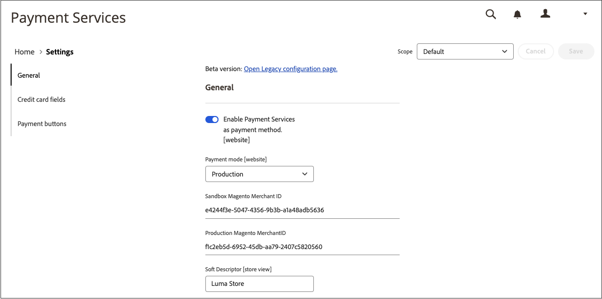

# [!UICONTROL Sales] > [!UICONTROL Payment Methods] > [!UICONTROL Payment Services]

Payment Services提供全包式自助服務解決方案，包括沙箱測試和簡單的設定，以提供強大且安全的付款處理。 若要進一步瞭解，請參閱 [_Payment Services使用手冊_](https://experienceleague.adobe.com/docs/commerce-merchant-services/payment-services/guide-overview.html).

若要存取支付服務的組態設定，請前往 _管理員_ 側欄移至 **[!UICONTROL Sales]** > **[!UICONTROL Payment Services]** 並按一下 **[!UICONTROL Settings]**.

{width="400"}

>[!NOTE]
>
>若要使用舊版設定而非 [設定](https://experienceleague.adobe.com/docs/commerce-merchant-services/payment-services/configure/settings.html)，請參閱 [舊版設定](https://experienceleague.adobe.com/docs/commerce-merchant-services/payment-services/configure/configure-admin.html).

## [!UICONTROL General]

{width="600" zoomable="yes"}

| 欄位 | [範圍](../../getting-started/websites-stores-views.md#scope-settings) | 說明 |
|---|---|---|
| [!UICONTROL Enable] | 網站 | 啟用或停用 [!DNL Payment Services] 您的網站。 選項： [!UICONTROL Yes] / [!UICONTROL No] |
| [!UICONTROL Payment mode] | 存放區檢視 | 設定商店的方法或環境。 選項： [!UICONTROL Sandbox] / [!UICONTROL Production] |
| [!UICONTROL Sandbox Merchant ID] | 存放區檢視 | 您的沙箱商家ID，會在沙箱上線期間自動產生。 |
| [!UICONTROL Production Merchant ID] | 存放區檢視 | 您的生產商家識別碼，會在沙箱上線期間自動產生。 |
| [!UICONTROL Soft Descriptor] | 網站或商店檢視 | 在您的網站和商店檢視中新增軟性描述項，可提供客戶交易的資訊，並描述品牌、商店或產品線。 此 [!UICONTROL Use website] 切換會套用網站層級新增的任何軟性描述項。 此 [!UICONTROL Use default] 切換會套用新增為預設的任何軟性描述項。 |

{style="table-layout:auto"}

## [!UICONTROL Credit card fields]

{width="600" zoomable="yes"}

| 欄位 | [範圍](../../getting-started/websites-stores-views.md#scope-settings) | 說明 |
|---|---|---|
| [!UICONTROL Title] | 存放區檢視 | 在結帳期間，在「付款方式」檢視中，新增文字以顯示為此付款選項的標題。 |
| [!UICONTROL Payment Action] | 網站 | 此 [付款動作](payment-methods.md#payment-actions) 指定付款方式的。 選項： [!UICONTROL Authorize] / [!UICONTROL Authorize and Capture] |
| [!UICONTROL 3DS Secure authentication] | 網站 | 啟用或停用 [3DS安全驗證](https://experienceleague.adobe.com/docs/commerce-merchant-services/payment-services/security-compliance/security.html#3ds). 選項： [!UICONTROL Always] / [!UICONTROL When Required] / [!UICONTROL Off] |
| [!UICONTROL Show on checkout page] | 網站 | 啟用或停用要在結帳頁面上顯示的信用卡欄位。 選項： [!UICONTROL Yes] / [!UICONTROL No] |
| [!UICONTROL Vault enabled] | 存放區檢視 | 啟用或停用 [信用卡保險庫](https://experienceleague.adobe.com/docs/commerce-merchant-services/payment-services/payments-checkout/vaulting.html). 選項： [!UICONTROL Yes] / [!UICONTROL No] |
| [!UICONTROL Show vaulted payment methods in Admin] | 存放區檢視 | 啟用或停用在Admin中為客戶完成訂單的功能 [使用存放式付款方式](https://experienceleague.adobe.com/docs/commerce-merchant-services/payment-services/payments-checkout/vaulting.html). 選項： [!UICONTROL Yes] / [!UICONTROL No] |
| [!UICONTROL Debug Mode] | 網站 | 啟用或停用偵錯模式。 選項： [!UICONTROL Yes] / [!UICONTROL No] |

{style="table-layout:auto"}

## [!UICONTROL Payment buttons]

{width="600" zoomable="yes"}

| 欄位 | [範圍](../../getting-started/websites-stores-views.md#scope-settings) | 說明 |
|---|---|---|
| [!UICONTROL Title] | 存放區檢視 | 在結帳期間，在「付款方式」檢視中，新增要顯示為此付款選項標題的文字。 |
| [!UICONTROL Payment Action] | 網站 | 此 [付款動作](payment-methods.md#payment-actions){target="_blank"} 指定付款方式的。 選項： [!UICONTROL Authorize] / [!UICONTROL Authorize and Capture] |
| [!UICONTROL Show PayPal buttons on checkout page] | 存放區檢視 | 啟用或停用 [!DNL PayPal Smart Buttons] 在結帳頁面上。 選項： [!UICONTROL  Yes] / [!UICONTROL No] |
| [!UICONTROL Show PayPal buttons on product detail page] | 存放區檢視 | 啟用或停用 [!DNL PayPal Smart Buttons] 在產品詳細資料頁面上。 選項： [!UICONTROL  Yes] / [!UICONTROL No] |
| [!UICONTROL Show PayPal buttons in mini-cart preview] | 存放區檢視 | 啟用或停用 [!DNL PayPal Smart Buttons] 在迷你購物車預覽中。 選項： [!UICONTROL Yes] / [!UICONTROL No] |
| [!UICONTROL Show PayPal buttons on cart page] | 存放區檢視 | 啟用或停用 [!DNL PayPal Smart Buttons] 在購物車頁面上。 選項： [!UICONTROL Yes] / [!UICONTROL No] |
| [!UICONTROL Show PayPal Pay Later button] | 存放區檢視 | 啟用或停用付款按鈕顯示的稍後付款選項外觀。 選項： [!UICONTROL Yes] / [!UICONTROL No] |
| [!UICONTROL Show PayPal Pay Later Message] | 網站 | 在購物車、產品頁面、迷你購物車和結帳流程中啟用或停用「稍後付款」訊息。 選項： [!UICONTROL Yes] / [!UICONTROL No] |
| [!UICONTROL Show Venmo button] | 存放區檢視 | 啟用或停用顯示付款按鈕的Venmo付款選項。 選項： [!UICONTROL Yes] / [!UICONTROL No] |
| [!UICONTROL Show Apple Pay button] | 存放區檢視 | 啟用或停用顯示付款按鈕的Apple付款選項。 選項： [!UICONTROL Yes] / [!UICONTROL No] |
| [!UICONTROL Show PayPal Credit and Debit card button] | 存放區檢視 | 啟用或停用顯示付款按鈕的「信用卡與借記卡」付款選項。 選項： [!UICONTROL Yes] / [!UICONTROL No] |
| [!UICONTROL Debug Mode] | 網站 | 啟用或停用偵錯模式。 選項： [!UICONTROL Yes] / [!UICONTROL No] |

{style="table-layout:auto"}

## [!UICONTROL PayPal Smart Button Styling]

{width="600" zoomable="yes"}

| 欄位 | [範圍](../../getting-started/websites-stores-views.md#scope-settings) | 說明 |
|--- |--- |--- |
| [!UICONTROL Layout] | 存放區檢視 | 定義付款按鈕的配置樣式。 選項： [!UICONTROL Vertical] / [!UICONTROL Horizontal] |
| [!UICONTROL Tagline] | 存放區檢視 | 啟用/停用標語。 選項： [!UICONTROL Yes] / [!UICONTROL No] |
| [!UICONTROL Color] | 存放區檢視 | 定義付款按鈕的顏色。 選項： [!UICONTROL Blue] / [!UICONTROL Gold] / [!UICONTROL Silver] / [!UICONTROL White] / [!UICONTROL Black] |
| [!UICONTROL Shape] | 存放區檢視 | 定義付款按鈕的形狀。 選項： [!UICONTROL Rectangular] / [!UICONTROL Pill] |
| [!UICONTROL Responsive Button Height] | 存放區檢視 | 定義付款按鈕是否使用預設高度。 選項： [!UICONTROL Yes] / [!UICONTROL No] |
| [!UICONTROL Height] | 存放區檢視 | 定義付款按鈕的高度。 預設值：無 |
| [!UICONTROL Label] | 存放區檢視 | 定義出現在付款按鈕中的標籤。 選項： [!UICONTROL PayPal] / [!UICONTROL Checkout] / [!UICONTROL Buynow] / [!UICONTROL Pay] / [!UICONTROL Installment] |

{style="table-layout:auto"}
