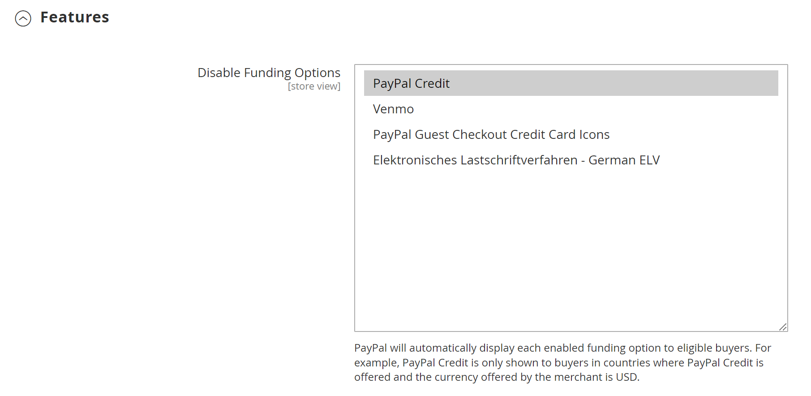

# [!UICONTROL Sales] > [!UICONTROL Payment Methods] > [!UICONTROL PayPal Express Checkout]

>[!IMPORTANT]
>
>**PSD2需求：**  
>自2019年9月14日起，歐洲銀行可能會拒絕不符合[PSD2](../../getting-started/compliance-payment-services-directive.md)要求的付款。 PayPal Express Checkout不需要採取任何動作即可符合PSD2，因為所有要求都由PayPal處理。

{{config}}

## [!UICONTROL Required PayPal Settings]

<!-- zoom -->

<!-- [PayPal Express Checkout Required Settings](../../stores-purchase/paypal-express-checkout.html) -->

| 欄位 | [領域](../../getting-started/websites-stores-views.md#scope-settings) | 說明 |
|--- |--- |--- |
| [!UICONTROL Enable this Solution] | 網站 | 啟用[!DNL PayPal Express Checkout]作為客戶可用的付款方式。 選項： `Yes` / `No` |
| [!UICONTROL Enable In-Context Checkout Experience] | 網站 | 啟用簡化的PayPal In-Context Checkout，做為客戶可用的付款方式。 選項： `Yes` / `No` |
| [!UICONTROL Enable PayPal Credit] | 網站 | 啟用PayPal信用額度，讓客戶現在購買稍後付款。 您會先收到付款，但客戶有更多時間付費。 選項： `Yes` / `No` |

{style="table-layout:auto"}

### [!UICONTROL Express Checkout]

| 欄位 | [領域](../../getting-started/websites-stores-views.md#scope-settings) | 說明 |
|--- |--- |--- |
| [!UICONTROL Email Associated with PayPal Merchant Account] | 網站 | 指定您建立PayPal商家帳戶時所指定的電子郵件地址。 電子郵件地址區分大小寫，且必須完全符合您在PayPal系統中的電子郵件地址。 |
| [!UICONTROL API Authentication Methods] | 網站 | 決定用於API驗證的方法。 選項：  **`API Signature`**— 在表單中顯示&#x200B;_[!UICONTROL API Signature]_&#x200B;欄位。 **`API Certificate`**— 在表單中顯示&#x200B;_[!UICONTROL API Certificate]_&#x200B;欄位。 |
| [!UICONTROL API Username] | 網站 | 與您的PayPal商家帳戶相關聯的API使用者名稱。 |
| [!UICONTROL API Password] | 網站 | 與您的PayPal商家帳戶相關聯的API密碼。 |
| [!UICONTROL API Signature] | 網站 | 與您的PayPal商家帳戶相關聯的API簽章。 |
| [!UICONTROL API Certificate] | 網站 | 瀏覽以上傳您的API憑證。 |
| [!UICONTROL Get Credentials from PayPal] |  | 從PayPal擷取您的API認證。 |
| [!UICONTROL Sandbox Credentials] |  | 從PayPal擷取您的沙箱認證。 |
| [!UICONTROL Sandbox Mode] | 網站 | 若要在測試環境中執行PayPal Express簽出，請輸入您的沙箱API認證，並將此設定為`Yes`。 選項： `Yes` / `No` |
| [!UICONTROL API Uses Proxy] | 網站 | 如果您的系統使用Proxy伺服器來建立Commerce與PayPal系統之間的連線，請將此設定為`Yes`。 選項： `Yes` / `No` |
| [!UICONTROL Proxy Host] | 網站 | 如果API使用Proxy，這會指定代理主機的IP位址。 |
| [!UICONTROL Proxy Port] | 網站 | 如果API使用Proxy，這會指定Proxy主機使用的連線埠。 |

{style="table-layout:auto"}

### [!UICONTROL Advertise PayPal Credit]

<!-- zoom -->

| 欄位 | [領域](../../getting-started/websites-stores-views.md#scope-settings) | 說明 |
|--- |--- |--- |
| [!UICONTROL Publisher ID] | 網站 | 與您的PayPal信用帳戶相關聯的發行者ID。 |
| [!UICONTROL Get Publisher ID from PayPal] |  | 從PayPal擷取您的發行者ID。 |
| [!UICONTROL Home Page] | 網站 | 決定首頁上[!DNL PayPal Credit]橫幅的位置和大小。 選項：  **顯示** — 在您的商店首頁上顯示[!DNL PayPal Credit]橫幅。 選項： `Yes` / `No`  **位置** — 決定首頁上[!DNL PayPal Credit]橫幅的位置。 選項： Header （中央） / Sidebar （右側）  **大小** — 決定首頁上[!DNL PayPal Credit]橫幅的大小。 選項： `190 x 100` / `234 x 60` / `300 x 50` / `468 x 60` / `728 x 90` /` 800 x 66` |
| [!UICONTROL Catalog Category Page] | 網站 | 決定類別頁面上[!DNL PayPal Credit]橫幅的位置和大小。 選項： （與[!UICONTROL Home Page]相同） |
| [!UICONTROL Catalog Product Page] | 網站 | 決定產品頁面上[!DNL PayPal Credit]橫幅的位置和大小。 選項： （與[!UICONTROL Home Page]相同） |
| [!UICONTROL Checkout Cart Page] | 網站 | 決定購物車頁面上[!DNL PayPal Credit]橫幅的位置和大小。 選項： （與[!UICONTROL Home Page]相同） |

{style="table-layout:auto"}

## [!UICONTROL Basic Settings]

<!-- zoom -->

| 欄位 | [領域](../../getting-started/websites-stores-views.md#scope-settings) | 說明 |
|--- |--- |--- |
| [!UICONTROL Title] | 存放區檢視 | 在結帳時識別PayPal Express結帳付款方法的名稱。 |
| [!UICONTROL Sort Order] | 存放區檢視 | 在結帳期間與其他付款方式一起列出時，決定PayPal Express結帳順序的數字。 在清單頂端輸入`0`。 |
| [!UICONTROL Payment Action] | 網站 | 決定PayPal收到訂單時所採取的動作。 選項：  **`Authorization`**— 核准購買，但保留資金。 此金額必須等到商家「擷取」後才會提取。 **`Sale`** — 已授權並立即從客戶帳戶中取用購買的金額。  **`Order`**— 代表與PayPal的合約，可讓商家在定義的時段內，從客戶的買方帳戶擷取一或多項最高至訂購總金額的金額。 最多可達29天。 必須從Commerce管理員產生一或多張商業發票，才能擷取資金。 |
| [!UICONTROL Display on Product Details Page] | 存放區檢視 | 決定「使用PayPal結帳」按鈕是否出現在產品頁面上。 選項包括： `Yes` / `No` |

{style="table-layout:auto"}

## [!UICONTROL Advanced Settings]

<!-- zoom -->

| 欄位 | [領域](../../getting-started/websites-stores-views.md#scope-settings) | 說明 |
|--- |--- |--- |
| [!UICONTROL Display on Shopping Cart] | 存放區檢視 | 決定PayPal Express結帳是否顯示為購物車中的付款選項。 選項： `Yes` （建議使用PayPal） / `No` |
| [!UICONTROL Payment Action Applicable From] | 網站 | 決定適用的國家/地區選取範圍。 選項： `All Allowed Countries` / `Specific Countries` |
| [!UICONTROL Countries Payment Applicable From] | 網站 | 識別接受付款的每個國家/地區。 只有帳單地址在選定國家/地區的客戶才能使用此付款方式進行購買。 |
| [!UICONTROL Debug Mode] | 網站 | 將商店和支付系統之間傳送的訊息記錄到記錄檔中。 選項： `Yes` / `No`   **_注意：_**&#x200B;記錄檔儲存在伺服器上，只有開發人員才能存取。 根據PCI資料安全性標準，記錄檔中不會記錄信用卡資訊。 |
| [!UICONTROL Enable SSL Verification] | 網站 | 啟用主機安全性憑證的驗證。 選項： `Yes` / `No` |
| [!UICONTROL Transfer Cart Line Items] | 網站 | 顯示PayPal網站上客戶購物車的條列專案完整摘要。 選項： `Yes` / `No` |
| [!UICONTROL Transfer Shipping Options] | 網站 | 包括PayPal網站上最多十個送貨選項。 選項： `Yes` / `No` |
| [!UICONTROL Shortcut Buttons Flavor] | 存放區檢視 | 決定用於PayPal接受按鈕的影像型別。 選項：  **`Dynamic`**- （建議）顯示可從PayPal伺服器動態變更的影像。 **`Static`** — 顯示無法動態變更的靜態影像。 |
| [!UICONTROL Enable PayPal Guest Checkout] | 網站 | 允許沒有PayPal帳戶的客戶透過PayPal Express結帳進行購買。 選項： `Yes` / `No` |
| [!UICONTROL Require Customer's Billing Address] | 網站 | 決定是否需要客戶帳單地址。 選項： `Yes` / `No` / `For Virtual Quotes Only` |
| [!UICONTROL Billing Agreement Signup] | 網站 | 決定客戶是否能與您的商店簽訂[帳單合約](../../stores-purchase/paypal-billing-agreements.md)。 選項：  **`Auto`**— 客戶可以在快速結帳期間註冊帳單合約。 **`Ask Customer`** — 詢問客戶是否要註冊帳單合約。  **`Never`**— 不提供客戶註冊付費合約的選項。 |
| [!UICONTROL Skip Order Review Step] | 網站 | 決定客戶是否可以從PayPal網站完成交易，或是必須返回您的商店並在提交訂單前完成「訂單複查」步驟。 選項： `Yes` / `No` |

{style="table-layout:auto"}

### [!UICONTROL Billing Agreement Settings]

<!-- zoom -->

| 欄位 | [領域](../../getting-started/websites-stores-views.md#scope-settings) | 說明 |
|--- |--- |--- |
| [!UICONTROL Enabled] | 網站 | 啟用後，帳單協定在結帳期間會對客戶顯示為付款選項。 選項： `Yes` / `No` |
| [!UICONTROL Title] | 存放區檢視 | PayPal帳單合約選項的標籤，會在結帳時顯示為付款選項。 |
| [!UICONTROL Sort Order] | 存放區檢視 | 決定結帳時帳單協定與其他付款方式一起列出的順序。 |
| [!UICONTROL Payment Action] | 網站 | 決定PayPal管理交易的方式：選項：  **授權** — 核准購買，但保留資金。 此金額必須等到商家「擷取」後才會提取。  **銷售** — 已授權並立即從客戶帳戶中收回購買金額。 |
| [!UICONTROL Payment Applicable From] | 網站 | 決定適用的國家/地區選取範圍。 選項：所有允許的國家/地區/特定國家 |
| [!UICONTROL Countries Payment Applicable From] | 網站 | 識別接受付款的每個國家/地區。 只有帳單地址在選定國家/地區的客戶才能使用此付款方式進行購買。 |
| [!UICONTROL Debug Mode] | 網站 | 在記錄檔中記錄與付款系統的通訊。 選項： `Yes` / `No`   **_注意：_**&#x200B;記錄檔儲存在伺服器上，只有開發人員才能存取。 根據PCI資料安全性標準，記錄檔中不會記錄信用卡資訊。 |
| [!UICONTROL Enable SSL Verification] | 網站 | 啟用驗證步驟，以確保透過加密的SSL通道進行交易。 選項： `Yes` / `No` |
| [!UICONTROL Transfer Cart Line Items] | 網站 | 啟用後，會在您的PayPal付款頁面上顯示購物車的明細專案摘要。 選項： `Yes` / `No` |
| [!UICONTROL Allow in Billing Agreement Wizard] | 網站 | 啟用後，客戶可以從其客戶帳戶的儀表板啟動帳單協定。 |

{style="table-layout:auto"}

### [!UICONTROL Settlement Report Settings]

<!-- zoom -->

| 欄位 | [領域](../../getting-started/websites-stores-views.md#scope-settings) | 說明 |
|--- |--- |--- |
| **[!UICONTROL SFTP Credentials]** |  |  |
| [!UICONTROL Login] | 網站 | 您登入PayPal安全FTP伺服器所需的使用者名稱。 |
| [!UICONTROL Password] | 網站 | 您登入PayPal安全FTP伺服器所需的密碼。 |
| [!UICONTROL Sandbox Mode] | 網站 | 啟用後，會在生產環境中「上線」之前，先在測試環境中執行報表。 選項： `Yes` / `No` |
| [!UICONTROL Custom Endpoint Hostname or IP-Address] | 網站 | 管理結算報表的URL。 預設值： `reports.paypal.com` |
| [!UICONTROL Custom Path] | 網站 | 結算報表儲存在伺服器上的路徑。 預設值： `/ppreports/outgoing` |
| **[!UICONTROL Scheduled Fetching]** |  |  |
| [!UICONTROL Enable Automatic Fetching] | 網站 | 啟用時，會依排程自動擷取結算報表。 選項： `Yes` / `No` |
| [!UICONTROL Schedule] | 網站 | 決定PayPal產生結算報表的頻率。 選項： `Daily` / `Every 3 days` / `Every 7 days` / `Every 10 days` / `Every 14 days` / `Every 30 days` / `Every 40 days` |
| [!UICONTROL Time of Day] | 網站 | 決定產生結算報表的小時、分鐘和秒。 |

{style="table-layout:auto"}

### [!UICONTROL Frontend Experience Settings]

<!-- zoom -->

| 欄位 | [領域](../../getting-started/websites-stores-views.md#scope-settings) | 說明 |
|--- |--- |--- |
| [!UICONTROL PayPal Product Logo] | 存放區檢視 | 決定出現在您商店中的PayPal標誌。 有兩種大小的4種基本樣式。 選項： `No Logo` / `We prefer PayPal (150 x 60)` / `We prefer PayPal (150 x 40)` / `Now accepting PayPal (150 x 60)` / `Now accepting PayPal (150 x 40)` / `Payments by PayPal (150 x 60)` / `Payments by PayPal (150 x 40)` / `Shop now using (150 x 60)` / `Shop now using (150 x 40)` |
| **[!UICONTROL PayPal Merchant Pages Style]** |  |  |
| [!UICONTROL Page Style] | 存放區檢視 | 決定您的PayPal商家頁面外觀。 允許的值： **`paypal`** — 使用PayPal頁面樣式。  **`primary`**— 使用您在帳戶設定檔中識別為「主要」樣式的頁面樣式。 **`your_custom_value`** — 使用帳戶設定檔中指定的自訂付款頁面樣式。 |
| [!UICONTROL Header Image URL] | 存放區檢視 | 顯示在結帳頁面左上角的影像URL。 大小上限為750 x 90畫素。   **_注意：_**&#x200B;PayPal建議將影像儲存在安全(https)伺服器上。 否則，客戶的瀏覽器可能會警告「頁面包含安全及不安全的專案」。 |
| [!UICONTROL Header Image Background Color] | 存放區檢視 | 結帳頁面上頁首的背景顏色的六字元[十六進位色彩](https://en.wikipedia.org/wiki/Web_colors)代碼。 您可以用大寫和小寫字元輸入代碼。 |
| [!UICONTROL Header Image Border Color] | 存放區檢視 | 標頭周圍雙畫素框線的六字元[十六進位色彩](https://en.wikipedia.org/wiki/Web_colors)代碼。 |
| [!UICONTROL Page Background Color] | 存放區檢視 | 出現在頁首與付款表單後方的結帳頁面背景顏色的六字元[十六進位色彩](https://en.wikipedia.org/wiki/Web_colors)代碼。 |

{style="table-layout:auto"}

#### [!UICONTROL Customize Smart Buttons (Basic)]

<!-- zoom -->

| 欄位 | [領域](../../getting-started/websites-stores-views.md#scope-settings) | 說明 |
|--- |--- |--- |
| [!UICONTROL Customize Button] | 存放區檢視 | 決定是否可自訂PayPal智慧型按鈕以符合商店的版面與主題。 您可以在「結帳」頁面、「產品」頁面、「購物車」頁面和「迷你購物車」中獨立套用這些變更。 |
| [!UICONTROL Label] | 存放區檢視 | PayPal在「智慧型付款」按鈕上顯示的文字。 選項：  **`Checkout`**（顯示為「PayPal結帳」） **`Pay`** （顯示為「使用PayPal付款」）  **`Buy Now`**（顯示為「使用PayPal立即購買」） **`PayPal`** （顯示為「PayPal」）  **`Installment`**（顯示為「PayPal」） **`Credit`** （顯示為「PayPal CREDIT」） |
| [!UICONTROL Layout] | 存放區檢視 | 決定要垂直或水準顯示PayPal智慧型按鈕。 選項：  **`Vertical`**— 無論是否選取[啟用來賓結帳]，購買者都必須登入PayPal或建立PayPal帳戶。 **`Horizontal`** — 選取[啟用來賓簽出]時，會在PayPal快顯視窗上顯示&#x200B;**`Pay with Debit Card or Credit Card`**&#x200B;按鈕。 否則，購買者必須登入PayPal或建立PayPal帳戶。 |
| [!UICONTROL Size] | 存放區檢視 | 設定智慧型付款按鈕的大小。 選項：  **`Medium`**- 250 x 35畫素 **`Large`** - 350 x 40畫素&#x200B; **`Responsive`**- （預設）調整為容器的寬度。 最小寬度是100畫素，最大寬度是500畫素。 高度會根據寬度動態調整。 |
| [!UICONTROL Shape] | 存放區檢視 | 設定智慧型付款按鈕的形狀。 選項： `Pill` （預設） / `Rectangle` |
| [!UICONTROL Color] | 存放區檢視 | 設定「智慧型付款」按鈕的顏色。 選項： `Gold` （預設） / `Blue` / `Silver` / `Black` |

{style="table-layout:auto"}

#### [!UICONTROL Customize Smart Buttons (Features)]

<!-- zoom -->

| 欄位 | [領域](../../getting-started/websites-stores-views.md#scope-settings) | 說明 |
|--- |--- |--- |
| [!UICONTROL Disable Funding Options] | 存放區檢視 | 決定在「結帳」頁面上顯示哪些其他PayPal資金選項。 選取的選項不會顯示在「結帳」頁面上。 未選取的選項僅在PayPal支援商店貨幣和買家地點時才會顯示。 選項： `PayPal Credit` / `PayPal Guest Checkout` `Credit Card Icons` / `Elektronisches Lastschriftverfahren - German ELV` |

{style="table-layout:auto"}
