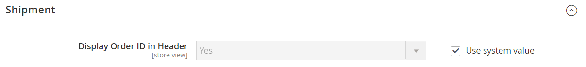

# [!UICONTROL Sales] > [!UICONTROL PDF Print-outs]

{{config}}

<!-- [Invoice](https://experienceleague.adobe.com/en/docs/commerce-admin/stores-sales/site-store/sales-documents) -->

## [!UICONTROL Invoice]

<!-- zoom -->

| 欄位 | [領域](../../getting-started/websites-stores-views.md#scope-settings) | 說明 |
|--- |--- |--- |
| [!UICONTROL Display Order ID in Header] | 存放區檢視 | 在商業發票表頭中包含訂單識別碼以供參考。 選項： `Yes` / `No` |

{style="table-layout:auto"}

## [!UICONTROL Shipment]

<!-- zoom -->

| 欄位 | [領域](../../getting-started/websites-stores-views.md#scope-settings) | 說明 |
|--- |--- |--- |
| [!UICONTROL Display Order ID in Header] | 存放區檢視 | 在出貨包裝單表頭中包含訂單識別碼以供參考。 選項： `Yes` / `No` |

{style="table-layout:auto"}

## [!UICONTROL Credit Memo]

<!-- zoom -->

| 欄位 | [領域](../../getting-started/websites-stores-views.md#scope-settings) | 說明 |
|--- |--- |--- |
| [!UICONTROL Display Order ID in Header] | 存放區檢視 | 在銷退折讓單表頭中包含「訂單識別碼」以供參考。 選項： `Yes` / `No` |

{style="table-layout:auto"}
