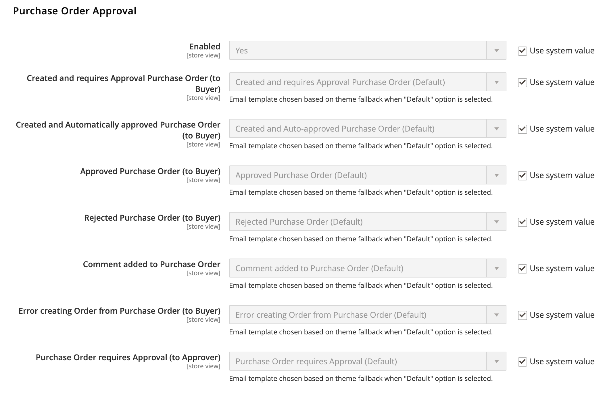

# [!UICONTROL Sales] > [!UICONTROL Sales Emails]

{{config}}

## [!UICONTROL General Settings]

<!-- zoom -->

<!-- [General Settings](https://experienceleague.adobe.com/en/docs/commerce-admin/systems/communications/email-communications) -->

| 欄位 | [領域](../../getting-started/websites-stores-views.md#scope-settings) | 說明 |
|--- |--- |--- |
| [!UICONTROL Asynchronous sending] | 全域 | 判斷是否以非同步方式傳送銷售電子郵件。 建議您啟用非同步傳送。 選項：  **`Disable`**- （預設）事件觸發時會傳送銷售電子郵件。 **`Enable`** - （建議）銷售電子郵件會以預先決定的固定間隔傳送。 |

{style="table-layout:auto"}

## [!UICONTROL Order]

<!-- zoom -->

<!-- [Order](https://experienceleague.adobe.com/en/docs/commerce-admin/stores-sales/order-management/orders/orders) -->

| 欄位 | [領域](../../getting-started/websites-stores-views.md#scope-settings) | 說明 |
|--- |--- |--- |
| [!UICONTROL Enabled] | 存放區檢視 | 啟用時，會針對每個下訂單傳送交易式電子郵件。 選項： `Yes` / `No` |
| [!UICONTROL New Order Confirmation Email Sender] | 存放區檢視 | 識別顯示為郵件寄件者的商店聯絡人。 預設寄件者： `Sales Representative` |
| [!UICONTROL New Order Confirmation Template] | 存放區檢視 | 識別會傳送以確認客戶下新訂單的範本。 預設範本： `New Order` |
| [!UICONTROL New Order Confirmation Template for Guest] | 存放區檢視 | 識別傳送以確認來賓下新訂單的範本。 預設範本： `New Order for Guest` |
| [!UICONTROL Send Order Email Copy To] | 存放區檢視 | 提供任何人收到訂單電子郵件副本的電子郵件地址。 請使用逗號分隔多個地址。 |
| [!UICONTROL Send Order Email Copy Method] | 存放區檢視 | 表示用於傳送副本的電子郵件方法。 選項包括：  **`Bcc`**— 在傳送給客戶的相同電子郵件的標題中包含收件者，以傳送不公開的禮貌復本。 客戶看不到密件副本收件者。 **`Separate Email`** — 以個別電子郵件的形式傳送復本。 |

{style="table-layout:auto"}

## [!UICONTROL Order Comments]

<!-- zoom -->

<!-- [Order Comments](https://experienceleague.adobe.com/en/docs/commerce-admin/stores-sales/order-management/orders/order-processing#process-an-order) -->

| 欄位 | [領域](../../getting-started/websites-stores-views.md#scope-settings) | 說明 |
|--- |--- |--- |
| [!UICONTROL Enabled] | 存放區檢視 | 啟用時，會針對每個訂單註解傳送交易式電子郵件。 選項： `Yes` / `No` |
| [!UICONTROL Order Comment Email Sender] | 存放區檢視 | 識別顯示為郵件寄件者的商店聯絡人。 預設寄件者： `Sales Representative` |
| [!UICONTROL Order Comment Email Template] | 存放區檢視 | 識別將註解新增至客戶訂單時傳送的範本。 預設範本： `Order Update` |
| [!UICONTROL New Order Confirmation Template for Guest] | 存放區檢視 | 識別將註解新增至客體訂單時所傳送的範本。 預設範本： `Order Update for Guest` |
| [!UICONTROL Send Order Email Copy To|Store View] | 提供任何人收到訂單評論電子郵件副本的電子郵件地址。 請使用逗號分隔多個地址。 |
| [!UICONTROL Send Order Email Copy Method] | 存放區檢視 | 指示用來傳送副本的方法。 選項包括：  **`Bcc`**— 在傳送給客戶的相同電子郵件的標題中包含收件者，以傳送不公開的禮貌復本。 客戶看不到密件副本收件者。 **`Separate Email`** — 以個別電子郵件的形式傳送復本。 |

{style="table-layout:auto"}

## [!UICONTROL Invoice]

<!-- zoom -->

<!-- [Invoice](https://experienceleague.adobe.com/en/docs/commerce-admin/stores-sales/order-management/invoices) -->

| 欄位 | [領域](../../getting-started/websites-stores-views.md#scope-settings) | 說明 |
|--- |--- |--- |
| [!UICONTROL Enabled] | 存放區檢視 | 啟用時，會針對每個產生的商業發票傳送交易式電子郵件。 選項： `Yes` / `No` |
| [!UICONTROL Invoice Email Sender] | 存放區檢視 | 識別顯示為郵件寄件者的商店聯絡人。 預設寄件者： `Sales Representative` |
| [!UICONTROL Invoice Email Template] | 存放區檢視 | 識別產生客戶的商業發票時所傳送的範本。 預設範本： `New Invoice` |
| [!UICONTROL Invoice Email Template for Guest] | 存放區檢視 | 識別在為來賓產生發票時傳送的範本。 預設範本： `New Invoice for Guest` |
| [!UICONTROL Send Invoice Email Copy To] | 存放區檢視 | 提供任何人接收發票電子郵件復本的電子郵件地址。 請使用逗號分隔多個地址。 |
| [!UICONTROL Send Invoice Email Copy Method] | 存放區檢視 | 指示用來傳送副本的方法。 選項包括：  **`Bcc`**— 在傳送給客戶的相同電子郵件的標題中包含收件者，以傳送不公開的禮貌復本。 客戶看不到密件副本收件者。 **`Separate Email`** — 以個別電子郵件的形式傳送復本。 |

{style="table-layout:auto"}

## [!UICONTROL Invoice Comments]

<!-- zoom -->

<!-- [Invoice Comments](https://experienceleague.adobe.com/en/docs/commerce-admin/stores-sales/order-management/invoices#create-an-invoice) -->

| 欄位 | [領域](../../getting-started/websites-stores-views.md#scope-settings) | 說明 |
|--- |--- |--- |
| [!UICONTROL Enabled] | 存放區檢視 | 啟用時，會針對每個商業發票註解傳送交易式電子郵件。 選項： `Yes` / `No` |
| [!UICONTROL Invoice Comment Email Sender] | 存放區檢視 | 識別顯示為郵件寄件者的商店聯絡人。 預設寄件者： `Sales Representative` |
| [!UICONTROL Invoice Comment Email Template] | 存放區檢視 | 識別將註解新增至客戶商業發票時所傳送的範本。 預設範本： `Invoice Update` |
| [!UICONTROL Invoice Comment Email Template for Guest] | 存放區檢視 | 識別將註解新增至來賓發票時所傳送的範本。 預設範本： `Invoice Update for Guest` |
| [!UICONTROL Send Invoice Comment Email Copy To] | 存放區檢視 | 提供任何人收到發票註解電子郵件副本的電子郵件地址。 請使用逗號分隔多個地址。 |
| [!UICONTROL Send Invoice Comments Email Copy Method] | 存放區檢視 | 表示用於傳送副本的電子郵件方法。 選項包括：  **`Bcc`**— 在傳送給客戶的相同電子郵件的標題中包含收件者，以傳送不公開的禮貌復本。 客戶看不到密件副本收件者。 **`Separate Email`** — 以個別電子郵件的形式傳送復本。 |

{style="table-layout:auto"}

## [!UICONTROL Shipment]

<!-- zoom -->

<!-- [Shipment](https://experienceleague.adobe.com/en/docs/commerce-admin/stores-sales/order-management/shipments) -->

| 欄位 | [領域](../../getting-started/websites-stores-views.md#scope-settings) | 說明 |
|--- |--- |--- |
| [!UICONTROL Enabled] | 存放區檢視 | 啟用時，會針對產生的每次出貨傳送交易式電子郵件。 選項： `Yes` / `No` |
| [!UICONTROL Shipment Email Sender] | 存放區檢視 | 識別顯示為訊息寄件者的商店聯絡人。 預設寄件者： `Sales Representative` |
| [!UICONTROL Shipment Email Template] | 存放區檢視 | 識別產生客戶的出貨時所傳送的範本。 預設範本： `New Shipment` |
| [!UICONTROL Shipment Email Template for Guest] | 存放區檢視 | 識別在為來賓產生出貨時傳送的範本。 預設範本： `New Shipment for Guest` |
| [!UICONTROL Send Shipment Email Copy To] | 存放區檢視 | 提供應接收運送電子郵件副本之人員的電子郵件地址。 請使用逗號分隔多個地址。 |
| [!UICONTROL Send Shipment Email Copy Method] | 存放區檢視 | 指示用來傳送副本的方法。 選項包括：  **`Bcc`**— 在傳送給客戶的相同電子郵件的標題中包含收件者，以傳送不公開的禮貌復本。 客戶看不到密件副本收件者。 **`Separate Email`** — 以個別電子郵件的形式傳送復本。 |

{style="table-layout:auto"}

## [!UICONTROL Shipment Comments]

<!-- zoom -->

<!-- [Shipment Comments](https://experienceleague.adobe.com/en/docs/commerce-admin/stores-sales/order-management/shipments) -->

| 欄位 | [領域](../../getting-started/websites-stores-views.md#scope-settings) | 說明 |
|--- |--- |--- |
| [!UICONTROL Enabled] | 存放區檢視 | 啟用時，會針對每個出貨註解傳送交易式電子郵件。 選項： `Yes` / `No` |
| [!UICONTROL Shipment Comment Email Sender] | 存放區檢視 | 識別顯示為郵件寄件者的商店聯絡人。 預設寄件者： `Sales Representative` |
| [!UICONTROL Shipment Comment Email Template] | 存放區檢視 | 識別將註解新增至客戶出貨時所傳送的範本。 預設範本： `Shipment Update` |
| [!UICONTROL Shipment Comment Email Template for Guest] | 存放區檢視 | 識別將註解新增至來賓出貨時所傳送的範本。 預設範本： `Shipment Update for Guest` |
| [!UICONTROL Send Shipment Comment Email Copy To] | 存放區檢視 | 提供接收出貨評論電子郵件副本之所有人的電子郵件地址。 請使用逗號分隔多個地址。 |
| [!UICONTROL Send Shipment Comments Email Copy Method] | 存放區檢視 | 表示用於傳送副本的電子郵件方法。 選項包括：  **`Bcc`**— 在傳送給客戶的相同電子郵件的標題中包含收件者，以傳送不公開的禮貌復本。 客戶看不到密件副本收件者。 **`Separate Email`** — 以個別電子郵件的形式傳送復本。 |

{style="table-layout:auto"}

## [!UICONTROL Credit Memo]

<!-- zoom -->

<!-- [Credit Memo](https://experienceleague.adobe.com/en/docs/commerce-admin/stores-sales/order-management/credit-memos/credit-memos) -->

| 欄位 | [領域](../../getting-started/websites-stores-views.md#scope-settings) | 說明 |
|--- |--- |--- |
| [!UICONTROL Enabled] | 存放區檢視 | 針對產生的每個銷退折讓單，啟用交易式電子郵件。 選項： `Yes` / `No` |
| [!UICONTROL Credit Memo Email Sender] | 存放區檢視 | 識別顯示為訊息寄件者的商店聯絡人。 預設寄件者： `Sales Representative` |
| [!UICONTROL Credit Memo Email Template] | 存放區檢視 | 識別產生客戶的銷退折讓單時所傳送的範本。 預設範本： `New Credit Memo` |
| [!UICONTROL Credit Memo Email Template for Guest] | 存放區檢視 | 識別在為來賓產生銷退折讓單時傳送的範本。 預設範本： `New Credit Memo for Guest` |
| [!UICONTROL Send Credit Memo Email Copy To] | 存放區檢視 | 提供應接收銷退折讓單電子郵件副本之人員的電子郵件地址。 請使用逗號分隔多個地址。 |
| [!UICONTROL Send Credit Memo Email Copy Method] | 存放區檢視 | 指示用來傳送副本的方法。 選項包括：  **`Bcc`**— 在傳送給客戶的相同電子郵件的標題中包含收件者，以傳送不公開的禮貌復本。 客戶看不到密件副本收件者。 **`Separate Email`** — 以個別電子郵件的形式傳送復本。 |

{style="table-layout:auto"}

## [!UICONTROL Credit Memo Comments]

<!-- zoom -->

<!-- [Credit Memo Comments](https://experienceleague.adobe.com/en/docs/commerce-admin/stores-sales/order-management/credit-memos/credit-memo-create) -->

| 欄位 | [領域](../../getting-started/websites-stores-views.md#scope-settings) | 說明 |
|--- |--- |--- |
| [!UICONTROL Enabled] | 存放區檢視 | 啟用時，會針對每個銷退折讓單註解傳送交易式電子郵件。 選項： `Yes` / `No` |
| [!UICONTROL Credit Memo Comment Email Sender] | 存放區檢視 | 識別顯示為郵件寄件者的商店聯絡人。 預設寄件者： `Sales Representative` |
| [!UICONTROL Credit Memo Comment Email Template] | 存放區檢視 | 識別將註解新增至客戶銷退折讓單時所傳送的範本。 預設範本： `Credit Memo Update` |
| [!UICONTROL Credit Memo Comment Email Template for Guest] | 存放區檢視 | 識別將註解新增至來賓銷退折讓單時所傳送的範本。 預設範本： `Credit Memo Update for Guest` |
| [!UICONTROL Send Credit Memo Comment Email Copy To] | 存放區檢視 | 指定任何人收到銷退折讓單評論電子郵件副本的電子郵件地址。 請使用逗號分隔多個地址。 |
| [!UICONTROL Send Credit Memo Comments Email Copy Method] | 存放區檢視 | 表示用於傳送副本的電子郵件方法。 選項包括：  **`Bcc`**— 在傳送給客戶的相同電子郵件的標題中包含收件者，以傳送不公開的禮貌復本。 客戶看不到密件副本收件者。 **`Separate Email`** — 以個別電子郵件的形式傳送復本。 |

{style="table-layout:auto"}

## [!UICONTROL Order Ready For Pickup in Store]

<!-- zoom -->

<!-- [Order Ready For Pickup in Store](https://experienceleague.adobe.com/en/docs/commerce-admin/stores-sales/delivery/basic-methods/shipping-in-store-delivery) -->

| 欄位 | [領域](../../getting-started/websites-stores-views.md#scope-settings) | 說明 |
|--- |--- |--- |
| [!UICONTROL Enabled] | 存放區檢視 | 啟用時，會在訂單準備好在店內取貨時傳送交易式電子郵件。 選項： `Yes` / `No` |
| [!UICONTROL Order Ready For Pickup Email Sender] | 存放區檢視 | 識別顯示為郵件寄件者的商店聯絡人。 預設寄件者： `General Contact` |
| [!UICONTROL Order Ready For Pickup Email Template] | 存放區檢視 | 識別用於交易式電子郵件的範本，適用於已準備好在店內為註冊客戶取貨的每份訂單。 預設範本： `Order is Ready for Pickup` |
| [!UICONTROL Order Ready For Pickup Email Template for Guest] | 存放區檢視 | 識別用於交易式電子郵件的範本，適用於已準備好在店內為來賓收取的每份訂單。 預設範本： `Order is Ready for Pickup for Guest` |
| 將訂單準備取貨電子郵件副本傳送至 | 存放區檢視 | 指定任何人收到&#x200B;_訂單準備取貨_&#x200B;電子郵件復本的電子郵件地址。 請使用逗號分隔多個地址。 |
| [!UICONTROL Send Order Ready For Pickup Email Copy Method] | 存放區檢視 | 表示用於傳送副本的電子郵件方法。 選項：  **`Bcc`**— 在傳送給客戶的同一封電子郵件的標題中包含收件者，以傳送不公開的禮貌復本。 客戶看不到密件副本收件者。 **`Separate Email`** — 以個別電子郵件的形式傳送復本。 |

{style="table-layout:auto"}

## [!UICONTROL Purchase Order Approval]

{{b2b-feature}}

<!-- zoom -->

| 欄位 | [領域](../../getting-started/websites-stores-views.md#scope-settings) | 說明 |
|--- |--- |--- |
| [!UICONTROL Enabled] | 存放區檢視 | 啟用時，會在採購單處理期間傳送電子郵件。 選項： `Yes` / `No` |
| [!UICONTROL Created and requires Approval Purchase Order (to Buyer)] | 存放區檢視 | 傳送電子郵件確認給採購單建立者。 |
| [!UICONTROL Created and Automatically approved Purchase Order (to Buyer)] | 存放區檢視 | 傳送電子郵件確認給採購單建立者。 |
| [!UICONTROL Approved Purchase Order (to Buyer)] | 存放區檢視 | 在核准採購單時，傳送電子郵件給建立者。 |
| [!UICONTROL Rejected Purchase Order (to Buyer)] | 存放區檢視 | 當採購單被拒絕時，傳送電子郵件給建立者。 |
| [!UICONTROL Comment added to Purchase Order] | 存放區檢視 | 將註解新增至採購單時，傳送電子郵件給建立者。 |
| [!UICONTROL Error creating Order from Purchase Order (to Buyer)] | 存放區檢視 | 通知建立者將採購單轉換為訂單時發生錯誤。 |
| [!UICONTROL Purchase Order required Approval (to Approver)] | 存放區檢視 | 傳送電子郵件，通知核准者採購單需要其核准。 |

{style="table-layout:auto"}

## [!UICONTROL Quote]

{{b2b-feature}}

<!-- zoom -->

<!-- [Quotes](https://experienceleague.adobe.com/en/docs/commerce-admin/b2b/quotes/account-dashboard-my-quotes) -->

| 欄位 | [領域](../../getting-started/websites-stores-views.md#scope-settings) | 說明 |
|--- |--- |--- |
| [!UICONTROL Enabled] | 存放區檢視 | 啟用從目前商店檢視傳送報價電子郵件訊息。 選項： `Yes` / `No` |
| [!UICONTROL Updated Quote Template (to Buyer)] | 存放區檢視 | 決定當有更新的報價可用時，用於傳送給買家的通知的電子郵件範本。 預設範本： `Updated Quote` |
| [!UICONTROL Declined Quote Template (to Buyer)] | 存放區檢視 | 決定當報價被拒絕時，用於通知買家的電子郵件範本。 預設範本： `Declined Quote` |
| [!UICONTROL New Quote Template (to Seller)] | 存放區檢視 | 決定當收到新報價的請求時，傳送給賣家的通知所使用的電子郵件範本。 預設範本： `New Quote` |
| [!UICONTROL Updated Quote Template (to Seller)] | 存放區檢視 | 決定電子郵件範本，用於在收到更新的報價時，傳送通知給賣家。 預設範本： `Updated Quote` |
| [!UICONTROL Quote Expiration (in 48 hrs)] | 存放區檢視 | 指定在報價到期前48小時傳送之到期通知所使用的電子郵件範本。 預設範本： `Expiration Warning` |
| [!UICONTROL Quote Expiration (in 24 hrs)] | 存放區檢視 | 指定在報價到期前24小時傳送之到期通知所使用的電子郵件範本。 預設範本： `Expiration Warning 1` |
| [!UICONTROL Expiration Date Reset] | 存放區檢視 | 指定在到期日變更時傳送之通知所使用的電子郵件範本。 預設範本： `Expiration Date Reset` |
| [!UICONTROL Send Quote Email Copy To] | 存放區檢視 | 指定每個要接收報價電子郵件副本之人員的電子郵件地址。 請使用逗號分隔多個地址。 |
| [!UICONTROL Send Quote Email Copy Method] | 存放區檢視 | 表示用於傳送副本的電子郵件方法。 選項包括：  **`Bcc`**— 在傳送給客戶的相同電子郵件的標題中包含收件者，以傳送不公開的禮貌復本。 客戶看不到密件副本收件者。 **`Separate Email`** — 以個別電子郵件的形式傳送復本。 |

{style="table-layout:auto"}

## [!UICONTROL RMA]

{{ee-feature}}

<!-- zoom -->

<!-- [RMA](https://experienceleague.adobe.com/en/docs/commerce-admin/stores-sales/order-management/returns/returns) -->

| 欄位 | [領域](../../getting-started/websites-stores-views.md#scope-settings) | 說明 |
|--- |--- |--- |
| [!UICONTROL Enabled] | 存放區檢視 | 為每個產生的RMA啟用電子郵件通知。 選項： `Yes` / `No` |
| [!UICONTROL RMA Email Sender] | 存放區檢視 | 識別顯示為郵件寄件者的[商店連絡人](../../getting-started/store-details.md#store-email-addresses)。 預設值： `Sales Representative` |
| [!UICONTROL RMA Email Template] | 存放區檢視 | 決定當客戶產生RMA時，用於傳送通知的[電子郵件範本](../../systems/email-templates.md)。 預設範本： `New RMA` |
| [!UICONTROL RMA Email Template for Guest] | 存放區檢視 | 決定為來賓產生RMA時傳送的範本。 預設範本： `New RMA for Guest` |
| [!UICONTROL Send RMA Email Copy To] | 存放區檢視 | 提供應接收RMA電子郵件副本之人員的電子郵件地址。 請使用逗號分隔多個地址。 |
| [!UICONTROL Send RMA  Email Copy Method] | 存放區檢視 | 表示用於傳送副本的電子郵件方法。 選項包括：  **`Bcc`**— 在傳送給客戶的相同電子郵件的標題中包含收件者，以傳送不公開的禮貌復本。 客戶看不到密件副本收件者。 **`Separate Email`** — 以個別電子郵件的形式傳送復本。 |

{style="table-layout:auto"}

## [!UICONTROL RMA Authorization]

{{ee-feature}}

<!-- zoom -->

<!-- [RMA Authorization](https://experienceleague.adobe.com/en/docs/commerce-admin/stores-sales/order-management/returns/rma-configure) -->

| 欄位 | [領域](../../getting-started/websites-stores-views.md#scope-settings) | 說明 |
|--- |--- |--- |
| [!UICONTROL Enabled] | 存放區檢視 | 啟用時，會針對每個RMA授權傳送電子郵件通知。 選項： `Yes` / `No` |
| [!UICONTROL RMA Authorization Email Sender] | 存放區檢視 | 識別顯示為郵件寄件者的[商店連絡人](../../getting-started/store-details.md#store-email-addresses)。 預設值： `Sales Representative` |
| [!UICONTROL RMA Authorization Email Template] | 存放區檢視 | 決定傳送RMA授權通知時所使用的[電子郵件範本](../../systems/email-templates.md)。 預設範本： `RMA Authorization` |
| [!UICONTROL RMA Authorization Email Template for Guest] | 存放區檢視 | 決定將RMA授權通知傳送給來賓時所使用的範本。 預設範本： `RMA Authorization for Guest` |
| [!UICONTROL Send RMA Authorization Email Copy To] | 存放區檢視 | 提供任何人收到RMA授權電子郵件副本的電子郵件地址。 請使用逗號分隔多個地址。 |
| [!UICONTROL Send RMA Authorization Email Copy Method] | 存放區檢視 | 表示用於傳送副本的電子郵件方法。 選項包括：  **`Bcc`**— 在傳送給客戶的相同電子郵件的標題中包含收件者，以傳送不公開的禮貌復本。 客戶看不到密件副本收件者。 **`Separate Email`** — 以個別電子郵件的形式傳送復本。 |

{style="table-layout:auto"}

## [!UICONTROL RMA Admin Comments]

{{ee-feature}}

<!-- zoom -->

| 欄位 | [領域](../../getting-started/websites-stores-views.md#scope-settings) | 說明 |
|--- |--- |--- |
| [!UICONTROL Enabled] | 存放區檢視 | 啟用時，會針對每個RMA管理員註解傳送電子郵件通知。 選項： `Yes` / `No` |
| [!UICONTROL RMA Comment Email Sender] | 存放區檢視 | 識別顯示為郵件寄件者的[商店連絡人](../../getting-started/store-details.md#store-email-addresses)。 預設值： `Sales Representative` |
| [!UICONTROL RMA Comment Email Template] | 存放區檢視 | 決定管理員將註解新增至客戶的RMA時所使用的[電子郵件範本](../../systems/email-templates.md)。 預設範本： `RMA Admin Comments` |
| [!UICONTROL RMA Comment Email Template for Guest] | 存放區檢視 | 決定管理員將訪客的評論新增至RMA時所使用的範本。 預設範本： `RMA Admin Comments for Guest` |
| [!UICONTROL Send RMA Comment Email Copy To] | 存放區檢視 | 提供任何人接收通知復本的電子郵件地址。 請使用逗號分隔多個地址。 |
| [!UICONTROL Send RMA Comments Email Copy Method] | 存放區檢視 | 表示用於傳送副本的電子郵件方法。 選項包括：  **`Bcc`**— 在傳送給客戶的相同電子郵件的標題中包含收件者，以傳送不公開的禮貌復本。 客戶看不到密件副本收件者。 **`Separate Email`** — 以個別電子郵件的形式傳送復本。 |

{style="table-layout:auto"}

## [!UICONTROL RMA Customer Comments]

{{ee-feature}}

<!-- zoom -->

<!-- [RMA Customer Comments](https://experienceleague.adobe.com/en/docs/commerce-admin/stores-sales/order-management/returns/returns) -->

| 欄位 | [領域](../../getting-started/websites-stores-views.md#scope-settings) | 說明 |
|--- |--- |--- |
| [!UICONTROL Enabled] | 存放區檢視 | 啟用時，會針對每個RMA客戶註解傳送電子郵件通知。 選項： `Yes` / `No` |
| [!UICONTROL RMA Comment Email Sender] | 存放區檢視 | 識別顯示為郵件寄件者的[商店連絡人](../../getting-started/store-details.md#store-email-addresses)。 預設值： `Customer Support` |
| [!UICONTROL RMA Comment Email Recipient] | 存放區檢視 | 識別商店聯絡人，其為客戶評論電子郵件的收件者。 預設值： `Sales Representative` |
| [!UICONTROL RMA Comment Email Template] | 存放區檢視 | 決定客戶將註解新增至RMA時所使用的[電子郵件範本](../../systems/email-templates.md)。 預設範本： `RMA Admin Comments` |
| [!UICONTROL Send RMA Comment Email Copy To] | 存放區檢視 | 提供任何人接收通知復本的電子郵件地址。 請使用逗號分隔多個地址。 |
| [!UICONTROL Send RMA Comments Email Copy Method] | 存放區檢視 | 表示用於傳送副本的電子郵件方法。 選項包括：  **`Bcc`**— 在傳送給客戶的相同電子郵件的標題中包含收件者，以傳送不公開的禮貌復本。 客戶看不到密件副本收件者。 **`Separate Email`** — 以個別電子郵件的形式傳送復本。 |

{style="table-layout:auto"}
