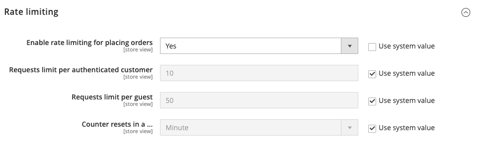

# [!UICONTROL Sales] > [!UICONTROL Sales]

{{config}}

## [!UICONTROL General]

<!-- zoom -->

<!-- [General](https://experienceleague.adobe.com/zh-hant/docs/commerce-admin/stores-sales/site-store/sales-documents) -->

| 欄位 | [領域](../../getting-started/websites-stores-views.md#scope-settings) | 說明 |
|--- |--- |--- |
| [!UICONTROL Hide Customer IP] | 存放區檢視 | 決定客戶IP位址是否出現在訂單、商業發票、出貨及銷退折讓單上。 選項： `Yes` / `No` |

{style="table-layout:auto"}

## [!UICONTROL Checkout Totals Sort Order]

<!-- zoom -->

<!-- [Checkout Totals Sort Order](https://experienceleague.adobe.com/zh-hant/docs/commerce-admin/stores-sales/point-of-purchase/checkout/checkout-totals-sort-order) -->

| 欄位 | [領域](../../getting-started/websites-stores-views.md#scope-settings) | 說明 |
|--- |--- |--- |
| [!UICONTROL Subtotal] | 網站 | 決定小計與其他結帳總計的計算時間數字。 預設值： `10` |
| [!UICONTROL Discount] | 網站 | 決定折扣何時計算與其他結帳總金額相關的數字。 預設值： `20` |
| [!UICONTROL Shipping] | 網站 | 決定與其他結帳總計相關時計算運費的數字。 預設值： `30` |
| [!UICONTROL Tax] | 網站 | 決定與其他結帳總計相關計算稅捐的數字。 預設值： `40` |
| [!UICONTROL Fixed Product Tax] | 網站 | 決定何時計算與其他結帳總計相關之固定產品稅捐的數字。 預設值： `50` |
| [!UICONTROL Grand Total] | 網站 | 決定總計與其他結帳總計之計算時間的數字。 預設值： `100` |

{style="table-layout:auto"}

## [!UICONTROL Reorder]

<!-- zoom -->

<!-- [Reorder](https://experienceleague.adobe.com/zh-hant/docs/commerce-admin/stores-sales/shopper-tools/reorders-allow) -->

| 欄位 | [領域](../../getting-started/websites-stores-views.md#scope-settings) | 說明 |
|--- |--- |--- |
| [!UICONTROL Allow Reorder] | 存放區檢視 | 決定客戶是否可以從其帳戶重新排序。 選項： `Yes` / `No` |

{style="table-layout:auto"}

## [!UICONTROL Allow Zero Grand Total]

| 欄位 | [領域](../../getting-started/websites-stores-views.md#scope-settings) | 說明 |
|--- |--- |--- |
| [!UICONTROL Allow Zero Grand Total for Credit Memo] | 存放區檢視 | 決定以零總計建立銷退折讓單的可能性。 選項： `Yes` / `No` |

{style="table-layout:auto"}

## [!UICONTROL Invoice and Packing Slip Design]

<!-- zoom -->

<!-- [Invoice and Packing Slip Design](https://experienceleague.adobe.com/zh-hant/docs/commerce-admin/stores-sales/site-store/sales-documents) -->

| 欄位 | [領域](../../getting-started/websites-stores-views.md#scope-settings) | 說明 |
|--- |--- |--- |
| [!UICONTROL Logo for PDF Print-outs] | 存放區檢視 | 識別出現在PDF發票與包裝單頁首的標誌檔案。 允許的檔案型別：  JPG/JPEG TIF/TIFF PNG |
| [!UICONTROL Logo for HTML Print View] | 存放區檢視 | 識別出現在商業發票與包裝單HTML列印檢視表頭中的標誌檔案。 允許的檔案型別：  JPG /JPEG GIF PNG |
| [!UICONTROL Address] | 存放區檢視 | 您要顯示在商業發票與包裝單上的商店地址。 |

{style="table-layout:auto"}

## [!UICONTROL Minimum Order Amount]

<!-- zoom -->

<!-- [Minimum Order Amount](https://experienceleague.adobe.com/zh-hant/docs/commerce-admin/stores-sales/point-of-purchase/cart/cart-configuration#minimum-order-amount) -->

| 欄位 | [領域](../../getting-started/websites-stores-views.md#scope-settings) | 說明 |
|--- |--- |--- |
| [!UICONTROL Enable] | 網站 | 決定是否設定網站的最小訂單金額。 選項： `Yes` / `No` |
| [!UICONTROL Minimum Amount] | 網站 | 指定套用折扣後的最小小計、訂單。 |
| [!UICONTROL Include Discount Amount] | 網站 | 決定最小訂單金額是否包含套用的折扣。 選項： `Yes` / `No` |
| [!UICONTROL Include Tax to Amount] | 網站 | 決定最小訂單金額是否包含稅捐。 選項： `Yes` / `No` |
| [!UICONTROL Description Message] | 存放區檢視 | 決定當購物車總計小於最小訂購量時顯示在購物車頂端的訊息。 若保留為空白，會顯示下列預設訊息： `Minimum order amount is $[minimum_amount]` |
| [!UICONTROL Error to Show in Shopping Cart] | 存放區檢視 | 決定當訂單量小於所需的最小訂單量時，從迷你購物車或結帳連結顯示的訊息。 如果保留為空白，則會顯示預設訊息。 |
| [!UICONTROL Validate Each Address Separately in Multi-address Checkout] | 網站 | 針對多料號訂單，會決定要分送地址的訂單料號是否大幅符合最小訂單金額。 選項： `Yes` / `No` |
| [!UICONTROL Multi-address Description Message] | 存放區檢視 | 針對多地址訂單，如果傳送至地址的專案小於最小訂購量，則會決定顯示在購物車中的訊息。 |
| [!UICONTROL Multi-address Error to Show in Shopping Cart] | 存放區檢視 | 針對多地址訂單，當訂單金額小於所需的最小訂單金額時，會決定從迷你購物車或結帳連結顯示的訊息。 如果保留為空白，則會顯示預設訊息。 |

{style="table-layout:auto"}

## [!UICONTROL Dashboard]

<!-- zoom -->

<!-- [Dashboard](https://experienceleague.adobe.com/zh-hant/docs/commerce-admin/start/admin/tools/admin-dashboard) -->

| 欄位 | [領域](../../getting-started/websites-stores-views.md#scope-settings) | 說明 |
|--- |--- |--- |
| [!UICONTROL Use Aggregated Data] | 全域 | 決定是否使用即時彙總的銷售資料來產生儀表板快照報表。 如果您要處理大量資料，關閉即時資料的顯示可以改善效能。 選項： `Yes` / `No` |

{style="table-layout:auto"}

## [!UICONTROL Orders Cron Settings]

<!-- zoom -->

<!-- [Orders Cron Settings](https://experienceleague.adobe.com/zh-hant/docs/commerce-admin/systems/tools/cron) -->

| 欄位 | [領域](../../getting-started/websites-stores-views.md#scope-settings) | 說明 |
|--- |--- |--- |
| [!UICONTROL Pending Payment Order Lifetime] | 網站 | 決定擱置訂單的期限（分鐘）。 預設設定： `480`分鐘（8小時） |

{style="table-layout:auto"}

## [!UICONTROL Gift Options]

<!-- zoom -->

<!-- [Gift Options](https://experienceleague.adobe.com/zh-hant/docs/commerce-admin/stores-sales/point-of-purchase/cart/cart-configuration#gift-options) -->

| 欄位 | [領域](../../getting-started/websites-stores-views.md#scope-settings) | 說明 |
|--- |--- |--- |
| [!UICONTROL Allow Gift Messages on Order Level] | 網站 | 指定是否可以為整個訂單新增禮品訊息。 |
| [!UICONTROL Allow Gift Messages on Order Items] | 網站 | 指定是否可以為個別訂單專案新增贈品訊息。 |
| [!UICONTROL Allow Gift Wrapping on Order Level] | 網站 |  (僅限Adobe Commerce)指定是否可以為整個訂單新增贈品包裝。 |
| [!UICONTROL Allow Gift Wrapping for Order Items] | 網站 |  (僅限Adobe Commerce)指定是否可以為個別訂單專案新增贈品包裝。 |
| [!UICONTROL Allow Gift Receipt] | 網站 |  (僅限Adobe Commerce)指定是否可以為訂單新增禮品收據。 |
| [!UICONTROL Allow Printed Card] | 網站 |  (僅限Adobe Commerce)指定是否可以為訂單新增列印卡片。 |
| [!UICONTROL Default Price for Printed Card] | 網站 |  (僅限Adobe Commerce)指定列印卡片的預設價格。 |

{style="table-layout:auto"}

## [!UICONTROL Minimum Advertised Price]

<!-- zoom -->

<!-- [Minimum Advertised Price](https://experienceleague.adobe.com/zh-hant/docs/commerce-admin/catalog/products/pricing/product-price-minimum-advertised) -->

| 欄位 | [領域](../../getting-started/websites-stores-views.md#scope-settings) | 說明 |
|--- |--- |--- |
| [!UICONTROL Enable MAP] | 網站 | 為您的商店啟用最低廣告價格。 選項： `Yes` / `No` |
| [!UICONTROL Display Actual Price] | 網站 | 決定客戶看到產品實際價格的位置。 選項：  **`In Cart`**— 顯示購物車中的實際產品價格。 **`Before Order Confirmation`** — 在訂單確認前，於結帳程式結束時顯示實際產品價格。  **`On Gesture`**— 當客戶按一下「價格點選」或「這是什麼？」時，在快顯視窗中顯示實際產品價格。 連結。 |
| [!UICONTROL Default Popup Text Message] | 存放區檢視 | 當客戶從分類清單或產品檢視頁面選取「按一下以取得價格」連結時顯示的文字訊息。 |
| [!UICONTROL Default "What's This" Text Message] | 存放區檢視 | 客戶按一下「這是什麼？」時顯示的文字訊息。 從產品檢視頁面連結。 |
| [!UICONTROL Manufacturer's Suggested Retail Price] | 全域 | 製造商建議的零售價(MSRP)。 |

{style="table-layout:auto"}

## [!UICONTROL Multicoupon Settings]

{{ee-feature}}

<!-- zoom -->

| 欄位 | [領域](../../getting-started/websites-stores-views.md#scope-settings) | 說明 |
|--- |--- |--- |
| [!UICONTROL Maximum number of coupons per order] | 網站 | 決定每筆訂單允許的優惠券數目上限。 此功能僅適用於Admin、GraphQL和REST API。 而且&#x200B;**_在店面中無法使用_**。 |

{style="table-layout:auto"}

## [!UICONTROL Order by SKU Settings]

{{ee-feature}}

<!-- zoom -->

<!-- [Order by SKU Settings](https://experienceleague.adobe.com/zh-hant/docs/commerce-admin/stores-sales/point-of-purchase/cart/order-by-sku) -->

<!-- zoom -->

| 欄位 | [領域](../../getting-started/websites-stores-views.md#scope-settings) | 說明 |
|--- |--- |--- |
| [!UICONTROL Enable Order by SKU on My Account in Storefront] | 網站 | 決定客戶帳戶儀表板中是否提供「依SKU排序」。 選項：  **`Yes, for Everyone`**- Order by SKU索引標籤會出現在所有客戶的帳戶儀表板中。 **`Yes, for Specified Customer Groups`** - Order by SKU索引標籤會顯示在指定群組或共用目錄成員的帳戶儀表板中。  **`No`**— 客戶帳戶無法使用「依SKU訂購」標籤。 |
| [!UICONTROL Customer Groups] | 網站 | 決定客戶群組。 選項： `General` / `Retailer` / `Wholesale` |

{style="table-layout:auto"}

## [!UICONTROL Instant Purchase]

<!-- zoom -->

<!-- [Instant Purchase](https://experienceleague.adobe.com/zh-hant/docs/commerce-admin/stores-sales/point-of-purchase/checkout-instant-purchase) -->

| 欄位 | [領域](../../getting-started/websites-stores-views.md#scope-settings) | 說明 |
|--- |--- |--- |
| [!UICONTROL Enabled] | 存放區檢視 | 如果付款方式(例如Braintree)已啟用儲存庫，則為商店檢視啟用「立即購買」。 選項： `Yes` / `No` |
| [!UICONTROL Button Text] | 存放區檢視 | 指定立即購買按鈕上顯示的文字。 預設文字為`Instant Purchase`。 |

{style="table-layout:auto"}

## [!UICONTROL Rate Limiting]

<!-- zoom -->

| 欄位 | [領域](../../getting-started/websites-stores-views.md#scope-settings) | 說明 |
|--------------------------------------------------------|--- |------------------------------------------------------------------------------------------------------------------------------------------------------------------------------------|
| [!UICONTROL Enable rate limiting for placing orders] | 存放區檢視 | 決定從商店檢視下訂單時是否使用費率限制（預設為`No`）。 選項： `Yes` / `No`。 |
| [!UICONTROL Requests limit per authenticated customer] | 存放區檢視 | 已驗證身分的客戶在期間內可以提出的購買要求數目。 預設限製為`10`。 |
| [!UICONTROL Requests limit per guest] | 存放區檢視 | 未驗證客戶在指定期間內可以提出的購買要求數目。 預設值為`50`。 |
| [!UICONTROL Counter resets in a ...] | 存放區檢視 | 已驗證/未驗證的客戶可以提出特定數量購買請求的時段（預設為`Minute`）。 選項： `Minute` / `Hour` /`Day` |

{style="table-layout:auto"}

## [!UICONTROL Orders, Invoices, Shipments, Credit Memos Archiving]

{{ee-feature}}

<!-- zoom -->

如需有關變更這些設定的詳細資訊，請參閱&#x200B;_商店與購買體驗指南_&#x200B;中的[設定訂單封存](../../stores-purchase/order-archive.md#configure-the-order-archive)。

| 欄位 | [領域](../../getting-started/websites-stores-views.md#scope-settings) | 說明 |
|--- |--- |--- |
| [!UICONTROL Enable Archiving] | 全域 | 決定是否啟用封存。 選項： `Yes` / `No` |
| [!UICONTROL Archive Orders Purchased] | 全域 | 決定完成訂單存檔前的天數。 預設值： `30` |
| [!UICONTROL Order  Statuses to be Archived] | 全域 | 決定要封存之訂單的[狀態](../../stores-purchase/order-status.md)。 依預設，系統會封存狀態為「完成」或「已結」的訂單。 選項： `Pending` / `Processing` / `Suspected Fraud` / `Complete` / `Closed` / `Canceled` / `On Hold` |

{style="table-layout:auto"}

## [!UICONTROL RMA Settings]

{{ee-feature}}

<!-- zoom -->

如需有關變更這些設定的詳細資訊，請參閱&#x200B;_商店與購買體驗指南_&#x200B;中的[設定退貨](../../stores-purchase/rma-configure.md)。

| 欄位 | [領域](../../getting-started/websites-stores-views.md#scope-settings) | 說明 |
|--- |--- |--- |
| [!UICONTROL Enable RMA on Storefront] | 網站 | 決定客戶是否可以從店面建立和檢視RMA請求。 RMA可同時套用至新訂單與現有訂單。 依預設，店面不會啟用RMA。 選項： `Yes` / `No` |
| [!UICONTROL Enable RMA on Product Level] | 網站 | 決定產品資訊中「啟用RMA」欄位的預設值。 |
| [!UICONTROL Use Store Address] | 網站 | 決定用於退回商品出貨的聯絡人名稱與地址。 選項：  **`Yes`**— 使用送貨設定中的[原點](../../stores-purchase/shipping-settings.md#point-of-origin)位址。 **`No`** — 開啟地址表單，以便您輸入替代地址。 |

{style="table-layout:auto"}
