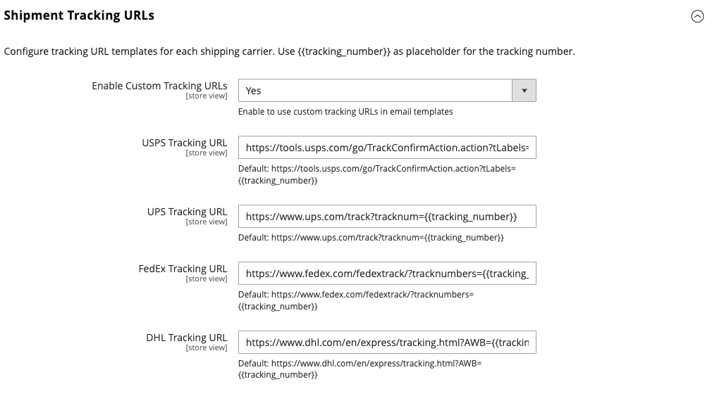

# [!UICONTROL Sales] > [!UICONTROL Shipping Settings]

{{config}}

如需有關變更這些設定的詳細資訊，請參閱&#x200B;_商店與購買體驗指南_&#x200B;中的[送貨設定](../../stores-purchase/shipping-settings.md)。

## [!UICONTROL Origin]

<!-- zoom -->

| 欄位 | [領域](../../getting-started/websites-stores-views.md#scope-settings) | 說明 |
|--- |--- |--- |
| [!UICONTROL Country] | 網站 | 原點國家/地區。 |
| [!UICONTROL Region/State] | 網站 | 原點區域或狀態。 |
| [!UICONTROL ZIP/Postal Code] | 網站 | 來源地郵遞區號。 |
| [!UICONTROL City] | 網站 | 原點城市。 |
| [!UICONTROL Street Address] | 網站 | 來源地街道地址。 |
| [!UICONTROL Street Address Line 2] | 網站 | 必要時，原始點街道地址的額外行。 |

{style="table-layout:auto"}

## [!UICONTROL Shipping Policy Parameters]

<!-- zoom -->

| 欄位 | [領域](../../getting-started/websites-stores-views.md#scope-settings) | 說明 |
|--- |--- |--- |
| [!UICONTROL Apply Custom Shipping Policy] | 網站 | 決定結帳時是否顯示送貨政策。 選項： `Yes` / `No` |
| [!UICONTROL Shipping Policy] | 存放區檢視 | 以文字形式包含您的送貨政策。 |

{style="table-layout:auto"}

## [!UICONTROL Shipment Tracking URLs]

僅[!BADGE SaaS]{type=Positive url="https://experienceleague.adobe.com/zh-hant/docs/commerce/user-guides/product-solutions" tooltip="僅適用於Adobe Commerce as a Cloud Service專案（Adobe管理的SaaS基礎結構）。"}

<!-- zoom -->

| 欄位 | [領域](../../getting-started/websites-stores-views.md#scope-settings) | 說明 |
|--- |--- |--- |
| [!UICONTROL Enable Custom Tracking URLs] | 存放區檢視 | 決定購物者電子郵件中傳送的運送追蹤號碼是連結還是純文字。 預設值`No`表示數字為純文字。 選項： `Yes` / `No` |
| [!UICONTROL USPS Tracking URL] | 存放區檢視 | 美國郵遞服務出貨的URL範本。 |
| [!UICONTROL UPS Tracking URL] | 存放區檢視 | United Parcel Service出貨的URL範本。 |
| [!UICONTROL FedEx Tracking URL] | 存放區檢視 | Federal Express出貨的URL樣版。 |
| [!UICONTROL DHL Tracking URL] | 存放區檢視 | DHL Express出貨的URL範本。 |

{style="table-layout:auto"}
